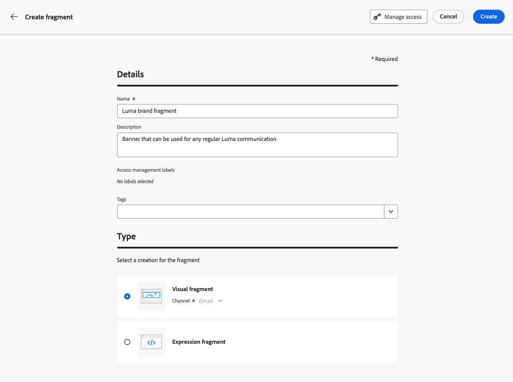

# 조각 만들기 {#create-fragments}

>[!CONTEXTUALHELP]
>id="ajo_create_visual_fragment"
>title="비주얼 유형 선택"
>abstract="여정 또는 캠페인 내의 이메일이나 콘텐츠 템플릿에서 콘텐츠를 재사용할 수 있도록 독립 실행형 시각적 조각을 만듭니다."
>additional-url="https://experienceleague.adobe.com/ko/docs/journey-optimizer/using/email/design-email/add-content/use-visual-fragments" text="이메일에 비주얼 조각 추가"

>[!CONTEXTUALHELP]
>id="ajo_create_expression_fragment"
>title="표현식 유형 선택"
>abstract="여러 여정과 캠페인 전반에서 콘텐츠를 재사용할 수 있도록 독립 실행형 표현식 조각을 만듭니다. 개인화 편집기를 사용하면 현재 샌드박스에서 생성된 모든 표현식 조각을 활용할 수 있습니다."
>additional-url="https://experienceleague.adobe.com/docs/journey-optimizer/using/content-management/personalization/expression-editor/use-expression-fragments.html?lang=ko-KR" text="표현식 조각 활용"

조각은 처음부터 만들 수 있습니다. **[!UICONTROL 조각]** 왼쪽 메뉴. 또한 콘텐츠를 디자인할 때 기존 콘텐츠의 일부를 조각으로 저장할 수도 있습니다. [방법 알아보기](#save-as-fragment)

저장되면 여정, 캠페인 또는 템플릿에서 조각을 사용할 수 있습니다. 여정 및 캠페인 내에서 콘텐츠를 작성할 때 이 조각을 사용할 수 있습니다. 다음을 참조하십시오 [시각적 조각 추가](../email/use-visual-fragments.md) 및 [표현식 조각 활용](../personalization/use-expression-fragments.md)

조각을 만들려면 아래 단계를 수행합니다.

## 조각의 속성 정의 {#properties}

1. 다음을 통해 조각 목록에 액세스 **[!UICONTROL 콘텐츠 관리]** > **[!UICONTROL 조각]** 왼쪽 메뉴.

1. 선택 **[!UICONTROL 조각 만들기]** 필요한 경우 조각 이름과 설명을 입력합니다.

   

1. 에서 Adobe Experience Platform 태그를 선택하거나 만듭니다. **[!UICONTROL 태그]** 개선된 검색을 위해 조각을 분류할 필드입니다. [통합 태그를 사용한 작업 방법 알아보기](../start/search-filter-categorize.md#tags)

1. 조각 유형을 선택합니다. **시각적 조각** 또는 **표현식 조각**. [시각적 및 표현식 조각에 대해 자세히 알아보기](../content-management/fragments.md#visual-expression)

   >[!NOTE]
   >
   >현재로서는 의 시각적 조각을 사용할 수 있습니다 **이메일** 채널만.

1. 표현식 조각을 만드는 경우 사용할 코드 유형을 선택합니다. **[!UICONTROL HTML]**, **[!UICONTROL JSON]** 또는 **[!UICONTROL 텍스트]**.

   

1. 조각에 사용자 지정 또는 핵심 데이터 사용 레이블을 할당하려면 **[!UICONTROL 액세스 관리]** 화면의 위쪽 섹션에 있는 단추입니다. [OLAC(Object Level Access Control)에 대해 자세히 알아보기](../administration/object-based-access.md).

1. 클릭 **[!UICONTROL 만들기]** 조각 콘텐츠를 디자인할 수 있습니다.

## 조각 콘텐츠 디자인 {#content}

조각의 속성을 구성하면 생성 중인 조각 유형에 따라 이메일 Designer 또는 개인화 편집기가 열립니다.

* 시각적 조각의 경우 여정 또는 캠페인 내의 이메일에 대해 수행하는 것과 동일한 방식으로 콘텐츠를 필요에 따라 편집합니다. [자세히 알아보기](../email/get-started-email-design.md)

  

* 표현식 조각의 경우 [!DNL Journey Optimizer] 조각 콘텐츠를 작성할 수 있는 모든 개인화 및 작성 기능이 있는 개인화 편집기. [자세히 알아보기](../personalization/personalization-build-expressions.md)

  

콘텐츠가 준비되면 **저장** 단추를 클릭합니다. 조각이 만들어지고 을 사용하여 조각 목록에 추가됩니다. **초안** 상태. 이를 미리 보고 게시하여 여정 및 캠페인에서 사용할 수 있도록 할 수 있습니다.

## 조각 미리보기 및 게시 {#publish}

>[!NOTE]
>
>조각을 게시하려면 [Publish 조각](../administration/ootb-product-profiles.md#content-library-manager) 사용자 권한.

조각의 실행이 준비되면 미리 보고 게시하여 여정 및 캠페인에서 사용할 수 있도록 할 수 있습니다. 이렇게 하려면 다음 단계를 수행합니다.

1. 콘텐츠를 디자인한 후 조각 만들기 화면으로 돌아가거나 조각 목록에서 엽니다.

1. 조각 미리보기는 **태그** 필드, 렌더링 확인 가능 변경해야 하는 경우 **편집** 조각 유형에 따라 이메일 Designer 또는 개인화 편집기를 열려면 화면 상단에 있는 버튼을 클릭합니다.

   

1. 다음을 클릭합니다. **Publish** 오른쪽 상단 모서리에 있는 버튼을 클릭하여 조각을 게시합니다.

   조각이 라이브 여정 또는 캠페인에서 사용 중인 경우 알려주는 메시지가 열립니다. 다음을 클릭합니다. **더 보기** 참조되는 여정 및/또는 캠페인 목록에 액세스하기 위한 링크입니다. [조각의 참조를 탐색하는 방법 알아보기](../content-management/manage-fragments.md#explore-references)

   클릭 **확인** 조각을 게시하고 이를 사용하는 라이브 여정/캠페인에서 업데이트합니다.

   {width="70%" align="center"}

이제 조각이 **라이브**&#x200B;에서 콘텐츠를 빌드할 때 및 을 사용할 수 있게 됩니다. [!DNL Journey Optimizer] 이메일 Designer 또는 개인화 편집기:

* [시각적 조각 사용 방법 알아보기](../email/use-visual-fragments.md)
* [표현식 조각 사용 방법 알아보기](../personalization/use-expression-fragments.md)
