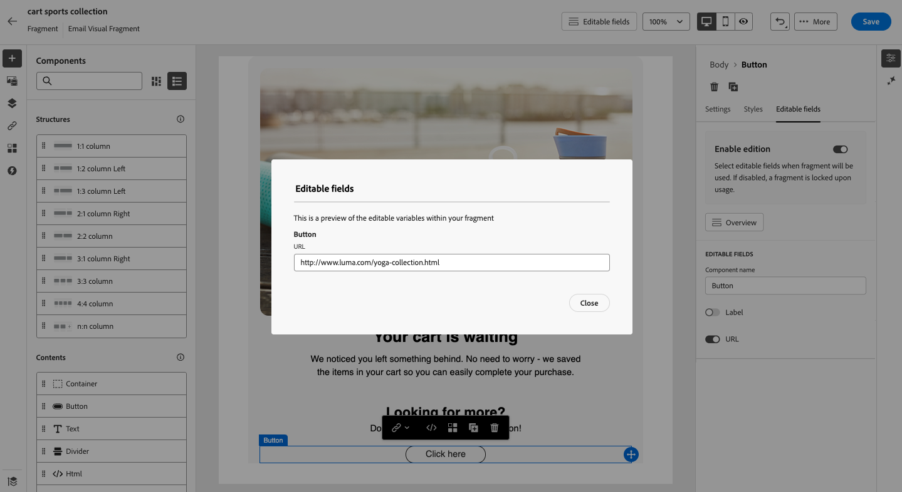
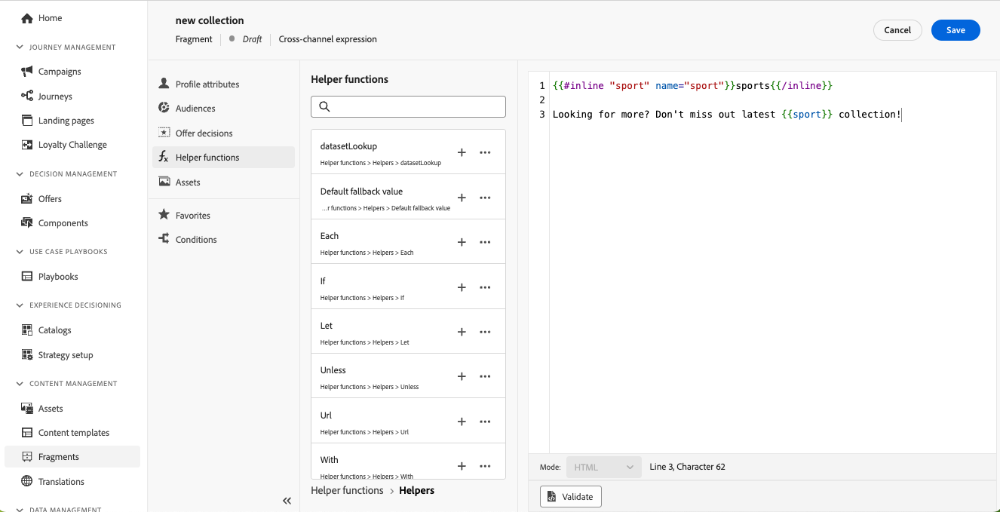

# 사용자 지정 가능한 조각 {#customizable-fragments}

조각이 캠페인이나 여정 작업에 사용되면 상속으로 인해 기본적으로 잠깁니다. 즉, 조각에 수행된 모든 변경 사항은 조각이 사용되는 모든 캠페인 및 여정에 자동으로 전파됩니다. 사용자 지정 가능한 조각을 사용하면 캠페인 또는 여정 작업에 조각을 추가할 때 조각 내의 특정 필드를 편집 가능한 것으로 정의할 수 있습니다. 예를 들어 배너, 일부 텍스트 및 버튼이 있는 조각이 있다고 가정해 보겠습니다. 이미지 또는 단추 대상 URL과 같은 특정 필드를 편집 가능한 것으로 지정할 수 있습니다. 이렇게 하면 사용자가 조각을 캠페인이나 여정에 통합할 때 이러한 요소를 수정할 수 있으므로 원본 조각에 영향을 주지 않고 맞춤 경험을 제공할 수 있습니다.

사용자 지정 가능한 조각은 이전에 조각 수준에서 중앙 집중식 변경 내용이 캠페인 및 여정에 전파되지 않도록 중단했던 조각 상속을 중단하지 않아도 됩니다. 이 접근 방식을 사용하면 콘텐츠 부분을 사용할 때 조정할 수 있으므로 컨텍스트별 세부 사항으로 기본값을 유연하게 대체할 수 있습니다.

사용자 지정 가능한 조각을 활용함으로써 완전히 새로운 콘텐츠 블록을 만들거나 원본 조각의 상속을 중단하지 않고도 콘텐츠를 효율적으로 관리하고 개인화할 수 있습니다. 이렇게 하면 조각 수준에서 수행된 변경 사항이 계속 전파되는 동시에 캠페인 또는 여정 수준에서 필요한 사용자 지정을 허용할 수 있습니다.

시각적 조각과 표현식 조각을 모두 사용자 지정으로 표시할 수 있습니다. 각 조각 유형을 계속 진행하는 방법에 대한 자세한 지침은 아래 섹션을 참조하십시오.

## 시각적 조각에 편집 가능한 필드 추가 {#visual}

시각적 조각의 일부를 편집할 수 있도록 하려면 다음 단계를 수행합니다.

>[!NOTE]
>
>편집 가능한 필드를에 추가할 수 있습니다. **이미지**, **텍스트** 및 **단추** 구성 요소. 대상 **HTML** 표현식 조각과 마찬가지로 개인화 편집기를 사용하여 구성 요소 및 편집 가능한 필드가 추가됩니다. [HTML 구성 요소 및 표현식 조각에서 편집 가능한 필드를 추가하는 방법을 알아봅니다](#expression)

1. 조각 콘텐츠 편집 화면을 엽니다.

1. 조각에서 편집 가능한 필드를 구성할 구성 요소를 선택합니다.

1. 오른쪽에 구성 요소 속성 창이 열립니다. 다음 항목 선택 **편집 가능한 필드** 탭을 누른 다음 을 토글합니다. **에디션 활성화** 옵션을 선택합니다.

1. 선택한 구성 요소에 대해 편집할 수 있는 모든 필드가 창에 나열됩니다. 편집할 수 있는 필드는 선택한 구성 요소 유형에 따라 다릅니다.

   아래 예에서는 &quot;여기를 클릭&quot; 버튼 URL의 편집을 허용합니다.

   

1. 다음을 클릭합니다. **개요** 편집 가능한 모든 필드와 해당 기본값을 확인합니다.

   이 예에서 버튼 URL 필드는 구성 요소에 정의된 기본값으로 표시됩니다. 사용자는 콘텐츠에 조각을 추가한 후 이 값을 사용자 지정할 수 있습니다.

   

1. 준비가 되면 변경 사항을 저장하여 조각을 업데이트합니다.

1. 조각을 이메일에 추가하면 사용자는 조각에 구성된 편집 가능한 모든 필드를 사용자 지정할 수 있습니다. [시각적 조각에서 편집 가능한 필드를 사용자 지정하는 방법 알아보기](../email/use-visual-fragments.md#customize-fields)

## HTML 구성 요소 및 표현식 조각에서 편집 가능한 필드 추가 {#expression}

HTML 구성 요소 또는 표현식 조각의 일부를 편집할 수 있게 하려면 표현식 편집기에서 특정 구문을 사용해야 합니다. 여기에는 다음 선언이 포함됩니다. **변수** 조각을 콘텐츠에 추가한 후 사용자가 재정의할 수 있는 기본값으로.

예를 들어, 이메일에 추가할 조각을 만들고 사용자가 프레임 또는 버튼의 배경색과 같이 다른 위치에서 사용되는 특정 색상을 사용자 지정할 수 있도록 허용하려고 한다고 가정합니다. 조각을 생성할 때 **고유 ID**&#x200B;예를 들어 &quot;color&quot;이고, 이 색상을 적용할 조각 콘텐츠의 원하는 위치에서 호출합니다. 조각을 콘텐츠에 추가하면 사용자는 변수가 참조되는 곳마다 사용되는 색상을 사용자 지정할 수 있습니다.

HTML 구성 요소의 경우 특정 요소만 편집 가능한 필드가 될 수 있습니다. 자세한 내용을 보려면 아래 섹션을 확장하십시오.

+++HTML 구성 요소에서 편집 가능한 요소:

아래 요소는 HTML 구성 요소에서 편집 가능한 필드가 될 수 있습니다.

* 텍스트 일부
* 링크 또는 이미지에 대한 전체 URL(URL의 일부와 함께 사용할 수 없음)
* 전체 CSS 속성(부분 속성에서 작동하지 않음)

예를 들어 아래 코드에서 빨간색으로 강조 표시된 각 요소는 속성이 될 수 있습니다.

{width=&quot;70%}

+++

변수를 선언하고 조각에서 사용하려면 다음 단계를 따르십시오.

1. 표현식 조각을 연 다음 개인화 편집기에서 콘텐츠를 편집합니다. HTML 구성 요소의 경우 조각에서 구성 요소를 선택하고 **소스 코드 표시** 단추를 클릭합니다.

   

1. 사용자가 편집할 변수를 선언합니다. 다음 위치로 이동 **도우미 함수** 왼쪽 탐색 창에 메뉴를 추가하고 **인라인** 도우미 함수입니다. 변수를 선언하고 호출하는 구문은 콘텐츠에 자동으로 추가됩니다.

   

1. 바꾸기 `"name"` 편집 가능한 필드를 식별하기 위한 고유 ID를 포함합니다.

   >[!NOTE]
   >
   >필드 ID는 고유해야 하며 공백이 없어야 합니다. 이 ID는 변수의 값을 표시하려는 콘텐츠의 모든 곳에서 사용해야 합니다.

1. 아래 표에 설명된 매개 변수를 추가하여 필요에 맞게 구문을 조정합니다.

   | 작업 | 매개변수 | 예 |
   | ------- | ------- | ------- |
   | 를 사용하여 편집 가능한 필드 선언 **기본값**. 조각을 콘텐츠에 추가할 때 사용자 지정하지 않으면 이 기본값이 사용됩니다. | 인라인 태그 사이에 기본값을 추가합니다. | `{{#inline "editableFieldID"}}default_value{{/inline}}` |
   | 정의 **레이블** 편집 가능한 필드용입니다. 이 레이블은 조각의 필드를 편집할 때 이메일 Designer에 표시됩니다. | `name="title"` | `{{#inline "editableFieldID" name="title"}}default_value{{/inline}}` |
   | 다음을 포함하는 편집 가능한 필드 선언 **이미지 소스** 게시해야 합니다. | `assetType="image"` | `{{#inline "editableFieldID" assetType="image"}}default_value{{/inline}}` |
   | 다음을 포함하는 편집 가능한 필드 선언 **URL** 추적해야 합니다. 즉시 사용 가능한 &quot;미러 페이지 URL&quot; 및 &quot;구독 취소 링크&quot; 사전 정의된 블록은 편집 가능한 필드가 될 수 없습니다. | `assetType="url"` | `{{#inline "editableFieldID" assetType="url"}}default_value{{/inline}}` |

1. 사용 `{{{name}}}` 편집 가능한 필드의 값을 표시할 모든 위치에 있는 코드의 구문 바꾸기 `name` (앞에 정의된 필드의 고유 ID 포함)

   

1. 조각을 저장합니다.

이제 이메일 콘텐츠에 조각을 추가할 때 변수의 기본값을 선택한 값으로 재정의할 수 있습니다.

* 표현식 조각의 경우 특정 구문을 사용하여 변수 값을 재정의합니다. [표현식 조각에서 편집 가능한 필드를 사용자 지정하는 방법 알아보기](../personalization/use-expression-fragments.md#customize-fields)

* HTML 구성 요소의 경우 변수는 이메일 Designer의 편집 가능한 필드 목록에 표시됩니다. [시각적 조각에서 편집 가능한 필드를 사용자 지정하는 방법 알아보기](../email/use-visual-fragments.md#customize-fields)

## 편집 가능한 표현식 조각 예 {#example}

아래 예제에서는 새로운 스포츠 컬렉션을 나타내는 표현식 조각을 만들고 있습니다. 기본적으로 조각은 다음 콘텐츠를 표시합니다. *더 많은 정보를 찾고 계십니까? 최신 스포츠 컬렉션을 놓치지 마세요!*

사용자가 이 콘텐츠의 &quot;스포츠&quot;를 선택한 스포츠로 대체할 수 있도록 허용하려고 합니다. 예: *더 많은 정보를 찾고 계십니까? 우리의 최신 요가 컬렉션을 놓치지 마세요!*

방법은 다음과 같습니다.

1. ID가 &quot;sport&quot;인 &quot;sport&quot; 변수를 선언합니다.

   기본적으로 사용자가 컨텐츠에 조각을 추가한 후 변수의 값을 변경하지 않으면 사이에 정의된 값이 표시됩니다. `{{#inline}}` 및 `{{/inline}}` 태그, 즉 &quot;sports&quot;.

1. 추가 ``{{{sport}}}`` 변수 값을 표시할 조각 콘텐츠의 구문(예: 기본적으로 &quot;sports&quot; 또는 사용자가 선택한 값)입니다.

   

1. 콘텐츠에 표현식 조각을 추가할 때 사용자는 표현식 편집기에서 직접 선택하여 변수 값을 변경할 수 있습니다. [표현식 조각에서 편집 가능한 필드를 사용자 지정하는 방법 알아보기](../personalization/use-expression-fragments.md#customize-fields)

   
