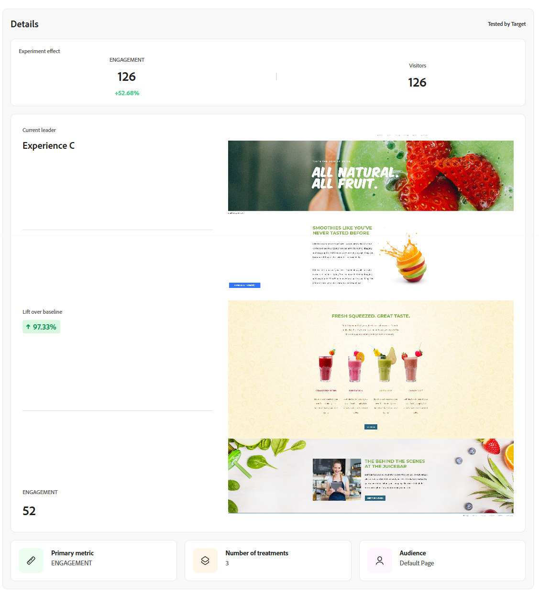

# 실험 추적 {#monitor}

**[!UICONTROL 실험]** 탭은 Adobe Journey Optimizer 및 Adobe Target의 테스트 추적 및 분석을 중앙 집중화합니다. 모든 실험을 보고, KPI를 검토하고, 특정 테스트를 찾기 위해 필터링하거나 검색할 수 있습니다.

## 대시보드 {#dashboard}

실험 탭에 액세스하면 Journey Optimizer 및 Adobe Target에서 사용 가능한 모든 실험이 통합 보기에 나열됩니다. 이를 통해 한 곳에서 두 플랫폼 간의 실험을 빠르게 검토하고 비교할 수 있습니다.
실험 목록에는 다음이 포함됩니다.

* 캠페인 또는 여정에서 생성된 Journey Optimizer 실험.

* 동일한 IMS 조직에 연결된 Journey Optimizer 프로덕션 기본 샌드박스에서 사용할 수 있는 Adobe Target 실험.

KPI 섹션은 생성된 총 실험 수와 현재 진행 중인 횟수를 포함한 주요 지표를 제공하며, 전체 실험 활동에 대한 스냅샷을 제공합니다

유형&#x200B;**[!UICONTROL ,]**&#x200B;별&#x200B;**[!UICONTROL ,]**&#x200B;상태&#x200B;**[!UICONTROL 또는]** Source **[!UICONTROL 별 필터링과 같은 컨텍스트별 옵션을 제공하는]**&#x200B;을(를) 클릭하여 필터에 액세스합니다. 예를 들어 Journey Optimizer의 활성 실험만 표시하도록 필터링할 수 있습니다.

또는 검색 막대에 실험의 이름을 입력하여 실험에서 원하는 결과를 신속하게 찾을 수 있습니다.

## 실험 모니터링 {#monitor-page}

실험에 액세스하고 모니터링하려면 **[!UICONTROL 실험]** 탭의 실험 목록에서 이전에 구성한 실험을 선택하거나 고급 메뉴를 사용하여 **[!UICONTROL 세부 정보 보기]** 또는 **[!UICONTROL 소스에서 열기]**&#x200B;를 수행합니다.

실험 세부 사항 페이지는 다음 섹션으로 분할됩니다.

* [실험 결과](#experiment-outcome)
* [가설](#hypothesis)
* [세부 사항](#details)
* [기회](#opportunities)
* [결과](#results)
* [실험 통찰력](#insights)

### 실험 결과 {#experiment-outcome}

**[!UICONTROL 실험 결과]**&#x200B;를 통해 실험에서 가장 성과가 좋은 변형을 빠르게 볼 수 있습니다.

### 설정 {#set-up}

**[!UICONTROL 가설]**&#x200B;은(는) 테스트할 계획 변경 사항을 캡처하고 기본 지표에 예상되는 영향을 문서화합니다. 명확한 **[!UICONTROL 가설]**&#x200B;을(를) 정의하면 각 실험에 측정 가능한 목표가 있으므로 결과를 더 쉽게 평가하고 변경 사항이 의미 있는 개선으로 이어졌는지 확인할 수 있습니다.

[실험 인사이트](#insights)가 생성되려면 가설 및 처리 세부 사항과 통계적 유의성을 확인해야 합니다.

1. **[!UICONTROL 추가]**&#x200B;를 클릭하여 실험에 대한 **[!UICONTROL 가설]**&#x200B;을(를) 만듭니다.

   

1. 변경된 사항과 기본 지표에 미치는 영향을 자세히 설명하여 **[!UICONTROL 가설]**&#x200B;을 입력합니다.

   **[!UICONTROL 저장]**&#x200B;을 클릭합니다.

1. 각 처리에 대한 이미지를 추가하거나 바꾸려면 **[!UICONTROL 검토]**&#x200B;를 클릭하십시오.

   

1. 치료 이미지는 자동으로 생성되지만 필요한 경우 **[!UICONTROL 이미지 추가]** 또는 **[!UICONTROL 이미지 바꾸기]**&#x200B;를 선택하여 **[!UICONTROL 치료]**&#x200B;에 대한 로컬 파일에서 선호하는 스크린샷을 업로드할 수 있습니다.

   스크린샷은 전체 페이지를 캡처해야 합니다.

1. 필요한 경우  아이콘을 클릭하여 **[!UICONTROL 가설]**&#x200B;을(를) 업데이트합니다.

**[!UICONTROL 가설]** 구성을 마치면 중요한 [인사이트](#insights) 및 [기회](#opportunities)를 얻을 수 있습니다.

### 세부 사항 {#details}

**[!UICONTROL 실험 효과]** 위젯에서는 실험이 타깃팅된 대상 세그먼트에 어떤 영향을 주었는지 자세히 볼 수 있습니다. 참여 및 행동을 평가하는 데 도움이 되는 주요 성과 지표를 제시합니다. 여기에는 다음과 같은 항목이 포함됩니다.

* 실험 생성 중에 구성된 내용에 따라 Journey Optimizer의 **[!UICONTROL 성공 지표]** 또는 Adobe Target의 **[!UICONTROL 기본 지표]**&#x200B;이(가) 달라집니다.

* **[!UICONTROL 방문자]**: 실험에 노출된 총 고유 방문자 수입니다.

다음 지표를 통해 선행 처리의 수행 방식에 대한 실시간 스냅샷을 볼 수도 있습니다.

* **[!UICONTROL 현재 리더]**: 현재 최상의 성능을 제공하는 치료를 식별합니다.

* **[!UICONTROL 기준선 위로 올리기]**: 제어 또는 기준선과 비교하여 선행 처리의 백분율 개선을 측정합니다.

* 실험 생성 중에 구성된 내용에 따라 Journey Optimizer의 **[!UICONTROL 성공 지표]** 또는 Adobe Target의 **[!UICONTROL 기본 지표]**&#x200B;이(가) 달라집니다.

위젯 하단에서 다음을 포함한 실험 구성의 간결한 요약을 찾을 수 있습니다.

* 실험 생성 중에 구성된 내용에 따라 Journey Optimizer의 **[!UICONTROL 성공 지표]** 또는 Adobe Target의 **[!UICONTROL 기본 지표]**&#x200B;이(가) 달라집니다.

* **[!UICONTROL 처리 수]**: 테스트한 총 변형 수.

* **[!UICONTROL 대상]**: 실험 중에 타깃팅된 정의된 사용자 세그먼트입니다.

### 기회 {#opportunities}

>[!AVAILABILITY]
>
>Opportunities 기능은 텍스트 기반 변경 사항을 사용하는 실험으로 제한됩니다.

**[!UICONTROL 기회]** 패널에는 테스트 성능을 향상시키고 더 광범위한 비즈니스 목표와 KPI에 맞게 설계된 AI가 생성한 권장 사항이 표시됩니다.

실험 기회가 생성되려면 먼저 [가설 및 치료 세부 사항을 확인](#set-up)해야 합니다.

1. 제안된 영업 기회를 탐색하고 **[!UICONTROL 영업 기회 보기]**&#x200B;를 클릭합니다.

   

1. 영업 기회를 선택하면 **영업 기회 세부 정보** 창이 열립니다. 이 창에서는 Journey Optimizer Experimentation Accelerator에서 제안하는 특정 처리 또는 변형에 대해 간략하게 설명합니다. 이 보기에는 다음이 포함됩니다.

   * **[!UICONTROL 가설]**: 제안된 치료의 예상 결과를 설명하는 AI 생성 가설입니다.

   * **[!UICONTROL 이유]**: Journey Optimizer Experimentation Accelerator에서 이 기회를 제안한 이유에 대한 설명입니다.

   * **[!UICONTROL 영업 기회 평가]**: 다음을 기반으로 하는 권장 사항의 이중 평가:

      * **[!UICONTROL 학습 가능성]**: 이전에 테스트한 내용과 얼마나 다른지를 기반으로 하여 기회가 제공할 수 있는 새로운 insight의 양을 예상합니다.

      * **[!UICONTROL 전환 가능성]**: 지금까지 잘 작동했던 전략과의 유사성을 기반으로 하여 현재 처리 수준을 능가하는 영업 기회의 예상 값입니다.
   <!--
   * **[!UICONTROL New text treatment example]**: Words or phrases that demonstrate the style the AI recommends using.
   -->

   

1. 그런 다음 **[!UICONTROL 실험 열기]**&#x200B;를 선택하여 실험에 직접 추가할 수 있습니다.

1. 원래 실험이 Adobe Journey Optimizer에서 만들어지고 관리되는 경우 이 작업을 수행하면 해당 캠페인 내의 **[!UICONTROL 콘텐츠 실험 패널]**&#x200B;이 열립니다.

   **[!DNL Adobe Target]**&#x200B;에서 시작된 실험의 경우 제안된 변경 내용이 대신 **[!DNL Adobe Target]**&#x200B;의 실험 워크플로에 로드됩니다.

   ➡️ [Adobe Target 설명서에서 자세히 알아보기](https://experienceleague.adobe.com/en/docs/target/using/activities/abtest/test-ab)

1. 실험 보기 내에서 Journey Optimizer Experimentation Accelerator이 표면화한 동일한 AI **[!UICONTROL 실험 기회]**&#x200B;에 액세스할 수 있습니다.

   **[!UICONTROL 보기]**&#x200B;를 선택하여 영업 기회 세부 정보를 엽니다.

1. 제안된 변경 사항을 적용하려면 **[!UICONTROL 실험 수정]**&#x200B;을 선택하면 기존 실험을 직접 편집할 수 있습니다.

### 결과 {#results}

**[!UICONTROL 결과]** 테이블은 실험 내의 각 처리에 대한 자세한 성능 분석을 제공합니다. 이러한 지표는 효율성, 사용자 참여 및 주요 비즈니스 결과에 대한 전반적인 영향을 평가하는 데 도움이 됩니다.

* **[!UICONTROL 위치]**: 다른 처리와 어떻게 비교되는지 나타내는 성능에 따라 처리의 순위 지정 위치입니다.

* 실험 생성 중에 구성된 내용에 따라 Journey Optimizer의 **[!UICONTROL 성공 지표]** 또는 Adobe Target의 **[!UICONTROL 기본 지표]**&#x200B;이(가) 달라집니다.

* **[!UICONTROL 사람]**: 메시지 대상 프로필로 적합한 사용자 프로필 수입니다.

* **[!UICONTROL 상승도]**: 기준선에 대한 해당 처리의 전환율 개선 비율을 측정합니다.

* **[!UICONTROL 신뢰도]**: 해당 처리가 기준 처리와 동일하다는 증거입니다. [자세히 알아보기](../content-management/experiment-calculations.md#understand-confidence)

* **[!UICONTROL 전환율]**: 치료를 본 후 원하는 작업(예: 구매, 등록)을 완료한 프로필의 백분율입니다.

### 실험 인사이트 {#insights}

>[!AVAILABILITY]
>
>실험 인사이트 기능은 텍스트 기반 변경 사항이 있는 실험으로 제한됩니다.

**[!UICONTROL 실험 인사이트]**&#x200B;는 이 실험에서 파생된 AI 생성 학습입니다. 이러한 통찰력은 실험이 통계적 중요도에 도달하면 사용할 수 있으며 성공에 기여한 사항을 맥락적으로 이해할 수 있습니다. 이들은 결과에 영향을 미칠 수 있는 통제와 달리 승리 치료에 존재하는 주요 속성을 강조합니다.

실험 인사이트를 생성하려면 먼저 [가설 및 처리 세부 정보를 확인](#set-up)해야 하며 통계적 유의성에 도달해야 합니다.

각 인사이트에 대한 자세한 내용을 보려면 **[!UICONTROL 세부 정보 보기]**&#x200B;를 클릭하십시오.

 

