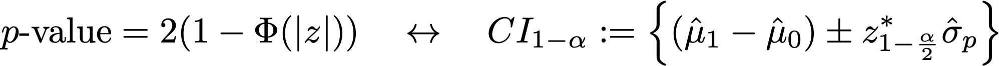

# 실험 보고서의 통계 계산 이해 {#experiment-report-calculations}

이 페이지에서는 Adobe Journey Optimizer의 캠페인에 대한 실험 보고서에 사용된 자세한 통계 계산을 문서화합니다.

이 페이지는 기술 사용자를 대상으로 합니다.

## 전환율

실험에서 각 처리 `ν`에 대한 전환율 또는 **평균**, μν은 해당 지표에 할당된 프로필 수(Nν)에 대한 지표 합계의 비율로 정의됩니다.

{width="125" align="center"}

여기서 Yiν은(는) 주어진 변형 *ν*&#x200B;에 할당된 각 프로필 `i`에 대한 목표 지표의 값입니다. 목표 지표가 &quot;고유&quot; 지표인 경우, 즉 특정 작업을 수행하는 프로필 수 카운트인 경우 전환율로 표시되고 백분율로 포맷됩니다. 지표가 &quot;count&quot; 또는 &quot;total value&quot; 지표인 경우(예: 이메일 열기, 각각 매출), 지표에 대한 평균 예상치가 &quot;프로필당 개수&quot; 또는 &quot;프로필당 값&quot;으로 표시됩니다.

필요한 경우 다음 표현식과 함께 샘플 표준 편차가 사용됩니다.

{width="225" align="center"}

## 상승도 {#lift}

변형 *ν*&#x200B;과(와) 제어 변형 *ν0* 사이의 상승도는 개별 전환율이 위에 정의된 대로 아래에 있는 계산으로 정의된 전환율의 상대적 &quot;델타&quot;입니다. 백분율로 표시됩니다.

{width="125" align="center"}

 

## 개별 치료에 대한 항시 유효한 신뢰 구간

여정 실험 패널에는 실험의 개별 처리에 대한 &quot;언제든지 유효한&quot; 신뢰 구간(신뢰 시퀀스)이 표시됩니다.

개별 변형 `ν`에 대한 신뢰 시퀀스가 Adobe에서 사용하는 통계 방법에 중점을 둡니다. [이 페이지](https://doi.org/10.48550/arXiv.2103.06476)([Waudby-Smith et al.]에서 재생성)에서 정의를 찾을 수 있습니다.

실험에서 변형의 전환율과 같은 대상 매개 변수 `ψ`을(를) 추정하려는 경우 &#39;고정 시간&#39; 신뢰 구간(CI) 시퀀스와 시간 균일 신뢰 시퀀스(CS) 간의 이분법은 다음과 같이 요약할 수 있습니다.

{width="500" align="center"}

일반 신뢰 구간의 경우, 대상 매개 변수의 값 범위(n)가 고정된 단일 값 `n`(여기서 `n`은(는) 샘플 수임)에서만 유효하다는 확률론적 보장이 제공됩니다. 반대로 신뢰 시퀀스의 경우 샘플 크기 `t`의 모든 시간/모든 값에서 관심 매개 변수의 &quot;true&quot; 값이 경계 내에 있음을 보장합니다.

이는 온라인 테스트에 매우 중요한 몇 가지 중요한 의미를 갖습니다.

* CS는 새로운 데이터가 이용 가능하게 될 때마다 선택적으로 업데이트될 수 있다.
* 실험은 지속적으로 모니터링되거나, 적응적으로 중단되거나, 또는 계속될 수 있다.
* type-I 오류는 데이터 종속 시간을 포함하여 모든 중지 시간에 제어됩니다.

Adobe은 평균 예상치가 `μ`인 개별 변형에 대해 다음 형식을 갖는 점근 신뢰 시퀀스를 사용합니다.

{width="300" align="center"}

위치:

* `N`은(는) 해당 변형의 단위 수입니다.
* `σ`은(는) 표준 편차의 샘플 추정치입니다(위에서 정의됨).
* `α`은(는) 원하는 수준의 유형 I 오류(또는 검사 오류 가능성)입니다. 항상 0.05로 설정됩니다.
* ρ2은 CS가 가장 촘촘한 샘플 크기를 조정하는 상수입니다. Adobe이 온라인 실험에서 보이는 전환율 유형에 적합한 ρ2 = 10-2.8의 유니버설 값을 선택했습니다.

## 신뢰도 {#confidence}

Adobe이 사용하는 신뢰도는 &quot;항시 유효한&quot; 신뢰도로, 평균 처리 효과에 대한 신뢰 순서를 반전시켜서 구한다.

정확히 말하면 두 변형 간의 평균 차이에 대한 두 샘플 *t* 테스트에서는 이 테스트에 대한 *p* 값과 평균 차이에 대한 신뢰 구간 사이에 1:1 매핑이 있습니다. 이와 유사하게, 평균 처리 효과 추정기에 대한 (언제든지 유효한) 신뢰 시퀀스를 반전시켜 항상 유효한 *p* 값을 얻을 수 있습니다.

{width="200" align="center"}

*E*&#x200B;은(는) 예상입니다. 사용된 추정기는 역성향 가중치(IPW) 추정기이다. 단위가 변형 `ν`=0,1에 할당된 경우 N = N0 +N1 단위, Ai=0,1(으)로 레이블이 지정된 각 단위 `i`에 대한 변형 할당을 고려하십시오. 사용자에게 고정 확률(성향) π0, (1-π0)이 할당되고 결과 지표가 Yi인 경우 평균 처리 효과에 대한 IPW 추정기는 다음과 같습니다.

{width="400" align="center"}

*f*&#x200B;이(가) 영향 함수인 점에 주목하면 Waudby-Smith et al. 이(가) 이 추정기에 대한 신뢰 시퀀스가 다음과 같음을 나타냈습니다.

{width="500" align="center"}

할당 확률을 경험적 추정치로 대체: π0 = N0/N, 분산 항은 개별 표본 평균 추정치로 표현 될 수 있습니다. μ0,1 및 표준 편차 추정치인 σ0,1:

{width="500" align="center"}

다음으로, 테스트 통계 z = (μA-μ0/σp)가 있는 일반 가설 테스트의 경우 `p` 값과 신뢰 구간 사이에 일치가 있다는 점을 상기하십시오.

{width="500" align="center"}

여기서 `Φ`은(는) 표준 표준의 누적 분포입니다. 언제든지 유효한 `p` 값의 경우 위에 정의된 평균 처리 효과에 대한 신뢰 시퀀스가 주어지면 이 관계를 반전할 수 있습니다.

{width="600" align="center"}

마지막으로 **항상 유효한 신뢰도**&#x200B;는 다음과 같습니다.

{width="200" align="center"}

## 실험에 결론이 있다고 선언

두 팔이 있는 실험의 경우, Journey Optimizer 실험 패널은 항시 유효한 신뢰도가 95%를 초과할 때(즉, 항시 유효한 `p` 값이 5% 미만일 때) 실험이 **결론**&#x200B;임을 나타내는 메시지를 표시합니다.

2개 이상의 변형이 존재하는 경우, 가족 단위 오류율을 제어하기 위해 Bonferonni 보정이 적용된다. `K`개의 처리 및 단일 기준(통제) 처리를 사용하는 실험의 경우 `K-1`개의 독립적인 가설 테스트가 있습니다. Bonferonni 수정은 항시 유효한 `p` 값(위에서 정의됨)이 임계값 `α/(K-1)`보다 작은 경우 통제와 주어진 변형이 동일한 수단을 가진다는 귀무 가설을 거부함을 의미합니다.

## 최상의 성능 암

실험이 확정적이라고 선언되면 가장 성과가 좋은 팔이 표시됩니다. 이것은 제어를 포함하는 집합 중에서 가장 우수한 성능(가장 높은 평균 또는 전환율)을 가진 팔과 Bonferonni 임계값 아래의 `p` 값을 갖는 모든 팔입니다.
