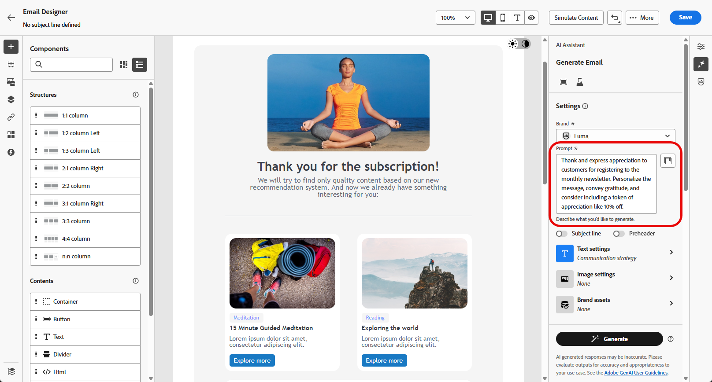
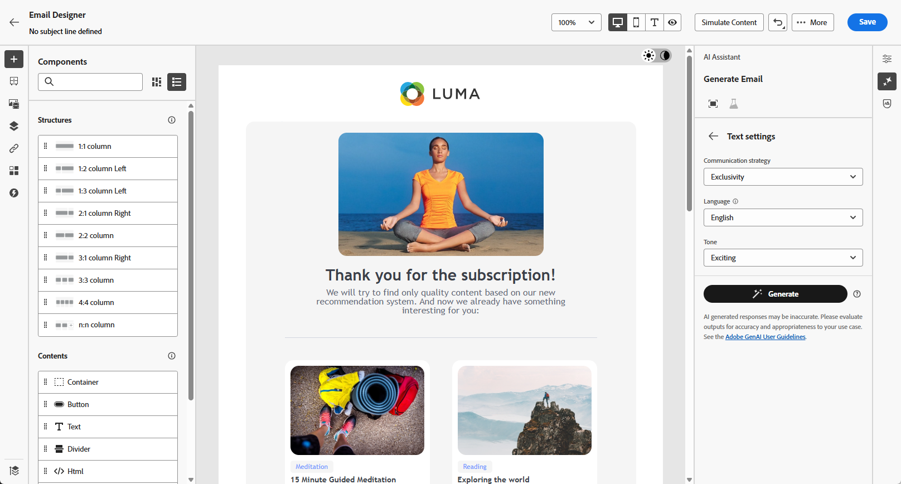
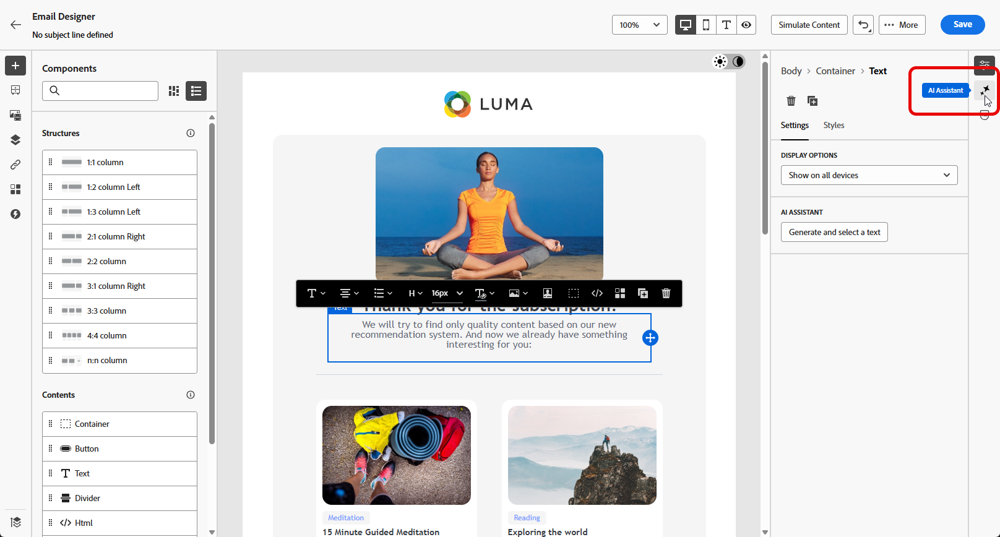
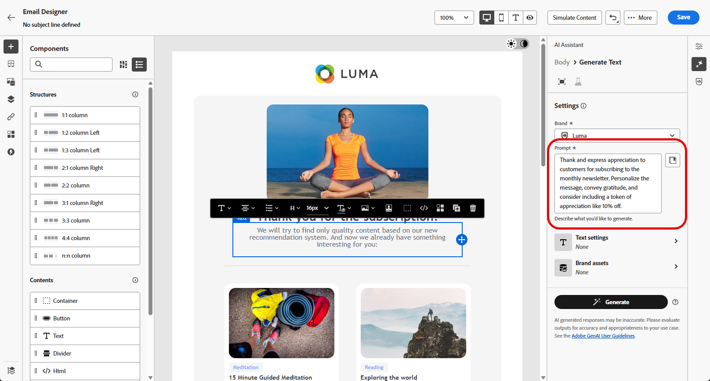
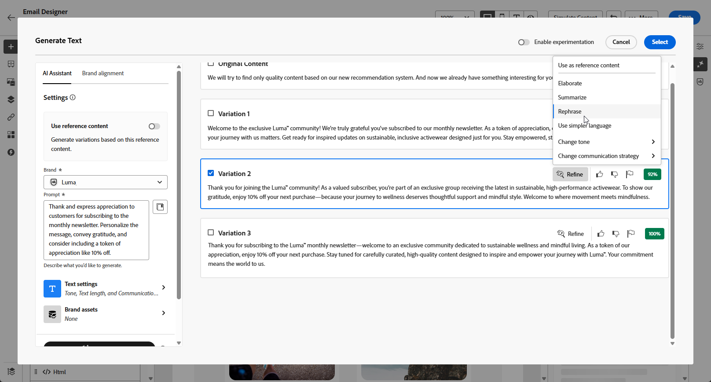

# AI 어시스턴트로 이메일 생성 {#generative-email}

>[!BEGINSHADEBOX]

**목차**

* [AI 어시스턴트 시작하기](gs-generative.md)
* AI 어시스턴트로 이메일 생성
* [AI 어시스턴트와 함께하는 SMS 세대](generative-sms.md)
* [AI Assistant를 사용하여 푸시 생성](generative-push.md)
* [AI Assistant를 사용한 콘텐츠 실험](generative-experimentation.md)

>[!ENDSHADEBOX]

>[!NOTE]
>
>이 기능의 사용을 시작하기 전에 관련 항목을 읽어 보십시오. [보호 및 제한 사항](gs-generative.md#generative-guardrails).

이메일을 만들고 맞춤화한 후에는 생성 AI를 기반으로 한 Journey Optimizer의 AI Assistant를 활용하여 콘텐츠를 높일 수 있습니다.

AI Assistant를 사용하여 대상자에게 직접 전달하는 완벽한 이메일, 맞춤화된 텍스트 조각 및 맞춤화된 이미지를 제작하여 참여도와 상호 작용을 향상시킴으로써 캠페인의 효과를 높일 수 있습니다.

Journey Optimizer에서 AI Assistant를 사용하는 방법을 알려면 아래 탭을 살펴보십시오.

>[!BEGINTABS]

>[!TAB 전체 이메일 생성]

다음 예에서는 AI 도우미를 활용하여 기존 이메일 템플릿을 구체화합니다.

1. 이메일 캠페인을 만들고 구성한 후 **[!UICONTROL 콘텐츠 편집]**.

   이메일 캠페인을 구성하는 방법에 대한 자세한 내용은 을(를) 참조하십시오. [이 페이지](../campaigns/create-campaign.md).

1. 필요에 따라 이메일을 개인화하고 **[!UICONTROL AI Assistant]** 메뉴 아래의 제품에서 사용할 수 있습니다.

   {zoomable=&quot;yes&quot;}

1. 활성화 **[!UICONTROL 원본 컨텐츠 사용]** campaign 콘텐츠, 이름 및 선택한 대상을 기반으로 새 콘텐츠를 개인화할 수 있는 AI 길잡이 옵션입니다.

   프롬프트는 항상 현재 콘텐츠에 연결되어야 합니다.

1. 에서 생성하려는 내용을 설명하여 콘텐츠를 미세 조정합니다. **[!UICONTROL 프롬프트]** 필드.

   메시지를 작성하는 데 도움이 필요한 경우 **[!UICONTROL 프롬프트 라이브러리]** 는 캠페인을 개선하기 위한 다양한 신속한 아이디어를 제공합니다.

   {zoomable=&quot;yes&quot;}

1. 다음을 전환할 수 있습니다. **[!UICONTROL 제목 줄]** 및 **[!UICONTROL 사전 머리글]** 변형 생성에 포함할 옵션입니다.

1. 클릭 **[!UICONTROL 브랜드 자산 업로드]** 추가 컨텍스트를 제공할 수 있는 콘텐츠가 포함된 브랜드 자산을 AI Assistant에 추가하거나 이전에 업로드한 자산을 선택합니다.

   {zoomable=&quot;yes&quot;}

1. 프롬프트를 다음과 같은 다양한 옵션으로 사용자 지정합니다.

   * **[!UICONTROL 커뮤니케이션 전략]**: 생성된 텍스트에 가장 적합한 커뮤니케이션 스타일을 선택합니다.
   * **[!UICONTROL 언어]**: 콘텐츠를 생성할 언어를 선택합니다.
   * **[!UICONTROL 톤]**: 이메일의 톤은 대상자에게 울려 퍼져야 합니다. AI 어시스턴트는 여러분이 유익하거나, 장난스럽거나, 설득력 있게 들리기를 원하든 상관없이 메시지를 그에 따라 조정할 수 있습니다.

   {zoomable=&quot;yes&quot;}

1. 프롬프트가 준비되면 다음을 클릭합니다. **[!UICONTROL 생성]**.

1. 생성된 를 통해 찾아보기 **[!UICONTROL 변형]** 및 클릭 **[!UICONTROL 미리 보기]** 선택한 변형의 전체 화면 버전을 보려면 다음과 같이 하십시오.

1. 다음 위치로 이동 **[!UICONTROL 세부 조정]** 내의 옵션 **[!UICONTROL 미리 보기]** 추가 사용자 지정 기능에 액세스하기 위한 창:

   * **[!UICONTROL 구문 변경]**: AI Assistant는 다양한 방식으로 메시지를 고쳐 써서 다양한 대상자를 유혹할 수 있습니다.

   * **[!UICONTROL 더 간결한 언어 사용]**: AI Assistant를 사용하여 언어를 단순화함으로써, 보다 많은 대상자가 명확하고 쉽게 사용할 수 있습니다.

   {zoomable=&quot;yes&quot;}

1. 클릭 **[!UICONTROL 선택]** 적절한 콘텐츠를 찾았으면

   콘텐츠에 대한 실험을 활성화할 수도 있습니다. [자세히 알아보기](generative-experimentation.md)

1. 개인화 필드를 삽입하여 프로필 데이터를 기반으로 이메일 콘텐츠를 사용자 정의합니다. 그런 다음 **[!UICONTROL 콘텐츠 시뮬레이션]** 단추를 클릭하여 렌더링을 제어하고 테스트 프로필로 개인화 설정을 확인합니다. [자세히 알아보기](../personalization/personalize.md)

콘텐츠, 대상자 및 일정을 정의했으면 이메일 캠페인을 준비할 준비가 되었습니다. [자세히 알아보기](../campaigns/review-activate-campaign.md)

>[!TAB 텍스트 생성]

다음 예제에서는 AI 도우미를 활용하여 이메일의 콘텐츠를 개선합니다.

1. 이메일 캠페인을 만들고 구성한 후 **[!UICONTROL 콘텐츠 편집]**.

   이메일 캠페인을 구성하는 방법에 대한 자세한 내용은 을(를) 참조하십시오. [이 페이지](../email/create-email.md).

1. 선택 **[!UICONTROL 텍스트 구성 요소]** 특정 콘텐츠만 타겟팅할 수 있습니다. 및 액세스 **[!UICONTROL AI Assistant]** 메뉴 아래의 제품에서 사용할 수 있습니다.

   {zoomable=&quot;yes&quot;}

1. 활성화 **[!UICONTROL 원본 컨텐츠 사용]** campaign 콘텐츠, 이름 및 선택한 대상을 기반으로 새 콘텐츠를 개인화할 수 있는 AI 길잡이 옵션입니다.

   프롬프트는 항상 현재 콘텐츠에 연결되어야 합니다.

1. 에서 생성하려는 내용을 설명하여 콘텐츠를 미세 조정합니다. **[!UICONTROL 프롬프트]** 필드.

   메시지를 작성하는 데 도움이 필요한 경우 **[!UICONTROL 프롬프트 라이브러리]** 는 캠페인을 개선하기 위한 다양한 신속한 아이디어를 제공합니다.

   {zoomable=&quot;yes&quot;}

1. 클릭 **[!UICONTROL 브랜드 자산 업로드]** 추가 컨텍스트를 제공할 수 있는 콘텐츠가 포함된 브랜드 자산을 AI Assistant에 추가합니다.

   {zoomable=&quot;yes&quot;}

1. 프롬프트를 다음과 같은 다양한 옵션으로 사용자 지정합니다.

   * **[!UICONTROL 커뮤니케이션 전략]**: 생성된 텍스트에 대해 원하는 통신 접근 방식을 선택합니다.
   * **[!UICONTROL 언어]**: 변형 콘텐츠의 언어를 선택합니다.
   * **[!UICONTROL 톤]**: 텍스트가 대상자 및 목적에 적합한지 확인합니다.
   * **[!UICONTROL Length]**: 범위 슬라이더를 사용하여 콘텐츠의 길이를 선택합니다.

   {zoomable=&quot;yes&quot;}

1. 프롬프트가 준비되면 다음을 클릭합니다. **[!UICONTROL 생성]**.

1. 생성된 를 통해 찾아보기 **[!UICONTROL 변형]** 및 클릭 **[!UICONTROL 미리 보기]** 선택한 변형의 전체 화면 버전을 보려면 다음과 같이 하십시오.

1. 다음 위치로 이동 **[!UICONTROL 세부 조정]** 내의 옵션 **[!UICONTROL 미리 보기]** 추가 사용자 지정 기능에 액세스하기 위한 창:

   * **[!UICONTROL 참조 콘텐츠로 사용]**: 선택한 변형은 다른 결과를 생성하기 위한 참조 콘텐츠 역할을 합니다.

   * **[!UICONTROL 정교하]**: AI Assistant를 사용하면 특정 주제를 확장하고 더 나은 이해와 참여를 위해 추가 세부 정보를 제공할 수 있습니다.

   * **[!UICONTROL 요약]**: 정보가 길면 이메일 수신자에게 과부하가 걸릴 수 있습니다. AI Assistant를 사용하여 주요 사항을 명확하고 간결한 요약으로 요약하여 주목 받고 더 자세히 읽을 수 있도록 장려합니다.

   * **[!UICONTROL 구문 변경]**:AI Assistant는 다양한 방식으로 메시지를 고쳐 써서 다양한 대상자를 유혹할 수 있습니다.

   * **[!UICONTROL 더 간결한 언어 사용]**: AI Assistant를 사용하여 언어를 단순화함으로써, 보다 많은 대상자가 명확하고 쉽게 사용할 수 있습니다.

   {zoomable=&quot;yes&quot;}

1. 클릭 **[!UICONTROL 선택]** 적절한 콘텐츠를 찾았으면

   콘텐츠에 대한 실험을 활성화할 수도 있습니다. [자세히 알아보기](generative-experimentation.md)

1. 개인화 필드를 삽입하여 프로필 데이터를 기반으로 이메일 콘텐츠를 사용자 정의합니다. 그런 다음 **[!UICONTROL 콘텐츠 시뮬레이션]** 단추를 클릭하여 렌더링을 제어하고 테스트 프로필로 개인화 설정을 확인합니다. [자세히 알아보기](../personalization/personalize.md)

콘텐츠, 대상자 및 일정을 정의했으면 이메일 캠페인을 준비할 준비가 되었습니다. [자세히 알아보기](../campaigns/review-activate-campaign.md)

>[!TAB 이미지 생성]

아래 예에서는 AI Assistant를 활용하여 에셋을 최적화하고 개선하여 보다 사용자 친화적인 경험을 제공하는 방법에 대해 알아봅니다.

1. 이메일 캠페인을 만들고 구성한 후 **[!UICONTROL 콘텐츠 편집]**.

   이메일 캠페인을 구성하는 방법에 대한 자세한 내용은 을(를) 참조하십시오. [이 페이지](../email/create-email.md).

1. 다음을 입력합니다. **[!UICONTROL 기본 세부 정보]** 캠페인을 위해 사용됩니다. 완료되면 다음을 클릭합니다. **[!UICONTROL 이메일 콘텐츠 편집]**.

1. AI Assistant를 사용하여 변경할 에셋을 선택합니다.

1. 오른쪽 메뉴에서 **[!UICONTROL AI Assistant]**.

   {zoomable=&quot;yes&quot;}

1. 활성화 **[!UICONTROL 참조 스타일]** ai 관리자가 참조 콘텐츠를 기반으로 새 콘텐츠를 개인화할 수 있는 옵션입니다. 이미지를 업로드하여 변형에 컨텍스트를 추가할 수도 있습니다.

   프롬프트는 항상 현재 콘텐츠에 연결되어야 합니다.

1. 에서 생성하려는 내용을 설명하여 콘텐츠를 미세 조정합니다. **[!UICONTROL 프롬프트]** 필드.

   메시지를 작성하는 데 도움이 필요한 경우 **[!UICONTROL 프롬프트 라이브러리]** 는 캠페인을 개선하기 위한 다양한 신속한 아이디어를 제공합니다.

   {zoomable=&quot;yes&quot;}

1. 클릭 **[!UICONTROL 브랜드 자산 업로드]** 추가 컨텍스트를 제공할 수 있는 콘텐츠가 포함된 브랜드 자산을 AI Assistant에 추가합니다.

1. 프롬프트를 다음과 같은 다양한 옵션으로 사용자 지정합니다.

   * **[!UICONTROL 종횡비]**: 에셋의 너비와 높이를 결정합니다. 16:9, 4:3, 3:2 또는 1:1과 같은 일반적인 비율 중에서 선택할 수 있는 옵션이 있거나 사용자 지정 크기를 입력할 수 있습니다.
   * **[!UICONTROL 색상 및 톤]**: 이미지 내의 전체 색상 모양과 전달하는 분위기 또는 분위기.
   * **[!UICONTROL 컨텐츠 유형]**: 사진, 그래픽 또는 예술과 같은 다양한 형식의 시각적 표현을 구별하여 시각적 요소의 특성을 분류합니다.
   * **[!UICONTROL 조명]**: 이미지에 있는 번개를 말하며, 분위기를 형성하고 특정 요소를 강조 표시합니다.
   * **[!UICONTROL 컴포지션]**: 이미지 프레임 내의 요소 배열을 말합니다

   {zoomable=&quot;yes&quot;}

1. 프롬프트 구성이 만족스러우면 **[!UICONTROL 생성]**.

1. 찾아보기 **[!UICONTROL 변형 제안]** 원하는 자산을 찾습니다.

   클릭 **[!UICONTROL 미리 보기]** 선택한 변형의 전체 화면 버전을 보려면 다음과 같이 하십시오.

   {zoomable=&quot;yes&quot;}

1. 선택 **[!UICONTROL 유사 항목 표시]** 이 변형과 관련된 이미지를 보려는 경우.

   {zoomable=&quot;yes&quot;}

1. 클릭 **[!UICONTROL 선택]** 적절한 콘텐츠를 찾았으면

   콘텐츠에 대한 실험을 활성화할 수도 있습니다. [자세히 알아보기](generative-experimentation.md)

1. 메시지 콘텐츠를 정의한 후 **[!UICONTROL 콘텐츠 시뮬레이션]** 단추를 클릭하여 렌더링을 제어하고 테스트 프로필로 개인화 설정을 확인합니다. [자세히 알아보기](../personalization/personalize.md)

1. 콘텐츠, 대상자 및 일정을 정의했으면 이메일 캠페인을 준비할 준비가 되었습니다. [자세히 알아보기](../campaigns/review-activate-campaign.md)

>[!ENDTABS]

## 방법 비디오 {#video}

AI Assistant를 사용하여 전체 이메일, 텍스트 또는 이미지를 생성하는 방법을 알아봅니다.

>[!VIDEO](https://video.tv.adobe.com/v/3428341)
