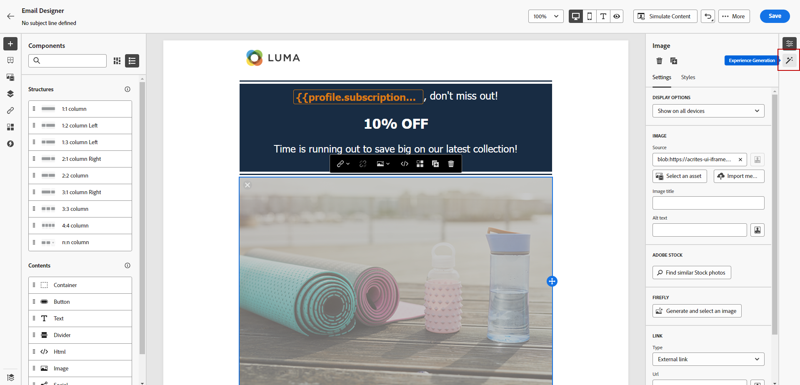

# AI Assistant를 사용하여 이미지 생성 {#image-content-assistant}

>[!BEGINSHADEBOX]

**목차**

* [AI Assistant 시작](gs-generative.md)
* [AI Assistant를 사용하여 텍스트 생성](generative-content.md)
* **[AI Assistant를 사용하여 이미지 생성](generative-image.md)**

>[!ENDSHADEBOX]

이메일 또는 웹 페이지를 만들고 개인화한 후에는 Journey Optimizer AI Assistant를 사용하여 콘텐츠를 한 차원 높입니다. 이 강력한 도구를 사용하면 콘텐츠를 손쉽게 개인화하고 향상시킬 수 있습니다.

아래 예에서는 AI Assistant를 사용하여 에셋을 업데이트하고 개선하여 더 나은 사용자 경험을 제공하는 방법에 대해 알아봅니다. 다음 단계를 수행하십시오.

1. 메시지를 만들고 구성한 후 **[!UICONTROL 콘텐츠 만들기]** 필요에 따라 개인화합니다.

1. AI Assistant를 사용하여 변경할 에셋을 선택합니다.

1. 오른쪽 메뉴에서 **[!UICONTROL 경험 생성]**.

   

1. 결과를 보다 세밀하게 조정하기 위한 프롬프트를 추가하고 을 클릭합니다. **[!UICONTROL 생성]**.

   활성화 **[!UICONTROL 현재 콘텐츠로 개선]** 메시지, 캠페인 이름 및 선택한 대상을 기반으로 새 에셋을 개인화할 수 있는 AI 길잡이 옵션입니다.

   

1. 찾아보기 **[!UICONTROL 변형 제안]** 원하는 자산을 찾습니다.

1. 다음을 선택하면 **[!UICONTROL 변형]**&#x200B;선택한 에셋의 고급 메뉴에 액세스합니다.

   

1. 다음을 선택할 수 있습니다. **[!UICONTROL 비슷하게 만들기]** 선택한 변형을 기반으로 더 많은 변형을 생성할 수 있습니다.

1. 클릭 **[!UICONTROL 이미지 편집]** 에 액세스하려면 **[!UICONTROL 새 이미지 선택]** 메뉴 아래의 제품에서 사용할 수 있습니다.

1. 이 메뉴에서 새 에셋을 생성하거나 에셋 폴더에서 기존 에셋을 사용하도록 선택할 수 있습니다.

   

1. 클릭 **[!UICONTROL 삽입]** 생성된 에셋을 콘텐츠에 추가합니다.

   

1. 생성된 에셋을 저장할 폴더를 선택하고 **[!UICONTROL 가져오기]**.

   

1. 메시지 콘텐츠를 정의한 후 **[!UICONTROL 콘텐츠 시뮬레이션]** 단추를 클릭하여 렌더링을 제어하고 테스트 프로필로 개인화 설정을 확인합니다. [자세히 알아보기](../content-management/preview-test.md)

1. 메시지가 준비되면 캠페인 요약 페이지에서 다음을 클릭할 수 있습니다. **[!UICONTROL 활성화하려면 검토]** 캠페인 요약을 표시합니다. 매개 변수가 잘못되거나 누락된 경우 경고가 표시됩니다.

1. 캠페인을 시작하기 전에 모든 구성이 올바른지 다시 한 번 확인한 다음 를 클릭합니다. **[!UICONTROL 활성화]**.

실험 및 캠페인을 성공적으로 구성한 후 캠페인 보고서에서 캠페인을 추적할 수 있습니다. [자세히 알아보기](../reports/campaign-global-report.md#experimentation-report)
