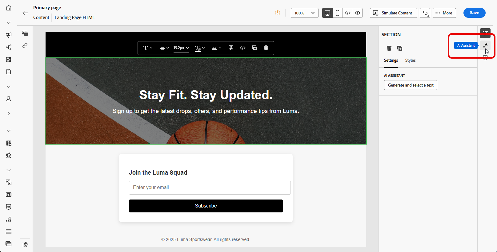
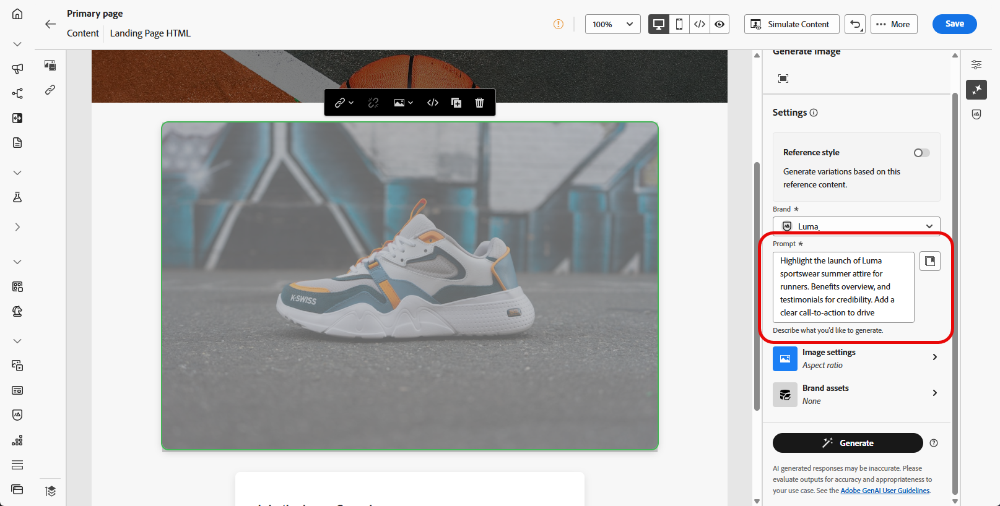

# AI Assistant를 사용하여 랜딩 페이지 생성 {#generative-lp}

>[!IMPORTANT]
>
>* 이 기능을 사용하기 전에 관련 [보호 및 제한 사항](gs-generative.md#generative-guardrails)을 읽어보십시오.
>
>
>* Journey Optimizer에서 AI Assistant를 사용하려면 먼저 [사용자 계약](https://www.adobe.com/legal/licenses-terms/adobe-dx-gen-ai-user-guidelines.html)에 동의해야 합니다. 자세한 내용은 Adobe 담당자에게 문의하십시오.

생성 AI에서 제공하는 Journey Optimizer의 AI Assistant를 사용하여 랜딩 페이지를 탈바꿈합니다.

완벽한 페이지, 맞춤화된 텍스트 조각, 대상자와 공감하는 사용자 지정된 시각적 요소 등 효과적인 콘텐츠를 손쉽게 제작하여 참여도와 상호 작용을 향상시킵니다.

Journey Optimizer에서 AI Assistant를 사용하는 방법을 알려면 아래 탭을 살펴보십시오.

>[!BEGINTABS]

>[!TAB 전체 랜딩 페이지 생성]

다음 예에서는 AI Assistant를 활용하여 기존 랜딩 페이지 템플릿을 구체화합니다.

1. 랜딩 페이지를 만들고 구성한 후 **[!UICONTROL 콘텐츠 편집]**&#x200B;을 클릭합니다.

   랜딩 페이지를 구성하는 방법에 대한 자세한 내용은 [이 페이지](../landing-pages/create-lp.md)를 참조하세요.

1. 필요에 따라 레이아웃을 개인화하고 **[!UICONTROL AI 길잡이]** 메뉴에 액세스합니다.

   {zoomable="yes"}

1. AI 관리자가 선택한 콘텐츠를 기반으로 새 콘텐츠를 개인화하려면 **[!UICONTROL 원본 콘텐츠 사용]** 옵션을 사용하도록 설정하십시오.

1. **[!UICONTROL 프롬프트]** 필드에 생성할 내용을 설명하여 내용을 미세 조정하십시오.

   프롬프트 작성에 도움이 필요한 경우 랜딩 페이지를 개선하기 위한 다양한 프롬프트 아이디어를 제공하는 **[!UICONTROL 프롬프트 라이브러리]**&#x200B;에 액세스하십시오.

   {zoomable="yes"}

1. **[!UICONTROL 텍스트 설정]** 옵션을 사용하여 메시지를 사용자 지정합니다.

   * **[!UICONTROL 커뮤니케이션 전략]**: 생성된 텍스트에 가장 적합한 커뮤니케이션 스타일을 선택합니다.
   * **[!UICONTROL 언어]**: 스페인어, 이탈리아어, 스웨덴어 및 노르웨이어 언어 옵션은 개인 베타 버전으로 출시되며 향후 릴리스에서 모든 고객에게 점진적으로 제공될 예정입니다.
   * **[!UICONTROL 음색]**: 랜딩 페이지의 음색이 대상자에게 울려 퍼져야 합니다. AI 어시스턴트는 유익하거나, 장난스럽거나, 설득력 있게 들리고자 하는 경우 해당 메시지를 적절하게 조정할 수 있습니다.

   {zoomable="yes"}

1. **[!UICONTROL 이미지 설정]** 선택:

   * **[!UICONTROL 콘텐츠 형식]**: 이 옵션은 시각적 요소의 특성을 분류하여 사진, 그래픽 또는 미술과 같은 시각적 표현의 다른 형식을 구분합니다.
   * **[!UICONTROL 시각적 강도]**: 이미지의 강도를 조정하여 이미지의 영향을 제어할 수 있습니다. 낮은 설정 (2)는 부드럽고 절제된 모양을 만들고, 높은 설정 (10)은 이미지를 더 생동감 있고 시각적으로 강력하게 만듭니다.
   * **[!UICONTROL 색상 및 색조]**: 이미지 내의 전체 색상 모양과 이미지 내의 분위기 또는 분위기를 전달합니다.
   * **[!UICONTROL 조명]**: 이미지에 있는 번개(대기의 모양과 특정 요소의 강조 표시)를 나타냅니다.
   * **[!UICONTROL 컴포지션]**: 이미지 프레임 내의 요소 배열을 참조합니다

   {zoomable="yes"}

1. **[!UICONTROL 브랜드 자산]** 메뉴에서 **[!UICONTROL 브랜드 자산 업로드]**&#x200B;를 클릭하여 추가 컨텍스트 AI Assistant를 제공하거나 이전에 업로드한 것을 선택할 수 있는 콘텐츠가 포함된 브랜드 자산을 추가합니다.

   이전에 업로드한 파일은 **[!UICONTROL 업로드된 브랜드 자산]** 드롭다운에서 사용할 수 있습니다. 세대에 포함할 자산을 전환하기만 하면 됩니다.

   {zoomable="yes"}

1. 메시지가 준비되면 **[!UICONTROL 생성]**&#x200B;을 클릭합니다.

1. 생성된 **[!UICONTROL 변형]**&#x200B;을 찾은 다음 **[!UICONTROL 미리 보기]**&#x200B;를 클릭하여 선택한 변형의 전체 화면 버전을 봅니다.

1. 추가 사용자 지정 기능에 액세스하려면 **[!UICONTROL 미리 보기]** 창 내에서 **[!UICONTROL 다시 정의]** 옵션으로 이동하십시오.

   * **[!UICONTROL 구문 변경]**: AI Assistant는 다양한 방식으로 메시지를 다시 구문 처리하여 쓰기를 신선하게 유지하고 다양한 대상자를 유혹할 수 있습니다.

   * **[!UICONTROL 더 간단한 언어 사용]**: AI Assistant를 사용하여 언어를 단순화함으로써 더 많은 대상자가 명확하고 쉽게 사용할 수 있습니다.

   텍스트의 **[!UICONTROL 색조]** 및 **[!UICONTROL 통신 전략]**&#x200B;을 변경할 수도 있습니다.

   {zoomable="yes"}

1. 적절한 콘텐츠를 찾으면 **[!UICONTROL 선택]**&#x200B;을 클릭합니다.

1. 개인화 필드를 삽입하여 프로필 데이터를 기반으로 랜딩 페이지 콘텐츠를 사용자 지정합니다. 그런 다음 **[!UICONTROL 콘텐츠 시뮬레이션]** 단추를 클릭하여 렌더링을 제어하고 테스트 프로필로 개인화 설정을 확인합니다. [자세히 알아보기](../personalization/personalize.md)

랜딩 페이지가 준비되면 이를 게시하여 메시지에 사용할 수 있도록 할 수 있습니다. [자세히 알아보기](../landing-pages/create-lp.md#publish-landing-page)

>[!TAB 텍스트 전용 생성]

다음 예에서는 AI Assistant를 활용하여 랜딩 페이지의 콘텐츠를 향상시킵니다.

1. 랜딩 페이지를 만들고 구성한 후 **[!UICONTROL 콘텐츠 편집]**&#x200B;을 클릭합니다.

   랜딩 페이지를 구성하는 방법에 대한 자세한 내용은 [이 페이지](../landing-pages/create-lp.md)를 참조하세요.

1. 특정 콘텐츠만 타겟팅하려면 **[!UICONTROL 텍스트 구성 요소]**&#x200B;를 선택하십시오. **[!UICONTROL AI Assistant]** 메뉴에 액세스합니다.

   {zoomable="yes"}

1. AI 관리자가 선택한 콘텐츠를 기반으로 새 콘텐츠를 개인화하려면 **[!UICONTROL 원본 콘텐츠 사용]** 옵션을 사용하도록 설정하십시오.

1. **[!UICONTROL 프롬프트]** 필드에 생성할 내용을 설명하여 내용을 미세 조정하십시오.

   프롬프트 작성에 도움이 필요한 경우 랜딩 페이지를 개선하기 위한 다양한 프롬프트 아이디어를 제공하는 **[!UICONTROL 프롬프트 라이브러리]**&#x200B;에 액세스하십시오.

   {zoomable="yes"}

1. **[!UICONTROL 텍스트 설정]** 옵션을 사용하여 메시지를 사용자 지정합니다.

   * **[!UICONTROL 커뮤니케이션 전략]**: 생성된 텍스트에 가장 적합한 커뮤니케이션 스타일을 선택합니다.
   * **[!UICONTROL 언어]**: 스페인어, 이탈리아어, 스웨덴어 및 노르웨이어 언어 옵션은 개인 베타 버전으로 출시되며 향후 릴리스에서 모든 고객에게 점진적으로 제공될 예정입니다.
   * **[!UICONTROL 음색]**: 랜딩 페이지의 음색이 대상자에게 울려 퍼져야 합니다. AI 어시스턴트는 유익하거나, 장난스럽거나, 설득력 있게 들리고자 하는 경우 해당 메시지를 적절하게 조정할 수 있습니다.
   * **텍스트 길이**: 슬라이더를 사용하여 원하는 텍스트 길이를 선택합니다.

   {zoomable="yes"}

1. **[!UICONTROL 브랜드 자산]** 메뉴에서 **[!UICONTROL 브랜드 자산 업로드]**&#x200B;를 클릭하여 추가 컨텍스트 AI Assistant를 제공하거나 이전에 업로드한 것을 선택할 수 있는 콘텐츠가 포함된 브랜드 자산을 추가합니다.

   이전에 업로드한 파일은 **[!UICONTROL 업로드된 브랜드 자산]** 드롭다운에서 사용할 수 있습니다. 세대에 포함할 자산을 전환하기만 하면 됩니다.

   {zoomable="yes"}

1. 메시지가 준비되면 **[!UICONTROL 생성]**&#x200B;을 클릭합니다.

1. 생성된 **[!UICONTROL 변형]**&#x200B;을 찾은 다음 **[!UICONTROL 미리 보기]**&#x200B;를 클릭하여 선택한 변형의 전체 화면 버전을 봅니다.

1. 추가 사용자 지정 기능에 액세스하려면 **[!UICONTROL 미리 보기]** 창 내에서 **[!UICONTROL 다시 정의]** 옵션으로 이동하십시오.

   * **[!UICONTROL 참조 콘텐츠로 사용]**: 선택한 변형이 다른 결과를 생성하기 위한 참조 콘텐츠로 사용됩니다.

   * **[!UICONTROL 정교함]**: AI 도우미는 특정 주제를 확장하고 더 나은 이해와 참여를 위해 추가 세부 정보를 제공하는 데 도움이 될 수 있습니다.

   * **[!UICONTROL 요약]**: 정보가 길면 랜딩 페이지 수신자에게 과부하가 걸릴 수 있습니다. AI Assistant를 사용하여 주요 사항을 명확하고 간결한 요약으로 요약하여 주목 받고 더 자세히 읽을 수 있도록 장려합니다.

   * **[!UICONTROL 구문 변경]**: AI 도우미는 다양한 방식으로 메시지를 다시 구문 처리하여 쓰기를 신선하게 유지하고 다양한 대상자를 유혹할 수 있습니다.

   * **[!UICONTROL 더 간단한 언어 사용]**: AI Assistant를 사용하여 언어를 단순화함으로써 더 많은 대상자가 명확하고 쉽게 사용할 수 있습니다.

   텍스트의 **[!UICONTROL 색조]** 및 **[!UICONTROL 통신 전략]**&#x200B;을 변경할 수도 있습니다.

   {zoomable="yes"}

1. 적절한 콘텐츠를 찾으면 **[!UICONTROL 선택]**&#x200B;을 클릭합니다.

1. 개인화 필드를 삽입하여 프로필 데이터를 기반으로 랜딩 페이지 콘텐츠를 사용자 지정합니다. 그런 다음 **[!UICONTROL 콘텐츠 시뮬레이션]** 단추를 클릭하여 렌더링을 제어하고 테스트 프로필로 개인화 설정을 확인합니다. [자세히 알아보기](../personalization/personalize.md)

랜딩 페이지가 준비되면 이를 게시하여 메시지에 사용할 수 있도록 할 수 있습니다. [자세히 알아보기](../landing-pages/create-lp.md#publish-landing-page)

>[!TAB 이미지 전용 생성]

아래 예에서는 AI Assistant를 활용하여 에셋을 최적화하고 개선하여 보다 사용자 친화적인 경험을 제공하는 방법에 대해 알아봅니다.

1. 랜딩 페이지를 만들고 구성한 후 **[!UICONTROL 콘텐츠 편집]**&#x200B;을 클릭합니다.

   랜딩 페이지를 구성하는 방법에 대한 자세한 내용은 [이 페이지](../landing-pages/create-lp.md)를 참조하세요.

1. AI Assistant를 사용하여 변경할 에셋을 선택합니다.

1. 오른쪽 메뉴에서 **[!UICONTROL AI 길잡이]**&#x200B;를 선택합니다.

   {zoomable="yes"}

1. AI 관리자가 참조 콘텐츠를 기반으로 새 콘텐츠를 개인화하려면 **[!UICONTROL 참조 스타일]** 옵션을 활성화하십시오. 이미지를 업로드하여 변형에 컨텍스트를 추가할 수도 있습니다.

1. **[!UICONTROL 프롬프트]** 필드에 생성할 내용을 설명하여 내용을 미세 조정하십시오.

   프롬프트 작성에 도움이 필요한 경우 랜딩 페이지를 개선하기 위한 다양한 프롬프트 아이디어를 제공하는 **[!UICONTROL 프롬프트 라이브러리]**&#x200B;에 액세스하십시오.

   {zoomable="yes"}

1. **[!UICONTROL 이미지 설정]** 옵션을 사용하여 메시지를 사용자 지정합니다.

   * **[!UICONTROL 종횡비]**: 에셋의 너비와 높이를 결정합니다. 16:9, 4:3, 3:2 또는 1:1과 같은 일반적인 비율 중에서 선택할 수 있는 옵션이 있거나 사용자 지정 크기를 입력할 수 있습니다.
   * **[!UICONTROL 콘텐츠 형식]**: 이 옵션은 시각적 요소의 특성을 분류하여 사진, 그래픽 또는 미술과 같은 시각적 표현의 다른 형식을 구분합니다.
   * **[!UICONTROL 시각적 강도]**: 이미지의 강도를 조정하여 이미지의 영향을 제어할 수 있습니다. 낮은 설정 (2)는 부드럽고 절제된 모양을 만들고, 높은 설정 (10)은 이미지를 더 생동감 있고 시각적으로 강력하게 만듭니다.
   * **[!UICONTROL 색상 및 색조]**: 이미지 내의 전체 색상 모양과 이미지 내의 분위기 또는 분위기를 전달합니다.
   * **[!UICONTROL 조명]**: 이미지에 있는 번개(대기의 모양과 특정 요소의 강조 표시)를 나타냅니다.
   * **[!UICONTROL 컴포지션]**: 이미지 프레임 내의 요소 배열을 참조합니다

   {zoomable="yes"}

1. **[!UICONTROL 브랜드 자산]** 메뉴에서 **[!UICONTROL 브랜드 자산 업로드]**&#x200B;를 클릭하여 추가 컨텍스트 AI Assistant를 제공하거나 이전에 업로드한 것을 선택할 수 있는 콘텐츠가 포함된 브랜드 자산을 추가합니다.

   이전에 업로드한 파일은 **[!UICONTROL 업로드된 브랜드 자산]** 드롭다운에서 사용할 수 있습니다. 세대에 포함할 자산을 전환하기만 하면 됩니다.

1. 프롬프트 구성에 만족하면 **[!UICONTROL 생성]**&#x200B;을 클릭합니다.

1. **[!UICONTROL 변형 제안]**&#x200B;을 검색하여 원하는 자산을 찾습니다.

   선택한 변형의 전체 화면 버전을 보려면 **[!UICONTROL 미리 보기]**&#x200B;를 클릭하십시오.

1. 이 변형과 관련된 이미지를 보려면 **[!UICONTROL 유사 항목 생성]**&#x200B;을 선택하십시오.

   {zoomable="yes"}

1. 적절한 콘텐츠를 찾으면 **[!UICONTROL 선택]**&#x200B;을 클릭합니다.

1. 메시지 콘텐츠를 정의한 후 **[!UICONTROL 콘텐츠 시뮬레이션]** 단추를 클릭하여 렌더링을 제어하고 테스트 프로필로 개인화 설정을 확인합니다. [자세히 알아보기](../personalization/personalize.md)

랜딩 페이지가 준비되면 이를 게시하여 메시지에 사용할 수 있도록 할 수 있습니다. [자세히 알아보기](../landing-pages/create-lp.md#publish-landing-page)

>[!ENDTABS]
