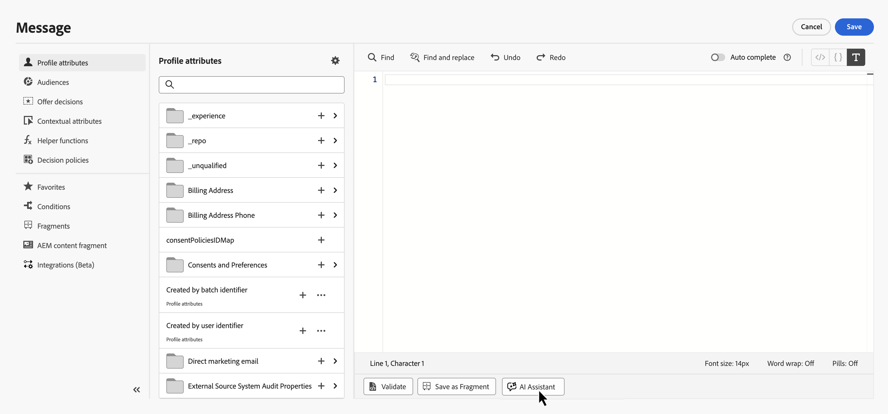

# 개인화 표현식을 위한 AI 지원{#generative-personalization-expressions}

>[!IMPORTANT]
>
>이 기능을 사용하기 전에 관련 [보호 및 제한 사항](gs-generative.md#generative-guardrails)을 읽어보십시오.
> 
>
>Journey Optimizer에서 AI Assistant를 사용하려면 [사용자 계약](https://www.adobe.com/kr/legal/licenses-terms/adobe-dx-gen-ai-user-guidelines.html)에 동의해야 합니다. 자세한 내용은 Adobe 담당자에게 문의하십시오.

## 개요 {#where-available}

[!UICONTROL AI Assistant]를 사용하면 일반 언어로 새로운 개인화를 생성하고, 기존 표현식이 수행하는 작업을 설명하고, 선택한 코드의 문제를 수정하여 구문 및 수동 필드 검색에 드는 시간을 줄일 수 있습니다. 선택 내용을 반복하거나 대화의 다른 변경 사항을 요청할 수도 있습니다. 다음 두 가지 진입점에서 사용할 수 있습니다.

* **[!UICONTROL Personalization 편집기]** — 편집기를 사용할 수 있는 모든 위치(제목 줄, 본문 및 해당 편집기를 여는 기타 필드)입니다. 편집기를 여는 위치 및 방법은 [개인화 추가](../personalization/personalization-build-expressions.md#where)를 참조하십시오.
* **이메일 Designer 인라인 텍스트 편집** — 텍스트 구성 요소를 편집할 때 인라인 편집 팝오버에서 바로 가져옵니다. [전자 메일 Designer에서 생성](#generate-email-designer)을 참조하세요.

더 광범위한 AI Assistant 설정 및 언어에 대해서는 [AI Assistant 시작](gs-generative.md)을 참조하십시오. 개인화 개념에 대해서는 [개인화 시작](../personalization/personalize.md)을 참조하십시오. 프롬프트 아이디어는 [AI 프롬프트 모범 사례](ai-assistant-prompting-guide.md)를 참조하십시오.

캠페인 또는 여정 컨텍스트에 따라 도우미는 데이터를 사용하여 작업하고 이미 노출된 [!UICONTROL Personalization 편집기]를 구성할 수 있습니다(예: 프로필 특성, 세그먼트 멤버십, 도우미 기능 및 관련 개인화 소스).

>[!NOTE]
>
>해당 세션에서 [!UICONTROL AI Assistant]가 열려 있는 동안에만 도우미가 프롬프트에서 컨텍스트를 유지합니다. 도우미나 편집기를 닫으면 대화가 지워집니다. 다음에 도우미를 열면 새 대화가 시작됩니다.

## 개인화 표현식 생성 {#generate}

이 단계들은 처음부터 개인화 표현식을 생성하는 것을 다룹니다. 편집기에 이미 있는 코드를 사용하여 작업하려면 [기존 코드 편집, 수정 또는 설명](#edit-existing)을 참조하세요.

1. 메시지 또는 콘텐츠에서 **[!UICONTROL Personalization 편집기]**&#x200B;를 엽니다.

1. 생성된 개인화 코드를 삽입할 편집기에 커서를 놓은 다음 **[!UICONTROL AI 길잡이]** 단추를 클릭합니다.

   

1. 텍스트 필드에서 필요한 프로필 특성, 세그먼트 또는 논리와 같은 일반 언어로 원하는 개인화 표현식을 설명한 다음 **[!UICONTROL 생성]**&#x200B;을 클릭합니다.

   또한 개인화된 인사말, 프로모션 코드 생성 등과 같이 **[!UICONTROL 빠른 프롬프트]** 섹션에서 바로 사용할 수 있는 프롬프트를 사용할 수도 있습니다.

   

   >[!NOTE]
   >
   >관련 없는 프롬프트 또는 질문이 있으면 범위를 벗어나는 오류가 반환됩니다. 프롬프트를 조정하고 필요한 개인화에 대한 관련 질문을 하십시오.

1. 다중 전환 대화에서 도우미와 계속 토론할 수 있습니다. 이는 프롬프트에서 컨텍스트를 유지하므로 동일한 표현식을 단계별로 구체화할 수 있습니다. 다시 시작하려면 **[!UICONTROL 새 세션]** 단추를 클릭하세요.

   

1. 표현식을 생성한 후 **[!UICONTROL 샘플 프로필에 대한 미리 보기 표시]**&#x200B;를 클릭하여 표현식이 샘플 데이터로 평가되는 방식을 확인하고 연결된 페이로드를 JSON으로 확인합니다. 이 검사를 위해 도우미는 제한된 합성 샘플 프로필 집합을 생성합니다. 이러한 프로필은 조직에 저장되거나 저장되지 않습니다.

   사용자 지정 또는 추가 샘플 프로필이 필요한 경우 도우미와 토론에서 필요한 내용을 설명하고 확인에 적합한 미리 보기 프로필을 생성할 수 있도록 **미리 보기** 키워드를 프롬프트에 포함하십시오.

   

   +++미리 보기 예

   

   >[!NOTE]
   >
   >추가 미리보기는 얼룩 검사를 위한 것입니다. 보조자는 약 1~5개의 프로필을 생성하도록 조정되며, 매우 큰 숫자를 요청하면 요청이 실패할 수 있습니다.

   +++

   >[!NOTE]
   >
   >이 컨트롤은 편집기에서 개인화 코드를 빠르게 검사하기 위한 것이며 콘텐츠의 전체 메시지 미리 보기가 아닙니다. 경험에 대한 완전한 유효성 검사는 일반적인 시뮬레이션 흐름을 사용하십시오. [콘텐츠를 미리 보고 테스트하는 방법에 대해 알아보세요](../content-management/preview-test.md)

1. 개인화 식에서 출력을 구현하려면 **[!UICONTROL 적용]**&#x200B;을 클릭합니다. 도우미 출력은 개인화 편집기의 커서 위치에 삽입됩니다. 이미 있는 코드를 대신 바꾸려면 먼저 편집기에서 해당 코드를 선택한 다음 **[!UICONTROL AI 도우미로 편집]**&#x200B;을 사용합니다([기존 코드 편집, 수정 또는 설명](#edit-existing) 참조).

   출력을 복사한 후  아이콘을 사용하여 필요한 위치에 붙여넣을 수도 있습니다.

## 기존 코드 편집, 수정 또는 설명 {#edit-existing}

기존 개인화 표현식을 선택하고 AI Assistant를 사용하여 개인화 문제를 해결하거나, 코드의 기능을 설명하거나, 기타 변경 사항을 요청할 수 있습니다.

1. 편집기에서 기존 개인화 코드를 선택합니다.

1. 선택 항목을 마우스 오른쪽 단추로 클릭하고 **[!UICONTROL AI 도우미로 편집]**&#x200B;을 선택하면 도우미가 선택 항목을 컨텍스트로 사용합니다.

   

1. **[!UICONTROL AI 길잡이]**&#x200B;가 열립니다. **[!UICONTROL 빠른 명령]**&#x200B;에서 **[!UICONTROL 설명]** 또는 **[!UICONTROL 수정]**&#x200B;을 클릭하거나 텍스트 필드를 사용하여 다른 변경 사항을 요청하고 대화를 시작하십시오.

   

1. **[!UICONTROL 수정]**&#x200B;을(를) 사용하는 경우 토론 내용에 있는 **[!UICONTROL 수정 세부 정보 표시]**&#x200B;를 클릭하여 수정 사항에 대한 설명과 미리 보기 전후의 줄바꿈을 표시합니다.

   

1. 개인화 식을 생성할 때와 마찬가지로 **[!UICONTROL 적용]**&#x200B;을 클릭하여 도우미 출력을 구현합니다. 개인화 편집기에서 선택한 코드를 대체합니다. 예를 들어 코드에 대한 설명을 요청한 경우 을 적용하면 표현식에 수행하는 작업을 설명하는 주석이 추가됩니다.

## 이메일 Designer에서 생성 {#generate-email-designer}

[!UICONTROL 개인화 표현식에 대한 AI 도우미]도 전체 [!UICONTROL Personalization 편집기]를 열지 않고 이메일 Designer의 인라인 편집 환경에서 바로 사용할 수 있습니다. 생성된 표현식은 텍스트 구성 요소의 커서 위치에 삽입됩니다.

1. 이메일 Designer에서 텍스트 구성 요소를 선택하고 인라인 편집을 시작합니다.

1. 다음 두 가지 방법 중 하나로 인라인 개인화 팝오버를 엽니다.

   * 식을 삽입할 위치에 `{{`을(를) 입력하십시오. 팝오버가 자동으로 열립니다.
   * 이미 열려 있는 경우 인라인 편집 팝오버에서 **[!UICONTROL AI를 사용하여 생성]**&#x200B;을 클릭합니다.

   

1. 텍스트 필드에서 원하는 개인화 표현식을 일반 언어로 설명한 다음 **[!UICONTROL 생성]**&#x200B;을 클릭합니다.

1. **[!UICONTROL 식]** 탭의 결과를 검토하여 생성된 식을 확인합니다.

   샘플 프로필 값을 사용하여 식이 평가되는 방식을 보려면 **[!UICONTROL 미리 보기]** 탭으로 전환하여 출력을 삽입하기 전에 확인할 수 있습니다.

   

1. 텍스트 구성 요소의 커서 위치에 식을 적용하려면 **[!UICONTROL 삽입]**&#x200B;을 클릭하십시오. 새 제안을 만들려면 **[!UICONTROL 다시 생성]**&#x200B;을 사용하고, 다시 시작하려면 **[!UICONTROL 다시 설정]**&#x200B;을 사용하세요.

>[!NOTE]
>
>인라인 이메일 Designer 팝오버의 [!UICONTROL 개인화 표현식에 대한 AI 도우미] 세션은 [!UICONTROL Personalization 편집기]의 세션과 독립적입니다. 팝오버를 닫으면 대화가 지워집니다.
