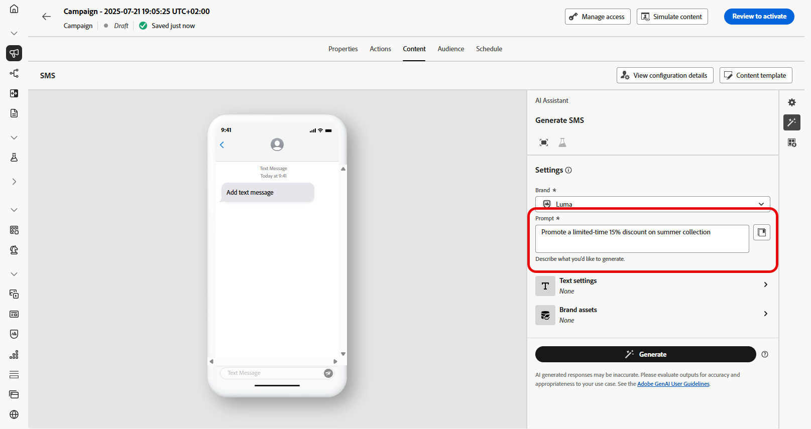

# Journey Optimizer의 AI Assistant를 사용하여 SMS 생성 {#generative-sms}

>[!IMPORTANT]
>
>이 기능을 사용하기 전에 관련 [보호 및 제한 사항](gs-generative.md#generative-guardrails)을 읽어보십시오.
> 
>
>Journey Optimizer에서 AI 도우미를 사용하려면 먼저 [사용자 동의](https://www.adobe.com/legal/licenses-terms/adobe-dx-gen-ai-user-guidelines.html)에 동의해야 합니다. 자세한 내용은 Adobe 담당자에게 문의하십시오.

대상의 환경 설정에 맞게 SMS 메시지를 만들고 맞춤화한 후 Journey Optimizer의 AI Assistant와의 커뮤니케이션을 향상시키십시오.

이 리소스는 콘텐츠를 세밀하게 조정할 수 있는 통찰력 있는 권장 사항을 제공하여 메시지가 공감하고 참여를 극대화할 수 있도록 지원합니다.

Journey Optimizer에서 AI Assistant를 사용하는 방법을 알려면 아래 탭을 살펴보십시오.

>[!BEGINTABS]

>[!TAB 전체 SMS 생성]

1. SMS 캠페인을 만들고 구성한 후 **[!UICONTROL 콘텐츠 편집]**&#x200B;을 클릭하세요.

   SMS 캠페인을 구성하는 방법에 대한 자세한 내용은 [이 페이지](../sms/create-sms.md)를 참조하세요.

1. 캠페인에 대한 **[!UICONTROL 기본 세부 정보]**&#x200B;를 입력하십시오. 완료되면 **[!UICONTROL 콘텐츠 편집]**&#x200B;을 클릭하세요.

1. 필요에 따라 SMS 메시지를 개인화합니다. [자세히 알아보기](../sms/create-sms.md)

1. **[!UICONTROL AI Assistant 표시]** 메뉴에 액세스합니다.

   {zoomable="yes"}

1. AI 생성 콘텐츠가 브랜드 사양에 맞게 조정되도록 하려면 **[!UICONTROL 브랜드]**&#x200B;를 선택하십시오. 브랜드에 대해 [자세히 알아보기](brands.md).

   브랜드 기능은 비공개 베타로 출시되며 모든 고객은 향후 릴리스에서 점진적으로 사용할 수 있습니다.

1. **[!UICONTROL 프롬프트]** 필드에 생성할 내용을 설명하여 내용을 미세 조정하십시오.

   프롬프트 작성에 도움이 필요한 경우 캠페인을 개선하기 위한 다양한 프롬프트 아이디어를 제공하는 **[!UICONTROL 프롬프트 라이브러리]**&#x200B;에 액세스하십시오.

   {zoomable="yes"}

1. **[!UICONTROL 텍스트 설정]** 옵션을 사용하여 메시지를 사용자 지정합니다.

   * **[!UICONTROL 통신 전략]**: 생성된 텍스트에 대해 원하는 통신 접근 방식을 선택하십시오.
   * **[!UICONTROL 언어]**: 스페인어, 이탈리아어, 스웨덴어 및 노르웨이어 언어 옵션은 개인 베타 버전으로 출시되며 향후 릴리스에서 모든 고객에게 점진적으로 제공될 예정입니다.
   * **[!UICONTROL 색조]**: 텍스트가 대상자와 목적에 적합한지 확인하십시오.
   * **[!UICONTROL 길이]**: 범위 슬라이더를 사용하여 콘텐츠의 길이를 선택합니다.

   {zoomable="yes"}

1. **[!UICONTROL 브랜드 자산]** 메뉴에서 **[!UICONTROL 브랜드 자산 업로드]**&#x200B;를 클릭하여 AI Assistant에 추가 컨텍스트를 제공하거나 이전에 업로드한 것을 선택할 수 있는 콘텐츠가 포함된 브랜드 자산을 추가합니다.

   이전에 업로드한 파일은 **[!UICONTROL 업로드된 브랜드 자산]** 드롭다운에서 사용할 수 있습니다. 세대에 포함할 자산을 전환하기만 하면 됩니다.

1. 메시지가 준비되면 **[!UICONTROL 생성]**&#x200B;을 클릭합니다.

1. 생성된 **[!UICONTROL 변형]**&#x200B;을 검색합니다.

1. **[!UICONTROL 미리 보기]** 창 내에서 **[!UICONTROL 세분화]** 옵션으로 이동하여 추가 사용자 지정 기능에 액세스하고 변형을 환경 설정에 맞게 세부 조정하십시오.

   * **[!UICONTROL 참조 콘텐츠로 사용]**: 선택한 변형이 다른 결과를 생성하기 위한 참조 콘텐츠로 사용됩니다.

   * **[!UICONTROL 구문 변경]**: AI 도우미는 다양한 방식으로 메시지를 다시 구문 처리하여 쓰기를 신선하게 유지하고 다양한 대상자를 유혹할 수 있습니다.

   * **[!UICONTROL 더 간단한 언어 사용]**: AI Assistant를 사용하여 언어를 단순화함으로써, 더 많은 대상자가 명확하고 쉽게 사용할 수 있습니다.

   텍스트의 **[!UICONTROL 색조]** 및 **[!UICONTROL 통신 전략]**&#x200B;을 변경할 수도 있습니다.

   {zoomable="yes"}

1. 적절한 콘텐츠를 찾으면 **[!UICONTROL 선택]**&#x200B;을 클릭합니다.

   콘텐츠에 대한 실험을 활성화할 수도 있습니다. [자세히 알아보기](generative-experimentation.md)

1. 개인화 필드를 삽입하여 프로필 데이터를 기반으로 SMS 콘텐츠를 사용자 지정합니다. [콘텐츠 개인화에 대해 자세히 알아보기](../personalization/personalize.md)

1. 메시지 콘텐츠를 정의한 후 **[!UICONTROL 콘텐츠 시뮬레이션]** 단추를 클릭하여 렌더링을 제어하고 테스트 프로필로 개인화 설정을 확인합니다. [자세히 알아보기](../personalization/personalize.md)

콘텐츠, 대상자 및 일정을 정의했으면 SMS 캠페인을 준비할 준비가 되었습니다. [자세히 알아보기](../campaigns/review-activate-campaign.md)

>[!TAB 텍스트 전용 생성]

1. SMS 캠페인을 만들고 구성한 후 **[!UICONTROL 콘텐츠 편집]**&#x200B;을 클릭하세요.

   SMS 캠페인을 구성하는 방법에 대한 자세한 내용은 [이 페이지](../sms/create-sms.md)를 참조하세요.

1. 캠페인에 대한 **[!UICONTROL 기본 세부 정보]**&#x200B;를 입력하십시오. 완료되면 **[!UICONTROL 콘텐츠 편집]**&#x200B;을 클릭하세요.

1. 필요에 따라 SMS 메시지를 개인화합니다. [자세히 알아보기](../sms/create-sms.md)

1. **[!UICONTROL 메시지]** 필드 옆에 있는 **[!UICONTROL AI 도우미를 사용하여 텍스트 편집]** 메뉴에 액세스합니다.

   {zoomable="yes"}

1. AI 도우미가 선택한 콘텐츠를 기반으로 새 콘텐츠를 개인화하려면 **[!UICONTROL 참조 콘텐츠 사용]** 옵션을 활성화하십시오.

1. AI 생성 콘텐츠가 브랜드 사양에 맞게 조정되도록 하려면 **[!UICONTROL 브랜드]**&#x200B;를 선택하십시오. 브랜드에 대해 [자세히 알아보기](brands.md).

   브랜드 기능은 비공개 베타로 출시되며 모든 고객은 향후 릴리스에서 점진적으로 사용할 수 있습니다.

1. **[!UICONTROL 프롬프트]** 필드에 생성할 내용을 설명하여 내용을 미세 조정하십시오.

   프롬프트 작성에 도움이 필요한 경우 캠페인을 개선하기 위한 다양한 프롬프트 아이디어를 제공하는 **[!UICONTROL 프롬프트 라이브러리]**&#x200B;에 액세스하십시오.

   {zoomable="yes"}

1. **[!UICONTROL 텍스트 설정]** 옵션을 사용하여 메시지를 사용자 지정합니다.

   * **[!UICONTROL 통신 전략]**: 생성된 텍스트에 대해 원하는 통신 접근 방식을 선택하십시오.
   * **[!UICONTROL 언어]**: 스페인어, 이탈리아어, 스웨덴어 및 노르웨이어 언어 옵션은 개인 베타 버전으로 출시되며 향후 릴리스에서 모든 고객에게 점진적으로 제공될 예정입니다.
   * **[!UICONTROL 색조]**: 텍스트가 대상자와 목적에 적합한지 확인하십시오.
   * **[!UICONTROL 길이]**: 범위 슬라이더를 사용하여 콘텐츠의 길이를 선택합니다.

   {zoomable="yes"}

1. **[!UICONTROL 브랜드 자산]** 메뉴에서 **[!UICONTROL 브랜드 자산 업로드]**&#x200B;를 클릭하여 AI Assistant에 추가 컨텍스트를 제공하거나 이전에 업로드한 것을 선택할 수 있는 콘텐츠가 포함된 브랜드 자산을 추가합니다.

   이전에 업로드한 파일은 **[!UICONTROL 업로드된 브랜드 자산]** 드롭다운에서 사용할 수 있습니다. 세대에 포함할 자산을 전환하기만 하면 됩니다.

1. 메시지가 준비되면 **[!UICONTROL 생성]**&#x200B;을 클릭합니다.

1. 생성된 **[!UICONTROL 변형]**&#x200B;을 찾은 다음 **[!UICONTROL 미리 보기]**&#x200B;를 클릭하여 선택한 변형의 전체 화면 버전을 봅니다.

1. **[!UICONTROL 미리 보기]** 창 내에서 **[!UICONTROL 세분화]** 옵션으로 이동하여 추가 사용자 지정 기능에 액세스하고 변형을 환경 설정에 맞게 세부 조정하십시오.

   * **[!UICONTROL 참조 콘텐츠로 사용]**: 선택한 변형이 다른 결과를 생성하기 위한 참조 콘텐츠로 사용됩니다.

   * **[!UICONTROL 구문 변경]**: AI 도우미는 다양한 방식으로 메시지를 다시 구문 처리하여 쓰기를 신선하게 유지하고 다양한 대상자를 유혹할 수 있습니다.

   * **[!UICONTROL 더 간단한 언어 사용]**: AI Assistant를 사용하여 언어를 단순화함으로써, 더 많은 대상자가 명확하고 쉽게 사용할 수 있습니다.

   {zoomable="yes"}

1. 적절한 콘텐츠를 찾으면 **[!UICONTROL 선택]**&#x200B;을 클릭합니다.

   콘텐츠에 대한 실험을 활성화할 수도 있습니다. [자세히 알아보기](generative-experimentation.md)

1. 개인화 필드를 삽입하여 프로필 데이터를 기반으로 SMS 콘텐츠를 사용자 지정합니다. [콘텐츠 개인화에 대해 자세히 알아보기](../personalization/personalize.md)

1. 메시지 콘텐츠를 정의한 후 **[!UICONTROL 콘텐츠 시뮬레이션]** 단추를 클릭하여 렌더링을 제어하고 테스트 프로필로 개인화 설정을 확인합니다.

콘텐츠, 대상자 및 일정을 정의했으면 SMS 캠페인을 준비할 준비가 되었습니다. [자세히 알아보기](../campaigns/review-activate-campaign.md)

>[!ENDTABS]
