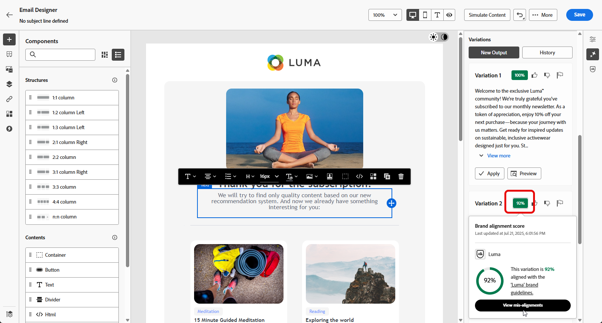

# AI Assistant를 사용하여 텍스트 생성 {#generative-text}

>[!IMPORTANT]
>
>이 기능을 사용하기 전에 관련 [보호 및 제한 사항](gs-generative.md#generative-guardrails)을 읽어보십시오.
> 
>
>Journey Optimizer에서 AI Assistant를 사용하려면 [사용자 계약](https://www.adobe.com/kr/legal/licenses-terms/adobe-dx-gen-ai-user-guidelines.html)에 동의해야 합니다. 자세한 내용은 Adobe 담당자에게 문의하십시오.

Journey Optimizer의 AI Assistant를 사용하여 대상자와 공감하는 매력적인 텍스트 콘텐츠를 생성할 수 있습니다. 이메일 사본 작성, 매력적인 웹 콘텐츠 제작, 설득력 있는 랜딩 페이지 텍스트 작성, 푸시 알림 메시지 작성, SMS 메시지 작성 등 AI Assistant를 통해 효과적인 텍스트 전달이 가능합니다.

## 이메일 및 웹 채널용 {#email-web-channels}

AI Assistant는 이메일 캠페인, 웹 경험 및 랜딩 페이지에 대한 고품질 텍스트 콘텐츠를 생성할 수 있습니다. 이 기능을 사용하면 디지털 터치포인트에서 대상과 연결하는 매력적인 브랜드 내 메시지를 만들 수 있습니다.

### 액세스 및 구성 {#access-configure}

AI Assistant를 사용하여 텍스트 콘텐츠 생성을 시작하려면 먼저 캠페인이나 여정을 설정하고 콘텐츠 편집기에 액세스해야 합니다. 다음 단계에 따라 작업 영역을 준비하고 AI Assistant 패널을 엽니다.

1. 캠페인 또는 여정 만들기 및 구성:

   * **전자 메일**: 전자 메일 캠페인을 만들고 구성한 후 **[!UICONTROL 콘텐츠 편집]**&#x200B;을 클릭하세요. [자세히 알아보기](../email/create-email.md)
   * **웹**: 웹 페이지를 만들고 구성한 후 **[!UICONTROL 웹 페이지 편집]**&#x200B;을 클릭하세요. [자세히 알아보기](../web/create-web.md)
   * **랜딩 페이지**: 랜딩 페이지를 만들고 구성한 후 **[!UICONTROL 디자이너 열기]**&#x200B;를 클릭합니다. [자세히 알아보기](../landing-pages/create-lp.md)

1. 특정 콘텐츠만 타겟팅하려면 **[!UICONTROL 텍스트 구성 요소]**&#x200B;를 선택하고 **[!UICONTROL AI Assistant]** 메뉴(또는 웹용 **[!UICONTROL AI Assistant 표시]**)에 액세스하십시오.

   {zoomable="yes"}

### 콘텐츠 생성 {#generate-content}

AI Assistant를 사용하여 명확한 프롬프트를 만들고, 설정을 미세 조정하고, 맞춤 텍스트를 생성하여 메시지가 브랜드 및 커뮤니케이션 목표에 맞게 조절되도록 하는 방법에 대해 알아봅니다.

1. AI 관리자가 선택한 콘텐츠를 기반으로 새 콘텐츠를 개인화하려면 **[!UICONTROL 원본 콘텐츠 사용]** 옵션을 사용하도록 설정하십시오.

1. AI 생성 콘텐츠가 브랜드 사양에 맞게 조정되도록 하려면 **[!UICONTROL 브랜드]**&#x200B;를 선택하십시오. 브랜드에 대해 [자세히 알아보기](brands.md).

1. **[!UICONTROL 프롬프트]** 필드에 생성할 내용을 설명하여 내용을 미세 조정하십시오.

   프롬프트 작성에 도움이 필요한 경우 캠페인을 개선하기 위한 다양한 프롬프트 아이디어를 제공하는 **[!UICONTROL 프롬프트 라이브러리]**&#x200B;에 액세스하십시오.

   프롬프트 필드 및 브랜드 선택기가 있는 {zoomable="yes"}

1. **[!UICONTROL 텍스트 설정]** 옵션을 사용하여 메시지를 사용자 지정합니다.

   * **[!UICONTROL 커뮤니케이션 전략]**: 생성된 텍스트에 가장 적합한 커뮤니케이션 스타일을 선택합니다.
   * **[!UICONTROL 언어]**: 생성된 콘텐츠의 언어를 선택합니다.
   * **[!UICONTROL 음색]**: 음색이 청중에게 울려 퍼집니다. AI 어시스턴트는 유익하거나, 장난스럽거나, 설득력 있게 들리고자 하는 경우 해당 메시지를 적절하게 조정할 수 있습니다.
   * **텍스트 길이**: 슬라이더를 사용하여 원하는 텍스트 길이를 선택합니다.

   {zoomable="yes"}

1. **[!UICONTROL 브랜드 자산]** 메뉴에서 **[!UICONTROL 브랜드 자산 업로드]**&#x200B;를 클릭하여 추가 컨텍스트 AI Assistant를 제공하거나 이전에 업로드한 것을 선택할 수 있는 콘텐츠가 포함된 브랜드 자산을 추가합니다.

   이전에 업로드한 파일은 **[!UICONTROL 업로드된 브랜드 자산]** 드롭다운에서 사용할 수 있습니다. 세대에 포함할 자산을 전환하기만 하면 됩니다.

   {zoomable="yes"}

1. 메시지가 준비되면 **[!UICONTROL 생성]**&#x200B;을 클릭합니다.

### 세분화 및 완료 {#refine-finalize}

생성된 텍스트를 검토하고, 세분화하고, 개인화를 적용하여 콘텐츠를 완성하여 전달할 준비가 된 세련된 매력적인 메시지를 만드는 방법에 대해 알아봅니다.

1. 생성된 **[!UICONTROL 변형]**&#x200B;을 검색합니다.

   선택한 변형의 전체 화면 버전을 보려면 **[!UICONTROL 미리 보기]**&#x200B;를 클릭하고 현재 콘텐츠를 바꾸려면 **[!UICONTROL 적용]**&#x200B;을 클릭하십시오.

1. 백분율 아이콘을 클릭하여 **[!UICONTROL 브랜드 맞춤 점수]**&#x200B;를 보고 브랜드에 대한 모든 오정렬을 식별합니다.

   [브랜드 정렬 점수](brands-score.md)에 대해 자세히 알아보세요.

   {zoomable="yes"}

1. 추가 사용자 지정 기능에 액세스하려면 **[!UICONTROL 미리 보기]** 창 내에서 **[!UICONTROL 다시 정의]** 옵션으로 이동하십시오.

   * **[!UICONTROL 참조 콘텐츠로 사용]**: 선택한 변형이 다른 결과를 생성하기 위한 참조 콘텐츠로 사용됩니다.

   * **[!UICONTROL 구문 변경]**: 의미를 유지하면서 메시지를 다시 작성합니다. 이 옵션은 핵심 메시지를 변경하지 않고 대체 단어를 생성하거나, 흐름을 개선하거나, 구문 조정을 하는 데 도움이 됩니다.

   * **[!UICONTROL 더 간단한 언어 사용]**: AI Assistant를 사용하여 언어를 단순화함으로써 더 많은 대상자가 명확하고 쉽게 사용할 수 있습니다.

   * **[!UICONTROL 색조 변경]**: 메시지 색조를 조정하여 사용자의 커뮤니케이션 스타일에 더 잘 맞춥니다. 즉, 보다 친숙하거나, 전문적이거나, 긴급하거나, 영감을 줄 수 있습니다.

   * **[!UICONTROL 통신 전략 변경]**: 긴급성을 만들거나 흥미로운 어필을 강조하는 등 목표에 따라 메시징 접근 방식을 수정합니다.

   {zoomable="yes"}

1. **[!UICONTROL 브랜드 정렬]** 탭을 열어 콘텐츠가 [브랜드 지침](brands.md)에 어떻게 적합한지 확인합니다.

1. 적절한 콘텐츠를 찾으면 **[!UICONTROL 선택]**&#x200B;을 클릭합니다.

   콘텐츠에 대한 실험을 활성화할 수도 있습니다. [자세히 알아보기](generative-experimentation.md)

1. 개인화 필드를 삽입하여 프로필 데이터를 기반으로 콘텐츠를 사용자 지정합니다. 그런 다음 **[!UICONTROL 콘텐츠 시뮬레이션]** 단추를 클릭하여 렌더링을 제어하고 테스트 프로필로 개인화 설정을 확인합니다. [자세히 알아보기](../personalization/personalize.md)

1. 콘텐츠를 검토하고 활성화합니다.
   * **이메일**: 콘텐츠, 대상자 및 일정을 정의했으면 이메일 캠페인을 준비할 준비가 되었습니다. [자세히 알아보기](../campaigns/review-activate-campaign.md)
   * **웹**: 웹 캠페인 설정을 정의하고 원하는 대로 콘텐츠를 편집한 후에는 웹 캠페인을 검토하고 활성화할 수 있습니다. [자세히 알아보기](../web/create-web.md#activate-web-campaign)
   * **랜딩 페이지**: 랜딩 페이지가 준비되면 이를 게시하여 메시지에 사용할 수 있도록 할 수 있습니다. [자세히 알아보기](../landing-pages/create-lp.md#publish-landing-page)

## 모바일 채널용 {#mobile-channels}

AI Assistant는 푸시 알림 및 SMS 메시지에 대한 매력적인 텍스트 콘텐츠를 생성하여 모든 모바일 터치포인트에서 대상자와 공감하는 매력적인 모바일 커뮤니케이션을 만들 수 있습니다.

### 액세스 및 구성 {#mobile-access-configure}

모바일 채널용 AI Assistant를 사용하여 텍스트 생성을 시작하려면 먼저 캠페인을 설정하고 AI Assistant에 액세스해야 합니다. 액세스 방법은 푸시 알림과 SMS 메시지 간에 약간 다릅니다.

1. 모바일 캠페인을 만들고 구성합니다.
   * **푸시 알림**: 푸시 알림 캠페인을 만들고 구성한 후 **[!UICONTROL 콘텐츠 편집]**&#x200B;을 클릭하세요. [자세히 알아보기](../push/create-push.md)
   * **SMS**: SMS 캠페인을 만들고 구성한 후 **[!UICONTROL 콘텐츠 편집]**&#x200B;을 클릭하세요. [자세히 알아보기](../sms/create-sms.md)

1. 캠페인에 대한 **[!UICONTROL 기본 세부 정보]**&#x200B;를 입력하십시오. 완료되면 **[!UICONTROL 콘텐츠 편집]**&#x200B;을 클릭하세요.

1. 필요에 따라 메시지를 개인화합니다.
   * **푸시 알림**: [자세히 알아보기](../push/design-push.md)
   * **SMS**: [자세히 알아보기](../sms/create-sms.md)

1. AI Assistant 액세스:
   * **푸시 알림용**: **[!UICONTROL 제목]** 또는 **[!UICONTROL 메시지]** 필드 옆에 있는 **[!UICONTROL AI Assistant로 텍스트 편집]** 메뉴를 클릭합니다. **AI 도우미** 메뉴에 직접 액세스할 수도 있습니다.

     {zoomable="yes"}

   * **SMS용**: **[!UICONTROL 메시지]** 옆에 있는 **[!UICONTROL AI Assistant로 텍스트 편집]** 메뉴를 클릭하거나 **[!UICONTROL AI Assistant 표시]** 메뉴에 액세스합니다.

     {zoomable="yes"}

### 콘텐츠 생성 {#mobile-generate-content}

AI Assistant에 액세스하면 생성 설정을 구성하여 브랜드 및 캠페인 목표와 일치하는 모바일 콘텐츠를 만들 수 있습니다. 텍스트 매개 변수를 사용자 지정하고, 브랜드 자산을 추가하고, AI가 관련 변형을 생성하는 데 도움이 되는 프롬프트를 제공합니다.

1. AI 생성 콘텐츠가 브랜드 사양에 맞게 조정되도록 하려면 **[!UICONTROL 브랜드]**&#x200B;를 선택하십시오. 브랜드에 대해 [자세히 알아보기](brands.md).

   브랜드 기능은 비공개 베타로 출시되며 모든 고객은 향후 릴리스에서 점진적으로 사용할 수 있습니다.

1. **[!UICONTROL 프롬프트]** 필드에 생성할 내용을 설명하여 내용을 미세 조정하십시오.

   프롬프트 작성에 도움이 필요한 경우 캠페인을 개선하기 위한 다양한 프롬프트 아이디어를 제공하는 **[!UICONTROL 프롬프트 라이브러리]**&#x200B;에 액세스하십시오. [프롬프트 모범 사례에 대해 자세히 알아보기](ai-assistant-prompting-guide.md)

   {zoomable="yes"}

1. **푸시 알림의 경우** 생성할 필드(제목 및/또는 메시지)를 선택하십시오.

1. **[!UICONTROL 텍스트 설정]** 옵션을 사용하여 메시지를 사용자 지정합니다.

   * **[!UICONTROL 커뮤니케이션 전략]**: 생성된 텍스트에 가장 적합한 커뮤니케이션 스타일을 선택합니다.
   * **[!UICONTROL 언어]**: 생성된 콘텐츠의 언어를 선택합니다.
   * **[!UICONTROL 음색]**: 음색이 청중에게 울려 퍼집니다. AI 어시스턴트는 유익하거나, 장난스럽거나, 설득력 있게 들리고자 하는 경우 해당 메시지를 적절하게 조정할 수 있습니다.

     {zoomable="yes"}

1. **[!UICONTROL 참조 콘텐츠]** 메뉴에서 **[!UICONTROL 파일 업로드]**&#x200B;를 클릭하여 추가 컨텍스트 AI 도우미를 제공할 수 있는 콘텐츠가 포함된 브랜드 자산을 추가하거나 이전에 업로드한 콘텐츠를 선택합니다.

   이전에 업로드한 파일은 **[!UICONTROL 업로드된 참조 콘텐츠]** 드롭다운에서 사용할 수 있습니다. 세대에 포함할 자산을 전환하기만 하면 됩니다.

1. 메시지가 준비되면 **[!UICONTROL 생성]**&#x200B;을 클릭합니다.

### 세분화 및 완료 {#mobile-refine-finalize}

모바일 메시지에 대한 텍스트 변형을 생성한 후 결과를 미세 조정하여 정확한 요구 사항을 충족할 수 있습니다. 브랜드 정렬을 검토하고, 색조와 언어를 조정하고, 활성화할 콘텐츠를 준비합니다.

1. 생성 후 **[!UICONTROL 변형]**&#x200B;을 살펴보십시오.

1. 백분율 아이콘을 클릭하여 **[!UICONTROL 브랜드 맞춤 점수]**&#x200B;를 보고 브랜드에 대한 모든 오정렬을 식별합니다.

   [브랜드 정렬 점수](brands-score.md)에 대해 자세히 알아보세요.

   {zoomable="yes"}

1. 선택한 변형의 전체 화면 버전을 보려면 **[!UICONTROL 미리 보기]**&#x200B;를 클릭하고 현재 콘텐츠를 바꾸려면 **[!UICONTROL 적용]**&#x200B;을 클릭하십시오.

1. 추가 사용자 지정 기능에 액세스하려면 **[!UICONTROL 미리 보기]** 창 내에서 **[!UICONTROL 다시 정의]** 옵션으로 이동하십시오.

   * **[!UICONTROL 참조 콘텐츠로 사용]**: 선택한 변형이 다른 결과를 생성하기 위한 참조 콘텐츠로 사용됩니다.

   * **[!UICONTROL 구문 변경]**: 의미를 유지하면서 메시지를 다시 작성합니다. 이 옵션은 핵심 메시지를 변경하지 않고 대체 단어를 생성하거나, 흐름을 개선하거나, 구문 조정을 하는 데 도움이 됩니다.

   * **[!UICONTROL 더 간단한 언어 사용]**: AI Assistant를 사용하여 언어를 단순화함으로써 더 많은 대상자가 명확하고 쉽게 사용할 수 있습니다.

   * **[!UICONTROL 번역]**: 언어를 단순화하여 더 많은 대상자가 명확하고 쉽게 이용할 수 있도록 합니다.

   * **[!UICONTROL 색조 변경]**: 메시지 색조를 조정하여 사용자의 커뮤니케이션 스타일에 더 잘 맞춥니다. 즉, 보다 친숙하거나, 전문적이거나, 긴급하거나, 영감을 줄 수 있습니다.

   * **[!UICONTROL 통신 전략 변경]**: 긴급성을 만들거나 흥미로운 어필을 강조하는 등 목표에 따라 메시징 접근 방식을 수정합니다.

     {zoomable="yes"}

1. **[!UICONTROL 브랜드 정렬]** 탭을 열어 콘텐츠가 [브랜드 지침](brands.md)에 어떻게 적합한지 확인합니다.

1. 적절한 콘텐츠를 찾으면 **[!UICONTROL 선택]**&#x200B;을 클릭합니다.

   콘텐츠에 대한 실험을 활성화할 수도 있습니다. [자세히 알아보기](generative-experimentation.md)

1. 개인화 필드를 삽입하여 프로필 데이터를 기반으로 콘텐츠를 사용자 지정합니다. 그런 다음 **[!UICONTROL 콘텐츠 시뮬레이션]** 단추를 클릭하여 렌더링을 제어하고 테스트 프로필로 개인화 설정을 확인합니다. [자세히 알아보기](../personalization/personalize.md)

콘텐츠, 대상자 및 일정을 정의했으면 모바일 캠페인을 준비할 준비가 되었습니다. [자세히 알아보기](../campaigns/review-activate-campaign.md)

