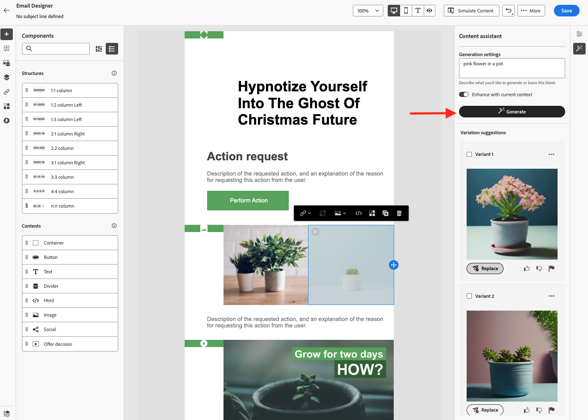

# AI 어시스턴트 시작하기 {#gs-content-assistant}

>[!CONTEXTUALHELP]
>id="ajo_content_generation"
>title="이메일 콘텐츠 만들기"
>abstract="Adobe Journey Optimizer AI 어시스턴트는 텍스트 및 이미지에 대한 사전 예방적 콘텐츠 변형 제안을 제공합니다. 이메일, 푸시, SMS 및 웹 채널에 사용 가능합니다. 이 새로운 기능은 프롬프트 기반의 텍스트 및 이미지 생성을 제공합니다."

>[!BEGINSHADEBOX]

**목차**

* **[AI Assistant 시작](gs-generative.md)**
* [AI Assistant를 사용하여 텍스트 생성](generative-content.md)
* [AI Assistant를 사용하여 이미지 생성](generative-image.md)

>[!ENDSHADEBOX]

Adobe Journey Optimizer AI Assistant는 텍스트 및 이미지에 대한 사전 예방적 콘텐츠 변형 제안을 제공합니다. 이메일, 푸시, SMS 및 웹 채널에 사용 가능합니다. 이 새로운 기능은 프롬프트 기반의 텍스트 및 이미지 생성을 제공합니다. 이미지 생성은 Adobe Firefly로 관리됩니다.

Journey Optimizer의 AI Assistant를 사용하여 다양한 주요 제목 및 이미지를 실험하여 메시지의 효과를 최적화할 수 있습니다. 여러 변형을 생성하고 비교할 실험을 빌드합니다. Journey Optimizer 컨텐츠 실험을 활용하면 여러 메시지 처리를 정의하여 어느 메시지가 타깃 대상자에게 가장 적합한지 측정할 수 있습니다. 게재 콘텐츠 또는 제목을 변경하도록 선택할 수 있습니다. 메시지 대상자는 지정된 지표 측면에서 가장 적합한 처리를 결정하기 위해 각 처리에 임의로 할당됩니다. [이 섹션](../campaigns/content-experiment.md)에서 콘텐츠 실험에 대해 자세히 알아보십시오.

>[!AVAILABILITY]
>
>Adobe Journey Optimizer AI Assistant는 현재 사용자를 선택하는 베타 버전으로 사용할 수 있습니다. Beta 프로그램에 참여하려면 Adobe 고객 지원 센터에 문의해 주십시오.
