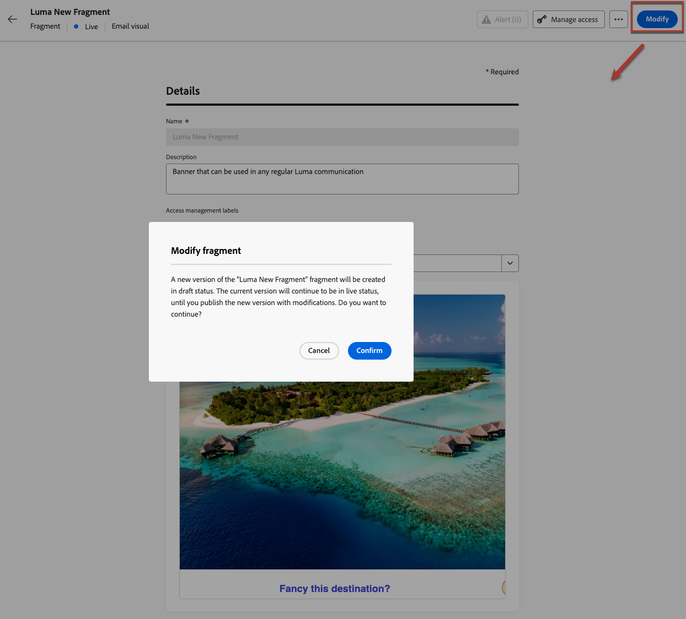

# 게시된 조각에 컨텍스트 속성 추가 {#adding-contextual-attributes}

>[!AVAILABILITY]
>
>이 기능은 일부 고객만 사용할 수 있으며 상당한 위험을 수반합니다. 이 기능이 조직에 대해 활성화되어 있는지 Adobe 담당자에게 확인합니다.

기본적으로 게시된 조각에 새 [개인화 특성](../personalization/personalization-build-expressions.md)을(를) 추가할 수 없습니다. 조각이 게시되면 모든 캠페인 및 여정에 대해 프로필 또는 컨텍스트 속성 세트가 잠깁니다.

그러나 일부 고객의 경우 **컨텍스트 특성**&#x200B;을(를) 게시된 조각에만 추가할 수 있습니다.

>[!WARNING]
>
>게시된 조각에 개인화 속성을 추가할 때 유효성 검사 프로세스가 덜 엄격하며 오류가 감지되지 않을 수 있습니다. 이렇게 하면 해당 조각을 대규모로 사용하는 여정 및 캠페인 간에 의도하지 않은 손상이 발생할 수 있습니다.

## 가드레일 및 제한 사항 {#limitations}

* 현재 조각을 사용하는 모든 여정 및 캠페인이 새로운 컨텍스트 속성을 처리할 수 있는지 확인하십시오.
* 프로필 속성을 게시된 조각에 추가할 수 없습니다. 컨텍스트 속성만 지원됩니다.
* 컨텍스트 속성은 코드 편집기에 수동으로 입력해야 합니다. 개인화 편집기 UI에서는 선택할 수 없습니다.
* 라이브 조각에 개인화된 속성을 추가하면 유효성 검사가 완화됩니다. 즉, 오류가 감지되지 않고 의도하지 않은 대규모 파손이 발생할 수 있습니다.
* 게시되면 모든 오류가 해당 조각을 사용하는 모든 통신에 즉시 영향을 미칩니다.

## 컨텍스트 속성 추가 {#add-contextual-attributes}

게시된 조각에 컨텍스트 속성을 추가하려면 아래 단계를 따르십시오.

>[!IMPORTANT]
>
>조각을 참조하는 여정 및 캠페인에 대한 영향을 완전히 이해하는 경우에만 진행합니다. [자세히 알아보기](#limitations)

1. **[!UICONTROL 콘텐츠 관리]** > **[!UICONTROL 조각]**(으)로 이동합니다.

1. 게시된 조각을 선택하고 **[!UICONTROL 수정]**&#x200B;을 클릭하여 초안 버전을 만듭니다.

   {width="70%" align="left"}

1. 조각 콘텐츠 편집기를 열려면 **[!UICONTROL 편집]**&#x200B;을 클릭하십시오.

1. 개인화 편집기에서 **[!UICONTROL 코드 편집기]** 또는 **[!UICONTROL 고급 모드]**(으)로 전환합니다.

1. 다음 구문을 사용하여 컨텍스트 속성을 수동으로 입력하거나 복사하여 붙여넣습니다.

   ```
   {{context.attribute_name}}
   ```

   `promotionCode` 특성의 예:

   ```
   {{context.promotionCode}}
   ```

   >[!CAUTION]
   >
   >속성 경로의 정확성을 다시 확인합니다. 오류가 감지되지 않을 수 있으며 대규모로 여정 또는 캠페인 커뮤니케이션에 방해가 될 수 있습니다.

1. 변경 내용을 저장합니다.

1. 확인되면 **[!UICONTROL 게시]**&#x200B;를 클릭하여 변경 내용을 실시간으로 적용합니다.

>[!NOTE]
>여정 및 캠페인에서 의도하지 않은 손상을 방지하기 위해 비프로덕션 환경에서 컨텍스트 속성 경로를 테스트할 수 있습니다.

## 관련 항목 {#related-topics}

* [조각 관리](manage-fragments.md)
* [이메일에 시각적 조각 사용](../email/use-visual-fragments.md)
* [표현식 조각 사용](../personalization/use-expression-fragments.md)
* [API-트리거된 캠페인](../campaigns/api-triggered-campaigns.md)
* [개인화 구문](../personalization/personalization-syntax.md)

