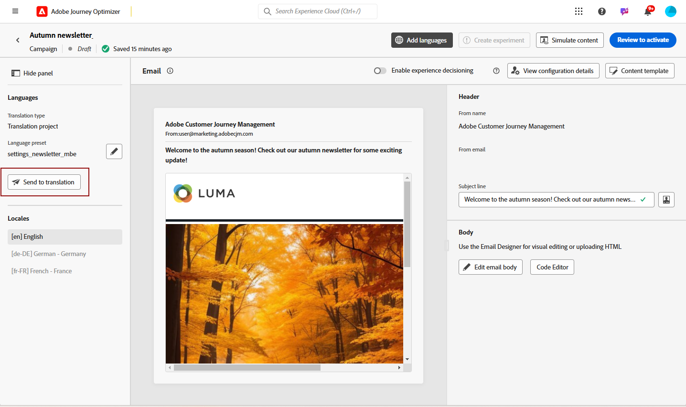

# 자동 번역을 사용하여 다국어 콘텐츠 만들기 {#multilingual-automated}

>[!BEGINSHADEBOX]

**목차**

* [다국어 콘텐츠 시작](multilingual-gs.md)
* [수동 번역을 사용하여 다국어 콘텐츠 만들기](multilingual-manual.md)
* 자동 번역을 사용하여 다국어 콘텐츠 만들기
* [다국어 캠페인 보고서](multilingual-report.md)

>[!ENDSHADEBOX]

자동화된 흐름을 사용하여 대상 언어 및 언어 공급자를 선택하면 됩니다. 그러면 콘텐츠가 번역으로 바로 전송되어 완료 시 최종 검토를 위해 준비됩니다.

다음 단계에 따라 자동화된 번역을 사용하여 다국어 콘텐츠를 만듭니다.

1. [로케일 만들기](#create-locale).

1. [언어 프로젝트 만들기](#create-translation-project).

1. [언어 설정 만들기](#create-language-settings).

1. [다국어 캠페인 만들기](#create-a-multilingual-campaign).

1. [번역 작업 검토(선택 사항)](#review-translation-project).

## 로케일 만들기 {#create-locale}

다음에 설명된 대로 언어 설정을 구성할 때 [언어 설정 만들기](#language-settings) 섹션, 특정 로케일을 다국어 콘텐츠에 사용할 수 없는 경우 **[!UICONTROL 번역]** 메뉴 아래의 제품에서 사용할 수 있습니다.

1. 다음에서 **[!UICONTROL 관리]** 메뉴, 액세스 **[!UICONTROL 채널]**.

   번역 메뉴를 통해 활성화된 로케일 목록에 액세스할 수 있습니다.

1. 다음에서 **[!UICONTROL 로케일 사전]** 탭을 클릭하고 **[!UICONTROL 로케일 추가]**.

   

1. 에서 로케일 코드를 선택합니다. **[!UICONTROL 언어]** 목록 및 관련 항목 **[!UICONTROL 지역]**.

1. 클릭 **[!UICONTROL 저장]** 로케일을 만들 수 있습니다.

   

## 번역 프로젝트 만들기 {#translation-project}

콘텐츠의 특정 언어 또는 지역을 나타내는 Target 로케일을 지정하여 번역 프로젝트를 시작합니다. 그런 다음 번역 공급업체를 선택할 수 있습니다.

1. 다음에서 **[!UICONTROL 번역 프로젝트]** 아래 메뉴 **[!UICONTROL 콘텐츠 관리]**, 클릭 **[!UICONTROL 프로젝트 만들기]**.

   

1. 입력 a **[!UICONTROL 이름]** 및 **[!UICONTROL 설명]**.

1. 다음 항목 선택 **[!UICONTROL 소스 로케일]**.

   

1. 다음 옵션을 활성화하려면 선택합니다.

   * **[!UICONTROL 승인된 번역 자동 게시]**: 번역이 승인되면 수동으로 개입할 필요 없이 캠페인에 자동으로 통합됩니다.
   * **[!UICONTROL 검토 워크플로우 활성화]**: 사람이 번역한 로케일에만 적용됩니다. 이렇게 하면 내부 검토자가 번역된 콘텐츠를 효율적으로 평가하고 승인하거나 거부할 수 있습니다. [자세히 알아보기](#review-translation-project)

1. 클릭 **[!UICONTROL 로케일 추가]** 메뉴에 액세스하고 번역 프로젝트의 언어를 정의합니다.

   다음과 같은 경우 **[!UICONTROL 로케일]** 이(가) 누락되었습니다. 다음에서 미리 수동으로 생성할 수 있습니다. **[!UICONTROL 번역]** 메뉴 또는 API별 을(를) 참조하십시오 [새 로케일 만들기](#create-locale).

   

1. 목록에서 을(를) 선택합니다 **[!UICONTROL 대상 로케일]** 및 선택 **[!UICONTROL 번역 공급업체]** 각 로케일에 를 사용합니다.

   **[!UICONTROL 번역 공급업체]** 설정에서 액세스할 수 있습니다. **[!UICONTROL 번역]** 의 메뉴 **[!UICONTROL 관리]** 메뉴 섹션.

   >[!NOTE]
   >
   >번역 공급업체와의 계약 관리는 이 기능의 범위를 벗어납니다. 지정된 번역 파트너와 유효하고 유효한 계약을 체결했는지 확인하십시오.
   >
   > 번역 제공업체는 번역된 콘텐츠의 품질에 대한 소유권을 갖습니다.

1. 클릭 **[!UICONTROL 로케일 추가]** 를 클릭합니다. 이때 Target 로케일과 올바른 번역 공급업체를 연결했습니다. 그런 다음 을 클릭합니다. **[!UICONTROL 저장]**.

   공급자가 대상 로케일에 대해 회색으로 표시된 경우 공급자가 해당 특정 로케일을 지원하지 않는다는 것을 나타냅니다.

   

1. 클릭 **[!UICONTROL 저장]** 번역 프로젝트가 구성되는 경우.

이제 번역 프로젝트가 생성되었으며 다국어 캠페인에서 사용할 수 있습니다.

## 언어 설정 만들기 {#language-settings}

이 섹션에서는 다국어 콘텐츠 관리를 위한 기본 언어 및 관련 로케일을 설정할 수 있습니다. 프로필 언어와 관련된 정보를 조회하는 데 사용할 속성을 선택할 수도 있습니다.

1. 다음에서 **[!UICONTROL 관리]** 메뉴, 액세스 **[!UICONTROL 채널]**.

1. 다음에서 **[!UICONTROL 언어 설정]** 메뉴, 클릭 **[!UICONTROL 언어 설정 만들기]**.

   

1. 의 이름을 입력합니다. **[!UICONTROL 언어 설정]**.

1. 다음을 선택합니다. **[!UICONTROL 번역 프로젝트]** 옵션을 선택합니다.

1. 다음에서 **[!UICONTROL 번역 프로젝트]** 필드, 클릭 **[!UICONTROL 편집]** 및 앞에서 만든 항목 선택 **[!UICONTROL 번역 프로젝트]**.

   이전에 구성한 로케일을 자동으로 가져옵니다.

   

1. 다음에서 **[!UICONTROL 전송 환경 설정]** 메뉴에서 찾을 속성을 선택하여 프로필 언어에 대한 정보를 찾습니다.

1. 클릭 **[!UICONTROL 편집]** 옆에 있는 **[!UICONTROL 로케일]** 추가 개인화 및 추가 **[!UICONTROL 프로필 환경 설정]**.

   

1. 다음의 경우 **[!UICONTROL 번역 프로젝트]** 업데이트한 다음 **[!UICONTROL 새로 고침]** 에 이러한 변경 사항을 반영하려면 **[!UICONTROL 언어 설정]**.

   

1. 클릭 **[!UICONTROL 제출]** 다음을 만들려면: **[!UICONTROL 언어 설정]**.

<!--
1. Access the **[!UICONTROL Channel surfaces]** menu and create a new channel surface or select an existing one.

1. In the **[!UICONTROL Header parameters]** section, select the **[!UICONTROL Enable multilingual]** option.

1. Select your **[!UICONTROL Locales dictionary]** and add as many as needed.
-->

## 다국어 캠페인 만들기 {#create-multilingual-campaign}

번역 프로젝트 및 언어 설정을 완료하고 나면 캠페인을 만들고 다른 로케일에 대한 콘텐츠를 사용자 지정할 수 있습니다.

1. 먼저 요구 사항에 따라 이메일, SMS 또는 푸시 알림 캠페인을 만들고 구성합니다. [자세히 알아보기](../campaigns/create-campaign.md)

1. 기본 컨텐츠가 만들어지면 **[!UICONTROL 저장]** campaign 구성 화면으로 돌아갑니다.

1. 클릭 **[!UICONTROL 언어 추가]**.  [자세히 알아보기](#create-language-settings)

   

1. 이전에 만든 항목 선택 **[!UICONTROL 언어 설정]**.

   

1. 로케일을 가져왔으므로 **[!UICONTROL 번역하도록 전송]** 이전에 선택한 번역 공급업체에 콘텐츠를 전달합니다.

   

1. 콘텐츠를 번역하도록 보낸 후에는 더 이상 편집할 수 없습니다. 원본 콘텐츠를 변경하려면 잠금 아이콘을 클릭합니다.

   이 콘텐츠를 변경하려면 새 번역 프로젝트를 만들어 번역용으로 다시 보내야 합니다.

   

1. 클릭 **[!UICONTROL 번역 열기]** 을 클릭하여 번역 프로젝트에 액세스하고 프로젝트를 검토합니다.

   

1. 이 페이지에서 번역 프로젝트의 상태를 따릅니다.

   * **[!UICONTROL 번역 진행 중]**: 서비스 공급자가 현재 번역 작업을 진행 중입니다.

     다음을 선택한 경우 **사내 번역** 구성 시 **언어 설정**, 번역 프로젝트에서 콘텐츠를 직접 번역할 수 있습니다. [자세히 알아보기](#manage-ht-project)

   * **[!UICONTROL 검토 준비됨]**: 검토 프로세스를 시작할 준비가 되었으며 번역에 액세스하고 번역을 거부하거나 승인할 수 있습니다.

     다음을 선택한 경우 **[!UICONTROL 검토 워크플로우 활성화]** (으)로 **[!UICONTROL 번역 프로젝트]**, 선택한 번역 공급업체에서 완료 후 Journey Optimizer에서 직접 번역을 검토할 수 있습니다. [자세히 알아보기](#review-translation-project)

   * **[!UICONTROL 검토됨]**: 번역이 승인되었으며 게시 및 캠페인에 보낼 준비가 되었습니다.

   * **[!UICONTROL 게시 준비]**: 기계 번역이 완료되었으며 이제 캠페인으로 전송할 수 있습니다.

   * **[!UICONTROL 완료됨]**: 이제 캠페인에서 번역을 사용할 수 있습니다.

   

1. 번역이 완료되면 다국어 콘텐츠를 보낼 수 있습니다.

   

1. 클릭 **[!UICONTROL 활성화하려면 검토]** 캠페인 요약을 표시합니다.

   요약을 사용하면 필요한 경우 캠페인을 수정하고 매개 변수가 틀리거나 누락되었는지 확인할 수 있습니다.

1. 다국어 콘텐츠를 탐색하여 각 언어로 렌더링을 확인합니다.

   

1. 캠페인이 올바르게 구성되었는지 확인한 다음, **[!UICONTROL 활성화]**.

이제 캠페인이 활성화되었습니다. 캠페인에 구성된 메시지는 즉시 전송되거나 지정된 날짜에 전송됩니다. Campaign이 라이브되는 즉시 수정할 수 없습니다. 콘텐츠를 재사용하기 위해 캠페인을 복제할 수 있습니다.

전송되면 캠페인 보고서 내에서 캠페인의 영향을 측정할 수 있습니다.

## 사내 번역 프로젝트 관리 {#manage-ht-project}

언어 설정을 구성할 때 내부 번역을 선택한 경우 번역 프로젝트에서 직접 콘텐츠를 번역할 수 있습니다.

1. 출처: **[!UICONTROL 번역 프로젝트]**, 액세스 **[!UICONTROL 추가 작업]** 메뉴 및 선택 **[!UICONTROL 사내 번역]**.

   

1. 외부 번역 소프트웨어를 사용하여 번역을 위해 CSV 파일을 내보낼 수 있습니다. 또는 를 클릭하여 CSV 파일을 번역 프로젝트로 다시 가져올 수 있습니다. **[!UICONTROL CSV 가져오기]** 단추를 클릭합니다.

   

1. 클릭 **[!UICONTROL 편집]** 을 클릭하여 번역 콘텐츠를 추가합니다.

   

1. 번역된 텍스트를 게시할 준비가 되면 **[!UICONTROL 완료]**.

## 번역 프로젝트 검토 {#review-translation-project}

다음을 선택한 경우 **[!UICONTROL 검토 워크플로우 활성화]** (으)로 **[!UICONTROL 번역 프로젝트]**, 선택한 번역 공급업체에서 완료 후 Journey Optimizer에서 직접 번역을 검토할 수 있습니다.

이 옵션이 비활성화되면 공급업체에서 번역을 완료하면 번역 작업 상태가 자동으로 다음으로 설정됩니다. **[!UICONTROL 검토됨]**&#x200B;를 클릭하여 빠르게 진행할 수 있습니다. **[!UICONTROL 게시]**.

1. 서비스 공급업체로부터 번역을 완료한 후에는 번역을 액세스하여 검토할 수 있습니다. **[!UICONTROL 번역 프로젝트]** 또는 을 통해 직접 **[!UICONTROL 캠페인]**.

   다음에서 **[!UICONTROL 추가 작업]** 메뉴, 클릭 **[!UICONTROL 리뷰]**.

   

1. 검토 창에서 번역된 콘텐츠를 탐색하고 각 번역 문자열을 수락하거나 거부합니다.

   

1. 클릭 **[!UICONTROL 편집]** 번역 문자열의 콘텐츠를 변경합니다.

   

1. 업데이트된 번역을 입력하고 **[!UICONTROL 확인]** 완료 시.

   

1. 다음을 선택할 수도 있습니다. **[!UICONTROL 모두 거부]** 또는 **[!UICONTROL 모두 승인]** 직접.

   선택 시 **[!UICONTROL 모두 거부]**, 댓글 추가 및 클릭 **[!UICONTROL 거부]**.

1. 클릭 **[!UICONTROL 미리 보기]** 각 언어로 번역된 콘텐츠의 렌더링을 확인합니다.

1. 번역된 텍스트를 게시할 준비가 되면 **[!UICONTROL 완료]**.

   

1. 출처: **[!UICONTROL 번역 프로젝트]**&#x200B;프로젝트 중 하나를 선택하여 세부 정보에 액세스합니다. 번역을 거부한 경우 번역으로 다시 전송하도록 선택할 수 있습니다.

   

1. 한 번 **[!UICONTROL 번역 프로젝트]** 상태가 검토됨으로 설정되어 있으면 캠페인에 보낼 수 있습니다.

   다음에서 **[!UICONTROL 추가 작업]** 메뉴, 클릭 **[!UICONTROL 게시]**.

   

1. 캠페인에서 번역 상태가 (으)로 변경되었는지 확인합니다. **[!UICONTROL 번역 완료]**. 이제 다국어 콘텐츠를 보낼 수 있습니다. 의 10단계를 참조하십시오. [이 섹션](#create-multilingual-campaign).

   

<!--
# Create a multilingual journey {#create-multilingual-journey}

1. Create your journey with a Delivery and personalize your content as needed.
1. From your delivery action, click Edit content.
1. Click Add languages.

-->
