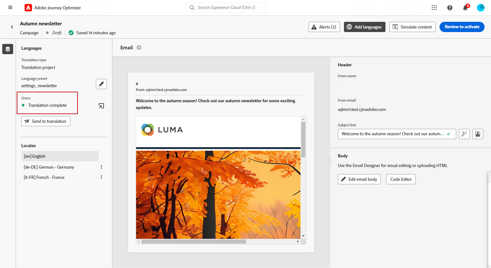

# 자동 번역을 사용하여 다국어 콘텐츠 만들기 {#multilingual-automated}

>[!CONTEXTUALHELP]
>id="ajo_multi_add_provider"
>title="제공자 추가"
>abstract="필요에 따라 번역 제공자와 로케일을 추가합니다. 이렇게 하면 프로젝트에 참여 중인 제공자와 로케일을 관리할 수 있어 현재 요구 사항과 프로젝트 범위에 따라 유연하게 리소스를 조정하고 대상자를 타기팅할 수 있습니다."

>[!CONTEXTUALHELP]
>id="ajo_multi_edit_provider"
>title="제공자 편집"
>abstract="필요에 따라 기존 번역 제공자를 수정하고 로케일을 추가합니다. 이 기능을 사용하면 프로젝트에 참여 중인 제공자와 로케일을 관리할 수 있어 현재 요구 사항과 프로젝트 목표에 따라 유연하게 리소스를 조정하고 특정 대상자를 타기팅할 수 있습니다."

>[!IMPORTANT]
>
>자동 흐름의 경우 사용자는 **[!UICONTROL 번역 서비스]** 기능과 관련된 권한이 필요합니다. [권한에 대해 자세히 알아보기](../administration/permissions.md)

자동화된 흐름을 사용하여 대상 언어 및 언어 공급자를 선택하면 됩니다. 그러면 콘텐츠가 번역으로 바로 전송되어 완료 시 최종 검토를 위해 준비됩니다.

다음 단계에 따라 자동화된 번역을 사용하여 다국어 콘텐츠를 만듭니다.

1. [공급자 추가](multilingual-provider.md)

1. [로케일 추가(선택 사항)](multilingual-locale.md)

1. [언어 프로젝트 만들기](#create-translation-project)

1. [언어 설정 만들기](#create-language-settings)

1. [다국어 콘텐츠 만들기](#create-a-multilingual-campaign)

1. [번역 작업 검토(선택 사항)](#review-translation-project)

## 번역 프로젝트 만들기 {#translation-project}

>[!CONTEXTUALHELP]
>id="ajo_multi_create_project"
>title="프로젝트 만들기"
>abstract="다국어 콘텐츠를 만들려면 먼저 대상 로케일을 식별하고 대상자에게 적합한 언어나 지역 방언을 선택하여 번역 프로젝트를 시작합니다. 그런 다음 프로젝트의 필요에 맞는 번역 제공자를 선택합니다."

>[!CONTEXTUALHELP]
>id="ajo_multi_edit_project"
>title="프로젝트 편집"
>abstract="추가 로케일을 통합하여 번역 프로젝트를 업데이트하면 콘텐츠를 확장하여 더 광범위한 대상자에게 다가갈 수 있습니다."

콘텐츠의 특정 언어 또는 지역을 나타내는 Target 로케일을 지정하여 번역 프로젝트를 시작합니다. 그런 다음 번역 공급업체를 선택할 수 있습니다.

1. **[!UICONTROL 콘텐츠 관리]**&#x200B;의 **[!UICONTROL 번역]** 메뉴에서 **[!UICONTROL 프로젝트]** 탭의 **[!UICONTROL 프로젝트 만들기]**&#x200B;를 클릭합니다.

   

1. **[!UICONTROL 이름]** 및 **[!UICONTROL 설명]**&#x200B;을(를) 입력하세요.

1. **[!UICONTROL Source 로케일]**&#x200B;을(를) 선택하십시오.

   

1. 다음 옵션을 활성화하려면 선택합니다.

   * **[!UICONTROL 승인된 번역을 자동으로 게시]**: 번역이 승인되면 수동으로 개입할 필요 없이 캠페인에 자동으로 통합됩니다.
   * **[!UICONTROL 검토 작업 과정을 사용하도록 설정]**: 사람이 번역한 로케일에만 적용됩니다. 이렇게 하면 내부 검토자가 번역된 콘텐츠를 효율적으로 평가하고 승인하거나 거부할 수 있습니다. [자세히 알아보기](#review-translation-project)

1. 메뉴에 액세스하고 번역 프로젝트의 언어를 정의하려면 **[!UICONTROL 로케일 추가]**&#x200B;를 클릭하십시오.

   **[!UICONTROL 로케일]**&#x200B;이(가) 누락된 경우 **[!UICONTROL 번역]** 메뉴에서 또는 API별로 미리 수동으로 만들 수 있습니다. [새 로케일 만들기](#create-locale)를 참조하세요.

   

1. 목록에서 **[!UICONTROL 대상 로케일]**&#x200B;을(를) 선택하고 각 로케일에 사용할 **[!UICONTROL 번역 공급자]**&#x200B;를 선택하십시오.

   **[!UICONTROL 번역 공급자]** 설정은 **[!UICONTROL 관리]** 메뉴 섹션의 **[!UICONTROL 번역]** 메뉴에서 액세스할 수 있습니다.

   >[!NOTE]
   >
   >번역 공급업체와의 계약 관리는 이 기능의 범위를 벗어납니다. 지정된 번역 파트너와 유효하고 유효한 계약을 체결했는지 확인하십시오.
   >
   ></br>번역 공급업체가 번역된 콘텐츠의 품질에 대한 소유권을 갖습니다.

1. 올바른 번역 공급업체와 대상 로케일 연결을 마치면 **[!UICONTROL 로케일 추가]**&#x200B;를 클릭합니다. 그런 다음 **[!UICONTROL 저장]**&#x200B;을 클릭합니다.

   공급자가 대상 로케일에 대해 회색으로 표시된 경우 공급자가 해당 특정 로케일을 지원하지 않는다는 것을 나타냅니다.

   

1. 번역 프로젝트가 구성되면 **[!UICONTROL 저장]**&#x200B;을 클릭합니다.

이제 번역 프로젝트가 생성되었으며 다국어 캠페인에서 사용할 수 있습니다.

## 언어 설정 만들기 {#language-settings}

>[!CONTEXTUALHELP]
>id="ajo_multi_custom_conditional"
>title="사용자 지정 조건부 설정"
>abstract="사용자 정의 조건 설정은 특정 기준에 따라 콘텐츠가 표시되는 로케일을 결정해 주는 규칙 세트입니다. 이러한 설정으로 사용자 위치, 언어 기본 설정 또는 다른 상황별 요소 등의 요소를 기반으로 콘텐츠 표시를 제어할 수 있습니다."

>[!CONTEXTUALHELP]
>id="ajo_multi_fallback"
>title="대체 환경 설정"
>abstract="대체 환경 설정 선택은 사용자 경험 개선에 있어 중요합니다. 대체 항목이 선택되지 않았을 때 프로필이 필수 요구 사항을 충족하지 못하는 경우 콘텐츠가 게재되지 않습니다. 적절한 대체 항목을 선택함으로써 프로필이 초기 기준에 맞지 않을 때에도 일관적으로 콘텐츠가 게재되도록 할 수 있습니다."

이 섹션에서는 다국어 콘텐츠를 관리하기 위해 다양한 로케일을 설정할 수 있습니다. 프로필 언어와 관련된 정보를 조회하는 데 사용할 속성을 선택할 수도 있습니다.

1. **[!UICONTROL 관리]** 메뉴에서 **[!UICONTROL 채널]** > **[!UICONTROL 일반 설정]**&#x200B;에 액세스합니다.

1. **[!UICONTROL 언어 설정]** 메뉴에서 **[!UICONTROL 언어 설정 만들기]**&#x200B;를 클릭합니다.

   

1. **[!UICONTROL 언어 설정]**&#x200B;의 이름을 입력하고 **[!UICONTROL 번역 프로젝트]**&#x200B;를 선택하세요.

1. **[!UICONTROL 번역 프로젝트]** 필드에서 **[!UICONTROL 편집]**&#x200B;을 클릭하고 이전에 만든 **[!UICONTROL 번역 프로젝트]**&#x200B;을(를) 선택합니다.

   이전에 구성한 **[!UICONTROL 로케일]**&#x200B;을(를) 자동으로 가져옵니다.

1. 프로필이 컨텐츠 전달에 필요한 기준을 충족하지 않을 경우에 대한 백업 옵션을 정의하려면 **[!UICONTROL 대체 환경 설정]**&#x200B;을(를) 선택하십시오.

   대체 옵션을 선택하지 않으면 캠페인이나 여정이 전송되지 않습니다.

   

1. 다음 옵션 중에서 전송 기본 설정을 선택합니다.

   * **[!UICONTROL 프로필 언어 환경 설정 특성 선택]**
   * **[!UICONTROL 사용자 지정 조건부 규칙 만들기]**

1. **[!UICONTROL 프로필 언어 기본 설정 특성 선택]**&#x200B;을 선택한 경우 **[!UICONTROL 프로필 언어 기본 설정 특성]** 메뉴에서 관련 특성을 선택하여 프로필 언어 정보를 조회합니다.

   

1. **[!UICONTROL 사용자 지정 조건부 규칙 만들기]**&#x200B;를 선택한 경우 조건을 만들 로케일을 선택하십시오. 그런 다음 사용자 위치, 언어 환경 설정 또는 기타 컨텍스트 요소와 같은 요소를 기반으로 규칙을 빌드합니다.

   

1. 속성, 이벤트 또는 대상자를 추가하여 조건 작성을 시작하고 대상 그룹을 정의합니다.

   >[!IMPORTANT]
   >
   >컨텍스트 기반 데이터는 웹, 인앱, 코드 기반 경험 및 콘텐츠 카드 채널에만 사용할 수 있습니다. 이메일, SMS, 푸시 알림 또는 DM 채널에 추가 속성 없이 사용하는 경우 캠페인 또는 여정은 목록의 첫 번째 옵션 언어로 전송됩니다.

   

   +++조건에서 컨텍스트 이벤트를 사용하기 위한 사전 요구 사항

   사용자가 콘텐츠를 표시하면 경험 이벤트와 함께 개인화 요청이 전송됩니다. 조건에 컨텍스트 기반 데이터를 활용하려면 개인화 요청 페이로드에 추가 데이터를 첨부해야 합니다. 이렇게 하려면 Adobe Experience Platform 데이터 수집에서 규칙을 만들어 다음을 지정해야 합니다. 개인화 요청이 전송되는 경우 요청에 추가 데이터를 첨부하여 스키마의 언어 필드와 일치하는 속성을 정의합니다.

   >[!NOTE]
   >
   >이러한 사전 요구 사항은 인앱 및 콘텐츠 카드 채널에만 필요합니다.

   1. Adobe Experience Platform 데이터 수집에서 태그 속성에 액세스합니다.

   1. **[!UICONTROL 규칙]** 메뉴에 액세스하고 새 규칙을 만듭니다. 규칙을 만드는 방법에 대한 자세한 내용은 [!DNL Adobe Experience Platform] [데이터 수집 설명서](https://experienceleague.adobe.com/en/docs/experience-platform/collection/e2e#create-a-rule){target="_blank"}를 참조하세요.

   1. 규칙의 **[!UICONTROL IF]** 섹션에서 아래와 같이 구성된 이벤트를 추가합니다.

      

      * 작업 중인 **[!UICONTROL 확장]**&#x200B;을(를) 선택하십시오.
      * **[!UICONTROL 이벤트 유형]** 필드에서 &quot;AEP 요청 이벤트&quot;를 선택합니다.
      * 오른쪽 창에서 &quot;XDM 이벤트 유형이 personalization.request와 같음&quot;을 선택합니다.
      * 확인하려면 **[!UICONTROL 변경 내용 유지]** 단추를 클릭하세요.

   1. 규칙의 **[!UICONTROL THEN]** 섹션에서 아래와 같이 구성된 작업을 추가합니다.

      

      * 작업 중인 **[!UICONTROL 확장]**&#x200B;을(를) 선택하십시오.
      * **[!UICONTROL 작업 유형]** 필드에서 &quot;데이터 첨부&quot;를 선택합니다.
      * JSON 페이로드 섹션에서 사용할 언어를 검색하는 데 사용되는 속성(&quot;언어&quot; 아래 예에서)이 데이터 수집 데이터스트림이 유입되는 스키마에 지정된 속성의 이름과 일치하는지 확인합니다.

        ```JSON
        {
            "xdm":{
                "application":{
                    "_dc":{
                        "language":"{%%Language%%}"
                    }
                }
            }
        }
        ```

      * **[!UICONTROL 변경 내용 유지]** 단추를 클릭하여 규칙을 확인하고 저장합니다.

+++

1. 로케일을 드래그 앤 드롭하여 재정렬하고 목록에서 해당 우선 순위를 관리합니다.

1. **[!UICONTROL 제출]**&#x200B;을 클릭하여 **[!UICONTROL 언어 설정]**&#x200B;을 만듭니다.

언어 환경 설정을 지정하면, 더 이상 언어 환경 설정을 편집할 수 없습니다.

<!--
1. Access the **[!UICONTROL channel configurations]** menu and create a new channel configuration or select an existing one.

1. In the **[!UICONTROL Header parameters]** section, select the **[!UICONTROL Enable multilingual]** option.


1. Select your **[!UICONTROL Locales dictionary]** and add as many as needed.
-->

## 다국어 콘텐츠 만들기 {#create-multilingual-campaign}

>[!AVAILABILITY]
>
> 코드 기반 경험 및 콘텐츠 카드에 대한 미리 보기는 현재 자동화된 흐름에서 사용할 수 없습니다.

번역 프로젝트 및 언어 설정을 완료하고 나면 캠페인이나 여정을 만들고 다른 로케일에 맞게 콘텐츠를 맞춤화할 수 있습니다.

1. 요구 사항에 따라 이메일, SMS 또는 푸시 알림 [campaign](../campaigns/create-campaign.md) 또는 [여정](../building-journeys/journeys-message.md)을(를) 만들고 구성하는 것부터 시작합니다.

1. 기본 콘텐츠가 만들어지면 **[!UICONTROL 저장]**&#x200B;을 클릭하고 캠페인 구성 화면으로 돌아갑니다.

1. **[!UICONTROL 언어 추가]**&#x200B;를 클릭합니다.  [자세히 알아보기](#create-language-settings)

   

1. 이전에 만든 **[!UICONTROL 언어 설정]**&#x200B;을 선택하세요.

   

1. 로케일을 가져왔으므로 **[!UICONTROL 번역하도록 보내기]**&#x200B;를 클릭하여 콘텐츠를 이전에 선택한 번역 공급업체에 전달합니다.

   

1. 콘텐츠를 번역하도록 보낸 후에는 더 이상 편집할 수 없습니다. 원본 콘텐츠를 변경하려면 잠금 아이콘을 클릭합니다.

   이 콘텐츠를 변경하려면 새 번역 프로젝트를 만들어 번역용으로 다시 보내야 합니다.

   

1. **[!UICONTROL 번역 열기]**&#x200B;를 클릭하여 번역 프로젝트에 액세스하고 이를 검토합니다.

   

1. 이 페이지에서 번역 프로젝트의 상태를 따릅니다.

   * **[!UICONTROL 번역 진행 중]**: 서비스 공급자가 현재 번역 작업을 진행 중입니다.

     **언어 설정**&#x200B;을 구성할 때 **인소싱**&#x200B;을 선택한 경우 번역 프로젝트에서 직접 콘텐츠를 번역할 수 있습니다. [자세히 알아보기](#manage-ht-project)

   * **[!UICONTROL 검토 준비됨]**: 검토 프로세스를 시작할 준비가 되었으며, 이를 통해 번역에 액세스하고 이를 거부하거나 승인할 수 있습니다.

     **[!UICONTROL 번역 프로젝트]**&#x200B;에서 **[!UICONTROL 검토 워크플로우 사용]**&#x200B;을(를) 선택한 경우 선택한 번역 공급업체에서 완료한 후 Journey Optimizer에서 직접 번역을 검토할 수 있습니다. [자세히 알아보기](#review-translation-project)

   * **[!UICONTROL 검토됨]**: 번역이 승인되었으며 게시 및 캠페인으로 전송될 준비가 되었습니다.

   * **[!UICONTROL 게시 준비됨]**: 기계 번역이 완료되었으며 이제 캠페인으로 보낼 수 있습니다.

   * **[!UICONTROL 완료]**: 이제 캠페인에서 번역을 사용할 수 있습니다.

   

1. 번역이 완료되면 다국어 콘텐츠를 보낼 수 있습니다.

   

1. **[!UICONTROL 활성화하려면 검토]**&#x200B;를 클릭하여 캠페인 요약을 표시합니다.

   요약을 사용하면 필요한 경우 캠페인을 수정하고 매개 변수가 틀리거나 누락되었는지 확인할 수 있습니다.

1. 다국어 콘텐츠를 탐색하여 각 언어로 렌더링을 확인합니다.

   

1. 캠페인이 올바르게 구성되었는지 확인한 다음 **[!UICONTROL 활성화]**&#x200B;를 클릭합니다.

   >[!IMPORTANT]
   >
   > 캠페인이 승인 정책의 적용을 받는 경우 다국어 캠페인을 보내려면 승인을 요청해야 합니다. [자세히 알아보기](../test-approve/gs-approval.md)

이제 캠페인이나 여정을 활성화할 수 있습니다. 전송되면 보고서 내에서 다국어 여정 또는 캠페인의 영향을 측정할 수 있습니다.

## 번역 프로젝트 인소싱 관리 {#manage-ht-project}

>[!CONTEXTUALHELP]
>id="ajo_multi_insourcing_project"
>title="번역 프로젝트 인소싱"
>abstract="번역 프로젝트 인소싱을 사용하면 번역 프로젝트 내에서 직접 번역을 관리하고 실행하여 프로세스를 간소화하고 번역 품질과 일관성을 크게 제어할 수 있습니다."

언어 설정을 구성할 때 인소싱을 선택한 경우 번역 프로젝트에서 직접 콘텐츠를 번역할 수 있습니다.

1. **[!UICONTROL 번역 프로젝트]**&#x200B;에서 **[!UICONTROL 추가 작업]** 메뉴에 액세스하고 **[!UICONTROL 인소싱]**&#x200B;을 선택하세요.

   

1. 외부 번역 소프트웨어를 사용하여 번역을 위해 CSV 파일을 내보낼 수 있습니다. 또는 **[!UICONTROL CSV 가져오기]** 단추를 클릭하여 CSV 파일을 번역 프로젝트로 다시 가져올 수 있습니다.

   

1. 번역 콘텐츠를 추가하려면 **[!UICONTROL 편집]**&#x200B;을 클릭하세요.

   

1. 번역된 텍스트를 게시할 준비가 되었으면 **[!UICONTROL 완료]**&#x200B;를 클릭하십시오.

## 번역 프로젝트 검토 {#review-translation-project}

>[!CONTEXTUALHELP]
>id="ajo_multi_review_project"
>title="번역 프로젝트 검토"
>abstract="선택한 번역 제공업체에서 번역을 완료하면 Journey Optimizer에서 직접 결과를 검토할 수 있습니다. 이를 통해 번역의 정확성과 품질을 평가하여 최종 결정을 내리기 전에 번역이 기대치와 프로젝트 요구 사항에 부합하는지 확인할 수 있습니다."

>[!CONTEXTUALHELP]
>id="ajo_multi_preview_project"
>title="번역 프로젝트 미리보기"
>abstract="미리보기 창에서 번역된 콘텐츠가 각 언어로 어떻게 표시되는지 확인할 수 있습니다. 이 기능을 사용하면 렌더링을 검사하고 콘텐츠가 선택한 모든 언어로 올바르고 효과적으로 표시되는지 확인할 수 있습니다."

**[!UICONTROL 번역 프로젝트]**&#x200B;에서 **[!UICONTROL 검토 워크플로우 사용]**&#x200B;을(를) 선택한 경우 선택한 번역 공급업체에서 완료한 후 Journey Optimizer에서 직접 번역을 검토할 수 있습니다.

이 옵션이 비활성화되면 공급자가 번역을 완료하면 번역 작업 상태가 자동으로 **[!UICONTROL 검토됨]**(으)로 설정되므로 **[!UICONTROL Publish]**&#x200B;을(를) 클릭하여 빠르게 진행할 수 있습니다.

1. 서비스 공급자로부터 번역을 완료하면 **[!UICONTROL 번역 프로젝트]**&#x200B;에서 또는 **[!UICONTROL 캠페인]**&#x200B;에서 직접 번역에 액세스하여 검토할 수 있습니다.

   **[!UICONTROL 추가 작업]** 메뉴에서 **[!UICONTROL 검토]**&#x200B;를 클릭합니다.

   

1. 검토 창에서 번역된 콘텐츠를 탐색하고 각 번역 문자열을 수락하거나 거부합니다.

   

1. 번역 문자열의 콘텐츠를 변경하려면 **[!UICONTROL 편집]**&#x200B;을 클릭합니다.

   

1. 업데이트된 번역을 입력하고 완료되면 **[!UICONTROL 확인]**&#x200B;을 클릭합니다.

   

1. **[!UICONTROL 모두 거부]** 또는 **[!UICONTROL 모두 승인]**&#x200B;을 직접 선택할 수도 있습니다.

   **[!UICONTROL 모두 거부]**&#x200B;를 선택할 때는 댓글을 추가하고 **[!UICONTROL 거부]**&#x200B;을 클릭하세요.

1. **[!UICONTROL 미리 보기]**&#x200B;를 클릭하여 각 언어로 번역된 콘텐츠의 렌더링을 확인합니다.

1. 번역된 텍스트를 게시할 준비가 되었으면 **[!UICONTROL 완료]**&#x200B;를 클릭하십시오.

   

1. **[!UICONTROL 번역 프로젝트]**&#x200B;에서 프로젝트 중 하나를 선택하여 자세한 정보에 액세스합니다. 번역을 거부한 경우 번역으로 다시 전송하도록 선택할 수 있습니다.

   

1. **[!UICONTROL 번역 프로젝트]** 상태가 [검토됨]으로 설정되면 이를 캠페인으로 보낼 수 있습니다.

   **[!UICONTROL 추가 작업]** 메뉴에서 **[!UICONTROL Publish]**&#x200B;을(를) 클릭합니다.

   

1. Campaign에서 번역 상태가 **[!UICONTROL 번역 완료]**(으)로 변경되었는지 확인하십시오. 이제 다국어 콘텐츠를 보낼 수 있습니다. [이 섹션](#create-multilingual-campaign)의 10단계를 참조하세요.

   

<!--
# Create a multilingual journey {#create-multilingual-journey}

1. Create your journey with a Delivery and personalize your content as needed.
1. From your delivery action, click Edit content.
1. Click Add languages.


-->
