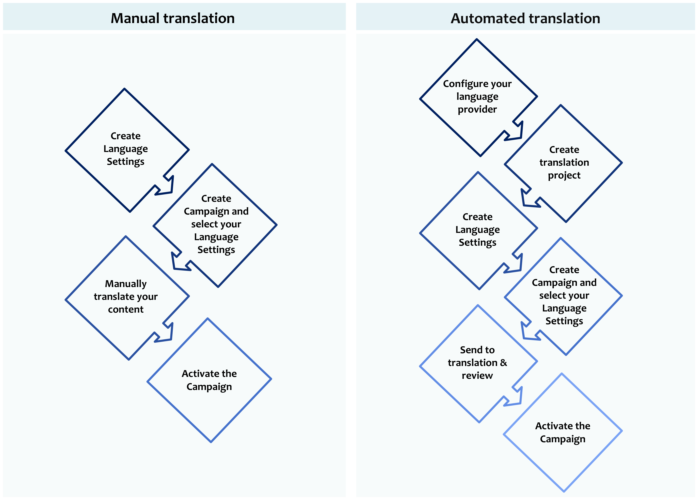

# 다국어 콘텐츠 시작 {#multilingual-gs}

>[!AVAILABILITY]
>
>다국어 콘텐츠는 현재 일부 조직에서만 사용할 수 있습니다(제한된 가용성). 자세한 내용은 Adobe 담당자에게 문의하십시오.

다국어 기능을 사용하면 단일 캠페인 또는 여정 내에서 손쉽게 여러 언어로 콘텐츠를 만들 수 있습니다. 이 기능을 사용하면 캠페인을 편집할 때 언어 간에 전환할 수 있으므로 전체 편집 프로세스를 간소화하고 다국어 콘텐츠를 효율적으로 관리할 수 있습니다.

Journey Optimizer을 사용하면 두 가지 서로 다른 방법을 통해 다국어 콘텐츠를 만들 수 있습니다.

* **수동 번역**: 이메일 Designer에서 직접 콘텐츠를 번역하거나 기존 다국어 콘텐츠를 가져옵니다. [자세히 알아보기](multilingual-manual.md)

* **자동 번역**: 자동 번역을 위해 선호하는 언어 공급자에게 콘텐츠를 보냅니다. [자세히 알아보기](multilingual-automated.md)

 

## 전제 조건 {#prerequisites}

Adobe Journey Optimizer은 현재 Adobe Journey Optimizer과 독립적으로 서드파티 번역 서비스(기계 번역 또는 사람 번역)를 제공하는 번역 공급업체와 통합됩니다.

선택한 번역 공급업체를 추가하기 전에 해당 공급업체에 계정을 만들어야 합니다.

번역 공급업체의 번역 서비스를 사용하는 경우 해당 공급업체의 추가 약관이 적용됩니다.  타사 솔루션인 번역 서비스는 통합을 통해 Adobe Journey Optimizer 사용자에게 제공됩니다.  Adobe은 타사 제품을 제어하지 않으며 책임도 지지 않습니다.

번역과 관련된 문제 또는 지원 요청은 해당 번역 공급업체에 문의하십시오.

## 방법 비디오 {#video}

단일 캠페인 또는 여정 내에서 여러 언어로 콘텐츠를 만드는 방법을 알아봅니다.

>[!VIDEO](https://video.tv.adobe.com/v/3430921/)
