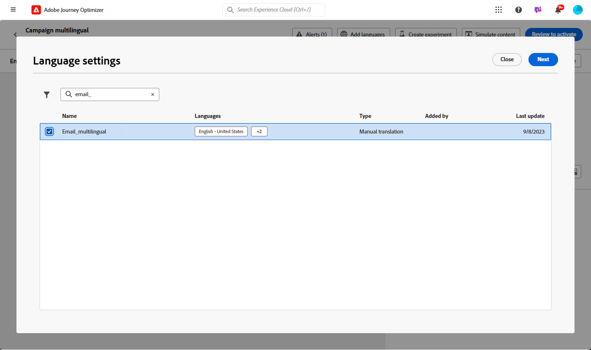
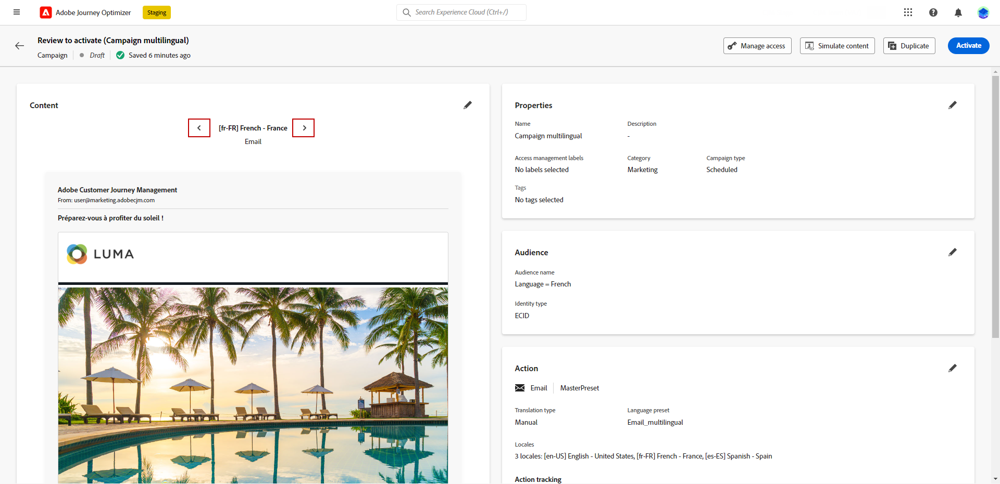

# 수동 번역을 사용하여 다국어 콘텐츠 만들기 {#multilingual-manual}

>[!AVAILABILITY]
>
>다국어 컨텐츠는 현재 조직 집합(제한된 가용성)에만 사용할 수 있습니다. 권한을 얻으려면 Adobe 담당자에게 문의하십시오.

수동 흐름을 사용하면 이메일, 푸시 알림 또는 SMS 캠페인 및 여정에서 콘텐츠를 손쉽게 직접 번역할 수 있으므로 다국어 메시지에 대한 정확한 제어 및 사용자 지정 옵션을 제공합니다. 또한 HTML 가져오기 옵션을 사용하여 기존 다국어 콘텐츠를 쉽게 가져올 수 있습니다.

수동 번역을 사용하여 다국어 콘텐츠를 만들려면 다음 단계를 따르십시오.

1. [로케일 만들기](#create-locale).

1. [언어 설정 만들기](#create-language-settings).

1. [다국어 콘텐츠 만들기](#create-a-multilingual-campaign).

## 로케일 만들기 {#create-locale}

다음에 설명된 대로 언어 설정을 구성할 때 [언어 설정 만들기](#language-settings) 섹션, 특정 로케일을 다국어 콘텐츠에 사용할 수 없는 경우 **[!UICONTROL 번역]** 메뉴 아래의 제품에서 사용할 수 있습니다.

1. 다음에서 **[!UICONTROL 콘텐츠 관리]** 메뉴, 액세스 **[!UICONTROL 번역]**.

1. 다음에서 **[!UICONTROL 로케일 사전]** 탭을 클릭하고 **[!UICONTROL 로케일 추가]**.

   

1. 에서 로케일 코드를 선택합니다. **[!UICONTROL 언어]** 목록 및 관련 항목 **[!UICONTROL 지역]**.

1. 클릭 **[!UICONTROL 저장]** 로케일을 만들 수 있습니다.

   

## 언어 설정 만들기 {#language-settings}

이 섹션에서는 다국어 콘텐츠 관리를 위한 기본 언어 및 관련 로케일을 설정할 수 있습니다. 프로필 언어와 관련된 정보를 조회하는 데 사용할 속성을 선택할 수도 있습니다

1. 다음에서 **[!UICONTROL 관리]** 메뉴, 액세스 **[!UICONTROL 채널]**.

1. 다음에서 **[!UICONTROL 언어 설정]** 메뉴, 클릭 **[!UICONTROL 언어 설정 만들기]**.

   

1. 의 이름을 입력합니다. **[!UICONTROL 언어 설정]**.

1. 다음 항목 선택 **[!UICONTROL 로케일]** 이 설정에 연결되었습니다. 최대 50개의 로케일을 추가할 수 있습니다.

   다음과 같은 경우 **[!UICONTROL 로케일]** 이(가) 누락되었습니다. 다음에서 미리 수동으로 생성할 수 있습니다. **[!UICONTROL 번역]** 메뉴 또는 API별 을(를) 참조하십시오 [새 로케일 만들기](#create-locale).

   

1. 다음에서 **[!UICONTROL 전송 환경 설정]** 메뉴에서 찾을 속성을 선택하여 프로필 언어에 대한 정보를 찾습니다.

   

1. 클릭 **[!UICONTROL 편집]** 옆에 있는 **[!UICONTROL 로케일]** 추가 개인화 및 추가 **[!UICONTROL 프로필 환경 설정]**.

   

1. 기타 선택 **[!UICONTROL 로케일]** 프로필 기본 설정 드롭다운에서 **[!UICONTROL 프로필 추가]**.

1. 의 고급 메뉴에 액세스 **[!UICONTROL 로케일]** 을(를) 정의하려면 **[!UICONTROL 기본 로케일]**, 즉 프로필 속성이 지정되지 않은 경우 기본 언어입니다.

   이 고급 메뉴에서 로케일을 삭제할 수도 있습니다.

   

1. 클릭 **[!UICONTROL 제출]** 다음을 만들려면: **[!UICONTROL 언어 설정]**.

<!--
1. Access the **[!UICONTROL Channel surfaces]** menu and create a new channel surface or select an existing one.

1. In the **[!UICONTROL Header parameters]** section, select the **[!UICONTROL Enable multilingual]** option.

1. Select your **[!UICONTROL Locales dictionary]** and add as many as needed.
-->

## 다국어 콘텐츠 만들기 {#create-multilingual-campaign}

다국어 콘텐츠를 설정한 후에는 캠페인이나 여정을 제작하고 선택한 각 로케일에 대한 콘텐츠를 사용자 지정할 수 있습니다.

1. 이메일, SMS 또는 푸시 알림을 만들고 구성하는 것으로 시작합니다 [campaign](../campaigns/create-campaign.md) 또는 [여정](../building-journeys/journeys-message.md) 귀하의 요구 사항에 따라.

   >[!AVAILABILITY]
   >
   >여정 당 하나의 번역 프로젝트만 포함하는 것이 좋습니다.

1. 원래 콘텐츠를 만들거나 가져온 후 필요에 따라 개인화합니다.

1. 기본 컨텐츠가 만들어지면 **[!UICONTROL 저장]** campaign 구성 화면으로 돌아갑니다.

   

1. 클릭 **[!UICONTROL 언어 추가]** 이전에 만든 을(를) 선택합니다 **[!UICONTROL 언어 설정]**. [자세히 알아보기](#create-language-settings)

   

1. 의 고급 설정에 액세스 **[!UICONTROL 로케일]** 메뉴 및 선택 **[!UICONTROL 모든 로케일에 기본 복사]**.

   

1. 이제 주요 콘텐츠가 선택한 전체 영역에서 복제됩니다.  **[!UICONTROL 로케일]**, 각 로케일에 액세스하고 **[!UICONTROL 이메일 본문 편집]** 콘텐츠 번역

   

1. 다음을 사용하여 로케일을 비활성화하거나 활성화할 수 있습니다. **[!UICONTROL 추가 작업]** 선택한 로케일의 메뉴.

   

1. 다국어 구성을 비활성화하려면 **[!UICONTROL 언어 추가]** 로컬 언어로 유지할 언어를 선택합니다.

   

1. 클릭 **[!UICONTROL 활성화하려면 검토]** 캠페인 요약을 표시합니다.

   요약을 사용하면 필요한 경우 캠페인을 수정하고 매개 변수가 틀리거나 누락되었는지 확인할 수 있습니다.

1. 다국어 콘텐츠를 탐색하여 각 언어로 렌더링을 확인합니다.

   

이제 캠페인이나 여정을 활성화할 수 있습니다. 전송되면 보고서 내에서 다국어 여정 또는 캠페인의 영향을 측정할 수 있습니다.

<!--
# Create a multilingual journey {#create-multilingual-journey}

1. Create your journey with a Delivery and personalize your content as needed.
1. From your delivery action, click Edit content.
1. Click Add languages.

-->
