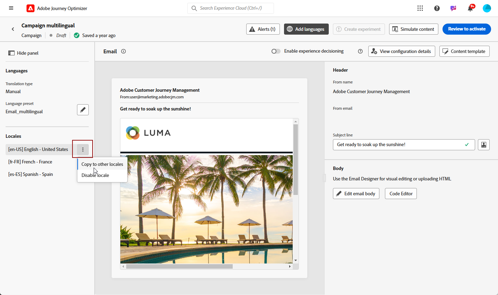

# 수동 번역을 사용하여 다국어 콘텐츠 만들기 {#multilingual-manual}

>[!IMPORTANT]
>
>수동 흐름의 경우 사용자에게 **[!UICONTROL 언어 설정 관리]** 권한이 부여되어야 합니다.

수동 흐름을 사용하면 캠페인 및 여정에서 직접 콘텐츠를 손쉽게 번역할 수 있으므로 다국어 메시지에 대한 정확한 제어 및 사용자 지정 옵션을 제공할 수 있습니다. 또한 HTML 가져오기 옵션을 사용하여 기존 다국어 콘텐츠를 쉽게 가져올 수 있습니다.

수동 번역을 사용하여 다국어 콘텐츠를 만들려면 다음 단계를 따르십시오.

1. [공급자 추가(선택 사항)](multilingual-provider.md)

1. [로케일 추가(선택 사항)](multilingual-locale.md)

1. [언어 설정 만들기](#create-language-settings)

1. [다국어 콘텐츠 만들기](#create-a-multilingual-campaign)

## 언어 설정 만들기 {#language-settings}

이 섹션에서는 다국어 콘텐츠를 관리하기 위해 다양한 로케일을 설정할 수 있습니다. 프로필 언어와 관련된 정보를 조회하는 데 사용할 속성을 선택할 수도 있습니다

1. **[!UICONTROL 관리]** 메뉴에서 **[!UICONTROL 채널]** > **[!UICONTROL 일반 설정]**&#x200B;에 액세스합니다.

1. **[!UICONTROL 언어 설정]** 메뉴에서 **[!UICONTROL 언어 설정 만들기]**&#x200B;를 클릭합니다.

   

1. **[!UICONTROL 언어 설정]**&#x200B;의 이름을 입력하고 **[!UICONTROL 수동 번역]**&#x200B;을 선택하세요.

1. 이 설정에 연결된 **[!UICONTROL 로케일]**&#x200B;을(를) 선택하십시오. 최대 50개의 로케일을 추가할 수 있습니다.

   **[!UICONTROL 로케일]**&#x200B;이(가) 누락된 경우 **[!UICONTROL 번역]** 메뉴에서 또는 API별로 미리 수동으로 만들 수 있습니다. [새 로케일 만들기](#create-locale)를 참조하세요.

   

1. 프로필이 컨텐츠 전달에 필요한 기준을 충족하지 않을 경우에 대한 백업 옵션을 정의하려면 **[!UICONTROL 대체 환경 설정]**&#x200B;을(를) 선택하십시오.

   대체 옵션을 선택하지 않으면 캠페인이나 여정이 전송되지 않습니다.

1. 다음 옵션 중에서 전송 기본 설정을 선택합니다.

   * **[!UICONTROL 프로필 언어 환경 설정 특성 선택]**
   * **[!UICONTROL 사용자 지정 조건부 규칙 만들기]**

1. **[!UICONTROL 프로필 언어 기본 설정 특성 선택]**&#x200B;을 선택한 경우 **[!UICONTROL 프로필 언어 기본 설정 특성]** 메뉴에서 관련 특성을 선택하여 프로필 언어 정보를 조회합니다.

   

1. **[!UICONTROL 사용자 지정 조건부 규칙 만들기]**&#x200B;를 선택한 경우 조건을 만들 로케일을 선택하십시오. 그런 다음 사용자 위치, 언어 환경 설정 또는 기타 컨텍스트 요소와 같은 요소를 기반으로 규칙을 빌드합니다.

   

1. 속성, 이벤트 또는 대상자를 추가하여 조건 작성을 시작하고 대상 그룹을 정의합니다.

   >[!IMPORTANT]
   >
   >컨텍스트 기반 데이터는 웹, 인앱, 코드 기반 경험 및 콘텐츠 카드 채널에만 사용할 수 있습니다. 이메일, SMS, 푸시 알림 또는 DM 채널에 추가 속성 없이 사용하는 경우 캠페인 또는 여정은 목록의 첫 번째 옵션 언어로 전송됩니다.

   

   +++조건에서 컨텍스트 이벤트를 사용하기 위한 사전 요구 사항

   사용자가 콘텐츠를 표시하면 경험 이벤트와 함께 개인화 요청이 전송됩니다. 조건에 컨텍스트 기반 데이터를 활용하려면 개인화 요청 페이로드에 추가 데이터를 첨부해야 합니다. 이렇게 하려면 Adobe Experience Platform 데이터 수집에서 규칙을 만들어 다음을 지정해야 합니다. 개인화 요청이 전송되는 경우 요청에 추가 데이터를 첨부하여 스키마의 언어 필드와 일치하는 속성을 정의합니다.

   >[!NOTE]
   >
   >이러한 사전 요구 사항은 인앱 및 콘텐츠 카드 채널에만 필요합니다.

   1. Adobe Experience Platform 데이터 수집에서 **[!UICONTROL 규칙]** 메뉴에 액세스하고 새 규칙을 만듭니다. 규칙을 만드는 방법에 대한 자세한 내용은 [!DNL Adobe Experience Platform] [데이터 수집 설명서](https://experienceleague.adobe.com/en/docs/experience-platform/collection/e2e#create-a-rule){target="_blank"}를 참조하세요.

   2. 규칙의 **[!UICONTROL IF]** 섹션에서 아래와 같이 구성된 이벤트를 추가합니다.

      

      * 작업 중인 **[!UICONTROL 확장]**&#x200B;을(를) 선택하십시오.
      * **[!UICONTROL 이벤트 유형]** 필드에서 &quot;AEP 요청 이벤트&quot;를 선택합니다.
      * 오른쪽 창에서 &quot;XDM 이벤트 유형이 personalization.request와 같음&quot;을 선택합니다.
      * 확인하려면 **[!UICONTROL 변경 내용 유지]** 단추를 클릭하세요.

   3. 규칙의 **[!UICONTROL THEN]** 섹션에서 아래와 같이 구성된 작업을 추가합니다.

      

      * 작업 중인 **[!UICONTROL 확장]**&#x200B;을(를) 선택하십시오.
      * **[!UICONTROL 작업 유형]** 필드에서 &quot;데이터 첨부&quot;를 선택합니다.
      * JSON 페이로드 섹션에서 사용할 언어를 검색하는 데 사용되는 속성(&quot;언어&quot; 아래 예에서)이 데이터 수집 데이터스트림이 유입되는 스키마에 지정된 속성의 이름과 일치하는지 확인합니다.

        ```JSON
        {
            "xdm":{
                "application":{
                    "_dc":{
                        "language":"{%%Language%%}"
                    }
                }
            }
        }
        ```

      * **[!UICONTROL 변경 내용 유지]** 단추를 클릭하여 규칙을 확인하고 저장합니다.

+++

1. 로케일을 드래그 앤 드롭하여 재정렬하고 목록에서 해당 우선 순위를 관리합니다.

1. 로케일을 삭제하려면 bin 아이콘을 클릭합니다.

   

1. **[!UICONTROL 제출]**&#x200B;을 클릭하여 **[!UICONTROL 언어 설정]**&#x200B;을 만듭니다.

언어 환경 설정을 지정하면, 더 이상 언어 환경 설정을 편집할 수 없습니다.

<!--
1. Access the **[!UICONTROL channel configurations]** menu and create a new channel configuration or select an existing one.


1. In the **[!UICONTROL Header parameters]** section, select the **[!UICONTROL Enable multilingual]** option.

1. Select your **[!UICONTROL Locales dictionary]** and add as many as needed.
-->

## 다국어 콘텐츠 만들기 {#create-multilingual-campaign}

다국어 콘텐츠를 설정한 후에는 캠페인이나 여정을 제작하고 선택한 각 로케일에 대한 콘텐츠를 사용자 지정할 수 있습니다.

1. 요구 사항에 따라 이메일, SMS 또는 푸시 알림 [campaign](../campaigns/create-campaign.md) 또는 [여정](../building-journeys/journeys-message.md)을(를) 만들고 구성하는 것부터 시작합니다.

   >[!IMPORTANT]
   >
   >여정 당 하나의 번역 프로젝트만 포함하는 것이 좋습니다.

1. 원래 콘텐츠를 만들거나 가져온 후 필요에 따라 개인화합니다.

1. 콘텐츠가 만들어지면 **[!UICONTROL 저장]**&#x200B;을 클릭하고 캠페인 구성 화면으로 돌아갑니다.

   

1. **[!UICONTROL 언어 추가]**&#x200B;를 클릭하고 이전에 만든 **[!UICONTROL 언어 설정]**&#x200B;을 선택합니다. [자세히 알아보기](#create-language-settings)

   

1. 드롭다운 메뉴에서 원하는 로케일을 선택하여 기존의 작성된 콘텐츠에 적용합니다.

1. **[!UICONTROL 로케일]** 메뉴의 고급 설정에 액세스하여 **[!UICONTROL 모든 로케일로 복사]**&#x200B;를 선택합니다.

   

1. 이제 선택한 **[!UICONTROL 로케일]**&#x200B;에 걸쳐 콘텐츠가 복제되었으므로 각 로케일에 액세스하고 **[!UICONTROL 전자 메일 본문 편집]**&#x200B;을 클릭하여 콘텐츠를 번역하십시오.

   

1. 선택한 로케일의 **[!UICONTROL 추가 작업]** 메뉴를 사용하여 로케일을 비활성화하거나 활성화할 수 있습니다.

   

1. 다국어 구성을 비활성화하려면 **[!UICONTROL 언어 추가]**&#x200B;를 클릭하고 로컬 언어로 유지할 언어를 선택하십시오.

   

1. **[!UICONTROL 활성화하려면 검토]**&#x200B;를 클릭하여 캠페인 요약을 표시합니다.

   요약을 사용하면 필요한 경우 캠페인을 수정하고 매개 변수가 틀리거나 누락되었는지 확인할 수 있습니다.

1. 다국어 콘텐츠를 탐색하여 각 언어로 렌더링을 확인합니다.

   

이제 캠페인이나 여정을 활성화할 수 있습니다. 전송되면 보고서 내에서 다국어 여정 또는 캠페인의 영향을 측정할 수 있습니다.

>[!IMPORTANT]
>
> 캠페인이 승인 정책의 적용을 받는 경우 다국어 캠페인 또는 여정을 전송하려면 승인을 요청해야 합니다. [자세히 알아보기](../test-approve/gs-approval.md)

<!--
# Create a multilingual journey {#create-multilingual-journey}

1. Create your journey with a Delivery and personalize your content as needed.
1. From your delivery action, click Edit content.
1. Click Add languages.

-->
