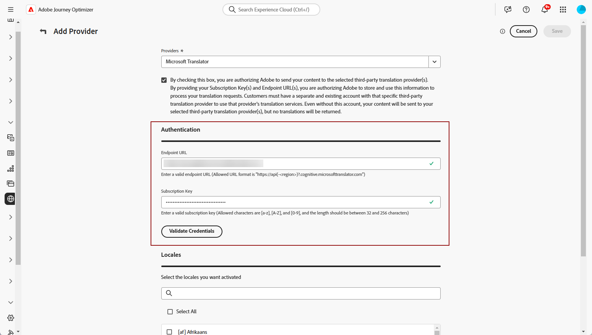

# 언어 공급자 추가 {#multilingual-provider}

>[!IMPORTANT]
>
> 번역 공급업체의 번역 서비스를 사용하는 경우 해당 공급업체의 추가 약관이 적용됩니다. 타사 솔루션인 번역 서비스는 통합을 통해 Adobe Journey Optimizer 사용자에게 제공됩니다. Adobe은 타사 제품을 제어하지 않으며 책임도 지지 않습니다.

Adobe Journey Optimizer은 Adobe Journey Optimizer과 별도로 기계 번역 및 사람 번역 서비스를 모두 제공하는 서드파티 번역 공급업체와 통합됩니다.

선택한 번역 공급업체를 추가하기 전에 해당 공급업체에 계정을 만들었는지 확인하십시오.

1. **[!UICONTROL 콘텐츠 관리]** 메뉴에서 **[!UICONTROL 번역]**(으)로 이동합니다.

1. **[!UICONTROL 공급자]** 탭에 액세스하여 **[!UICONTROL 공급자 추가]**&#x200B;를 클릭합니다.

   

1. **[!UICONTROL 공급자]** 드롭다운 목록에서 원하는 공급자를 선택합니다.

   >[!NOTE]
   >
   >목록에 새 **공급자**&#x200B;를 추가하려면 **공급자**&#x200B;에게 [이 문서](https://developer.adobe.com/gcs/partner/)에 설명된 지침에 따라 온보딩 프로세스를 완료하도록 요청하세요.

   

1. Microsoft Translator를 공급자로 사용하는 경우 **[!UICONTROL 구독 키]** 및 **[!UICONTROL 끝점 URL]**&#x200B;을 입력하십시오.

   

1. 해당 **지원되는 로케일**&#x200B;을(를) 선택하십시오.

   

1. 구성을 완료한 후 **[!UICONTROL 저장]**&#x200B;을 클릭하여 설정을 완료합니다.
