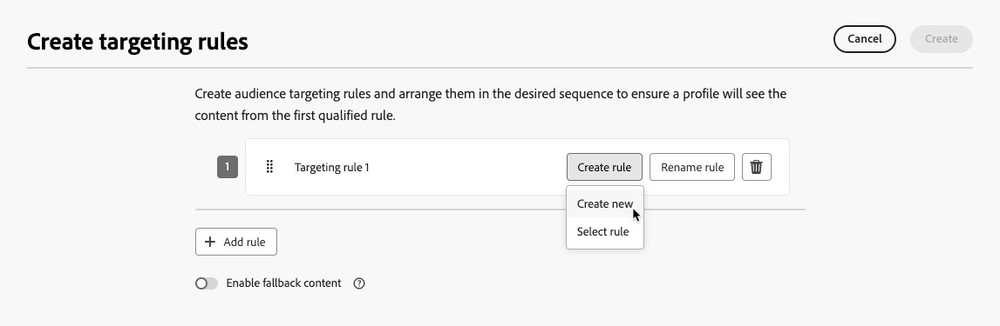

# 타기팅 사용 {#targeting}

>[!CONTEXTUALHELP]
>id="ajo_content_targeting_fallback"
>title="대체 콘텐츠란 무엇입니까?"
>abstract="대체 콘텐츠를 사용하면 타기팅 규칙을 충족하지 않는 대상자가 기본 콘텐츠를 받을 수 있습니다. 이 옵션을 선택하지 않으면 위에 정의된 타기팅 규칙에 적합하지 않은 대상자는 콘텐츠를 받지 못합니다."

타깃팅은 사용자 프로필 속성 또는 컨텍스트 속성에 따라 개인화된 콘텐츠를 특정 대상 세그먼트에 전달합니다.

메시지 콘텐츠를 무작위로 할당하는 실험과 달리 타기팅은 콘텐츠를 올바른 대상자에게 전달한다는 측면에서 결정적입니다.

타깃팅을 사용할 경우 다음을 기반으로 특정 규칙을 정의할 수 있습니다.

* 위치(예: **사용자 프로필 특성** 지역 타겟팅), 연령 또는 환경 설정. 예를 들어, 미국의 사용자는 &quot;골든 게이트&quot; 프로모션을 보고 프랑스의 사용자는 &quot;에펠탑&quot; 프로모션을 봅니다.

* 디바이스 유형(예: **컨텍스트 데이터** 디바이스 타기팅), 시간 또는 세션 세부 정보. 예를 들어 데스크탑 사용자는 데스크탑에 최적화된 콘텐츠를 수신하는 반면, 모바일 사용자는 모바일에 최적화된 콘텐츠를 수신합니다.

* 특정 대상 멤버십이 있는 프로필을 포함하거나 제외하는 데 사용할 수 있는 **대상**.

타깃팅을 설정하려면 아래 단계를 따르십시오.

1. [여정](../building-journeys/journey-gs.md#jo-build) 또는 [캠페인](../campaigns/create-campaign.md)을 만듭니다.

   >[!NOTE]
   >
   >여정에 있는 경우 **[!UICONTROL 작업]** 활동을 추가하고 채널 활동을 선택한 다음 **[!UICONTROL 작업 구성]**&#x200B;을 선택하십시오. [자세히 알아보기](../building-journeys/journey-action.md#add-action)

1. **[!UICONTROL 작업]** 탭에서 하나 이상의 작업을 선택합니다.

1. **[!UICONTROL 최적화]** 섹션에서 **[!UICONTROL 타깃팅 규칙 만들기]**&#x200B;를 선택합니다.

   {width=85%}

1. **[!UICONTROL 규칙 만들기]** > **[!UICONTROL 새로 만들기]**&#x200B;를 클릭하고 규칙 빌더를 사용하여 이동 중에 기준을 정의합니다.

   {width=100%}

   예를 들어 미국 거주자를 위한 규칙, 프랑스 거주자를 위한 규칙, 인도 거주자를 위한 규칙을 정의합니다.

   {width=85%}

1. **[!UICONTROL 규칙 만들기]** > **[!UICONTROL 규칙 선택]**&#x200B;을 클릭하여 **[!UICONTROL 규칙]** 메뉴에서 만든 기존 타깃팅 규칙을 선택할 수도 있습니다. [자세히 알아보기](../experience-decisioning/rules.md)

   {width=70%}

   이 경우 규칙을 구성하는 공식은 단순히 여정 또는 캠페인에 복사됩니다. **[!UICONTROL 규칙]** 메뉴에서 해당 규칙을 추가로 변경해도 여정 또는 캠페인의 복사에는 영향을 주지 않습니다.

   >[!AVAILABILITY]
   >
   >[전용 ](../experience-decisioning/rules.md#create) 메뉴에서 타깃팅 규칙을 만드는 중[!DNL Journey Optimizer]은(는) 현재 Decisioning 추가 기능 서비스를 구입한 조직에서 사용할 수 있으며 다른 조직에 대해 필요할 때 사용할 수 있습니다(제한된 가용성).
   >
   >이 용량은 모든 고객에게 점진적으로 제공될 예정입니다. 그동안 Adobe 담당자에게 문의하여 액세스 권한을 얻으십시오.

1. 규칙을 추가한 후에도 수정할 수 있습니다. 규칙 빌더를 사용하여 이동 중에 업데이트하려면 **[!UICONTROL 인라인 편집]**&#x200B;을 선택하고, 다른 기존 규칙을 선택하려면 **[!UICONTROL 규칙 선택]**&#x200B;을 선택하십시오.

   {width=100%}

   >[!NOTE]
   >
   >인라인 규칙을 편집해도 기존의 원본 규칙에는 영향을 주지 않습니다.

1. 필요에 따라 **[!UICONTROL 대체 콘텐츠 사용]** 옵션을 선택하십시오. 대체 콘텐츠 를 사용하면 타깃팅 규칙이 적격하지 않을 때 대상자가 기본 콘텐츠를 받을 수 있습니다.

   >[!NOTE]
   >
   >이 옵션을 선택하지 않으면 위에서 정의한 타겟팅 규칙에 적합하지 않은 모든 대상자는 컨텐츠를 받지 않습니다.

1. 타깃팅 규칙 설정을 저장합니다.

1. **[!UICONTROL 작업]** 탭으로 돌아가 **[!UICONTROL 콘텐츠 편집]**&#x200B;을 선택합니다.

1. 타겟팅 규칙 설정으로 정의된 각 그룹에 적절한 콘텐츠를 디자인할 수 있습니다.

   {width=85%}

   이 예제에서는 미국 거주자를 위한 특정 콘텐츠, 프랑스 거주자를 위한 다른 콘텐츠 및 인도 거주자를 위한 다른 콘텐츠를 디자인합니다.

1. 여정 또는 캠페인을 [활성화](../campaigns/review-activate-campaign.md)합니다.

여정/캠페인이 라이브되면 미국 거주자는 특정 메시지를, 프랑스 거주자는 다른 메시지를 얻을 수 있도록 각 대상에 맞게 조정된 콘텐츠가 전송됩니다.

<!--Default content:

* If no targeting rules match, default content can be delivered.

* If default content is not enabled, passthrough behavior ensures lower-priority campaigns are evaluated.-->

