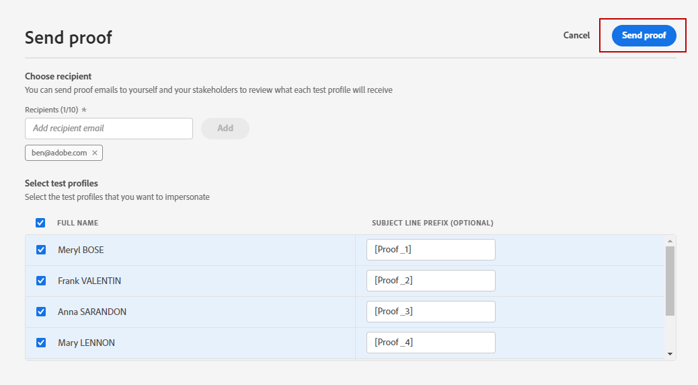

# 이메일 증명 보내기 {#send-proofs}

증명은 메시지를 주요 대상에게 보내기 전에 테스트할 수 있는 특정 메시지입니다. 증명 수신자는 메시지 승인(렌더링, 콘텐츠, 개인화 설정, 구성)을 담당합니다.

[테스트 프로필](test-profiles.md)을 선택하면 증명을 보낼 수 있습니다.

1. **[!UICONTROL 시뮬레이션]** 화면에서 **[!UICONTROL 증명 보내기]** 단추를 클릭합니다.

   

1. **[!UICONTROL 증명 보내기]** 창에서 받는 사람의 전자 메일을 입력하고 **[!UICONTROL 추가]**&#x200B;를 클릭하여 본인 또는 조직의 구성원에게 증명을 보냅니다.

   증명 게재에 최대 10명의 수신자를 추가할 수 있습니다.

   

1. 메시지 콘텐츠를 개인화하는 데 사용할 **테스트 프로필**&#x200B;을(를) 선택하십시오.

   증명의 각 수신자는 선택한 테스트 프로필 수만큼 메시지를 수신합니다. 예를 들어 5개의 수신자 이메일을 추가하고 10개의 테스트 프로필을 선택한 경우 50개의 증명 메시지를 보내고 각 수신자는 그 중 10개를 받습니다.

1. 필요한 경우 증명의 제목 줄에 접두사를 추가할 수 있습니다. 영숫자와 특수 문자(예: )만 - _ ( ) [ ]은(는) 제목 줄에 접두사로 사용할 수 있습니다.

1. **[!UICONTROL 증명 보내기]**&#x200B;를 클릭합니다.

   

1. **[!UICONTROL 시뮬레이션]** 화면으로 돌아가서 **[!UICONTROL 증명 보기]** 단추를 클릭하여 상태를 확인하세요.

   

메시지 콘텐츠를 수정할 때마다 증명을 보내는 것이 좋습니다.

>[!NOTE]
>
>보낸 증명에서 미러 페이지 링크가 활성화되지 않았습니다. 최종 메시지에서만 활성화됩니다.
