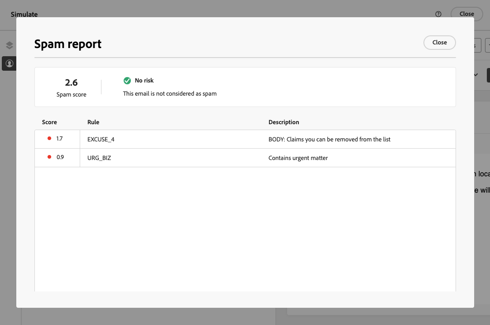

# 스팸 보고서 사용 {#spam-report}

>[!AVAILABILITY]
>
>스팸 보고서 기능은 현재 사용자를 선택하는 베타 버전으로만 사용할 수 있습니다. Beta 프로그램에 참여하려면 Adobe 고객 지원 센터에 문의해 주십시오.

[!DNL Journey Optimizer] 을 사용하면 스팸 필터링에 대해 콘텐츠가 수행되는 방식을 확인하고 메시지가 스팸이 아닌 고객의 받은 편지함에 도착하는지 확인할 수 있습니다.

>[!CAUTION]
>
>* 이 기능은 현재 이메일 채널에서만 사용할 수 있습니다.
>
>* 현재 스팸 보고서 분석은 영어로 된 콘텐츠에 대해서만 수행할 수 있습니다.

콘텐츠를 편집하거나 미리 볼 때 **[!UICONTROL 스팸 보고서]** 옵션은 나열된 각 개별 항목에 대한 점수를 개선하기 위한 채점 및 조언을 제공합니다.

이를 통해 메시지가 수신 시 사용된 스팸 방지 도구에 의해 스팸으로 간주될 위험이 있는지 여부를 확인하고 그렇지 않은 경우 조치를 취할 수 있습니다.

>[!CAUTION]
>
>스팸 보고서는 표시와 경고만 제공합니다. 스팸 보고서에 콘텐츠가 스팸으로 간주된다는 메시지가 표시되면 메시지를 보낼 수 없습니다. 점수와 제안된 개선 사항에 따라 조치를 취하는 것이 귀사의 선택입니다.

을(를) 사용하려면 **[!UICONTROL 스팸 보고서]** 기능을 사용하려면 아래 단계를 따르십시오.

<!--For example spam scoring tool can tell that there are too many Images compared to the text. Retailers tend to do this even though the spam score gets worse because the content is more engaging.-->

<!--Michael, who is a marketer with NIKE works along with Tara from testing team to ensure that the emails being sent as part of the campaign/journey don't get categorised as SPAM.

They need an integration within AJO's marketing system to show how the curated content is doing against different SPAM compliance pillars like for SPAM trigger words, HTML Body content and layout, subject line etc.

They should be able to get scores for each individual items as shown by market standard SPAM filtering tools like Spam Assassin, Symantec etc.

They should also get suggestions on how to improve the score better to be confident that the messages don't get categorised as spam.-->

1. 다음에서 **[!UICONTROL 시뮬레이트]** 화면에서 **[!UICONTROL 스팸 보고서]** 단추를 클릭합니다.

   

<!--
    You can also open the [Email Designer](../email/content-from-scratch.md), click the **[!UICONTROL More]** button and select **[!UICONTROL Check spam score]** from the menu.

    
-->

1. 스팸 방지 검사가 자동으로 수행되며 **[!UICONTROL 스팸 보고서]** 창에 결과가 표시됩니다. 본문 레이아웃, 구조, 이미지 크기, 스팸 트리거 단어(있는 경우) 등의 측면에서 콘텐츠가 수행되는 방식을 보여 줍니다.

   

1. 각 항목에 대한 점수와 설명을 확인합니다.

   점수가 5보다 높으면 경고가 표시됩니다. 일부 메시지가 수신되면 스팸 방지 도구에 의해 차단되거나 스팸으로 표시될 수 있음을 나타냅니다.

1. 해당 점수를 기반으로, 일부 요소를 개선할 수 있다고 생각되면, [이메일 디자이너](../email/content-from-scratch.md) 필요한 업데이트를 만듭니다.

1. 변경이 완료되면 다음으로 돌아갑니다. **[!UICONTROL 스팸 보고서]** 점수가 향상되었는지 확인하는 화면입니다.

   

<!--You can also check the message's alerts for warnings on potential risk of spam detection. Follow the steps below.

1. Click the **[!UICONTROL Alerts]** button on top right of the screen. [Learn more on email alerts](../email/create-email.md#check-email-alerts)

1. If **[!UICONTROL Spam checker alert]** is displayed, you should check your content for a potential risk of spam using the **[!UICONTROL Spam report]** feature as detailed above.

    
-->

