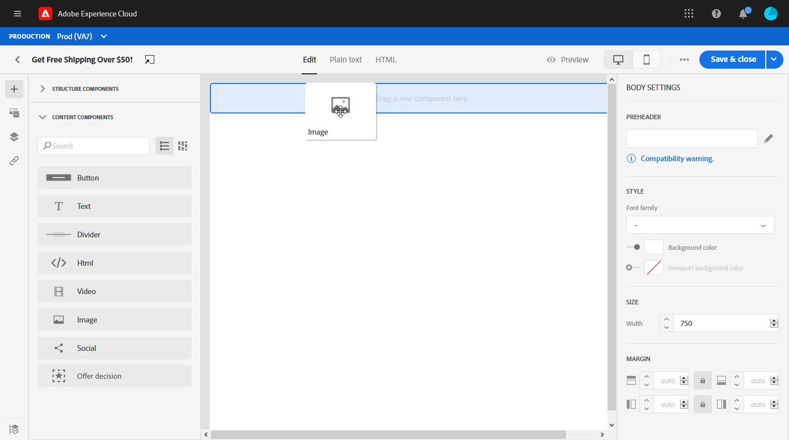

# 사용자 인터페이스 {#create-email-content}에서 이메일 컨텐츠 디자인

메시지](create-message.md)을(를) [만들었으면 전자 메일 내용 만들기를 시작할 수 있습니다.

1. 새로 만든 메시지의 **[!UICONTROL Edit content]** 섹션에서 **[!UICONTROL Email designer]**&#x200B;을 선택합니다.

   

1. 이메일 디자이너 홈 페이지에서 다음 옵션을 사용하여 이메일을 디자인할 방법을 선택합니다.

   * 이메일 디자이너 기능을 사용하여 이메일 콘텐츠를 만들려면 **[!UICONTROL Design from scratch]**&#x200B;을 선택합니다.

   * 템플릿 내장 목록에서 **[!UICONTROL Start from template]**&#x200B;을 선택하여 이메일을 만듭니다. 다른 템플릿은 만들 수 없습니다.

   * **[!UICONTROL Code your own]**&#x200B;을 선택하여 HTML 원시 코드를 입력하거나 붙여 넣습니다. [자세히 알아보기](existing-content.md#import-raw-html-code).

   * HTML 파일 또는 .zip 폴더를 가져오려면 **[!UICONTROL Import HTML]**&#x200B;을 선택합니다. [자세히 알아보기](existing-content.md#import-html-content-from-file).

   

## 처음부터 디자인

이메일 디자이너와 함께 이메일 컨텐츠를 작성하려면 다음 단계를 따르십시오.

1. **[!UICONTROL Design from scratch]** 옵션을 선택한 후 **[!UICONTROL Structure components]**&#x200B;을(를) 드래그 앤 드롭하여 이메일 레이아웃을 정의하여 이메일 컨텐츠를 디자인합니다.

   

1. **[!UICONTROL Content components]** 드롭다운에서 구조 구성 요소에 필요한 만큼 **[!UICONTROL Content components]**&#x200B;을 추가할 수 있습니다. [컨텐츠 구성 요소에 대해 자세히 알아보십시오](content-components.md).

   

1. 각 구성 요소는 **[!UICONTROL Component settings]** 섹션으로 추가로 사용자 정의할 수 있습니다. 예를 들어, 구성 요소의 패딩 또는 여백을 텍스트 스타일, 안쪽 여백을 변경할 수 있습니다. [이메일 편집기에서 스타일에 대해 자세히 알아보십시오](https://experienceleague.adobe.com/docs/campaign-standard/using/designing-content/styles.html).

   

1. **[!UICONTROL Assets picker]**&#x200B;에서 **[!UICONTROL Assets library]**&#x200B;에 저장된 자산을 이메일에 직접 추가할 수 있습니다. [자산 관리에 대한 자세한 내용을 살펴보십시오](assets-essentials.md).

   에셋이 포함된 폴더를 두 번 클릭하고 이메일에 추가할 에셋을 드래그하여 놓습니다.

   

1. 개인화 필드를 추가하여 프로필 데이터의 컨텐츠를 사용자 정의합니다. [콘텐츠 개인화에 대한 자세한 내용을 살펴보십시오](personalization/personalize.md).

   

1. 왼쪽 창의 **[!UICONTROL Links]** 탭에서 추적할 컨텐츠의 모든 URL 목록을 확인합니다. 필요한 경우 **[!UICONTROL Tracking Type]**, **[!UICONTROL Label]** 및 **[!UICONTROL Tags]**&#x200B;를 수정할 수 있습니다.

   

1. 필요한 경우 코드 편집기로 전환하여 고급 메뉴에서 **[!UICONTROL Switch to code editor]**&#x200B;을 클릭하여 이메일을 더 개인화할 수 있습니다. 코드 편집기에 대한 자세한 내용은 이 [페이지](existing-content.md#import-raw-html-code)를 참조하십시오.

   >[!NOTE]
   >
   >코드 편집기로 전환한 후에는 이 이메일에 대해 비주얼 디자이너를 사용할 수 없습니다.

   

1. 이메일 렌더링을 확인하려면 **[!UICONTROL Preview]**&#x200B;을 클릭합니다. 데스크탑 또는 모바일 보기를 선택할 수 있습니다.

   

1. 전자 메일이 준비되면 **[!UICONTROL Save & Close]**&#x200B;을 클릭합니다.

이제 메시지에 이메일 컨텐츠를 사용할 수 있습니다. [메시지를 보내는 방법을 알아봅니다](publish-manage-message.md).

## 이메일 구조 정의 {#defining-the-email-structure}

>[!CONTEXTUALHELP]
>id="ac_structure_components"
>title="구조 구성 요소 정보"
>abstract="구조 구성 요소는 이메일의 레이아웃을 정의합니다."

>[!CONTEXTUALHELP]
>id="ac_edition_columns"
>title="이메일 열 정의"
>abstract="이메일 디자이너를 사용하면 열 구조를 정의하여 이메일의 레이아웃을 쉽게 정의할 수 있습니다."

이메일 디자이너를 사용하면 이메일의 구조를 쉽게 정의할 수 있습니다. 간단한 드래그 앤 드롭 동작으로 구조 요소를 추가하고 이동하여 신속하게 이메일 모양을 디자인할 수 있습니다.

이메일 구조를 편집하려면:

1. 기존 컨텐츠를 열거나 새 이메일 컨텐츠를 만듭니다.
1. 왼쪽의 **+** 아이콘을 선택하여 **[!UICONTROL Structure components]**&#x200B;에 액세스합니다.
1. 이메일을 구성하는 데 필요한 구조 구성 요소를 드래그하여 놓습니다.
파란색 선은 구조 구성 요소를 놓기 전에 정확한 위치를 재구성합니다. 위의 다른 구성 요소 간 또는 아래에 놓을 수 있지만 안으로는 놓을 수 없습니다.

   >[!NOTE]
   >
   >열 스택은 모든 이메일 프로그램과 호환되지 않습니다. 지원되지 않는 경우 열이 누적되지 않습니다.
   >
   >이메일에 배치하면 이미 안에 배치된 컨텐츠 구성 요소나 조각이 없는 한 구성 요소를 이동하거나 제거할 수 없습니다.

1. 하나 이상의 열로 구성된 여러 구조 구성 요소를 사용할 수 있습니다.

   **[!UICONTROL n:n column]** 구성 요소를 선택하여 원하는 열 수(3에서 10 사이)를 정의합니다. 각 열 아래쪽에서 화살표를 이동하여 각 열의 너비를 정의할 수도 있습니다.

   >[!NOTE]
   >
   >각 열 크기는 구조 구성 요소의 전체 너비의 10% 미만일 수 없습니다. 비어 있지 않은 열은 제거할 수 없습니다.

구조가 정의되면 컨텐츠 조각과 구성 요소를 이메일에 추가할 수 있습니다.

## 미리 헤더 {#preheader} 사용

>[!CONTEXTUALHELP]
>id="ac_edition_preheader"
>title="사전 헤더 사용"
>abstract="사전 헤더를 사용하면 이메일을 추적하고 사용자 지정하는 데 도움이 되는 간단한 요약 텍스트를 구성할 수 있습니다."

사전 헤더는 이메일 클라이언트에서 보낸 이메일을 볼 때 제목 줄 뒤에 오는 간단한 요약 텍스트입니다. 사전 헤더를 통해 이메일을 추적하고 사용자 정의할 수 있습니다.

**[!UICONTROL Preheader]** 편집 상자를 선택하고 콘텐트를 추가합니다.

사전 헤더 컨텐츠에 **[!UICONTROL Content block]**, **[!UICONTROL Dynamic content]** 또는 **[!UICONTROL Personalization fields]**&#x200B;를 추가할 수 있습니다.

>[!NOTE]
>
>사전 헤더는 모든 이메일 클라이언트와 호환되지 않습니다. 지원되지 않는 경우 프리헤더가 표시되지 않습니다.

## 배경 설정 {#about-backgrounds}

>[!CONTEXTUALHELP]
>id="ac_edition_backgroundimage"
>title="배경 설정"
>abstract="전자 메일 디자이너를 사용하면 컨텐츠의 배경색 또는 배경 이미지를 맞춤화할 수 있습니다. 배경 이미지는 일부 전자 메일 클라이언트에서 지원되지 않습니다."
>additional-url="https://docs.google.com/spreadsheets/d/1TLo62YKm3tThUWDOIliCQFWs3dpNjpDfw6DdTr1oGOw/edit#gid=0" text="추가 정보"

이메일 디자이너에서 배경을 설정하는 방법은 Adobe에서 다음을 권장합니다.

1. 디자인에 필요한 경우 이메일 본문에 배경색을 적용합니다.
1. 대부분의 경우 열 수준에서 배경색을 설정합니다.
1. 관리하기가 어려우므로 이미지 또는 텍스트 구성 요소에 배경색을 사용하지 마십시오.

다음은 사용할 수 있는 배경 설정입니다.

* 전체 이메일에 대해 **[!UICONTROL Background color]**&#x200B;을 설정합니다. 왼쪽 팔레트에서 액세스할 수 있는 탐색 트리에서 본문 설정을 선택해야 합니다.

* **[!UICONTROL Viewport background color]**&#x200B;을 선택하여 모든 구조 구성 요소에 대해 동일한 배경색을 설정합니다. 이 옵션을 사용하면 배경색에서 다른 설정을 선택할 수 있습니다.

* 각 구조 구성 요소에 대해 다른 배경색을 설정합니다. 왼쪽 팔레트에서 액세스할 수 있는 탐색 트리에서 구조를 선택하여 해당 구조에만 특정 배경색을 적용합니다.

   구조 배경색을 숨길 수 있으므로 뷰포트 배경색을 설정하지 마십시오.

* 구조 구성 요소의 내용에 대해 **[!UICONTROL Background image]**&#x200B;을 설정합니다.

   >[!NOTE]
   >
   >일부 이메일 프로그램은 배경 이미지를 지원하지 않습니다. 지원되지 않는 경우 행 배경색이 대신 사용됩니다. 이미지를 표시할 수 없는 경우 적절한 폴백 배경색을 선택해야 합니다.

* 열 수준에서 배경색을 설정합니다.

   >[!NOTE]
   >
   >가장 일반적인 사용 사례입니다. Adobe에서는 전체 이메일 컨텐츠를 편집할 때 유연성을 높일 수 있도록 열 수준에서 배경색을 설정하는 것이 좋습니다.

   열 수준에서 배경 이미지를 설정할 수도 있지만 거의 사용되지 않습니다.

### 예:세로 정렬 및 패딩 조정 {#example--adjusting-vertical-alignment-and-padding}

3개의 열로 구성된 구조 구성 요소 내에서 패딩 및 세로 정렬을 조정할 수 있습니다. 이렇게 하려면 아래 단계를 수행합니다:

1. 이메일에서 직접 구조 구성 요소를 선택하거나 왼쪽 **팔레트**&#x200B;에서 사용할 수 있는 구조 트리를 사용합니다.
1. **상황에 맞는 도구 모음**&#x200B;에서 **[!UICONTROL Select a column]**&#x200B;를 클릭하고 편집할 도구 모음을 선택합니다. 구조 트리에서 선택할 수도 있습니다.

   해당 열의 편집 가능한 매개 변수는 오른쪽의 **[!UICONTROL Settings]** 창에 표시됩니다.

1. **[!UICONTROL Vertical alignment]** 아래에서 **[!UICONTROL Up]**&#x200B;을 선택합니다.

   컨텐츠 구성 요소가 열 상단에 표시됩니다.

1. **[!UICONTROL Padding]** 아래에서 열 안의 위쪽 패딩을 정의합니다. 잠금 아이콘을 클릭하여 아래쪽 패딩과의 동기화를 중단합니다.

   해당 열의 왼쪽 및 오른쪽 패딩을 정의합니다.

1. 다른 열의 정렬 및 패딩을 조정하려면 비슷하게 진행하십시오.

1. 변경 내용을 저장합니다.

## 링크 {#about-styling-links} 스타일 정의

링크에 밑줄을 그고 이메일 디자이너에서 링크의 색상과 대상을 선택할 수 있습니다.

1. 링크가 삽입되는 구성 요소에서 링크의 레이블 텍스트를 선택합니다.

1. 구성 요소 설정에서 **[!UICONTROL Underline link]**&#x200B;을 선택하여 링크의 레이블 텍스트에 밑줄을 표시합니다.

1. 링크를 열 검색 컨텍스트를 선택하려면 **[!UICONTROL Target]**&#x200B;을 선택합니다.

1. 링크의 색상을 변경하려면 **[!UICONTROL Link color]**&#x200B;을 클릭합니다.

1. 필요한 색상을 선택하십시오.

1. 변경 내용을 저장합니다.

## 인라인 스타일 특성 추가 {#adding-inline-styling-attributes}

이메일 디자이너 인터페이스에서 요소를 선택하고 사이드 패널에 요소를 표시하는 경우 해당 특정 요소에 대한 인라인 속성과 해당 값을 사용자 지정할 수 있습니다.

1. 컨텐츠에서 요소를 선택합니다.
1. 사이드 패널에서 **[!UICONTROL Styles Inline]** 설정을 찾습니다.

1. 기존 속성의 값을 수정하거나 **+** 단추를 사용하여 새 속성을 추가합니다. CSS와 호환되는 모든 속성과 값을 추가할 수 있습니다.

그러면 스타일이 선택한 요소에 적용됩니다. 자식 요소에 특정 스타일 속성이 정의되지 않은 경우 상위 요소의 스타일이 상속됩니다.

## 이메일 {#generate-text-version}의 텍스트 버전을 만듭니다.

HTML 콘텐츠를 표시할 수 없을 때 사용되는 이메일 본문의 텍스트 버전을 만드는 것이 좋습니다.

기본적으로 이메일 디자이너는 개인화 필드를 포함하여 **[!UICONTROL Plain text]** 버전의 이메일을 만듭니다. 이 버전은 자동으로 생성되어 HTML 버전의 컨텐츠와 동기화됩니다.

일반 텍스트 버전에 다른 컨텐츠를 사용하려면 아래 단계를 따르십시오.

1. 이메일에서 **[!UICONTROL Plain text]** 탭을 선택합니다.

1. 동기화를 비활성화하려면 **[!UICONTROL Sync with HTML]** 토글을 사용합니다.

   

1. 확인 표시를 클릭하여 선택을 확인합니다.

   

1. 그런 다음 원하는 대로 일반 텍스트 버전을 편집할 수 있습니다.

>[!CAUTION]
>
>* **[!UICONTROL Plain text]** 보기에서 변경한 내용은 HTML 보기에 반영되지 않습니다.
   >
   >
* 일반 텍스트 내용을 업데이트한 후 **[!UICONTROL Sync with HTML]** 옵션을 다시 활성화하면 변경 내용이 손실되고 HTML 버전에서 생성된 텍스트 내용으로 바뀝니다.

>

