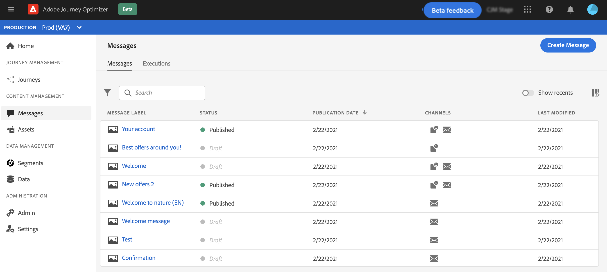

# 메시지 만들기 {#create-message}

메시지는 **[!UICONTROL Messages]** 바로 가기를 클릭합니다. 모든 메시지가 게시 날짜(게시된 메시지의 경우) 또는 작성 날짜(초안 메시지의 경우)별로 정렬되어 나열됩니다.

>[!NOTE]
>
>사용자는 제품 프로필에 따라 메시지에 액세스, 만들기, 편집 및/또는 게시할 수 있습니다. 사용자 권한에 대해 자세히 알아보기 [이 섹션](administration/permissions.md).

를 사용하십시오 **[!UICONTROL Show recents]** 지난 5일 동안 액세스한 메시지에 직접 링크를 추가하려면 을 전환합니다.

필터 아이콘을 사용하여 게시되는 초안, 게시 또는 메시지만 표시할 수 있습니다. 다음과 같이 메시지 레이블을 검색할 수도 있습니다.

## 새 메시지 만들기

새 메시지를 만들려면 아래 단계를 수행하십시오.

1. 메시지 목록에 액세스한 다음 **[!UICONTROL Create Message]**.

1. 메시지 속성을 정의합니다.

   

   * 을(를) 입력합니다. **[!UICONTROL Title]** (필수) 및 **[!UICONTROL Description]**.

   * 을(를) 선택합니다 **[!UICONTROL Message category]**: 마케팅 또는 트랜잭션.

   * 을(를) 선택합니다 **[!UICONTROL Preset]** 을 전달하는 것이 좋습니다.

      사전 설정에는 브랜드에 따라 이메일 및/또는 푸시 알림을 전송하는 데 필요한 모든 매개 변수가 포함되어 있습니다. [사전 설정에 대해 자세히 알아보기](configuration/message-presets.md).

   * 해당 메시지에 사용할 채널을 선택합니다. 이메일 및/또는 푸시 알림. 메시지를 만들 수 있으려면 채널을 하나 이상 선택해야 합니다.
   언제든지 **[!UICONTROL Properties]** 메시지 인터페이스의 단추.

1. 클릭 **[!UICONTROL Create]** 메시지 만들기를 확인합니다. 메시지가 메시지 목록의 **[!UICONTROL Draft]** 상태.

   선택한 각 채널에 대해 하나의 탭을 사용할 수 있습니다. 이 탭을 사용하여 각 채널에 대한 컨텐츠를 구성합니다. 탭을 선택하고 **[!UICONTROL Delete channel]** 오른쪽에 있는 단추입니다.

   

   이제 메시지 콘텐츠를 만들고 설정을 조정할 수 있습니다. 전자 메일 및 푸시 알림 구성에 대한 자세한 내용은 다음 섹션에서 확인할 수 있습니다.

   * [이메일 만들기](create-email.md)
   * [푸시 알림 만들기](create-push.md)

   >[!NOTE]
   >   
   >표현식 편집기를 사용하여 프로필의 데이터를 사용하여 메시지를 개인화할 수 있습니다. 개인화에 대한 자세한 내용은 [이 섹션](personalization/personalize.md).

1. 왼쪽의 미리 보기 섹션을 사용하여 메시지 렌더링을 제어하고 테스트 프로필로 개인화 설정을 확인합니다. 이 작업에 대한 자세한 정보는 [이 섹션](preview.md)을 참조하십시오.

   

1. 편집기의 위쪽 섹션에서 경고를 확인합니다.  일부는 간단한 경고이지만 일부는 메시지를 게시하지 못하도록 할 수 있습니다. 추가 정보 [이 섹션](alerts.md).

1. 이제 을(를) 클릭하여 메시지를 게시할 수 있습니다 **[!UICONTROL Publish]** 단추를 클릭하거나 초안으로 유지하고 나중에 게시합니다. 메시지 게시 방법에 대한 자세한 내용은 [이 섹션](publish-manage-message.md).

## 메시지 복제

기존 메시지에서 메시지를 만들려면 **[!UICONTROL Duplicate]** 메시지 인터페이스의 단추. 모든 설정 및 구성이 새 메시지에 복사됩니다

중복을 확인하기 전에 메시지 이름을 변경할 수 있습니다.

새 메시지가 만들어지면 창 하단에 확인 메시지가 표시됩니다.

전용 아이콘을 사용하여 메시지 목록에서 메시지를 복제할 수도 있습니다.

동일한 확인 프로세스가 적용됩니다.
