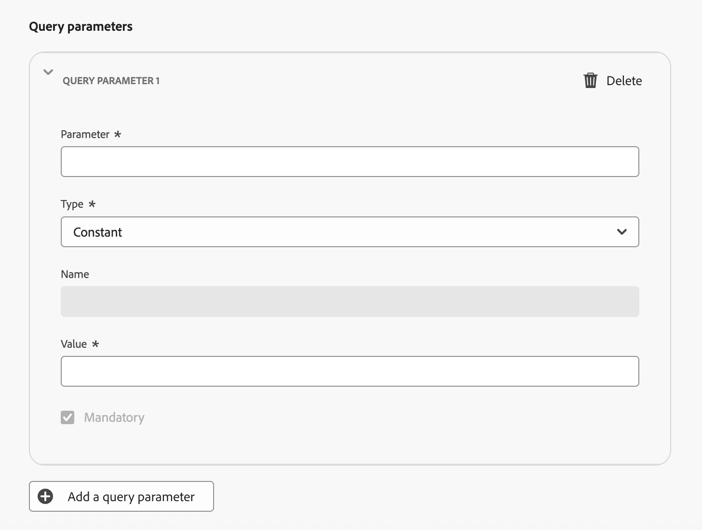
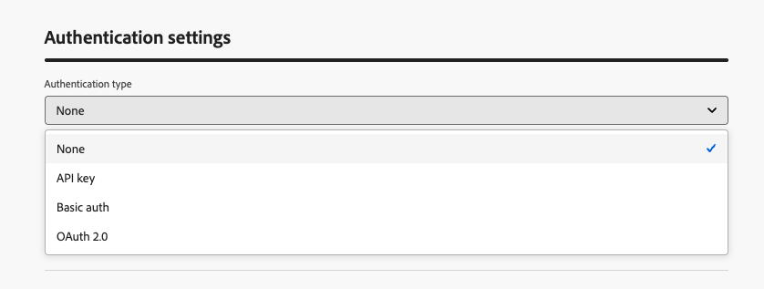

# 사용자 정의 채널 설정 {#create-custom-channel}

>[!BEGINSHADEBOX]

**이 페이지에서:** 끝점 URL, 헤더, 인증, 제한 정책 및 메시지 페이로드 구조를 정의하여 채널 빌더를 사용하여 Adobe Journey Optimizer에서 사용자 지정 채널을 만드는 방법을 알아봅니다.

>[!ENDSHADEBOX]

>[!CONTEXTUALHELP]
>id="ajo_custom_channel_settings"
>title="사용자 정의 채널 정보"
>abstract="Adobe Journey Optimizer는 사용자 정의 채널을 이용하여 고유한 API 엔드포인트를 통해 개인화된 메시지를 외부 시스템에 보낼 수 있습니다. 일반 속성, 엔드포인트, 인증 및 페이로드를 정의한 다음 새 사용자 정의 채널을 테스트하고 활성화합니다. 완료되면 채널 구성을 만들 때 사용하여 마케팅 담당자가 여정 및 캠페인에서 사용하도록 할 수 있습니다."
>additional-url="" text="사용자 정의 채널 시작하기"

<!--Contextual help final location TBC (here or in Settings subsection-->

캠페인 및 여정에서 사용자 지정 채널을 사용하려면 관리자가 먼저 채널을 만들어야 합니다. 여기에는 끝점, 인증, 제한 정책 및 메시지 페이로드 구조 정의가 포함됩니다.

**채널 빌더** 섹션은 새 사용자 지정 채널을 정의하는 중앙 인터페이스입니다. <!--It is accessible to users with the **[!UICONTROL Administrator]** role. -->사용자 지정 채널을 만들고 구성할 수 있을 뿐만 아니라 API 자격 증명을 관리하고 하위 도메인을 위임할 수 있습니다.

>[!IMPORTANT]
>
>채널 빌더에 액세스하여 사용자 정의 채널을 만들고 관리하려면 **사용자 정의 채널 보기** 및 **사용자 정의 채널 관리** 권한이 부여되어야 합니다. <!--[Learn more](../administration/high-low-permissions.md)--> [이 섹션](../administration/permissions.md)에서 권한을 관리하는 방법을 알아보세요.

## 사용자 지정 채널 액세스 및 관리 {#access-channel-builder}

**채널 빌더**&#x200B;에 액세스하고 사용자 지정 채널을 관리하려면 아래 단계를 따르십시오.

1. 왼쪽 탐색 레일에서 **[!UICONTROL 관리]** > **[!UICONTROL 채널]**(으)로 이동합니다.

1. **[!UICONTROL 채널 빌더]** 섹션에서 **[!UICONTROL 사용자 지정 채널]**&#x200B;을 선택합니다.

   {width="100%"}

1. 인벤토리는 현재 상태 및 외부 끝점에 연결하는 데 사용되는 인증 유형을 포함하여 샌드박스의 모든 사용자 지정 채널을 나열합니다.

1. 사용자 지정 채널을 만든 상태(**초안**, **활성** 또는 **보관됨**)별로 필터링하고 이름별로 검색할 수 있습니다.

1. 채널을 편집하려면 인벤토리에서 해당 이름을 클릭하고 변경한 다음 저장합니다. 활성 채널의 경우 특정 필드만 편집할 수 있습니다. [자세히 알아보기](#test-activate).

   >[!CAUTION]
   >
   >활성 채널에서 전송률 조절 또는 다시 시도 설정 수정은 진행 중인 모든 실행과 이후의 실행에 대해 즉시 적용됩니다.

1. 채널을 보관하려면 인벤토리에서 채널을 열고 **[!UICONTROL 보관]**&#x200B;을 클릭하세요.

   활성 채널을 보관하면 캠페인 작업 선택기, 여정 작업 팔레트, <!--orchestrated campaigns channel list,--> 채널 구성 및 콘텐츠 템플릿 등 모든 선택 드롭다운에서 활성 채널이 제거됩니다. 이미 채널을 사용하고 있는 기존 여정 및 캠페인은 정상적으로 계속 작동합니다.

## 사용자 지정 채널 만들기 {#create-channel}

새 사용자 지정 채널을 만들려면 아래 단계를 수행하십시오.

1. **[!UICONTROL 사용자 지정 채널 만들기]** 단추를 클릭하여 채널 만들기 양식을 엽니다. 먼저 사용자 지정 채널에 대한 일반 설정을 정의합니다.

   {width="70%"}

1. **[!UICONTROL 속성]** 섹션에서 사용자 지정 채널의 **[!UICONTROL 이름]**&#x200B;을(를) 입력하십시오. 이 이름은 여정 캔버스 및 캠페인 작업 선택기<!--and orchestrated campaigns channel list-->에 표시됩니다.

   >[!NOTE]
   >
   >이름은 고유해야 하고, 문자(A-Z)로 시작하고, 영숫자나 특수문자( _, ., -)만 포함되어야 하며, 1문자보다 커야 합니다.

1. 기본 아이콘 라이브러리에서 아이콘을 선택하거나, 컴퓨터에서 SVG 파일을 선택할 수 있습니다.

   >[!NOTE]
   >
   >파일은 150KB 이하여야 합니다.

   이 아이콘은 여정 캔버스에서 채널 이름 옆에 표시됩니다. 업로드된 아이콘이 없으면 기본 아이콘이 사용됩니다.

1. 선택적 **[!UICONTROL 설명]**&#x200B;을 입력하십시오.

<!--
1. Optionally, assign **[!UICONTROL Access labels]** to restrict access to this channel based on data usage policies. Learn more
-->

## 끝점 구성 설정 {#endpoint-configuration}

외부 메시징 시스템의 HTTP URL인 끝점을 구성해야 합니다. [!DNL Journey Optimizer]은(는) 프로필이 캠페인이나 여정에서 유효할 때 개인화된 페이로드를 사용하여 이 끝점에 POST 요청을 보냅니다.

{width="80%"}

1. **[!UICONTROL 끝점 구성]** 섹션에서 외부 메시징 시스템의 호스트 **[!UICONTROL URL]**&#x200B;을(를) 입력합니다. 예: `https://api.my-messaging-provider.com/v1/messages`.

   <!--The HTTP method to is currently set to **POST**.-->

   >[!IMPORTANT]
   >외부 메시징 시스템에서 [!DNL Journey Optimizer]이(가) HTTP POST를 통해 호출할 수 있는 HTTPS 끝점을 노출해야 합니다. 끝점은 다음과 같아야 합니다.
   >
   >* 채널이 정의하는 페이로드 포맷(JSON)을 수락합니다.
   >* 채널 빌더에서 사용할 수 있는 인증 방법 중 하나를 지원합니다. [자세히 알아보기](#authentication-settings)
   >* 요청을 성공적으로 수신했음을 확인하려면 HTTP 2xx 응답을 반환합니다.

1. 필요에 따라 **[!UICONTROL 헤더]**&#x200B;를 추가합니다. 헤더는 HTTP 요청 수준에서 전송되는 키-값 쌍입니다. 이 요청은 엔드포인트에 대한 모든 요청과 함께 전송되며, 일반적으로 인증 토큰, 콘텐츠 유형 사양 또는 외부 시스템에 필요한 기타 메타데이터에 사용됩니다.

   <!--At minimum, `Content-Type` and `Charset` are available as default headers.-->

   {width="60%"}

   각 헤더에 대해 값이 다음과 같은지 여부를 정의할 수 있습니다.

   * **[!UICONTROL 상수]** - 한 번 설정되고 모든 요청에 포함된 정적 값입니다. 예를 들어 값이 `application/json`인 `Content-Type`매개 변수 또는 값이 `UTF-8`인 `Charset` 매개 변수를 정의할 수 있습니다.
   * **[!UICONTROL 변수]** - 여기에 기본값을 입력하면 채널 구성에서 재정의되지 않는 한 사용됩니다. 예를 들어 런타임 시 확인되는 사용자 ID에 대한 변수를 정의할 수 있습니다. [자세히 알아보기](custom-channel-configuration.md) <!--From Custom actions section: For these parameters, you can define where to get this information (example: events, data sources), pass values manually or use the advanced expression editor for advanced use cases. Advanced uses cases can be data manipulation and other function usage. Refer to this [page](expression/expressionadvanced.md).-->

1. 필요한 경우 동일한 상수/변수 패턴을 사용하여 **[!UICONTROL 쿼리 매개 변수]**&#x200B;를 추가하십시오. 쿼리 매개 변수는 배달 시 끝점 URL에 추가됩니다. 상수 매개 변수는 항상 동일한 값으로 추가됩니다. 변수 매개 변수는 예를 들어 프로필에서 사용자 식별자를 전달하기 위해 전송 시 확인됩니다.

   {width="60%"}

1. **[!UICONTROL 정책 구성]** 섹션에서 [!DNL Journey Optimizer]이(가) 요청 처리량 및 오류를 처리하는 방법을 정의합니다. 이는 외부 시스템이 많은 요청을 처리할 수 있도록 하고 요청을 압도하지 않도록 하는 데 중요합니다.

   {width="70%"}

   * **[!UICONTROL 전송률 조절 사용]** - 기본적으로 비활성화되어 있습니다. 초당 최대 요청 수를 설정하십시오(기본값: **5,000c**). 제한에 도달하면 요청이 큐에 올라가 가능한 한 빨리 전송됩니다.
   * **[!UICONTROL 다시 시도 사용]** - 기본적으로 사용됩니다. 실패한 요청에 대한 최대 다시 시도 횟수(기본값: **3**, 구성 가능한 범위: 0-10)를 설정하십시오. 이렇게 하면 일시적인 오류가 발생하는 동안 끝점을 초과하지 않도록 하는 데 도움이 됩니다.
   * **[!UICONTROL 시간 초과]** - 기본값: **5,000밀리초**. 요청이 실패했음을 고려하기 전에 끝점의 응답을 기다리는 최대 시간을 설정하십시오.
     <!--* **[!UICONTROL Enable cache]** – Disabled by default. Set the caching duration (default TTL: **600 seconds**). After the TTL (Time To Live) expires, the next request is sent to the endpoint. Caching is useful for endpoints that return the same response for identical requests, reducing load and improving performance.-->

## 인증 설정 {#authentication-settings}

>[!CONTEXTUALHELP]
>id="ajo_custom_channel_authentication"
>title="인증 유형 정의"
>abstract="인증은 승인된 요청만 외부 메시징 시스템으로 전송되도록 합니다. API 키, 기본 인증 및 OAuth 2.0을 비롯한 여러 인증 방법 중에서 선택할 수 있습니다. 활성화 시, Adobe Journey Optimizer는 API 자격 증명 인벤토리에서 관리할 수 있는 채널에 대한 초기 API 자격 증명 세트를 자동으로 생성합니다. 하지만 나중에 자격 증명을 변경할 수 있더라도 채널을 활성화하기 전에 엔드포인트에 대한 연결을 테스트하려면 인증 세부 정보를 여기에 제공해야 합니다."
>additional-url="" text="API 자격 증명에 대해 자세히 알아보기"

이 채널에 사용해야 하는 **[!UICONTROL 인증 유형]**&#x200B;을(를) 선택하십시오. 사용 가능한 옵션은 외부 메시징 시스템에서 지원하는 인증 방법에 따라 다릅니다.

{width="85%"}

엔드포인트에 필요한 인증 세부 정보를 제공합니다.

* **[!UICONTROL 없음]** - 자격 증명 없이 요청을 보냅니다.
* **[!UICONTROL API 키]** - 키 이름, 값 및 위치(쿼리 매개 변수 또는 헤더)를 제공합니다.
* **[!UICONTROL 기본 인증]** - 사용자 이름과 암호를 제공하십시오.
* **[!UICONTROL OAuth 2.0]** - OAuth 2.0 인증을 위해 페이로드를 구성합니다.
  <!--* **[!UICONTROL Custom]** – Define the authentication configuration using a JSON payload.-->

인증 유형이 **없음** 이외의 경우 [!DNL Journey Optimizer]은(는) 활성화될 때 이 채널에 대한 초기 API 자격 증명 집합을 자동으로 생성합니다. 이러한 자격 증명을 변경하고 API 자격 증명 인벤토리에서 새 자격 증명을 만들 수 있습니다. [자세히 알아보기](custom-channel-api-credentials.md) <!--TBC-->

단, 여기서 인증 세부 정보는 채널을 활성화하기 전에 엔드포인트에 대한 연결을 테스트하는 데 필요합니다. **[!UICONTROL 연결 테스트]** 단추를 사용하여 인증 설정의 유효성을 검사할 수 있습니다. [자세히 알아보기](#test-activate)

## 페이로드 구성 {#payload-configuration}

>[!CONTEXTUALHELP]
>id="ajo_custom_channel_payload_config"
>title="채널 구성을 위한 필드 활성화"
>abstract="활성화되면 이 열의 필드가 채널 구성에 표시되므로 관리자는 구성별로 서로 다른 값(예: 브랜드 또는 지역별로 서로 다른 발신자 ID)을 설정할 수 있습니다. 이는 발신자 정보나 메시지 템플릿과 같이 캠페인 또는 여정의 상황에 따라 달라질 수 있는 필드에 유용합니다."
>additional-url="" text="사용자 정의 채널 구성에서 동적 매개변수 구성"

<!--Create a page on Custom channel config to explain how to use the payload in a channel configuration.-->

프로필이 캠페인이나 여정에서 유효하면 페이로드가 끝점으로 전송됩니다.

페이로드 구성에서 메시지 페이로드의 구조와 마케터가 작성 및 개인화할 수 있는 필드를 정의합니다.

1. **[!UICONTROL 페이로드 정의]**&#x200B;를 클릭하고 페이로드 정의 방법을 선택하십시오.

   * **[!UICONTROL 샘플 JSON 페이로드 붙여넣기]** - 대표적인 JSON 개체를 붙여넣으면 [!DNL Journey Optimizer]에서 자동으로 스키마를 유추합니다. 예:

     ```json
     {
       "channelId": "KakaoTalk08",
       "title": "Flash Sale: 48 Hours Only",
       "body": "New arrivals just dropped. Shop now before they're gone!",
       "image": "https://demo-system-next.s3.amazonaws.com/assets/luma/luma-flash-sale-banner.jpg"
     }
     ```

   * **[!UICONTROL JSON 스키마 가져오기]**(준비 중) - 전체 JSON 스키마 파일을 업로드합니다.

     >[!AVAILABILITY]
     >
     >이 기능은 아직 사용할 수 없습니다. 향후 릴리스에 추가될 예정입니다.

1. 스키마가 생성되면 [!DNL Journey Optimizer]에서 검색된 모든 필드를 폼 보기로 표시합니다.

   {width="80%"}

1. 각 필드에 대해 다음 설정을 구성합니다.

   | 설정 | 설명 |
   | --- | --- |
   | **[!UICONTROL 기본값]** | 선택 사항입니다. 작성 시 개인화된 값이 제공되지 않는 경우 사용됩니다. |
   | **[!UICONTROL 유형]** | 페이로드에서 파생된 읽기 전용. 지원되는 형식: `string`, `integer`, `decimal`, `boolean`, `dateTime`, `dateTimeOnly`, `dateOnly`, `listObject`, `listString`, `listInteger`, `listDecimal`, `listBoolean`, `listDateTime`, `listDateTimeOnly`, `listDateOnly`. |
   | **[!UICONTROL 필수]** | 활성화된 경우 캠페인이나 여정에서 채널을 사용할 때 필드에 값이 있어야 합니다. 필수 필드가 누락되면 활성화를 방해하는 유효성 검사 오류가 트리거됩니다. |
   | **[!UICONTROL 채널 구성]** | 활성화되면 필드가 채널 구성에 표시되어 관리자가 구성별로 다른 값(예: 브랜드 또는 지역별로 다른 발신자 ID)을 설정할 수 있습니다. [방법 알아보기](custom-channel-configuration.md) |

   중첩된 필드는 점 표기법을 사용하여 표현됩니다(예: `image.id`).<!--TBC-->

## 테스트 및 활성화 {#test-activate}

채널이 **[!UICONTROL 초안]** 상태인 동안 화면 상단의 **[!UICONTROL 연결 테스트]** 단추를 사용하여 끝점에 테스트 요청을 보내고 종단 간 연결을 확인합니다.

{width="70%"}

외부 시스템의 로그를 확인하여 요청이 필요한 인증 및 페이로드와 함께 수신되었는지 확인하십시오.

테스트가 성공하면 채널을 저장하거나 활성화할 수 있습니다.

* 채널을 사용하지 않고 진행 상황을 저장하려면 **[!UICONTROL 초안으로 저장]**&#x200B;을 클릭하세요.
* 채널 구성, 캠페인 및 여정에서 채널을 사용할 수 있도록 하려면 **[!UICONTROL 활성화]**&#x200B;를 클릭하십시오.

>[!IMPORTANT]
>
>채널이 활성화되면 이름, 설명, 아이콘, 제한 및 구성 재시도 필드만 편집할 수 있습니다. 끝점 URL, 헤더, 쿼리 매개 변수, 인증 및 페이로드 구조가 잠겨 있습니다.<!--TBC-->

<!--TBC: An activated channel can be **archived** (hidden from all selection drop-downs while existing journeys and campaigns continue to function), but it cannot be **deleted**. Deletion is only possible while the channel is in **[!UICONTROL Draft]** status.TBC-->

## 다음 단계 {#next-steps}

이제 사용자 지정 채널이 생성되었습니다. 나머지 단계에 따라 구성을 완료합니다.

* [API 자격 증명 설정](custom-channel-api-credentials.md)(채널에서 인증을 사용하는 경우)
* [하위 도메인 위임](custom-channel-subdomains.md)(선택 사항 - 링크 추적에 필요)
* [채널 구성 만들기](custom-channel-configuration.md)
