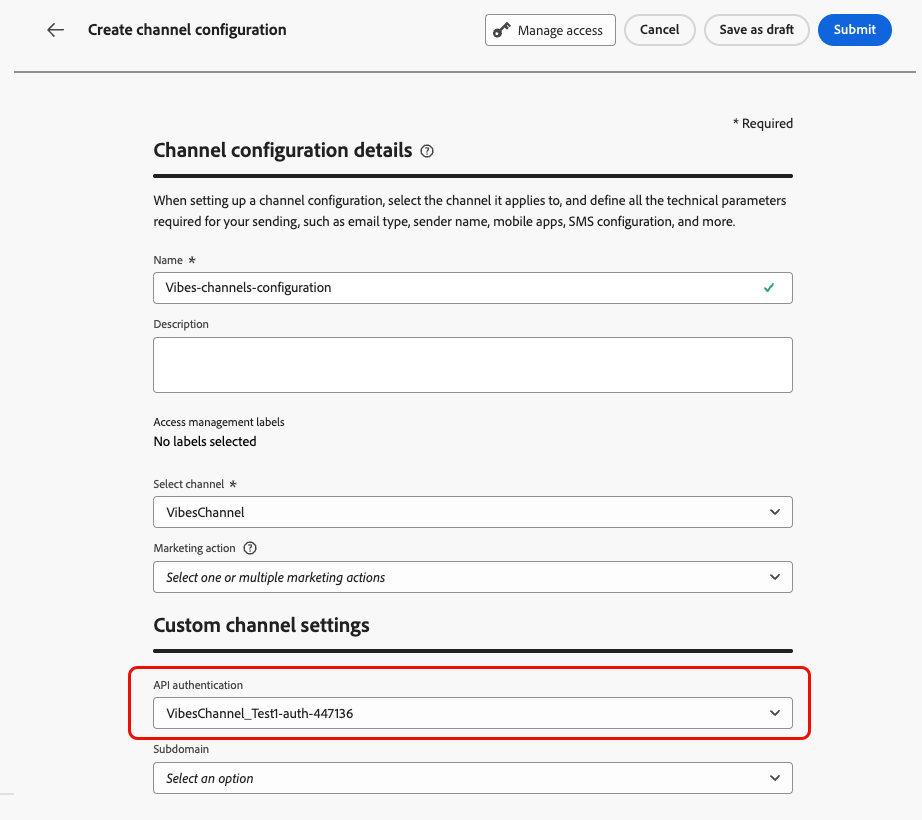
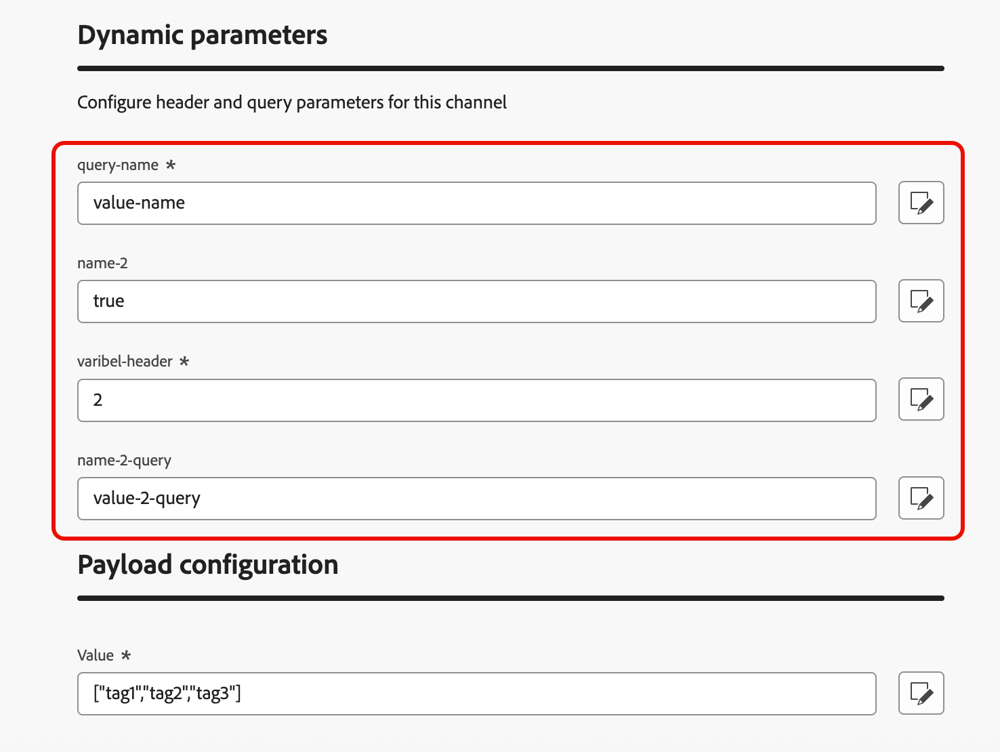

# 채널 구성 만들기 {#create-channel-config}

채널 구성은 마케터가 캠페인 및 여정을 작성할 때 선택하는 재사용 가능한 명명된 사전 설정에 사용자 지정 채널을 연결합니다.

사용자 지정 채널에 대한 채널 구성을 만들려면 아래 단계를 수행합니다.

1. **[!UICONTROL 관리]** > **[!UICONTROL 채널]** > **[!UICONTROL 채널 구성]**(으)로 이동한 다음 **[!UICONTROL 채널 구성 만들기]**&#x200B;를 클릭합니다. [채널 구성 만들기](../configuration/channel-surfaces.md)에 대해 자세히 알아보세요.

1. **[!UICONTROL 채널 선택]** 드롭다운 목록에서 활성화된 사용자 지정 채널 중 하나를 선택합니다.

   {width="100%"}

1. 선택한 채널이 인증을 사용하는 경우(유형이 **없음**&#x200B;이 아님) **[!UICONTROL API 자격 증명]** 필드가 나타납니다. 이 구성에 사용할 자격 증명을 선택합니다. [API 자격 증명에 대해 자세히 알아보기](custom-channel-api-credentials.md)

   {width="100%"}

1. [!DNL Journey Optimizer]에서 사용자 지정 채널에 대한 하위 도메인을 설정한 경우 이 구성에 대한 페이로드에 있는 링크를 추적하는 데 사용할 위임된 하위 도메인을 선택할 수 있습니다. [하위 도메인을 위임하는 방법 알아보기](custom-channel-subdomains.md)

1. 선택한 채널에 끝점 URL에 대해 [변수로 정의된 헤더 또는 쿼리 매개 변수가 ](create-custom-channel.md#endpoint-configuration)인 경우 **[!UICONTROL 동적 매개 변수]** 섹션이 나타납니다.

   각 매개 변수의 값을 입력합니다. 개인화 편집기를 사용하여 동적 값(예: 프로필에서 확인된 사용자 식별자)을 삽입할 수 있습니다. 이렇게 하면 프로필 데이터를 기반으로 각 수신자에 대한 요청을 사용자 지정할 수 있습니다.

   {width="100%"}

1. 사용자 지정 채널에 **[!UICONTROL 채널 구성]** 확인란이 활성화된 페이로드 필드가 있는 경우 해당 필드가 **[!UICONTROL 페이로드 구성]** 섹션에 표시됩니다. [자세히 알아보기](create-custom-channel.md#payload-configuration)

   {width="100%"}

   각 필드에 대한 값을 이 구성에 맞게 구성합니다. 발신자 정보나 메시지 템플릿과 같이 캠페인이나 여정 컨텍스트에 따라 달라질 수 있는 필드에 유용합니다.

1. 오케스트레이션된 캠페인의 경우 **[!UICONTROL 실행 세부 정보]** 섹션을 완료하여 프로필 차원을 매핑하고 실행 주소를 지정하십시오.

   {width="80%"}

1. 채널 구성을 저장하고 활성화하려면 **[!UICONTROL 제출]**&#x200B;을 클릭하십시오.

<!--
>[!CAUTION]
>
>If your organization uses approval policies, you may need to request approval before activating journeys or campaigns that use this channel configuration. [Learn more](../test-approve/gs-approval.md)
-->

## 다음 단계 {#next-steps}

이제 사용자 지정 채널이 완전히 구성되었습니다. 마케터는 이를 사용하여 고객 경험을 구축할 수 있습니다.

* [사용자 지정 채널 경험 만들기](create-custom-experience.md)
* [사용자 지정 채널 테스트](test-custom-channel.md)
* [사용자 지정 채널 모니터링](configure-custom-channel.md)
