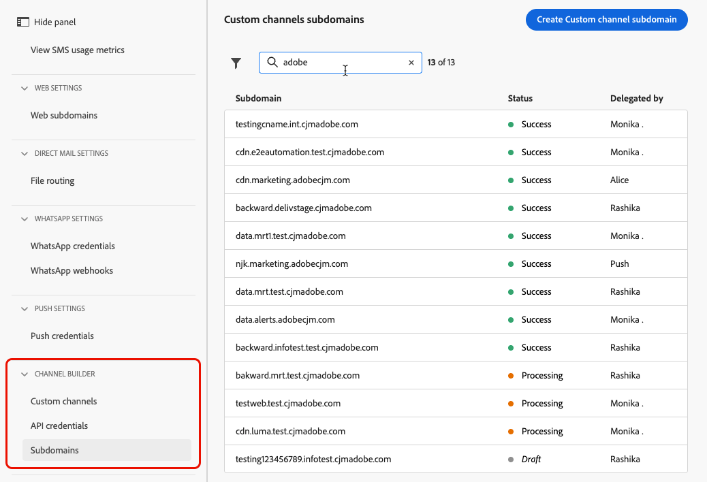

# 사용자 정의 채널 하위 도메인 구성 {#custom-channel-subdomains}

>[!BEGINSHADEBOX]

**이 페이지에서:** 기존 위임된 하위 도메인을 사용하거나 DNS 레코드로 새 하위 도메인을 구성하여 메시지에서 링크 추적을 사용하도록 Adobe Journey Optimizer에서 사용자 지정 채널 하위 도메인을 설정하는 방법을 알아봅니다.

>[!ENDSHADEBOX]

>[!CONTEXTUALHELP]
>id="ajo_admin_subdomain_custom_channel"
>title="사용자 정의 채널 하위 도메인 위임"
>abstract="사용자 정의 채널 메시지에 사용할 하위 도메인을 구성해야 합니다. 이는 사용자 정의 채널 구성을 만들기 위해 이 하위 도메인이 필요하기 때문입니다. Adobe에 이미 위임된 하위 도메인을 사용하거나 새 하위 도메인을 구성할 수 있습니다."
>additional-url="https://experienceleague.adobe.com/ko/docs/journey-optimizer/using/custom-channel/custom-channel-configuration" text="사용자 정의 채널 구성"

>[!CONTEXTUALHELP]
>id="ajo_admin_config_custom_channel_subdomain"
>title="사용자 정의 채널 하위 도메인 선택"
>abstract="사용자 정의 채널 구성을 만들려면 하위 도메인 이름 목록에서 선택할 사용자 정의 채널 하위 도메인을 이전에 하나 이상 구성했는지 확인합니다."
>additional-url="https://experienceleague.adobe.com/ko/docs/journey-optimizer/using/custom-channel/custom-channel-configuration" text="사용자 정의 채널 구성"

## 사용자 지정 채널 하위 도메인 시작 {#gs-custom-channel-subdomains}

사용자 지정 채널 메시지에서 링크 추적을 활성화하려면 [사용자 지정 채널 구성을 만들](custom-channel-configuration.md#subdomain-delegation) 때 선택할 하위 도메인을 설정해야 합니다.

이미 Adobe에 위임된 하위 도메인을 사용하거나 다른 하위 도메인을 구성할 수 있습니다. [이 섹션](../configuration/delegate-subdomain.md)에서 하위 도메인을 Adobe으로 위임하는 방법에 대해 자세히 알아보세요.

사용자 지정 채널 하위 도메인 구성은 모든 환경에서 공유됩니다. 따라서 사용자 지정 채널 하위 도메인을 수정하면 다른 프로덕션 샌드박스에도 영향을 줍니다.

<!--
TBC
>[!NOTE]
>
>To access and edit custom channel subdomains, you must have the **[!UICONTROL Manage Custom Channel Subdomains]** permission on the production sandbox. Learn more about permissions in [this section](../administration/high-low-permissions.md).
-->

## 기존 하위 도메인 사용 {#custom-channel-use-existing-subdomain}

이미 Adobe에 위임된 하위 도메인을 사용하려면 아래 단계를 따르십시오.

1. **[!UICONTROL 관리]** > **[!UICONTROL 채널]** 메뉴로 이동한 다음 **[!UICONTROL 채널 빌더]** > **[!UICONTROL 하위 도메인]**&#x200B;을 선택합니다.

   {width="100%"}

1. **[!UICONTROL 사용자 지정 채널 하위 도메인 만들기]**&#x200B;를 클릭합니다.

1. **[!UICONTROL 구성 유형]** 섹션에서 **[!UICONTROL 위임된 하위 도메인 사용]**&#x200B;을(를) 선택합니다.

   {width="90%"}

1. 사용자 지정 채널 URL에 표시할 접두어를 입력합니다. 영숫자와 하이픈만 사용할 수 있습니다.

   접두사는 이 사용자 지정 채널에 대한 고유한 하위 도메인을 만드는 데 사용됩니다. 예를 들어 `promo`을(를) 입력하고 하위 도메인 `luma.com`을(를) 선택하면 결과 하위 도메인은 `promo.luma.com`이(가) 됩니다.

   >[!CAUTION]
   >
   >`cdn` 또는 `data` 접두사는 내부용으로 예약되었으므로 사용하지 마십시오. `dmarc` 또는 `spf`과(와) 같은 기타 제한되거나 예약된 접두사도 사용하지 않아야 합니다.

1. 목록에서 위임된 하위 도메인을 선택합니다.

   이미 사용자 지정 채널 하위 도메인으로 사용되는 하위 도메인은 선택할 수 없습니다.

   >[!CAUTION]
   >
   >[CNAME 메서드](../configuration/delegate-subdomain.md#cname-subdomain-setup)를 사용하여 Adobe에 위임된 도메인을 선택하는 경우 호스팅 플랫폼에서 DNS 레코드를 만들어야 합니다. DNS 레코드를 생성하려면 새 사용자 지정 채널 하위 도메인을 구성할 때와 프로세스가 동일합니다. [이 섹션](#custom-channel-configure-new-subdomain)에서 방법을 알아보세요.

1. **[!UICONTROL 제출을 클릭합니다]**.

1. 제출되면 하위 도메인이 목록에 **[!UICONTROL 처리 중]** 상태로 표시됩니다. 하위 도메인 상태에 대한 자세한 내용은 [이 섹션](../configuration/delegate-subdomain.md#access-delegated-subdomains)을 참조하세요.

   해당 하위 도메인을 사용하여 메시지를 보내려면 먼저 Adobe에서 필요한 검사를 수행할 때까지 기다려야 합니다. 필요한 검사는 **최대 4시간**&#x200B;이 소요될 수 있습니다.

1. 확인이 성공하면 하위 도메인이 **[!UICONTROL 성공]** 상태를 가져옵니다. 사용자 지정 채널 구성을 만드는 데 사용할 준비가 되었습니다.

## 새 하위 도메인 구성 {#custom-channel-configure-new-subdomain}

>[!CONTEXTUALHELP]
>id="ajo_admin_custom_channel_subdomain_dns"
>title="일치하는 DNS 레코드 생성"
>abstract="새 사용자 정의 채널 하위 도메인을 구성하려면 Journey Optimizer 인터페이스에 표시된 Adobe 이름 서버 정보를 복사한 다음 도메인 호스팅 솔루션에 붙여넣어 일치하는 DNS 레코드를 생성해야 합니다. 확인이 완료되면 사용자 정의 채널 구성 만들기에 하위 도메인을 사용할 준비가 되었습니다."

새 하위 도메인을 구성하려면 아래 단계를 따르십시오.

1. **[!UICONTROL 관리]** > **[!UICONTROL 채널]** 메뉴로 이동한 다음 **[!UICONTROL 채널 빌더]** > **[!UICONTROL 하위 도메인]**&#x200B;을 선택합니다.

1. **[!UICONTROL 사용자 지정 채널 하위 도메인 만들기]**&#x200B;를 클릭합니다.

1. **[!UICONTROL 구성 유형]** 섹션에서 **[!UICONTROL 고유한 도메인 추가]**&#x200B;를 선택합니다.

   {width="70%"}

1. 위임할 하위 도메인을 지정합니다.

   >[!CAUTION]
   >
   >* 기존 사용자 지정 채널 하위 도메인은 사용할 수 없습니다.
   >
   >* 하위 도메인에서는 대문자가 허용되지 않습니다.

   잘못된 하위 도메인을 Adobe에 위임할 수 없습니다. marketing.yourcompany.com과 같이 조직에서 소유한 올바른 하위 도메인을 입력해야 합니다.

   (동일한 상위 도메인의) 다중 수준 하위 도메인이 지원됩니다. 예를 들어 &#39;custom.marketing.yourcompany.com&#39;을 사용할 수 있습니다.

1. DNS 서버에 배치할 레코드가 표시됩니다. 이 레코드를 복사하거나 CSV 파일을 다운로드한 다음 도메인 호스팅 솔루션으로 이동하여 일치하는 DNS 레코드를 생성합니다.

1. 도메인 호스팅 솔루션에 DNS 레코드가 생성되었는지 확인합니다. 모든 항목이 올바르게 구성된 경우 &quot;확인...&quot; 상자를 선택한 다음 **[!UICONTROL 제출]**&#x200B;을 클릭합니다.

   

   새 사용자 지정 채널 하위 도메인을 구성할 때 항상 CNAME 레코드를 가리킵니다.

1. 하위 도메인 위임이 제출되면 하위 도메인이 목록에 **[!UICONTROL 처리]** 상태로 표시됩니다. 하위 도메인 상태에 대한 자세한 내용은 [이 섹션](../configuration/delegate-subdomain.md#access-delegated-subdomains)을 참조하세요.

하위 도메인을 사용하여 사용자 지정 채널 메시지를 보내기 전에 Adobe에서 필요한 검사를 수행할 때까지 기다려야 하며 최대 4시간이 걸릴 수 있습니다. 확인이 성공하면 하위 도메인이 **[!UICONTROL 성공]** 상태를 가져옵니다. 사용자 지정 채널 구성을 만드는 데 사용할 준비가 되었습니다.

호스팅 솔루션에서 유효성 검사 레코드를 만들지 못하면 하위 도메인이 **[!UICONTROL 실패]**(으)로 표시됩니다.

<!--

Any specific guardrails to add? If so, can we link to email subdomain guardrails? journey-optimizer.en/help/using/configuration/delegate-subdomain.md#guardrails

Otherwise use the following from SMS subdomains?

## Guardrails {#guardrails}

Currently, the [!DNL Journey Optimizer] user interface does not support the deletion or undelegation of custom channel subdomains once they have been set up.

However, when testing features within [!DNL Journey Optimizer], it may be necessary to create a custom channel subdomain. Once the testing is complete, this can lead to cluttered environments with unnecessary configurations as the UI does not allow for removing or undelegating custom channel subdomains.

Here are some recommended steps and considerations:

* As a best practice, maintain a tidy environment by only creating necessary components and configurations.
* In situations where there is a business impact, contact your Adobe representative who may be able to assist with the removal/undelegation of the custom channel subdomain. [Learn more](#undelegate-subdomain)
* If further assistance is required, reach out to Adobe for guidance on managing your instance effectively.

## Undelegate a subdomain {#undelegate-subdomain}

If you wish to undelegate a custom channel subdomain, reach out to your Adobe representative with the subdomain you want to undelegate.

If the custom channel subdomain points to a CNAME record, you can delete the CNAME DNS record that you created for the custom channel subdomain from your hosting solution (but do not delete the original email subdomain if any).

>[!NOTE]
>
>A custom channel subdomain can point to a CNAME record because it was either an [existing subdomain](#custom-channel-use-existing-subdomain) delegated to Adobe using the [CNAME method](../configuration/delegate-subdomain.md#cname-subdomain-setup), or a [new custom channel subdomain](#custom-channel-configure-new-subdomain) that you configured.

After your request is handled by Adobe, the undelegated domain is no longer displayed on the subdomain inventory page.
-->

## 다음 단계 {#next-steps}

* [채널 구성을 만들어](custom-channel-configuration.md) 마케터가 캠페인 및 여정에서 선택할 하위 도메인, 자격 증명 및 페이로드 기본값으로 사용자 지정 채널을 연결합니다.
