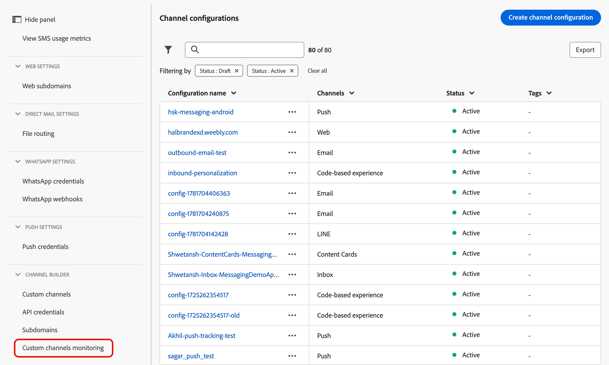

# 사용자 지정 채널 모니터링 {#monitor-custom-channel}

>[!BEGINSHADEBOX]

**이 페이지에서:** 성공적인 게재, 오류 및 링크 클릭과 같은 지표를 포함하여 Adobe Journey Optimizer의 기본 제공 보고를 통해 사용자 지정 채널의 라이프사이클을 관리하고 게재 성능을 모니터링하는 방법에 대해 알아봅니다.

>[!ENDSHADEBOX]

사용자 지정 채널을 만들고 활성화하면 [해당 라이프사이클을 관리](create-custom-channel.md#access-channel-builder)하고 [!DNL Journey Optimizer] 인터페이스를 통해 게재 성능을 모니터링할 수 있습니다.

## 캠페인 및 여정 보고서 활용 {#reporting}

[!DNL Journey Optimizer]에서 사용자 지정 채널에 대한 기본 보고를 제공합니다.

사용자 지정 채널 캠페인 보고서는 [이 섹션](../reports/campaign-global-report-cja-custom-channel.md)에 자세히 설명되어 있습니다.

<!--The Custom channel journey report is detailed in this section. TBC-->

다음 지표는 라이브(24시간) 및 글로벌(CJA) 보고서 모두에서 사용자 지정 채널에 사용할 수 있습니다.<!--TBC and add or replace with CJA link when available-->

| 지표 | 설명 |
|--------|-------------|
| **시도된 게재** | 외부 엔드포인트로 보낸 총 메시지 수입니다. |
| **성공한 게재** | 끝점이 HTTP 2xx 응답을 반환하는 메시지. |
| **타겟팅된 프로필** | 고유 프로필 수에 도달했습니다. |
| **클릭 수** | 페이로드에서 추적된 링크 클릭 수입니다. 사용자 지정 채널에 대해 위임된 하위 도메인이 필요합니다. |
| **오류/실패** | 오류 이유별 분류와 함께 실패한 게재 시도 횟수. |

[실시간 보고서](../reports/live-report.md) 및 [글로벌 보고서](../reports/report-gs-cja.md)에 대해 자세히 알아보세요. 보고 기능에 대한 자세한 내용은 [이 설명서](../reports/report-cja-manage.md)를 참조하세요.

<!--
### Journey reports {#journey-reports}

To view delivery data for a custom channel action in a journey:

1. Open the journey from the **[!UICONTROL Journeys]** list.
1. Click **[!UICONTROL View report]** in the top-right area.
   * **[!UICONTROL Live report]** – Data for the last 24 hours.
   * **[!UICONTROL All time]** – Full lifetime data via Customer Journey Analytics (CJA).

### Campaign reports {#campaign-reports}

To view delivery data for a custom channel campaign:

1. Open the campaign from the **[!UICONTROL Campaigns]** list.
1. Click **[!UICONTROL Reports]** in the top-right area.

The campaign report includes execution count, successful deliveries, errors, and click data (if link tracking is enabled).
-->

## 게재 성능 모니터링 {#monitoring}

[!DNL Journey Optimizer]은(는) 캠페인 및 여정 보고서 외에도 전용 사용자 지정 채널 모니터링 대시보드를 제공합니다. **[!UICONTROL 관리]** > **[!UICONTROL 채널]** > **[!UICONTROL 채널 빌더]** > **[!UICONTROL 사용자 지정 채널 모니터링]**&#x200B;에서 액세스합니다.

{width="100%"}

이 대시보드를 사용하면 사용자 지정 채널 메시지를 전달할 때 외부 끝점에 대해 수행하는 [!DNL Journey Optimizer] API 호출의 안정성과 성능을 모니터링할 수 있습니다. 이를 사용하여 통합 문제, 지연 및 제한 제한을 신속하게 파악할 수 있습니다.

**[!UICONTROL 사용자 지정 채널 모니터링]** 대시보드는 [!DNL Journey Optimizer]의 다른 모든 시간 보고서와 같이 작동합니다. 시간 범위를 선택하고, 채널 또는 끝점으로 필터링하고, 드릴다운하여 각 사용자 지정 채널에 의존하는 캠페인 및 여정을 볼 수 있습니다. [자세히 알아보기](../reports/report-cja-manage.md)

### 사용자 지정 채널 지표 {#monitoring-kpis}

**[!UICONTROL 사용자 지정 채널 지표]** 섹션은 사용자 지정 채널 호출의 작동 상태 및 안정성에 대한 통합된 보기를 제공합니다.

{width="100%"}

+++ 사용자 지정 채널 지표에 대해 자세히 알아보기

* **[!UICONTROL 성공한 호출]**: 오류 없이 유효한 응답을 반환하는 총 HTTP 호출 수입니다.

* **[!UICONTROL 4xx/5xx 오류]**: 클라이언트측(4xx) 또는 서버측(5xx) 오류로 인해 실패한 호출 수로, 구성 문제 또는 끝점 오류가 강조 표시됩니다.

* **[!UICONTROL 시간 초과 호출]**: 최대 응답 시간을 초과하여 실패한 호출 수입니다. 이렇게 하면 외부 끝점과 관련하여 지연 또는 성능 문제를 표면화하는 데 도움이 됩니다.

* **[!UICONTROL 호출 전 오류]**: HTTP 호출이 외부 끝점에 수행되기 전에 실패한 사용자 지정 채널 전송 수입니다. 이러한 오류는 외부 시스템이 아닌 [!DNL Journey Optimizer]의 자체 인프라 계층에서 발생합니다. 세 가지 범주가 있습니다.

  | 카테고리 | 설명 |
  |----------|-------------|
  | **인증 실패**(`AUTH_*`) | [!DNL Journey Optimizer]에서 끝점을 호출하는 데 필요한 OAuth 토큰 또는 자격 증명을 가져오거나 새로 고칠 수 없습니다. 채널 구성에 연결된 API 자격 증명이 유효하고 만료되지 않았는지 확인하십시오. |
  | **요청 생성 오류**(`REQUEST_GENERATION_ERROR`) | [!DNL Journey Optimizer]에서 올바른 HTTP 요청을 만들 수 없습니다. 예를 들어 URL 템플릿을 확인할 수 없거나 필수 개인화 필드가 누락되었기 때문입니다. |
  | **HTTP 구문 분석 오류**(`HTTP_PARSE_ERROR`) | [!DNL Journey Optimizer]이(가) 끝점에서 응답을 받았지만 이 응답을 사용 가능한 구조로 구문 분석할 수 없습니다. |

  >[!TIP]
  >
  >사전 호출 실패는 외부 끝점의 문제가 아니라 [!DNL Journey Optimizer]측 또는 채널 구성에 문제가 있음을 나타냅니다. API 자격 증명과 필수 페이로드 필드를 검토하여 문제 해결을 시작합니다.

* **[!UICONTROL 평균 대기 시간]**: 성공한 호출, 오류 및 시간 제한을 포함하여 모든 HTTP 호출에 대한 평균 종단 간 응답 시간(밀리초)입니다.

<!--
* **[!UICONTROL Capped calls]**: Number of calls that were blocked due to capping limits, ensuring downstream systems are not overloaded.

* **[!UICONTROL Average RPS]**: Number of requests per second processed by the custom channel over the selected time range.

* **[!UICONTROL Average successful latency]**: Average end-to-end response time (in milliseconds) for successful calls only, excluding failed requests and timeouts.

* **[!UICONTROL Average queue time]**: Average time (in milliseconds) calls spent waiting in the execution queue before being sent. This only applies to throttled endpoints, where [!DNL Journey Optimizer] queues calls when the throughput limit is reached.
-->

+++

### 시간 경과에 따른 사용자 정의 채널 결과 {#outcomes-overtime}

{width="100%"}

**[!UICONTROL 시간 경과에 따른 사용자 지정 채널 결과]** 그래프는 선택한 기간 동안의 HTTP 호출 KPI 트렌드를 보여 줍니다. 시계열의 세부기간은 선택한 시간 범위에 따라 다릅니다.

* 7일 보고서의 경우, 각 데이터 포인트는 1일에 대한 KPI를 보여줍니다.
* 1일 시간 범위의 경우 그래프는 시간당 KPI를 보여 줍니다.
* 1시간 시간 범위의 경우 그래프는 분당 KPI를 보여 줍니다.

### 시간 경과에 따른 지연 {#latency-overtime}

{width="100%"}

**[!UICONTROL 시간 경과에 따른 지연]** 그래프는 선택한 기간 동안의 지연 지표 트렌드를 시각화합니다. 이 시계열 보기를 통해 성능 패턴을 추적하고 최대 지연 기간을 식별하며 시간에 따른 최적화 또는 시스템 변경의 영향을 모니터링할 수 있습니다.

### 사용자 정의 채널 결과 분류 {#outcome-breakdown}

{width="100%"}

**[!UICONTROL 사용자 지정 채널 결과 분석]** 테이블은 최상위 수준의 끝점당 전체 지표부터 해당 끝점을 사용하는 사용자 지정 채널당 지표까지, 최하위 수준의 캠페인 및 여정에 이르기까지 HTTP 호출 지표에 대한 계층적 분석을 제공합니다.

### 지연 분류 {#latency-breakdown}

**[!UICONTROL 지연 분석]** 테이블은 사용자 지정 채널 전체에 걸쳐 지연 지표에 대한 자세한 분석을 제공합니다. 이 보기를 통해 성능 문제가 발생하는 특정 엔드포인트 또는 채널을 파악하여 지연 병목 현상을 효과적으로 찾아내고 해결할 수 있습니다.

### Insight 빌더 {#insight-builder}

**[!UICONTROL Insight 빌더]**&#x200B;를 사용하여 사용자 지정 채널 지표를 기반으로 사용자 지정 시각화 및 대시보드를 만드십시오. 이 도구를 사용하면 여러 KPI를 결합하고 필터를 적용하고 모니터링 및 보고 요구 사항에 맞는 맞춤형 보기를 만들 수 있습니다. [자세히 알아보기](../reports/report-cja-manage.md#insight-builder)

## 문제 해결 {#troubleshooting}

사용자 지정 채널에 문제가 발생하는 경우 다음 표에는 일반적인 증상, 가능한 원인 및 권장 해결 방법이 나와 있습니다.

| 증상 | 가능한 원인 | 해결 방법 |
|---------|----------------|------------|
| **HTTP 401/403 오류** | 인증 실패 — 자격 증명이 만료되었거나 잘못되었습니다. | **[!UICONTROL 관리]** > **[!UICONTROL 채널]** > **[!UICONTROL API 자격 증명]**&#x200B;에서 자격 증명을 업데이트합니다. |
| **HTTP 429 오류** | 외부 끝점은 [!DNL Journey Optimizer]의 요청을 제한합니다. | 엔드포인트의 속도 제한을 검토합니다. 채널 빌더 정책 구성에서 제한 설정을 줄입니다. |
| **HTTP 5xx 오류** | 외부 시스템이 다운되었거나 서버 오류가 반환되었습니다. | 외부 시스템의 상태 대시보드를 확인합니다. 일시적인 오류를 정상적으로 처리하도록 여정 작업 활동에서 오류 경로를 구성합니다. |
| **확인되지 않은 개인화 토큰** | 표현식이 프로필에 없는 속성을 참조합니다. | XDM 속성 경로가 올바른지 확인합니다. 기본 값 대체 항목 `{{profile.person.name.firstName \| default("Valued Customer")}}`을(를) 추가합니다. |
| **필수 필드 유효성 검사 오류** | 작성 시 필수 페이로드 필드에 값이 없습니다. | 콘텐츠 편집기에서 모든 필수 필드가 채워졌는지 확인합니다. 또는 필드가 진정으로 선택 사항인 경우 채널 빌더에서 필수 제약 조건을 제거합니다. |

<!--
## Related resources {#related}

* [Get started with custom channels](get-started-custom-channel.md)
* [Configure a custom channel](custom-channel-configuration.md)
* [Global report overview](../reports/report-gs-cja.md)
* [Journey live report](../reports/live-report.md
-->