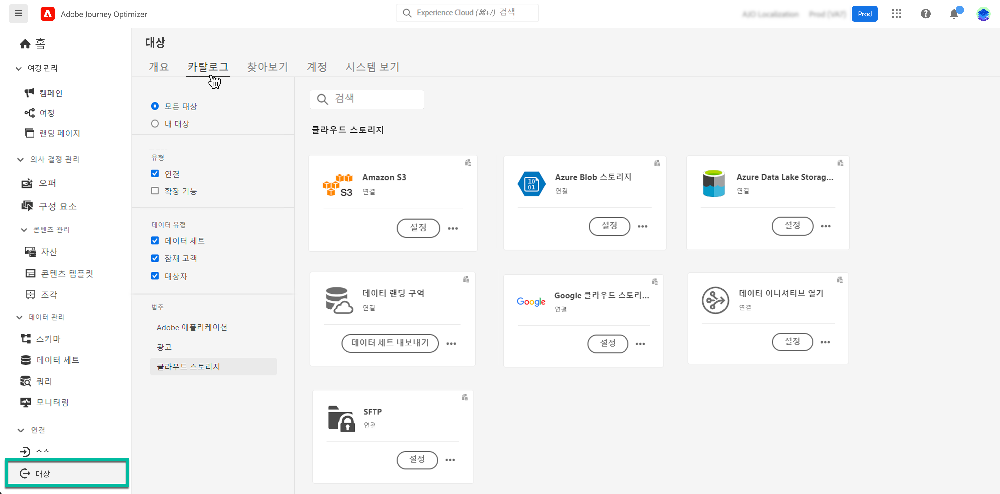

# 데이터 세트를 클라우드 스토리지 위치로 내보내기 {#export-datasets}

>[!AVAILABILITY]
>
>데이터 세트 내보내기 기능은 현재 베타 버전이며 모든 Adobe Journey Optimizer 사용자가 사용할 수 있습니다. 아직 액세스 권한이 없는 경우 Adobe 담당자에게 대상 액세스 권한 부여를 요청하십시오.

Journey Optimizer을 사용하면 데이터 세트의 콘텐츠를 내보내기 위해 클라우드 스토리지 위치와 라이브 연결을 설정할 수 있습니다.

정기적으로 데이터를 내보내면 고객 상호 작용에 대한 완전한 최신 기록을 확보하고, 보고 또는 분석 목적으로 이 정보를 사용하며, 법적 요구 사항을 준수하도록 할 수 있습니다.

## 사용 가능한 클라우드 스토리지 대상 {#destinations}

에서 액세스할 수 있는 6개의 클라우드 스토리지 대상으로 데이터 세트를 내보낼 수 있습니다. **[!UICONTROL 대상]** 메뉴, **[!UICONTROL 카탈로그]** 탭.

>[!AVAILABILITY]
>
>이러한 대상은 모두 Beta에서 사용할 수 있으며 변경될 수 있습니다.

각 대상에 대한 자세한 내용은 Adobe Experience Platform 설명서에서 확인할 수 있습니다.

* [Amazon S3](https://experienceleague.adobe.com/docs/experience-platform/destinations/catalog/cloud-storage/amazon-s3.html)
* [Azure Blob](https://experienceleague.adobe.com/docs/experience-platform/destinations/catalog/cloud-storage/azure-blob.html)
* [Azure Data Lake Gen 2](https://experienceleague.adobe.com/docs/experience-platform/destinations/catalog/cloud-storage/adls-gen2.html)
* [데이터 랜딩 영역](https://experienceleague.adobe.com/docs/experience-platform/destinations/catalog/cloud-storage/data-landing-zone.html)
* [Google 클라우드 스토리지](https://experienceleague.adobe.com/docs/experience-platform/destinations/catalog/cloud-storage/google-cloud-storage.html)
* [SFTP](https://experienceleague.adobe.com/docs/experience-platform/destinations/catalog/cloud-storage/sftp.html)

## 사전 요구 사항 {#prerequisites}

데이터 세트 내보내기를 시작하기 전에 다음 사전 요구 사항을 확인하십시오.

* 데이터 세트를 내보내려면 **대상 관리**, **대상 보기**, **대상 활성화**, 및 **데이터 세트 대상 관리 및 활성화** [액세스 제어 권한](https://experienceleague.adobe.com/docs/experience-platform/access-control/home.html#permissions). 읽기 [액세스 제어 개요](https://experienceleague.adobe.com/docs/experience-platform/access-control/ui/overview.html) 필요한 권한을 얻으려면 제품 관리자에게 문의하십시오.

* 내보내려는 데이터 세트에 2세대 데이터가 없는지 확인합니다. 이 기능은 1세대 데이터(즉, 에서 정의한 원시 데이터)만 내보내도록 지원합니다. [Real-time Customer Data Platform 제품 설명](https://helpx.adobe.com/legal/product-descriptions/real-time-customer-data-platform-b2c-edition-prime-and-ultimate-packages.html). 1세대 데이터에는 Adobe Experience Platform 소스를 통해 가져온 데이터 세트 또는 Analytics Data Connector 및 Journey Optimizer 로그/보고서 데이터 세트와 같은 Adobe 솔루션을 사용하여 수집된 데이터 세트가 포함됩니다.

## 데이터 세트를 내보내는 주요 단계 {#main-steps}

데이터 세트를 클라우드 스토리지 위치로 내보내는 주요 단계는 다음과 같습니다.

각 단계에 대한 자세한 내용은 Adobe Experience Platform 설명서에서 확인할 수 있습니다. [클라우드 스토리지 대상으로 데이터 세트 내보내기](https://experienceleague.adobe.com/docs/experience-platform/destinations/ui/activate/export-datasets.html).

1. **클라우드 스토리지 대상 설정**. 아직 연결하지 않은 경우 대상 카탈로그에서 클라우드 스토리지 대상에 연결합니다. [새 대상 연결을 만드는 방법 알아보기](https://experienceleague.adobe.com/docs/experience-platform/destinations/ui/connect-destination.html#setup)

   <!---->

1. **클라우드 스토리지 대상 선택** 데이터 세트를 내보낼 위치입니다. 대상 카탈로그에서 **[!UICONTROL 데이터 세트 내보내기]** 원하는 카드를 누르고 사용할 연결을 선택합니다.

   <!---->

   >[!NOTE]
   >
   >실시간 고객 프로필과 함께 Adobe Journey Optimizer을 사용하는 경우 대상 카드에 &quot;활성화&quot; 버튼이 표시되어 활성화된 권한에 따라 데이터 세트를 내보내고 이 대상에 대한 대상을 활성화할 수 있습니다.

1. **데이터 세트 선택** 을(를) 선택한 대상으로 내보냅니다.

   <!---->

1. **내보내기 예약** 데이터 세트. 내보내기를 시작해야 하는 시기와 실행 빈도를 지정합니다.

   <!---->

1. **내보내기 검토 및 확인** 구성 끝에 표시되는 요약을 확인합니다.

   <!---->

내보내기가 완료되면 데이터 세트의 콘텐츠가 사용자가 구성한 일정에 따라 클라우드 저장소 위치에 저장됩니다. [성공적인 데이터 세트 내보내기를 확인하는 방법 알아보기](https://experienceleague.adobe.com/docs/experience-platform/destinations/ui/activate/export-datasets.html#verify)
