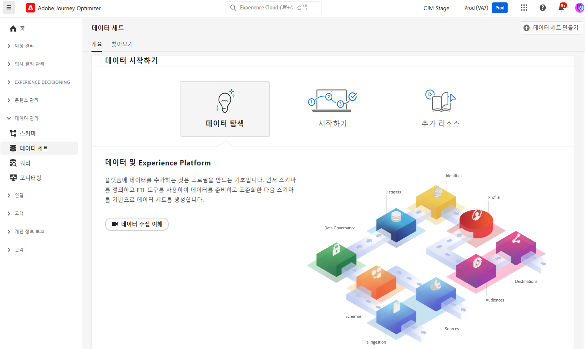

# 데이트 세트 시작 {#datasets-gs}

Adobe Experience Platform에 수집되는 모든 데이터는 데이터 세트로 Data Lake 내에 보관됩니다. 데이터 세트는 스키마(열) 및 필드(행)를 포함하는 데이터 수집을 위한 저장소 및 관리 구조입니다. 

## 데이터 세트 액세스{#access-datasets}

[!DNL Adobe Journey Optimizer] 사용자 인터페이스의 **데이터 세트** 작업 영역에서 데이터를 탐색하고 데이터 세트를 만들 수 있습니다.

왼쪽 탐색 인터페이스에서 **데이터 세트**&#x200B;를 선택하여 [데이터 세트] 대시보드를 엽니다.

[!DNL Adobe Experience Platform]에 데이터를 추가하는 것은 [프로필] 작성의 기초입니다. 그 다음에는 [!DNL Adobe Journey Optimizer]에서 프로필을 활용할 수 있습니다. 먼저 스키마를 정의하고 ETL 도구를 사용하여 데이터를 준비하고 표준화한 다음 스키마를 기반으로 데이터 세트를 만듭니다.

**찾아보기** 탭을 선택하여 조직에서 사용할 수 있는 데이터 세트 전체의 목록을 표시합니다. 목록에 있는 각 데이터 세트에 대해 이름, 데이터 세트가 준수하는 스키마, 최근 수집 실행 상태 등 세부 정보가 표시됩니다.

기본적으로는 수집한 데이터 세트만 표시됩니다. 시스템에서 생성한 데이터 세트를 보려면 필터에서 **시스템 데이터 세트 표시** 토글을 켭니다.

데이터 세트의 이름을 선택하여 [데이터 세트] 활동 화면에 액세스하고 선택한 데이터 세트의 세부 정보를 확인합니다. 활동 탭에는 메시지 사용률을 시각화한 그래프와 성공/실패한 일괄 처리 집합 목록이 있습니다.

아래에 Adobe Journey Optimizer의 시스템 데이터 세트 목록이 있습니다.

>[!CAUTION]
>
> 시스템 데이터 세트를 **수정해서는 안 됩니다**. 변경 사항이 있는 경우 제품을 업데이트할 때마다 자동으로 되돌려집니다.
>

**보고**

* _보고 - 메시지 피드백 이벤트 데이터 세트_: 메시지 게재 로그. Journey Optimizer의 모든 메시지 게재에 대한 정보입니다. 보고하고 대상자를 만드는 데 사용합니다. 바운스에 대한 이메일 ISP의 피드백도 이 데이터 세트에 기록됩니다.
* _보고 - 이메일 추적 경험 이벤트 데이터 세트_: 이메일 채널의 상호 작용 로그입니다. 보고하고 대상자를 만드는 데 사용합니다. 저장된 정보를 통해 최종 사용자가 이메일에 대해 수행한 작업(열기, 클릭 등)을 확인할 수 있습니다.
* _보고 - 푸시 추적 경험 이벤트 데이터 세트_: 푸시 채널의 상호 작용 로그입니다. 보고하고 대상자를 만드는 데 사용합니다. 저장된 정보를 통해 최종 사용자가 푸시 알림에 대해 수행한 작업을 확인할 수 있습니다.
* _보고 - 여정 단계 이벤트_: Journey Optimizer에서 생성한 [모든 여정 단계 경험 이벤트]를 캡처합니다. [보고] 등 서비스에서 사용합니다. Customer Journey Analytics에서 전년 대비 분석 보고서를 작성하는 데에도 중요합니다. [여정 메타데이터]에 연결되어 있습니다.
* _보고 - 여정_: 여정의 각 단계에 대한 정보가 있는 메타데이터 데이터 세트입니다.
* _보고 - BCC_: 숨은 참조 이메일에 대한 게재 로그를 저장하는 [피드백 이벤트 데이터 세트]입니다. 보고 목적으로 사용합니다.

**동의**

* _동의 서비스 데이터 세트_: 프로필의 동의 정보를 저장합니다.

**Intelligent Services**

* _보내는 시간 최적화 점수/참여 점수_: [고객 여정 AI]의 결과 점수입니다.

각 스키마의 전체 필드와 속성 목록을 보려면 [Journey Optimizer 스키마 사전](https://experienceleague.adobe.com/tools/ajo-schemas/schema-dictionary.html?lang=ko){target="_blank"}을 찾아봅니다.

## 데이터 세트 미리 보기{#preview-datasets}

[데이터 세트] 활동 화면의 오른쪽 위 모서리에 있는 **데이터 세트 미리 보기**&#x200B;를 선택하여 이 데이터 세트의 최근 성공적인 일괄 처리 집합을 미리 봅니다. 데이터 세트가 비어 있으면 미리 보기 링크가 비활성화됩니다.

## 데이터 세트 만들기{#create-datasets}

새 데이터 세트를 만들려면 먼저 [데이터 세트] 대시보드의 **데이터 세트 만들기**&#x200B;를 선택합니다.

다음을 수행할 수 있습니다.

* 스키마에서 데이터 세트 만들기. [이 문서에서 자세히 알아보기](https://experienceleague.adobe.com/docs/experience-platform/catalog/datasets/user-guide.html?lang=ko#schema){target="_blank"}
* CSV 파일에서 데이터 세트를 만듭니다. [이 문서에서 자세히 알아보기](https://experienceleague.adobe.com/docs/experience-platform/ingestion/tutorials/map-a-csv-file.html?lang=ko-KR){target="_blank"}

이 비디오에서는 데이터 세트를 만들고 이를 스키마에 매핑하며, 세트에 데이터를 추가하고 데이터가 수집되었는지 확인하는 방법을 알아봅니다.

>[!VIDEO](https://video.tv.adobe.com/v/334293?quality=12)

## 데이터 거버넌스

데이터 세트의 **데이터 거버넌스** 탭을 찾아보며 데이터 세트와 필드 수준에서 레이블을 확인합니다. [데이터 거버넌스]는 적용되는 정책 유형에 따라 데이터를 분류합니다.

[!DNL Adobe Experience Platform]의 핵심 기능 중 하나는 여러 엔터프라이즈 시스템의 데이터를 모아 마케터가 고객을 확인하고 파악하며 참여도를 높이는 작업을 돕는 것입니다. 이 데이터에는 조직 규정이나 법적 규정에 따른 사용 제한이 적용될 수 있습니다. 따라서 데이터 작업 시에는 데이터 사용 정책을 준수해야 합니다.

[!DNL Adobe Experience Platform Data Governance]로 고객 데이터를 관리하고 데이터 사용에 적용되는 규정과 제한, 정책을 준수할 수 있습니다. 이 기능은 Experience Platform 내 카탈로그 작성, 데이터 계통 확인, 데이터 사용 라벨링, 데이터 사용 정책, 마케팅 작업을 위한 데이터 사용 제어 등 다양한 수준에서 주요 역할을 합니다.

[데이터 거버넌스]와 데이터 사용 레이블에 대한 자세한 내용은 [데이터 거버넌스 설명서](https://experienceleague.adobe.com/docs/experience-platform/data-governance/labels/user-guide.html?lang=ko){target="_blank"}를 참조하십시오.

## 샘플 및 사용 사례{#uc-datasets}

[이 자세한 샘플](../audience/creating-test-profiles.md)에서는 Adobe Journey Optimizer에서 스키마와 데이터 세트를 만들고 데이터를 수집하여 [테스트 프로필]을 추가하는 방법을 알아봅니다.

데이터 세트 만들기에 대한 자세한 정보는 [Adobe Experience Platform 설명서](https://experienceleague.adobe.com/docs/experience-platform/catalog/datasets/overview.html?lang=ko){target="_blank"}를 참조하십시오.

[데이터 세트] UI를 사용하는 방법은 [데이터 수집 개요 설명서](https://experienceleague.adobe.com/docs/experience-platform/ingestion/home.html?lang=ko){target="_blank"}를 참조하십시오.

사용 사례 목록과 쿼리 예제는 [여기](../data/datasets-query-examples.md)에서 확인할 수 있습니다.

**참조**

* [스트리밍 수집 개요](https://experienceleague.adobe.com/docs/experience-platform/ingestion/streaming/overview.html?lang=ko){target="_blank"}
* [데이터를 Adobe Experience Platform으로 수집](https://experienceleague.adobe.com/docs/experience-platform/ingestion/tutorials/ingest-batch-data.html?lang=ko){target="_blank"}
