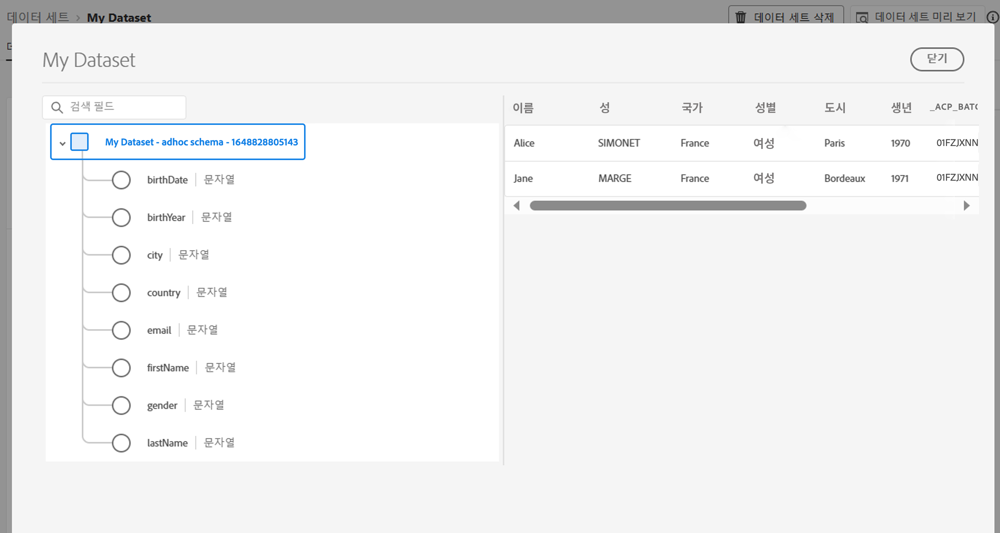

# 데이터 세트 시작 {#datasets-gs}

Adobe Experience Platform에 수집된 모든 데이터는 데이터 세트로 데이터 레이크 내에서 유지됩니다. 데이터 세트는 스키마(열) 및 필드(행)를 포함하는 데이터 수집을 위한 저장소 및 관리 구조입니다. 

## 데이터 세트 액세스{#access-datasets}

다음 **데이터 세트** 작업 공간 [!DNL Adobe Journey Optimizer] 사용자 인터페이스를 통해 데이터를 탐색하고 데이터 세트를 만들 수 있습니다.

선택 **데이터 세트** 왼쪽 탐색에서 데이터 세트 대시보드를 엽니다.

에 데이터 추가 [!DNL Adobe Experience Platform] 는 프로필을 빌드하는 기반입니다. 그러면 에서 프로필을 활용할 수 있습니다 [!DNL Adobe Journey Optimizer]. 먼저 스키마를 정의하고 ETL 도구를 사용하여 데이터를 준비하고 표준화한 다음 스키마를 기반으로 데이터 세트를 만듭니다.

을(를) 선택합니다 **찾아보기** 탭을 클릭하여 조직에서 사용 가능한 모든 데이터 세트 목록을 표시합니다. 세부 사항은 해당 이름, 데이터 세트가 준수하는 스키마 및 가장 최근 수집 실행 상태를 포함하여 나열된 각 데이터 세트에 대해 표시됩니다.

기본적으로 수집된 데이터 세트만 표시됩니다. 시스템에서 생성한 데이터 세트를 보려면 **시스템 데이터 세트 표시** 필터에서 전환합니다.

데이터 세트 이름을 선택하여 해당 데이터 세트 활동 화면에 액세스하고 선택한 데이터 세트에 대한 세부 사항을 확인합니다. 활동 탭에는 사용 중인 메시지 수와 성공 및 실패한 일괄 처리 목록을 시각화하는 그래프가 포함되어 있습니다.

사용할 수 있는 데이터 세트는 다음과 같습니다.

**보고**

* _보고 - 메시지 피드백 이벤트 데이터 세트_: 메시지 게재 로그. 보고 및 세그먼트 생성을 위한 Journey Optimizer의 모든 메시지 게재에 대한 정보입니다. 바운스에 대한 이메일 ISP의 피드백도 이 데이터 세트에 기록됩니다.
* _보고 - 이메일 추적 경험 이벤트 데이터 세트_: 보고 및 세그먼트 만들기에 사용되는 이메일 채널에 대한 상호 작용 로그입니다. 저장된 정보는 전자 메일(열기, 클릭 등)에서 최종 사용자가 수행한 작업에 대해 알려줍니다.
* _보고 - 푸시 추적 경험 이벤트 데이터 세트_: 보고 및 세그먼트 생성 용도로 사용되는 푸시 채널에 대한 상호 작용 로그입니다. 저장된 정보는 최종 사용자가 푸시 알림에 대해 수행하는 작업에 대해 알려줍니다.
* _보고 - 여정 단계 이벤트_: Reporting과 같은 서비스에서 사용할 Journey Optimizer에서 생성된 모든 여정 단계 경험 이벤트를 캡처합니다. YoY 분석을 위한 Customer Journey Analytics에서 보고서를 작성하는 데에도 중요합니다. 여정 메타데이터에 연결되어 있습니다.
* _보고 - 여정_: 여정에서 각 단계의 정보를 포함하는 메타데이터 데이터 집합입니다.
* _보고 - BCC_: 숨은 참조 이메일에 대한 게재 로그를 저장하는 피드백 이벤트 데이터 세트입니다. 보고 목적으로 사용됩니다.

**동의**

* _동의 서비스 데이터 세트_: 프로필의 동의 정보를 저장합니다.

**Intelligent Services**

* _전송 시간 최적화 점수/참여 점수_: 여정 AI의 출력 점수입니다.

각 스키마에 대한 전체 필드 및 속성 목록을 보려면 [Journey Optimizer 스키마 사전](https://experienceleague.adobe.com/tools/ajo-schemas/schema-dictionary.html?lang=ko){target="_blank"}.

## 데이터 세트 미리 보기{#preview-datasets}

데이터 집합 활동 화면에서 을 선택합니다 **데이터 세트 미리 보기** 화면 오른쪽 상단 근처에 있는 를 클릭하여 이 데이터 세트에 있는 가장 최근 성공적인 일괄 처리를 미리 봅니다. 데이터 세트가 비어 있으면 미리 보기 링크가 비활성화됩니다.

## 데이터 세트 만들기{#create-datasets}

새 데이터 세트를 만들려면 먼저 **데이터 집합 만들기** 데이터 세트 대시보드에서 을 참조하십시오.

다음을 수행할 수 있습니다.

* 스키마에서 데이터 세트 만들기. [이 문서에서 자세히 알아보기](https://experienceleague.adobe.com/docs/experience-platform/catalog/datasets/user-guide.html?lang=en#schema){target="_blank"}
* CSV 파일에서 데이터 세트를 만듭니다. [이 문서에서 자세히 알아보기](https://experienceleague.adobe.com/docs/experience-platform/ingestion/tutorials/map-a-csv-file.html?lang=ko-KR){target="_blank"}

이 비디오에서 데이터 세트를 만들고 스키마에 매핑하고 데이터를 추가하고 데이터가 수집되었는지 확인하는 방법을 알아봅니다.

>[!VIDEO](https://video.tv.adobe.com/v/334293?quality=12)

## 데이터 거버넌스

데이터 세트에서 **데이터 거버넌스** 탭하여 데이터 세트 및 필드 수준에서 레이블을 확인합니다. 데이터 거버넌스는 적용되는 정책 유형에 따라 데이터를 분류합니다.

의 핵심 기능 중 하나 [!DNL Adobe Experience Platform] 는 여러 엔터프라이즈 시스템의 데이터를 함께 가져와서 마케터가 고객을 식별, 이해 및 참여시킬 수 있도록 하는 것입니다. 이 데이터는 조직 또는 법적 규정에 의해 정의된 사용 제한을 받을 수 있습니다. 따라서 데이터 작업이 데이터 사용 정책을 준수하도록 해야 합니다.

[!DNL Adobe Experience Platform Data Governance] 고객 데이터를 관리하고 데이터 사용에 적용되는 규정, 제한 및 정책을 준수할 수 있습니다. 이 디자이너는 카탈로그 작성, 데이터 계보, 데이터 사용 레이블 지정, 데이터 사용 정책, 마케팅 작업을 위한 데이터 사용 제어 등 다양한 수준에서 Experience Platform 내에서 주요 역할을 합니다.

의 데이터 거버넌스 및 데이터 사용 레이블에 대해 자세히 알아보십시오 [데이터 거버넌스 설명서](https://experienceleague.adobe.com/docs/experience-platform/data-governance/labels/user-guide.html){target="_blank"}

## 샘플 및 사용 사례{#uc-datasets}

에서 Adobe Journey Optimizer에서 스키마, 데이터 세트 및 데이터를 수집하여 테스트 프로필을 추가하는 방법을 알아봅니다 [이 종단 간 샘플](../segment/creating-test-profiles.md)

에서 데이터 집합 만들기에 대해 자세히 알아보십시오 [Adobe Experience Platform 설명서](https://experienceleague.adobe.com/docs/experience-platform/catalog/datasets/overview.html?lang=ko){target="_blank"}.

에서 데이터 세트 UI를 사용하는 방법을 알아봅니다 [데이터 수집 개요 설명서](https://experienceleague.adobe.com/docs/experience-platform/ingestion/home.html?lang=ko){target="_blank"}.

쿼리 예가 포함된 사용 사례 목록을 사용할 수 있습니다 [여기](../data/datasets-query-examples.md).

**참조 -**

* [스트리밍 수집 개요](https://experienceleague.adobe.com/docs/experience-platform/ingestion/streaming/overview.html?lang=ko){target="_blank"}
* [Adobe Experience Platform에 데이터 수집](https://experienceleague.adobe.com/docs/experience-platform/ingestion/tutorials/ingest-batch-data.html){target="_blank"}
