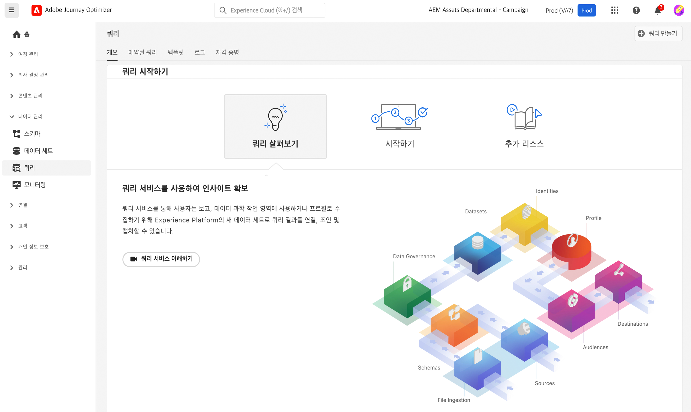

# 쿼리 시작 {#queries-gs}

[쿼리 편집기]는 Adobe Experience Platform [쿼리 서비스]에서 제공하는 대화형 도구로, [!DNL Adobe Journey Optimizer] 사용자 인터페이스 내에서 고객 경험 데이터에 대한 쿼리를 작성하고 유효성을 검사하고 실행할 수 있습니다

[쿼리 편집기]는 분석 및 데이터 탐색을 위한 쿼리 개발을 지원하며, 개발을 위한 인터랙티브 쿼리와 [데이터 세트](get-started-datasets.md)에 데이터를 수집하기 위한 비인터랙티브 쿼리를 실행할 수 있습니다.

[쿼리 편집기]를 사용하는 방법은 [이 설명서](https://experienceleague.adobe.com/docs/experience-platform/query/ui/user-guide.html?lang=ko){target="_blank"}를 참조하십시오.

**참조**

* [쿼리 서비스 설명서](https://experienceleague.adobe.com/docs/experience-platform/query/home.html?lang=ko){target="_blank"}
* [쿼리 서비스 개요 비디오](https://experienceleague.adobe.com/docs/platform-learn/tutorials/queries/understanding-query-service.html?lang=ko-KR){target="_blank"}
