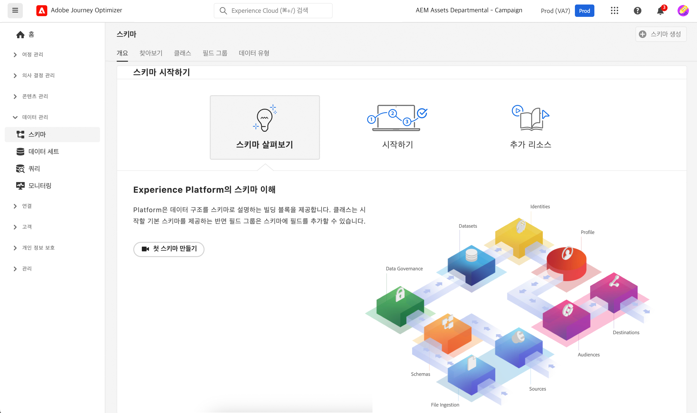

# 스키마 시작 {#schemas-gs}

스키마는 Experience Platform에서 데이터를 설명하는 표준 방식입니다.스키마를 따르는 모든 데이터를 조직 전체에서 충돌 없이 재사용하거나 여러 조직에서 공유할 수 있습니다.

➡️ [이 비디오에서 스키마를 만들고 구성하는 방법을 알아보십시오](#video-schema)(비디오).

스키마는 데이터의 구조와 형식을 나타내고 유효성을 검사하는 규칙 세트입니다. 스키마는 높은 수준에서 실제 개체(예: 사람)에 대한 추상적인 정의를 제공하고, 해당 개체의 각 인스턴스에 포함되어야 하는 데이터(예: 이름, 성, 생일 등)에 대한 개요를 제공합니다.

스키마를 구축하는 방법은 [이 설명서](https://experienceleague.adobe.com/docs/experience-platform/xdm/schema/composition.html?lang=ko){target="_blank"}를 참조하십시오.

[!DNL Adobe Journey Optimizer] 사용자 인터페이스의 **스키마** 작업 영역에서는 스키마와 클래스, 스키마 필드 그룹, 데이터 유형 등 XDM(Experience Data Model) 리소스를 관리할 수 있습니다. Adobe에서 제공하는 핵심 리소스를 보고 탐색하며 조직의 사용자 정의 리소스와 스키마를 만들 수 있습니다.

[스키마] 사용자 인터페이스를 사용하는 방법은 [이 설명서](https://experienceleague.adobe.com/docs/experience-platform/xdm/ui/overview.html?lang=ko){target="_blank"}를 참조하십시오.

[스키마 편집기]를 사용하여 스키마를 만드는 단계별 설명서는 [이 페이지](https://experienceleague.adobe.com/docs/experience-platform/xdm/tutorials/create-schema-ui.html?lang=ko){target="_blank"}에서 확인할 수 있습니다.

각 스키마의 전체 필드와 속성 목록을 보려면 [Journey Optimizer 스키마 사전](https://experienceleague.adobe.com/tools/ajo-schemas/schema-dictionary.html?lang=ko){target="_blank"}을 찾아봅니다.

## 방법 비디오{#video-schema}

스키마를 만들고, 필드 그룹을 추가하고, 사용자 지정 필드 그룹을 만들고 구성하는 방법을 알아봅니다.

>[!VIDEO](https://video.tv.adobe.com/v/334461?quality=12)

>[!MORELIKETHIS]
>
>* [Journey Optimizer에서 스키마와 데이터 세트를 만들고 데이터를 수집하여 테스트 프로필 추가](../audience/creating-test-profiles.md)
>* [XDM 시스템 개요](https://experienceleague.adobe.com/docs/experience-platform/xdm/home.html?lang=ko-KR){target="_blank"}
>* [데이터 모델링 모범 사례](https://experienceleague.adobe.com/docs/experience-platform/xdm/schema/best-practices.html?lang=ko){target="_blank"}
>* [Schema Registry API를 사용하여 스키마 만들기](https://experienceleague.adobe.com/docs/experience-platform/xdm/tutorials/create-schema-api.html?lang=ko){target="_blank"}
>* [스키마 편집기로 두 스키마의 관계 정의](https://experienceleague.adobe.com/docs/experience-platform/xdm/tutorials/relationship-ui.html?lang=ko){target="_blank"}
