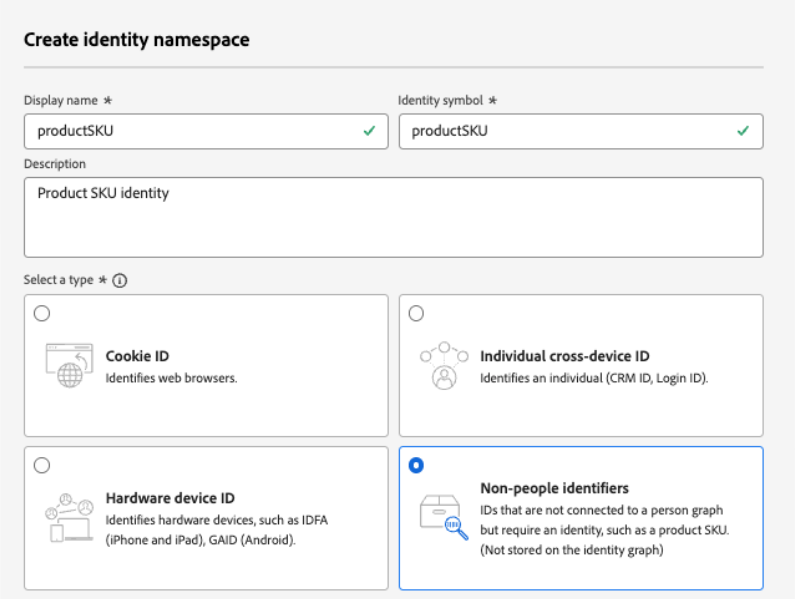
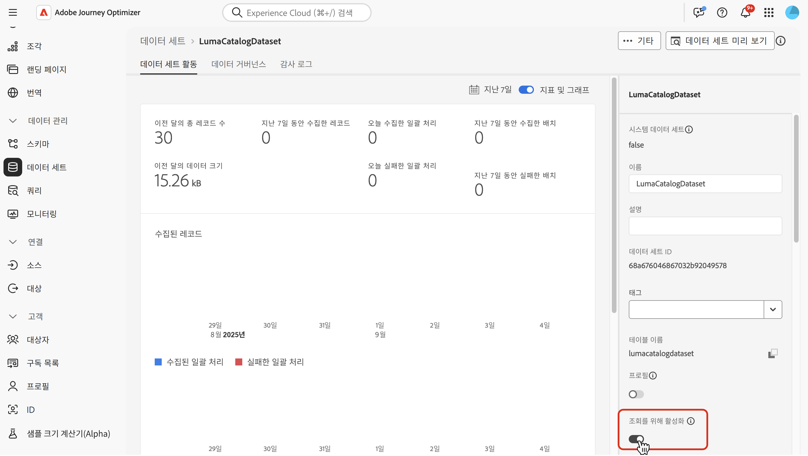
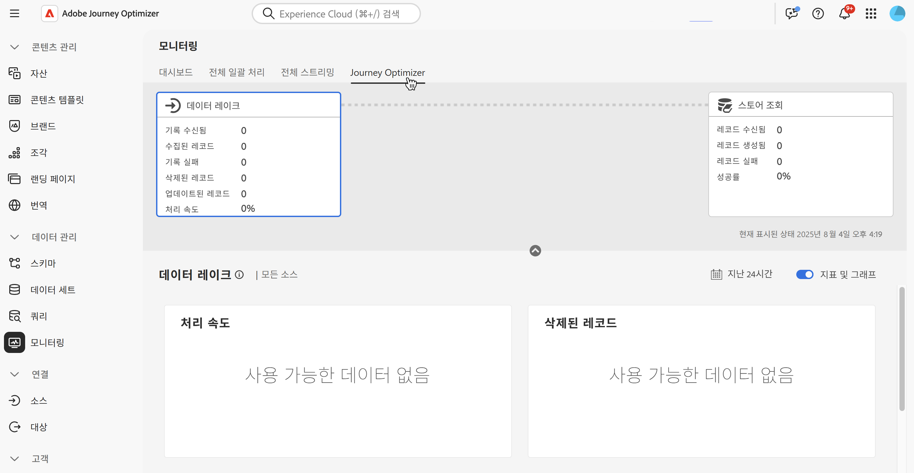

# Adobe Experience Platform 데이터 사용 {#aep-data}

>[!CONTEXTUALHELP]
>id="lookup-aep-data"
>title="조회를 위해 활성화"
>abstract="데이터 세트를 조회용으로 활성화하면 Journey Optimizer 개인화 및 결정 기능으로 해당 데이터를 활용할 수 있습니다."

>[!AVAILABILITY]
>
>이 기능은 현재 모든 고객이 제한된 가용성 릴리스로 사용할 수 있습니다.

Journey Optimizer을 사용하면 개인화 및 의사 결정 기능을 통해 Adobe Experience Platform 데이터의 데이터를 활용할 수 있습니다. 이렇게 하려면 조회 개인화에 필요한 레코드 기반 데이터 세트를 먼저 아래 설명된 대로 조회 서비스에 대해 활성화해야 합니다.

## 반드시 알아야 할 사항

### 보호 및 지침 {#guidelines}

시작하기 전에 다음 제한 사항 및 지침을 검토하십시오.

* 조회를 위해 활성화된 데이터 세트에는 PII(개인 식별 정보)가 포함되어서는 안 됩니다.
* 조회가 활성화되고 개인화에 사용되는 데이터 세트는 삭제로부터 보호되지 않습니다. 삭제되거나 제거되지 않도록 개인화에 사용되는 데이터 세트를 추적하는 것은 귀하의 책임입니다.
* 데이터 세트는 프로필 또는 이벤트 유형이 아닌 스키마와 연결되어야 합니다.
* 스키마에 기본 ID가 있어야 합니다. 조회에 단일 기본 키만 사용할 수 있습니다.

### 조회 서비스에 대한 권한 부여

| 기능 구성 요소 | 제한 | 참고 |
| ------- | ------- | ------- |
| 조회 데이터 세트 활성화됨 | 조직당 최대 10개 | 지정된 시간에 조회를 위해 구성할 수 있는 최대 데이터 세트 수입니다. 이 제한은 고객 인스턴스 내의 프로덕션 및 개발 샌드박스 모두에서 조회 데이터 세트의 총 결합 수에 적용됩니다. |
| 데이터 세트 레코드 수 | 데이터 세트당 최대 200만 개의 레코드 | 단일 데이터 세트에서 허용되는 최대 레코드 수로, 해당 데이터 세트 내의 모든 배치에서 총 카운트로 계산됩니다. |
| 레코드 크기 | 레코드당 최대 2KB | 지원되는 기본 최대 레코드 크기입니다. |
| 데이터 세트 크기 | 최대 4GB | 샌드박스의 모든 데이터 세트에서 결합된 크기가 아닌 개별 데이터 세트의 최대 크기입니다. 레코드 수 및 데이터 세트 크기 제한은 독립적인 보호이므로 둘 다 만족해야 합니다. |
| 데이터 세트 빈도 업데이트 | 데이터 세트당 하루에 최대 5개의 업데이트 | 일별 단일 데이터 세트에 허용되는 최대 업데이트 작업 빈도입니다. |

>[!NOTE]
>
>위에 나열된 보호 기능 이외에 추가 볼륨이 필요한 경우 Adobe 담당자에게 문의하십시오.

### 추가 성능 고려 사항

아래 권장 사항은 게재 기능의 지연을 방지하기 위한 지침입니다.

| 고려 사항 | 권장 제한 | 설명 |
| ------- | ------- | ------- |
| 조회당 속성 | 최대 20개 | 단일 조회 활동에서 레코드당 검색된 데이터 필드 수입니다. |
| 조회 활동 | 여정 당 최대 5개 | 각 여정은 최대 5개의 개별 조회 활동을 포함할 수 있습니다. 각 조회는 다른 데이터 세트를 타깃팅할 수 있습니다. |

## 데이터 조회를 위해 데이터 세트 활성화 {#enable}

개인화를 위해 데이터 세트의 데이터를 활용하려면 조회를 위해 데이터 세트를 활성화해야 합니다.

### 전제 조건 {#prerequisites-enable}

조회에 사용할 데이터 세트와 연결된 스키마는 레코드 유형이어야 합니다. 스키마는 프로필 또는 이벤트 클래스가 아니어야 합니다.

+++예


+++

스키마에 기본 ID가 정의되어 있어야 합니다.

+++예


+++

사용자 지정 네임스페이스가 아직 정의되지 않은 경우 ID가 비개인 식별자인지 확인하십시오.

+++예



+++

### 데이터 세트 관리 인터페이스에서 조회를 위해 데이터 세트 활성화

데이터 세트 관리 사용자 인터페이스에서 전환을 사용하여 조회를 위해 데이터 세트를 활성화합니다.



>[!NOTE]
>
>데이터 세트는 프로필 풍부성의 증가를 초래할 수 있으며 조회를 수행하는 데 필요하지 않으므로 프로필에 대해서도 활성화되지 않는 것이 좋습니다.

### API 메서드

[이 설명서](https://developer.adobe.com/journey-optimizer-apis/references/authentication/)에 설명된 지침에 따라 API 명령을 보내도록 환경을 구성하십시오.

#### 전제 조건

* 개발자 프로젝트에는 Adobe Journey Optimizer 및 Adobe Experience Platform API가 프로젝트에 추가되어 있어야 합니다.

  

* 역할의 일부로 데이터 세트 관리 권한이 있어야 합니다.

* 데이터 세트가 기반으로 삼는 스키마에는 조회 키로 작동할 수 있는 기본 ID가 포함되어야 합니다.

#### API 호출 구조

```shell
curl -s -XPATCH "https://platform.adobe.io/data/core/entity/lookup/dataSets/${DATASET_ID}/${ACTION}" \ -H "Authorization: Bearer ${ACCESS_TOKEN}" \ -H "x-api-key: ${API_KEY}" \ -H "x-gw-ims-org-id: ${IMS_ORG}" \ -H "x-sandbox-name: ${SANDBOX_NAME}" 
```

위치:

* URL은 `https://platform.adobe.io/data/core/entity/lookup/dataSets/${DATASET_ID}/${ACTION}`입니다.
* 데이터 세트 ID는 활성화하고자 하는 데이터 세트입니다.
* 작업은 활성화 또는 비활성화입니다.
* 개발자 콘솔에서 액세스 토큰을 검색할 수 있습니다.
* API 키는 개발자 콘솔에서 검색할 수 있습니다.
* IMS 조직 ID는 Adobe 조직입니다.
* 샌드박스 이름 은 데이터 세트가 있는 샌드박스 이름(예: prod, dev 등)입니다.

>[!NOTE]
>
>데이터 세트를 활성화하기 위해 API 호출을 시도할 때 아래 오류가 발생하는 경우 개발자 콘솔 프로젝트에서 Adobe Journey Optimizer API를 제거한 다음 다시 추가해 보십시오.
>
>`"error_code": "403003",`
>`"message": "Api Key is invalid"`

## 데이터 세트 모니터링

데이터 집합을 조회에 사용하도록 설정한 후에는 **[!UICONTROL 모니터링]** 메뉴로 이동하여 **[!UICONTROL Journey Optimizer]** 탭을 선택하여 조회 서비스로의 수집 상태를 검토할 수 있습니다.

이 프로세스 표시기는 조회 서비스에서 새로운 데이터 배치를 사용할 수 있는 시기를 이해하는 데 도움이 됩니다.



<!--Ivan Mironchuk
Note - we have a bug here currently. Will need to update screenshot once the lookup service will accurately reflect the progress.-->

## 다음 단계

API 호출을 사용하여 데이터 집합을 조회에 사용하도록 설정한 후에는 [!DNL Journey Optimizer] 개인화 및 의사 결정 기능과 함께 데이터를 사용할 수 있습니다. 자세한 내용은 다음 섹션을 참조하십시오.

* [개인화에 Adobe Experience Platform 데이터 사용](../personalization/aep-data-perso.md)
* [결정을 위해 Adobe Experience Platform 데이터 사용](../experience-decisioning/aep-data-exd.md)
