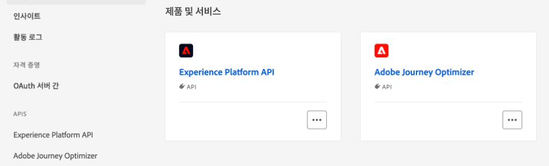

# Adobe Experience Platform 데이터 사용 {#aep-data}

>[!AVAILABILITY]
>
>이 기능은 현재 모든 고객이 공개 베타로 사용할 수 있습니다.
>
>이 기능을 사용하려면 먼저 조직에 대한 베타 약관에 동의해야 합니다.

Journey Optimizer을 사용하면 [!DNL Journey Optimizer]에서 Adobe Experience Platform의 데이터를 활용할 수 있습니다. 이렇게 하려면 조회 개인화에 필요한 데이터 세트를 먼저 아래 설명된 대로 API 호출을 통해 활성화해야 합니다. 완료되면 해당 데이터를 [!DNL Journey Optimizer] 개인화 및 의사 결정 기능으로 사용할 수 있습니다.

## Beta 제한 사항 및 지침 {#guidelines}

시작하기 전에 다음 제한 사항 및 지침을 검토하십시오.

* **데이터 세트 크기**&#x200B;은(는) 프로덕션 데이터 세트의 경우 5GB, 개발 샌드박스 데이터 세트의 경우 1GB로 제한됩니다
* **조직 당 조회에 대해 최대 50개의 데이터 세트를 사용할 수 있습니다**.
* **레코드 수**&#x200B;은(는) 프로덕션 데이터 세트에서는 5백만 개, 개발 샌드박스 데이터 세트에서는 1백만 개로 제한됩니다.
* **데이터 사용 레이블 지정 및 적용**&#x200B;은 현재 조회를 위해 활성화된 데이터 세트에 대해 적용되지 않습니다.
* **조회를 사용하도록 설정되어 있고 개인화에 사용되는 데이터 세트는 삭제로부터 보호되지 않습니다**. 삭제되거나 제거되지 않도록 개인화에 사용되는 데이터 세트를 추적하는 것은 귀하의 책임입니다.
* **데이터 사용 레이블 지정 및 적용**&#x200B;은 현재 조회를 위해 활성화된 데이터 세트에 대해 적용되지 않습니다.

## 데이터 조회를 위해 데이터 세트 활성화 {#enable}

개인화를 위해 데이터 세트의 데이터를 활용하려면 API 호출을 사용하여 상태를 검색하고 조회 서비스를 활성화해야 합니다.

### 전제 조건 {#prerequisites-enable}

* [이 설명서](https://developer.adobe.com/journey-optimizer-apis/references/authentication/)에 설명된 지침에 따라 API 명령을 보내도록 환경을 구성하십시오.
* 개발자 프로젝트에는 Adobe Journey Optimizer 및 Adobe Experience Platform API가 프로젝트에 추가되어 있어야 합니다.

  

* 역할의 일부로 데이터 세트 관리 권한이 있어야 합니다.
* 데이터 집합의 기반이 되는 스키마에는 조회 키로 사용할 수 있는 **기본 ID**&#x200B;이(가) 있어야 합니다.

### API 호출 구조 {#call}

```
curl -s -XPATCH "https://platform.adobe.io/data/core/entity/lookup/dataSets/${DATASET_ID}/${ACTION}" \ -H "Authorization: Bearer ${ACCESS_TOKEN}" \ -H "x-api-key: ${API_KEY}" \ -H "x-gw-ims-org-id: ${IMS_ORG}" \ -H "x-sandbox-name: ${SANDBOX_NAME}"
```

위치:

* **URL**&#x200B;은(는) `https://platform.adobe.io/data/core/entity/lookup/dataSets/${DATASET_ID}/${ACTION}`입니다.
* **데이터 세트 ID**&#x200B;은(는) 활성화하려는 데이터 세트입니다.
* **Action**&#x200B;을(를) 사용하거나 사용하지 않도록 설정합니다.
* 개발자 콘솔에서 **액세스 토큰**&#x200B;을(를) 검색할 수 있습니다.
* **API 키**&#x200B;는 개발자 콘솔에서 검색할 수 있습니다.
* **IMS 조직 ID**&#x200B;은(는) Adobe 조직입니다.
* **샌드박스 이름**&#x200B;은(는) 데이터 세트가 있는 샌드박스 이름입니다(예: prod, dev 등).

>[!NOTE]
>
>데이터 세트를 활성화하기 위해 API 호출을 시도할 때 아래 오류가 발생하는 경우 개발자 콘솔 프로젝트에서 Adobe Journey Optimizer API를 제거한 다음 다시 추가해 보십시오.
>
>```
>
>"error_code": "403003", 
>"message": "Api Key is invalid"
>
>```

API 호출을 사용하여 데이터 집합을 조회에 사용하도록 설정하면 해당 데이터를 [!DNL Journey Optimizer] 개인화 및 의사 결정 기능과 함께 사용할 수 있습니다.

* [개인화에 Adobe Experience Platform 데이터 사용](../personalization/aep-data-perso.md)
* [의사 결정에 Adobe Experience Platform 데이터 사용](../experience-decisioning/aep-data-exd.md)
