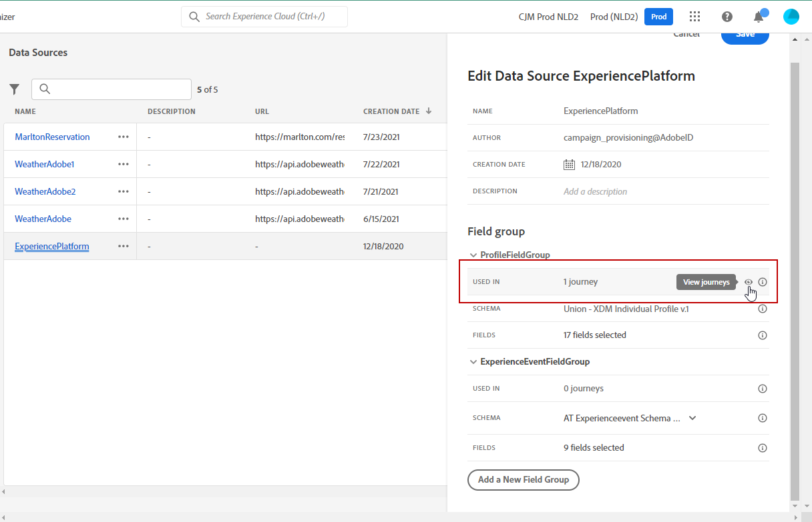

# 데이터 소스 구성 {#configure-data-source}

>[!NOTE]
>
>데이터 소스는 항상 **기술 사용자**&#x200B;가 구성해야 합니다.

데이터 소스를 구성하려면 아래 단계를 수행합니다.

1. 관리 메뉴 섹션에서 다음을 선택합니다. **[!UICONTROL 구성]**. 다음에서  **[!UICONTROL 데이터 소스]** 섹션, 클릭 **[!UICONTROL 관리]**. 데이터 소스 목록이 표시됩니다. 인터페이스에 대한 자세한 내용은 [이 페이지](../start/user-interface.md)를 참조하십시오.

   

1. 기본 제공 데이터 소스에 필드 그룹을 추가하거나([이 페이지](../datasource/adobe-experience-platform-data-source.md) 참조) 새 외부 데이터 소스([이 페이지](../datasource/external-data-sources.md) 참조) 및 관련 필드 그룹([이 페이지](../datasource/configure-data-sources.md#define-field-groups) 참조)을 만들 수 있습니다.

   

1. **[!UICONTROL 저장]**&#x200B;을 클릭합니다.

   이제 데이터 소스가 구성되었으며 여정에서 사용할 수 있는 상태가 되었습니다.

## 필드 그룹 정의 {#define-field-groups}

필드 그룹은 데이터 소스에서 검색하고 여정에서 사용할 수 있는 필드 세트입니다.

각 데이터 소스에 대해 여러 필드 그룹을 정의할 수 있습니다.

예를 들어, 전화 번호, 이메일, 이름 및 프로필 주소로 필드 그룹을 만들 수 있습니다. 그런 다음 여정에서 이 데이터를 사용하여 조건을 만들 수 있습니다. 예를 들어 고객이 모바일 애플리케이션을 설치한 경우에만 푸시 알림을 보내도록 결정할 수 있습니다. 비어 있는 경우 이메일을 보낼 수 있습니다.

기본 이름이 자동으로 추가되더라도 필드 그룹의 이름을 지정하는 것이 좋습니다. 실제로 필드 그룹 이름은에서 다른 사용자에게 표시됩니다. [!DNL Journey Optimizer]. 필드 그룹에 관련 이름을 지정하는 것이 좋습니다.

데이터 소스 필드가 여정에서 사용될 때 시스템은 해당 필드 그룹에 대해 정의된 모든 필드를 검색합니다. 따라서 여정에 필요한 필드만 선택하는 것이 좋습니다. 이렇게 하면 여정에서 요청 지연이 줄어들어 성능이 향상됩니다. 나중에 필드 그룹에 더 많은 필드를 쉽게 추가할 수 있습니다.

필드 그룹을 사용하는 여정 수는 **[!UICONTROL 다음에서 사용됨]** 필드. 다음을 클릭할 수 있습니다 **[!UICONTROL 여정 보기]** 단추를 클릭하여 이 필드 그룹을 사용하는 여정 목록을 표시합니다.

>[!NOTE]
>
>필드 그룹에 필드가 없으면 표현식 편집기에 표시되지 않습니다.

## 필드 그룹 라이프사이클 {#field-group-lifecycle}

초안 또는 라이브 여정에서 사용되지 않는 필드 그룹의 필드를 추가하거나 제거할 수 있습니다.

하나 이상의 초안 또는 라이브 여정에 사용된 필드 그룹에서는 필드를 추가할 수 있지만 제거할 수 없습니다. 이렇게 하면 여정 손상을 방지할 수 있습니다.

하나 이상의 여정에 사용된 필드 그룹에서 필드를 삭제하려면 다음 단계를 따르십시오. &quot;필드 그룹 A&quot;라는 필드 그룹의 예를 사용하겠습니다.

1. 필드 그룹 목록에서 &quot;필드 그룹 A&quot; 위에 커서를 놓고 **[!UICONTROL 복제]** 오른쪽에 있는 아이콘. 복제된 필드 그룹의 이름을 &quot;필드 그룹 B&quot;로 지정합니다.
1. &quot;필드 그룹 B&quot;에서 더 이상 원하지 않는 필드를 제거합니다.
1. &quot;필드 그룹 A&quot;에서 이 필드 그룹이 사용되는 위치를 확인합니다. 이 정보는에 표시됩니다 **[!UICONTROL 다음에서 사용됨]** 필드.
1. 필드 그룹 A를 사용하는 모든 여정을 엽니다.
1. 이러한 각 여정의 새 버전을 만듭니다. &quot;필드 그룹 A&quot;를 사용하여 모든 활동을 편집하고 &quot;필드 그룹 B&quot;를 선택합니다.
1. 필드 그룹 A를 사용하는 이전 버전의 여정을 중지합니다. 그러면 &quot;필드 그룹 A&quot;를 사용하는 여정이 없어야 합니다.
1. 필드 그룹 A는 더 이상 사용되지 않으므로 제거합니다.
