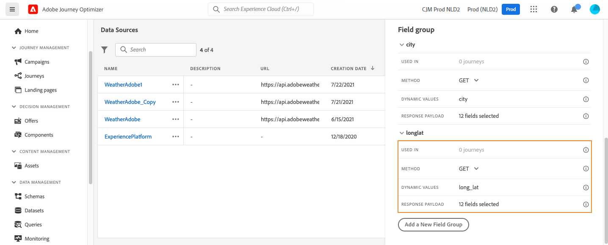
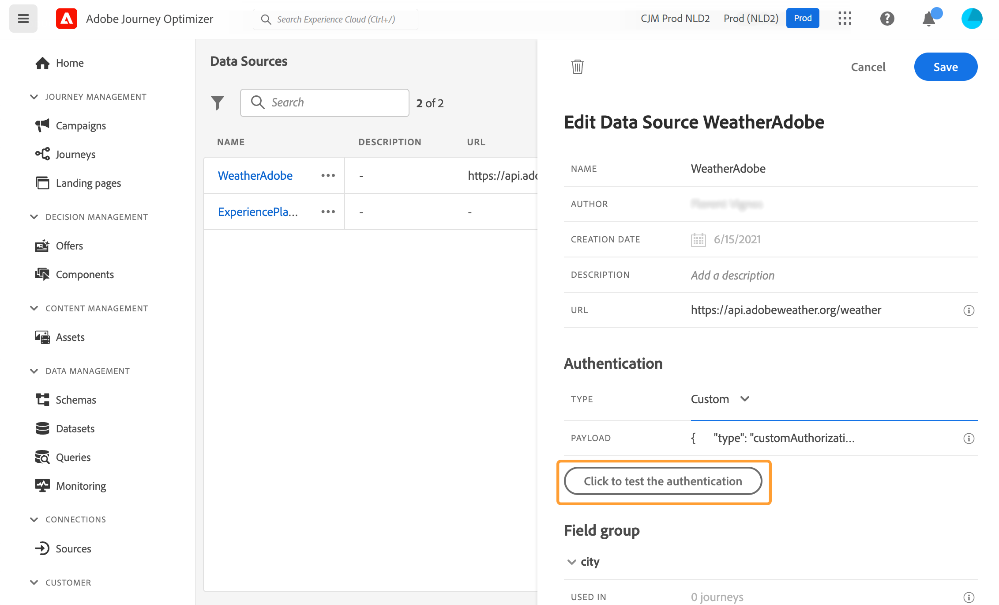

# 외부 데이터 소스 {#external-data-sources}

>[!CONTEXTUALHELP]
>id="ajo_journey_data_source_custom"
>title="외부 데이터 소스"
>abstract="외부 데이터 소스를 사용하면 서드파티 시스템에 대한 연결을 정의할 수 있습니다. 호텔 예약 시스템을 사용하여 특정인의 객실 투숙 여부를 확인하는 경우를 예로 들 수 있습니다. 기본 제공 Adobe Experience Platform 데이터 소스와는 달리 외부 데이터 소스는 필요한 수만큼 만들 수 있습니다."

## 외부 데이터 소스 작업 {#gs-ext-data-sources}

외부 데이터 소스를 사용하면 서드파티 시스템에 대한 연결을 정의할 수 있습니다. 호텔 예약 시스템을 사용하여 특정인의 객실 투숙 여부를 확인하는 경우를 예로 들 수 있습니다. 기본 제공 Adobe Experience Platform 데이터 소스와는 달리 외부 데이터 소스는 필요한 수만큼 만들 수 있습니다.

>[!NOTE]
>
>* 외부 시스템으로 작업할 때 보호 기능은 [이 페이지](../configuration/external-systems.md)에 나열됩니다.
>
>* 이제 응답이 지원되므로 외부 데이터 소스 사용 사례에서 데이터 소스 대신 사용자 지정 작업을 사용해야 합니다. 응답에 대한 자세한 내용은 이 [섹션](../action/action-response.md)을 참조하세요.

POST 또는 GET을 사용하며 JSON을 반환하는 REST API가 지원됩니다. 그리고 API 키와 기본/사용자 지정 인증 모드가 지원됩니다.

실시간 날씨 데이터에 따라 여정 동작을 사용자 지정하는 데 사용하려는 날씨 API 서비스의 예제를 살펴보겠습니다.

아래에 API 호출의 두 가지 예제가 나와 있습니다.

* _https://api.adobeweather.org/weather?city=London,uk&amp;appid=1234_
* _https://api.adobeweather.org/weather?lat=35&amp;lon=139&amp;appid=1234_

이 호출에는 기본 URL(_https://api.adobeweather.org/weather_), 매개 변수 세트 2개(도시에 해당하는 &quot;city&quot;와 위도/경도에 해당하는 &quot;lat/long&quot;), 그리고 API 키(appid)가 포함되어 있습니다.

>[!TIP]
>
>만료 불일치 및 401 오류를 방지하려면 특히 작업 로드가 많은 경우 외부 API의 토큰 만료 기간과 Journey Optimizer [`cacheDuration` 설정](#custom-authentication-access-token) 사이에 최소 1분 이상의 버퍼를 두는 것이 좋습니다.

## 외부 데이터 소스 만들기 및 구성 {#create-ext-data-sources}

다음은 새 외부 데이터 소스를 만들고 구성하는 주요 단계입니다.

1. 데이터 원본 목록에서 **[!UICONTROL 데이터 Source 만들기]**&#x200B;를 클릭하여 새 외부 데이터 원본을 만듭니다.

   

   화면 오른쪽에 데이터 소스 구성 창이 열립니다.

   

1. 데이터 소스의 이름을 입력합니다.

영숫자와 밑줄만 허용됩니다. 최대 길이는 30자입니다.

1. 원하는 경우 데이터 소스에 이벤트에 설명을 추가합니다.
1. 외부 서비스의 URL을 추가합니다. 이 예제에서는 _https://api.adobeweather.org/weather_&#x200B;를 추가합니다.

   >[!CAUTION]
   >
   >보안상 HTTPS를 사용하는 것이 좋습니다. 또한 공개적으로 제공되지 않는 Adobe 주소 및 IP 주소는 사용할 수 없습니다.

   

1. 외부 서비스 구성에 따라 인증을 구성합니다. **[!UICONTROL 인증 없음]**, **[!UICONTROL 기본]**, **[!UICONTROL 사용자 지정]** 또는 **[!UICONTROL API 키]**.

   기본 인증 모드의 경우 사용자 이름과 암호를 입력해야 합니다.

   >[!NOTE]
   >
   >* 인증 호출이 수행되면 base64로 인코딩된 `<username>:<password>` 문자열이 Authentication 헤더에 추가됩니다.
   >
   >* Adobe Journey Optimizer은 사용자 지정 작업에 정의된 암호를 자동으로 암호화합니다. 각 조직의 암호화 키는 해당 조직에 연결된 전용 보관소에서 안전하게 관리됩니다. 인터페이스에 자격 증명이 표시되면 실수로 노출되지 않도록 기본적으로 마스킹됩니다.


   사용자 지정 인증 모드에 대한 자세한 내용은 [이 섹션](../datasource/external-data-sources.md#custom-authentication-mode)을 참조하세요. 이 예제에서는 다음과 같이 API 키 인증 모드를 선택합니다.

   * **[!UICONTROL 유형]**: &quot;API 키&quot;
   * **[!UICONTROL 이름]**: &quot;appid&quot;(API 키 매개 변수 이름)
   * **[!UICONTROL 값]**: &quot;1234&quot;(API 키의 값)
   * **[!UICONTROL 위치]**: &quot;쿼리 매개 변수&quot;(API 키가 URL에 있음)

     

1. **[!UICONTROL 새 필드 그룹 추가]**&#x200B;를 클릭하여 각 API 매개 변수 집합에 대한 새 필드 그룹을 추가합니다. 필드 그룹 이름에는 영숫자와 밑줄만 허용됩니다. 최대 길이는 30자입니다. 이 예제에서는 각 매개 변수 세트(city, long/lat)용으로 하나씩 두 개의 필드 그룹을 만들어야 합니다.

&quot;long/lat&quot; 매개 변수 세트의 경우 다음 정보를 사용하여 필드 그룹을 만듭니다.

* **[!UICONTROL 다음에서 사용]**: 필드 그룹을 사용하는 여정 수를 표시합니다. **[!UICONTROL 여정 보기]** 아이콘을 클릭하여 이 필드 그룹을 사용하는 여정 목록을 표시할 수 있습니다.
* **[!UICONTROL 메서드]**: POST 또는 GET 메서드를 선택합니다. 여기서는 GET 메서드를 선택합니다.
* **[!UICONTROL 동적 값]**: 각 매개 변수를 쉼표로 구분하여 입력합니다. 이 예제에서는 &quot;long,lat&quot;를 입력합니다. 매개 변수 값은 실행 컨텍스트에 따라 달라지므로 여정에서 정의됩니다. [자세히 알아보기](../building-journeys/expression/expressionadvanced.md)
* **[!UICONTROL 응답 페이로드]**: **[!UICONTROL 페이로드]** 필드 내부를 클릭하고 호출에서 반환된 페이로드의 예제를 붙여 넣습니다. 이 예제에서는 날씨 API 웹 사이트의 페이로드를 사용했습니다. 필드 유형이 올바른지 확인합니다. API를 호출할 때마다 시스템은 페이로드 예제에 포함된 모든 필드를 검색합니다. 현재 전달된 페이로드를 변경하려는 경우 **[!UICONTROL 새 페이로드 붙여넣기]**&#x200B;를 클릭할 수 있습니다.
* **[!UICONTROL 페이로드 전송됨]**: 이 예제에서는 이 필드가 표시되지 않습니다. POST 메서드를 선택해야 이 필드를 사용할 수 있습니다. 서드파티 시스템으로 전송할 페이로드를 붙여넣습니다.

매개 변수가 필요한 GET 호출의 경우 **[!UICONTROL 동적 값]** 필드에 매개 변수를 입력하면 호출 끝에 매개 변수가 자동으로 추가됩니다. POST 호출의 경우에는 다음을 수행해야 합니다.

* 호출 시 전달할 매개 변수의 목록을 **[!UICONTROL 동적 값]** 필드에 포함합니다. 아래 예제에서는 매개 변수가 &quot;identifier&quot;입니다.
* 전송되는 페이로드 본문에서도 정확히 동일한 구문을 사용하여 매개 변수를 지정합니다. 이렇게 하려면 &quot;param&quot;: &quot;매개 변수의 이름&quot;(아래 예제에서는 &quot;identifier&quot;)을 추가해야 합니다. 아래 구문을 따르십시오.

  ```json
  {"id":{"param":"identifier"}}
  ```

  


변경 사항이 저장되면 데이터 소스가 구성되며, 예를 들어 조건이나 이메일 개인화 등에 여정에서 사용할 수 있도록 준비됩니다. 가령 기온이 섭씨 30도를 넘으면 특정 메시지를 보내도록 지정할 수 있습니다.

## 사용자 정의 인증 모드 {#custom-authentication-mode}

>[!CONTEXTUALHELP]
>id="jo_authentication_payload"
>title="사용자 정의 인증"
>abstract="사용자 정의 인증 모드는 OAuth2 등의 API 래핑 프로토콜을 호출하는 복잡한 인증에 사용됩니다. 작업은 두 단계로 실행됩니다. 첫 단계에서는 엔드포인트 호출을 수행하여 액세스 토큰을 생성합니다. 두 번째 단계에서는 작업의 HTTP 요청에 액세스 토큰을 삽입합니다."

사용자 지정 인증 모드는 작업의 실제 HTTP 요청에 삽입할 액세스 토큰을 검색하기 위해 복잡한 인증에 사용되며, 종종 OAuth2와 같은 API 래핑 프로토콜을 호출하는 데 사용됩니다.

사용자 지정 인증을 구성할 때는 **[!UICONTROL 인증을 확인하려면]** 단추를 사용하여 사용자 지정 인증 페이로드가 올바르게 구성되었는지 확인하세요.



테스트가 성공하면 버튼이 녹색으로 바뀝니다.


이 인증 모드에서는 작업이 다음의 두 단계로 실행됩니다.

1. 끝점을 호출하여 액세스 토큰을 생성합니다.
1. 올바른 방식으로 액세스 토큰을 삽입하여 REST API를 호출합니다.


>[!NOTE]
>
>**이 인증에는 두 부분이 있습니다.**

### 액세스 토큰을 생성하기 위해 호출할 끝점의 정의{#custom-authentication-endpoint}

* `endpoint`: 끝점을 생성하는 데 사용할 URL
* 끝점(`GET` 또는 `POST`)에 대한 HTTP 요청의 메서드
* `headers`: 필요한 경우 이 호출에서 헤더로 삽입할 키-값 쌍입니다
* `body`: 메서드가 POST인 경우 호출의 본문을 설명합니다. bodyParams(키-값 쌍)에 정의된 제한된 본문 구조가 지원됩니다. bodyType은 호출 본문의 형식과 인코딩을 설명합니다.
   * `form`: 콘텐츠 유형은 application/x-www-form-urlencoded(charset UTF-8)이며 키-값 쌍이 그대로 일련화됩니다(예: key1=value1&amp;key2=value2&amp;...).
   * `json`: 콘텐츠 유형은 application/json(charset UTF-8)이며 키-값 쌍이 json 개체 그대로 일련화됩니다(예: _{ &quot;key1&quot;: &quot;value1&quot;, &quot;key2&quot;: &quot;value2&quot;...}_).

### 작업의 HTTP 요청에 액세스 토큰을 삽입해야 하는 방식의 정의{#custom-authentication-access-token}

* **authorizationType**: 생성된 액세스 토큰을 작업의 HTTP 호출에 삽입해야 하는 방법을 정의합니다. 가능한 값은 다음과 같습니다.

   * `bearer`: _인증: 전달자 &lt;액세스 토큰>_&#x200B;과 같이 액세스 토큰을 인증 헤더에 삽입해야 함을 나타냅니다.
   * `header`: 액세스 토큰을 `tokenTarget` 속성으로 정의된 헤더 이름인 헤더로 삽입해야 함을 나타냅니다. 예를 들어 `tokenTarget`이(가) `myHeader`이면 액세스 토큰은 _myHeader: &lt;액세스 토큰>_(으)로 헤더로 삽입됩니다.
   * `queryParam`: 액세스 토큰을 queryParam(tokenTarget 속성으로 정의된 쿼리 매개 변수 이름)으로 삽입해야 함을 나타냅니다. 예를 들어 tokenTarget이 myQueryParam이면 작업 호출의 URL은 _&lt;url>?myQueryParam=&lt;액세스 토큰>_&#x200B;이 됩니다.

* **tokenInResponse**: 인증 호출에서 액세스 토큰을 추출하는 방법을 나타냅니다. 이 속성은 다음 중 하나일 수 있습니다.
   * `response`: HTTP 응답이 액세스 토큰임을 나타냅니다.
   * json의 선택기. 응답이 json이면 XML 등의 다른 형식은 지원되지 않습니다. 이 선택기의 형식은 _json://&lt;액세스 토큰 속성의 여정>_&#x200B;입니다. 예를 들어 호출의 응답이 _{ &quot;access_token&quot;: &quot;theToken&quot;, &quot;timestamp&quot;: 12323445656 }_&#x200B;이면 tokenInResponse는 _json: //access_token_&#x200B;이 됩니다.

이 인증의 형식은 다음과 같습니다.

```json
{
    "type": "customAuthorization",
    "endpoint": "<URL of the authentication endpoint>",
    "method": "<HTTP method to call the authentication endpoint, in 'GET' or 'POST'>",
    (optional) "headers": {
        "<header name>": "<header value>",
        ...
    },
    (optional, mandatory if method is 'POST') "body": {
        "bodyType": "<'form'or 'json'>,
        "bodyParams": {
            "param1": value1,
            ...
        }
    },
    "tokenInResponse": "<'response' or json selector in format 'json://<field path to access token>'",
    "cacheDuration": {
        (optional, mutually exclusive with 'duration') "expiryInResponse": "<json selector in format 'json://<field path to expiry>'",
        (optional, mutually exclusive with 'expiryInResponse') "duration": <integer value>,
        "timeUnit": "<unit in 'milliseconds', 'seconds', 'minutes', 'hours', 'days', 'months', 'years'>"
    },
    "authorizationType": "<value in 'bearer', 'header' or 'queryParam'>",
    (optional, mandatory if authorizationType is 'header' or 'queryParam') "tokenTarget": "<name of the header or queryParam if the authorizationType is 'header' or 'queryParam'>",
}
```

>[!NOTE]
>
>Encode64는 인증 페이로드에서 사용할 수 있는 유일한 함수입니다.

사용자 지정 인증 데이터 소스에 대해 토큰의 캐시 기간을 변경할 수 있습니다. 아래는 사용자 지정 인증 페이로드의 예입니다. 캐시 기간은 `cacheDuration` 매개 변수에 정의되어 있습니다. 캐시에서 생성된 토큰의 보존 기간을 지정합니다. 단위는 밀리초, 초, 분, 시간, 일, 개월, 년일 수 있습니다.

다음은 전달자 인증 유형의 예입니다.

```json
{
    "type": "customAuthorization",
    "endpoint": "https://<your_auth_endpoint>/epsilon/oauth2/access_token",
    "method": "POST",
    "headers": {
      "Authorization": "Basic EncodeBase64(<epsilon Client Id>:<epsilon Client Secret>)"
    },
    "body": {
      "bodyType": "form",
      "bodyParams": {
        "scope": "cn mail givenname uid employeeNumber",
        "grant_type": "password",
        "username": "<epsilon User Name>",
        "password": "<epsilon User Password>"
      }
    },
    "tokenInResponse": "json://access_token",
    "cacheDuration": {
      "duration": 5,
      "timeUnit": "minutes"
    },
  },
```

>[!NOTE]
>
>* 인증 토큰은 사용자별로 캐시됩니다. 두 여정이 동일한 여정 지정 작업을 사용하는 경우 각 여정에 캐시된 자체 토큰이 있습니다. 해당 토큰은 해당 여정 간에 공유되지 않습니다.
>
>* 캐시 지속 시간은 인증 끝점에 대한 너무 많은 호출을 방지하는 데 도움이 됩니다. 서비스에서 인증 토큰 보존이 캐시되므로 지속성이 없습니다. 서비스가 다시 시작되면 클린 캐시로 시작합니다. 기본적으로 캐시 지속 시간은 1시간입니다. 사용자 지정 인증 페이로드에서는 다른 보존 기간을 지정하여 조정할 수 있습니다.
>

다음은 헤더 인증 유형의 예입니다.

```json
{
  "type": "customAuthorization",
  "endpoint": "https://myapidomain.com/v2/user/login",
  "method": "POST",
  "headers": {
    "x-retailer": "any value"
  },
  "body": {
    "bodyType": "form",
    "bodyParams": {
      "secret": "any value",
      "username": "any value"
    }
  },
  "tokenInResponse": "json://token",
  "cacheDuration": {
    "expiryInResponse": "json://expiryDuration",
    "timeUnit": "minutes"
  },
  "authorizationType": "header",
  "tokenTarget": "x-auth-token"
} 
```

다음은 로그인 API 호출의 응답의 예입니다.

```json
{
  "token": "xDIUssuYE9beucIE_TFOmpdheTqwzzISNKeysjeODSHUibdzN87S",
  "expiryDuration" : 5
}
```

>[!CAUTION]
>
>사용자 지정 작업에 대한 사용자 지정 인증을 구성할 때 중첩된 JSON 개체(예: `bodyParams` 내의 하위 개체)는 현재 **지원되지 않습니다**. 플랫 키-값 쌍만 최종 요청 페이로드에 포함됩니다. 인증 끝점에 중첩된 오브젝트가 필요한 경우 필드가 누락되고 인증 오류가 발생할 수 있습니다.
