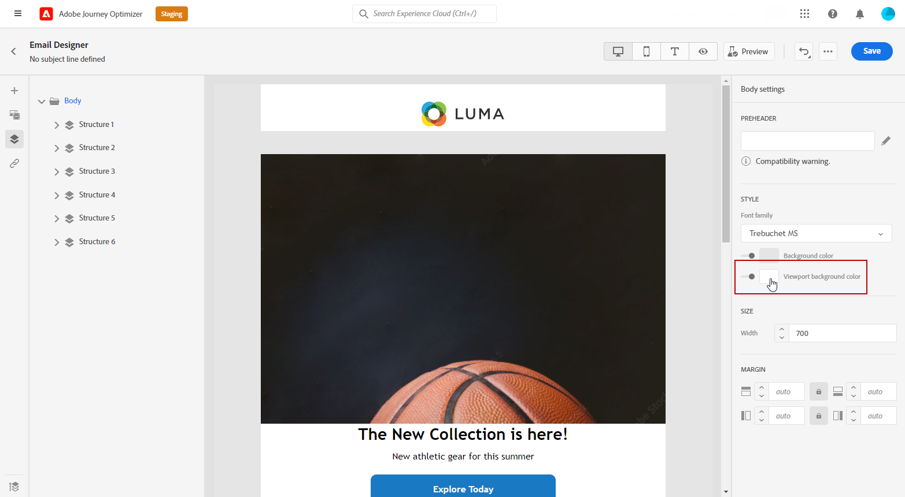
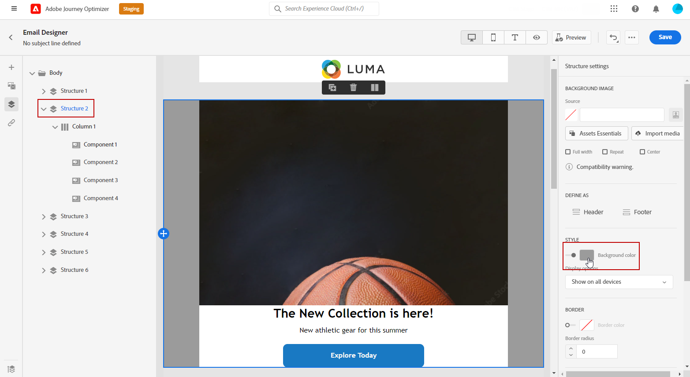

# 이메일 배경 개인화 {#backgrounds}

>[!CONTEXTUALHELP]
>id="ac_edition_backgroundimage"
>title="백그라운드 설정"
>abstract="콘텐츠의 배경색 또는 배경 이미지를 개인화할 수 있습니다. 모든 이메일 클라이언트는 배경 이미지를 지원하지 않습니다."

이메일 디자이너를 사용하여 배경을 설정하는 방법은 다음과 같습니다.

1. 디자인에 필요한 경우 이메일 본문에 배경색을 적용합니다.
1. 일반적으로 열 수준에서 배경색을 설정합니다.
1. 관리하기가 어려우므로 이미지 또는 텍스트 구성 요소에 배경색을 사용하지 마십시오.

다음은 사용할 수 있는 배경 설정입니다.

* 설정 **[!UICONTROL 배경색]** 전체 이메일. 왼쪽 팔레트에서 액세스할 수 있는 탐색 트리에서 본문 설정을 선택해야 합니다.

   

* 모든 구조 구성 요소에 대해 동일한 배경색을 선택하고 **[!UICONTROL 뷰포트 배경색]**. 이 옵션을 사용하면 배경색에서 다른 설정을 선택할 수 있습니다.

   

* 각 구조 구성 요소에 대해 다른 배경색을 설정합니다. 왼쪽 팔레트에서 액세스할 수 있는 탐색 트리에서 구조를 선택하여 해당 구조에만 특정 배경색만 적용합니다.

   구조 배경색을 숨길 수 있으므로 뷰포트 배경색을 설정하지 마십시오.

   

* 설정 **[!UICONTROL 배경 이미지]** 구조 구성 요소의 컨텐츠에 대해 설명합니다.

   >[!NOTE]
   >
   >일부 이메일 프로그램은 배경 이미지를 지원하지 않습니다. 지원되지 않는 경우에는 행 배경색이 대신 사용됩니다. 이미지를 표시할 수 없는 경우 적절한 대체 배경색을 선택해야 합니다.

   

* 열 수준에서 배경색을 설정합니다.

   >[!NOTE]
   >
   >가장 일반적인 사용 사례입니다. Adobe은 전체 이메일 콘텐츠를 편집할 때 보다 유연하게 계산할 수 있도록 열 수준에서 배경색을 설정하는 것이 좋습니다.

   열 수준에서 배경 이미지를 설정할 수도 있지만 거의 사용되지 않습니다.

   
