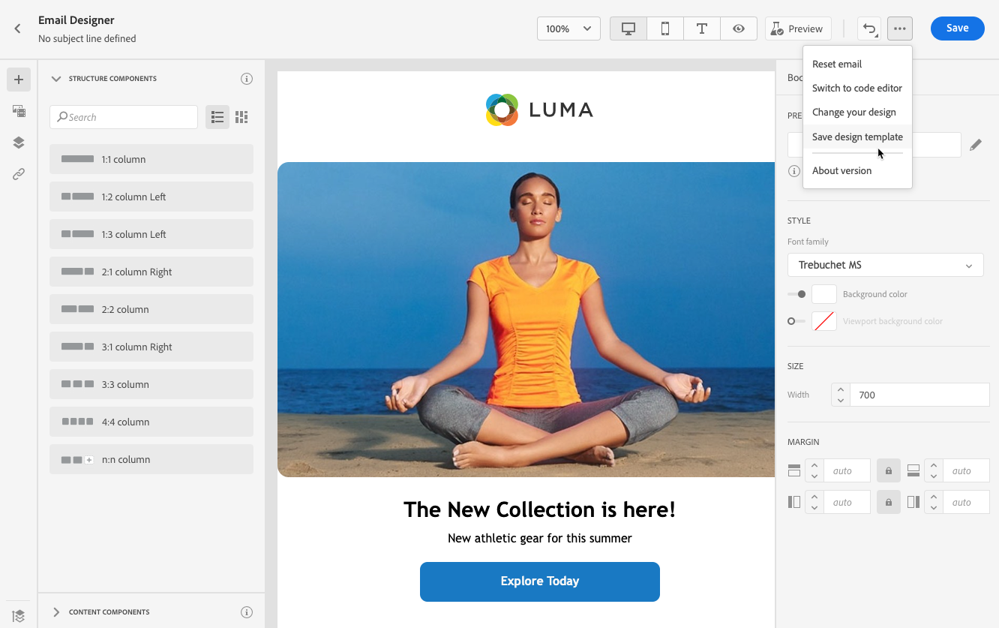

# 이메일 템플릿 작업 {#email-templates}

를 사용하십시오 **[!UICONTROL Select design template]** 섹션에서 을(를) 클릭하여 템플릿에서 컨텐츠 작성을 시작합니다.

다음 중에서 선택할 수 있습니다.
* 20개의 기본 제공 이메일 템플릿.
* 저장된 템플릿. [자세히 보기](#save-as-template)

## 템플릿으로 저장 {#save-as-template}

일단 당신이 [이메일 콘텐츠](design-emails.md)나중에 다시 사용할 수 있도록 저장할 수 있습니다. 이렇게 하려면 아래 단계를 수행합니다.

1. 화면의 오른쪽 상단에 있는 줄임표를 클릭합니다.

1. 선택 **[!UICONTROL Save design template]** 를 클릭합니다.

   

1. 이 템플릿의 이름을 추가합니다.

   

1. **[!UICONTROL Save]**&#x200B;을(를) 클릭합니다.

다음에 이메일을 만들 때 이 템플릿을 사용하여 콘텐츠를 작성할 수 있습니다. [방법 알아보기](#use-saved-template)

## 저장된 템플릿 사용 {#use-saved-template}

1. 를 엽니다. [이메일 디자이너](create-email-content.md).

1. 설정 **[!UICONTROL Create your email screen]**, **[!UICONTROL Sample templates]** 기본적으로 탭이 선택되어 있습니다. **[!UICONTROL Saved templates]** 탭을 선택합니다. 

   

1. 이전 모든 목록 [저장된 템플릿](#save-as-template) 표시됩니다. 분류할 수 있습니다 **[!UICONTROL By name]**, **[!UICONTROL Last modified]** 및 **[!UICONTROL Last created]**.

   

1. 목록에서 원하는 템플릿을 선택합니다.

1. 선택한 후에는 오른쪽 및 왼쪽 화살표를 사용하여 저장된 모든 템플릿 간을 탐색할 수 있습니다.

   

1. 클릭 **[!UICONTROL Use this email]** 화면 오른쪽 위에 있습니다.

1. 이메일 디자이너를 사용하여 원하는 대로 콘텐츠를 편집합니다.
