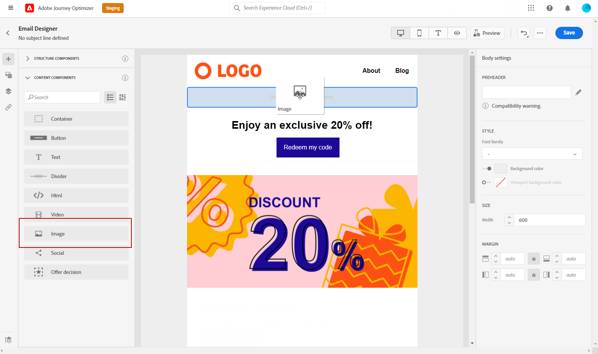

# 관리 [!DNL Adobe Stock] 이미지 {#stock}

## [!DNL Adobe Stock] 시작 {#get-started-stock}

[!DNL Adobe Stock] 고품질로 큐레이팅된 로열티가 없는 수백만 장의 사진, 비디오, 일러스트레이션 및 벡터 그래픽에 액세스할 수 있습니다. 신용 팩을 구매하여 자산을 라이선스를 부여하거나 필요한 자산에 대해 하나의 Standard 또는 Extended 라이선스만 구매하도록 선택할 수 있습니다. Adobe Stock에서는 자산을 무료로 수집할 수도 있습니다.

자세한 내용은 [!DNL Adobe Stock]를 참조하려면 [Adobe Stock 시작](https://helpx.adobe.com/stock/get-started.html).

사용 [!DNL Adobe Journey Optimizer]에서 직접 이메일에 이미지를 업로드할 수 있습니다. [!DNL Adobe Stock] 자산을 자산 폴더에 추가합니다. 다음 **[!UICONTROL Find Similar Image]** 선택 사항을 사용하면 게재에 사용되는 자산의 콘텐츠, 색상 및 구성과 일치하는 이미지를 찾을 수 있습니다.
[이메일 디자인에 대한 자세한 정보](design-emails.md).

## 삽입 및 가져오기 [!DNL Adobe Stock] 이미지 {#add-stock-image}

>[!NOTE]
>
> 다음 **[!UICONTROL Find Adobe Stock photos]** 옵션은 AEM Assets Essentials 제품 프로필에 액세스할 수 있는 사용자만 사용할 수 있습니다. 자세한 내용은 [자산 필수 설명서](https://experienceleague.adobe.com/docs/experience-manager-assets-essentials/help/get-started-admins/deploy-administer.html#add-users-to-essentials).

이메일을 편집하고 개인화한 후에는 [!DNL Adobe Stock] 템플릿을 사용하려면 다음을 수행하십시오.

1. 이미지를 드래그하여 놓습니다 **[!UICONTROL Content components]** 을 이메일에 추가합니다.

   

1. 에서 **[!UICONTROL Component settings]** 메뉴, 선택 **[!UICONTROL Find Adobe Stock photos]**.

   

1. 라이브러리를 탐색하거나 필드에 검색어를 입력합니다. 선택한 이미지를 선택하고 을(를) 클릭합니다 **[!UICONTROL Save]**.

   

1. 이미지에 라이센스를 부여하고 다운로드하려면 이미지를 선택합니다 **[!UICONTROL Content components]** 을(를) 클릭합니다. **[!UICONTROL License Adobe Stock image]**. 으로 리디렉션됩니다. [!DNL Adobe Stock] 웹 사이트입니다.

   >[!NOTE]
   > 이미지가 이미 라이선스가 있는 경우  아이콘. 이 경우 7단계로 건너뛸 수 있습니다.

   

1. 에서 [!DNL Adobe Stock] 웹 사이트에서 이미지를 다운로드하고 워터마크를 제거하려면 자산을 구매해야 합니다.

   이 구매는 Adobe Stock 플랜 또는 구독에 따라 다릅니다. Adobe Stock 계정이 여러 개 있는 경우 마지막으로 사용한 주식 ID로 리디렉션됩니다. 이 경우, 자산에 라이선스를 부여하기 전에 올바른 계정에 로그인했는지 확인하십시오.
자세한 정보는 이 [페이지](https://stock.adobe.com/plans)를 참조하십시오.

   >[!WARNING]
   > 라이센스가 없는 이미지가 포함된 이메일이 전송되면 이미지에는 워터마크가 있는 라이센스가 없는 양식이 유지됩니다.

   

1. 구매가 완료되면 이제 이메일 로 돌아갈 수 있습니다. [!DNL Adobe Journey Optimizer] 을(를) 선택합니다. **[!UICONTROL Import stock image]** 라이선스가 있는 이미지를 자산에 가져오기 위해.

   

1. 자산을 저장할 폴더를 선택합니다. 자세한 내용은 [!DNL Assets Essentials], 다음을 참조하십시오 [페이지](assets-essentials.md#get-started-assets-essentials).

   

1. 이미지를 선택한 후 [!DNL Adobe Stock]를 사용하려면 **[!UICONTROL Find similar Stock photos]** 이미지의 컨텐츠, 색상 및 컴포지션과 일치하는 자산을 찾는 옵션.

   이 옵션은 Assets 폴더의 라이선스/라이센스가 없는 Stock 이미지와 이미지에 사용할 수 있습니다.

   

1. 을(를) 사용하여 이미지를 추가로 사용자 지정합니다. **[!UICONTROL Components settings]** 메뉴 아래의 제품에서 사용할 수 있습니다. [구성 요소 설정에 대해 자세히 알아보기](content-components.md)

   

메시지를 만들고 개인화하면 게시하여 실행할 수 있도록 할 수 있습니다. [자세히 보기](../messages/publish-manage-message.md)
