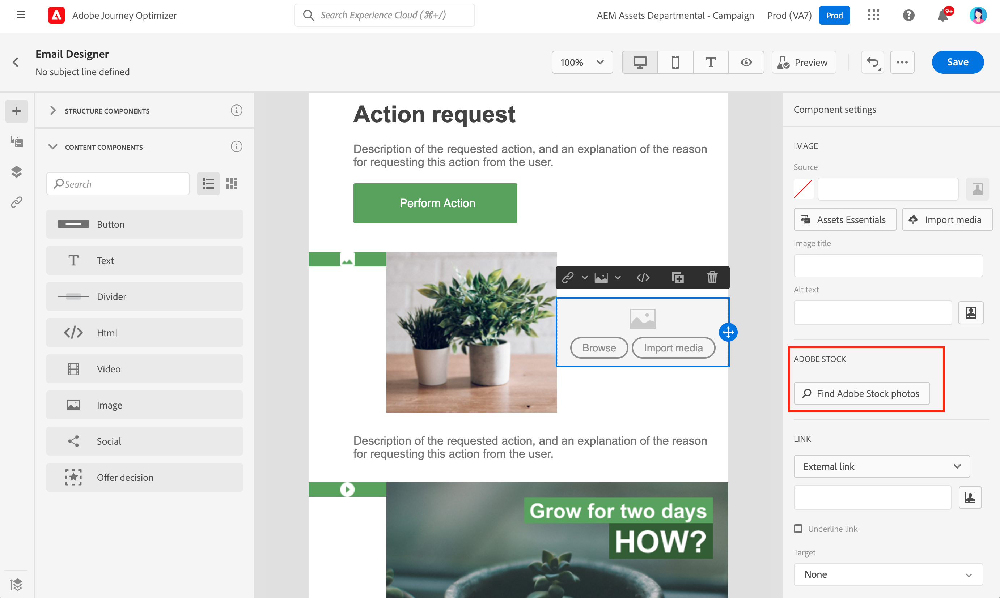
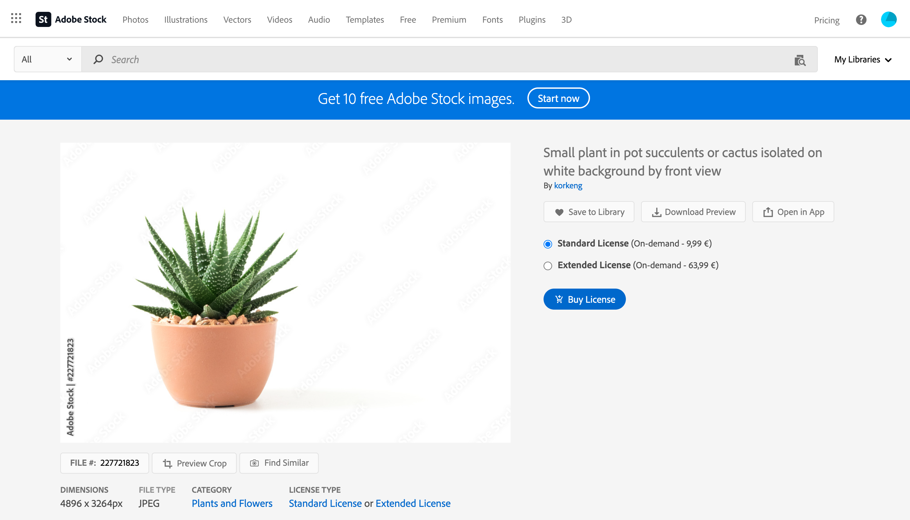

# 작업 [!DNL Adobe Stock] 이미지 {#stock}

## [!DNL Adobe Stock] 시작 {#get-started-stock}

다음 [!DNL Adobe Stock] 및 [!DNL Adobe Journey Optimizer] 이메일 디자이너 통합 플러그인을 사용하면 메시지를 작성하는 데 사용할 이미지를 쉽게 탐색, 라이선스 및 저장할 수 있습니다.

[Adobe Stock](https://helpx.adobe.com/stock/get-started.html){target=&quot;_blank&quot;}에서는 고품질로 큐레이팅된 로열티가 없는 수백만 장의 사진, 비디오, 일러스트레이션 및 벡터 그래픽에 액세스할 수 있습니다. 신용 팩을 구매하여 자산을 라이선스를 부여하거나 필요한 자산에 대해 하나의 Standard 또는 Extended 라이선스만 구매하도록 선택할 수 있습니다. Adobe Stock에서는 자산을 무료로 수집할 수도 있습니다.

사용 [!DNL Adobe Journey Optimizer]에서 직접 이메일에 이미지를 업로드할 수 있습니다. [!DNL Adobe Stock] 자산을 자산 폴더에 추가합니다. 다음 **[!UICONTROL Find Similar Image]** 선택 사항은 게재에 사용되는 자산의 콘텐츠, 색상 및 컴포지션과 일치하는 이미지를 찾는 데 도움이 됩니다.

## 권한{#stock-permissions}

다음 **[!UICONTROL Find Adobe Stock photos]** AEM Assets Essentials 제품 프로필에 액세스할 수 있는 사용자는 옵션을 사용할 수 있습니다.

자세한 내용은 [자산 필수 설명서](https://experienceleague.adobe.com/docs/experience-manager-assets-essentials/help/get-started-admins/deploy-administer.html#add-users-to-essentials){target=&quot;_blank&quot;}.

## 에서 이미지 삽입 [!DNL Adobe Stock] {#add-stock-image}

에서 이미지를 추가하려면 [!DNL Adobe Stock] 콘텐츠를 보려면 아래 단계를 수행하십시오.

1. 에서 **[!UICONTROL Content components]** 이메일 디자이너의 섹션에서 **이미지**.

1. 을(를) 클릭합니다. **[!UICONTROL Find Adobe Stock photos]** 이메일 디자이너 왼쪽의 단추.

   

1. 라이브러리를 탐색하거나 검색 필드에 용어를 입력합니다.

   

1. 선택한 이미지를 선택하고 을(를) 클릭합니다 **[!UICONTROL Save]**.

   선택한 이미지에 라이센스가 없는 경우 [라이센스 받기](#license-stock-image).

## 유사한 사진 찾기 {#similar-stock-image}

전자 메일 콘텐츠의 기존 이미지를 [!DNL Adobe Stock]. 이 옵션은 모든 이미지에 사용할 수 있습니다. Assets 폴더에서 라이선스가 부여된/라이센스가 없는 Stock 이미지 및 이미지.

유사한 사진을 찾아보려면 아래 단계를 수행하십시오.

1. 바꿀 이미지를 선택합니다.
1. 을(를) 클릭합니다. **[!UICONTROL Find similar Stock photos]** 에 자산을 표시하는 단추 [!DNL Adobe Stock] 이미지의 컨텐츠, 색상 및 컴포지션과 일치하는 항목을 찾습니다.

   

1. 선택한 이미지를 선택하고 을(를) 클릭합니다 **[!UICONTROL Save]**.

   

   선택한 이미지에 라이센스가 없는 경우 [라이센스 받기](#license-stock-image).

1. 필요한 경우 **[!UICONTROL Components settings]** 메뉴 아래의 제품에서 사용할 수 있습니다. [구성 요소 설정에 대해 자세히 알아보기](content-components.md)

메시지를 만들고 개인화하면 게시하여 실행할 수 있도록 할 수 있습니다. [자세히 보기](../messages/publish-manage-message.md)

## 다음에서 라이센스 받기 [!DNL Adobe Stock] {#license-stock-image}

이미지가 이미 라이선스가 있는 경우  아이콘. 그렇지 않은 경우 라이센스를 부여해야 합니다.

이미지에 라이센스를 부여하고 다운로드하려면 아래 단계를 수행하십시오.

1. 이 옵션을 선택하고 을(를) 클릭합니다. **[!UICONTROL License Adobe Stock image]** 아이콘.

   

   그러면 로 리디렉션됩니다. [!DNL Adobe Stock] 라이센스를 제외한 웹 사이트입니다.

   

1. 에서 [!DNL Adobe Stock] 웹 사이트에서 이미지를 다운로드하고 워터마크를 제거하려면 자산을 구매해야 합니다.

   이 구매는 Adobe Stock 플랜 또는 구독에 따라 다릅니다. Adobe Stock 계정이 여러 개 있는 경우 마지막으로 사용한 주식 ID로 리디렉션됩니다. 이 경우, 자산에 라이선스를 부여하기 전에 올바른 계정에 로그인했는지 확인하십시오.

   의 Adobe Stock 계획 및 가격에 대해 자세히 알아보십시오 [Adobe Stock 설명서](https://stock.adobe.com/plans){target=&quot;_blank&quot;}.

   >[!WARNING]
   > 허가되지 않은 이미지가 포함된 이메일이 전송되면 이미지가 라이센스가 없는 양식에 워터마크를 유지합니다.

1. 구매가 완료되면 이제 이메일 로 돌아갈 수 있습니다. [!DNL Adobe Journey Optimizer] 을(를) 선택합니다. **[!UICONTROL Import stock image]** 라이선스가 있는 이미지를 자산에 가져오기 위해.

   

1. 자산을 저장할 폴더를 선택합니다. 자세한 내용은 [!DNL Assets Essentials], 다음을 참조하십시오 [페이지](assets-essentials.md#get-started-assets-essentials).

## 관련 항목{#stock-related-topics}

* [Journey Optimizer의 이메일 디자인](design-emails.md)
* [전자 메일 디자인을 위한 구성 요소 설정](content-components.md)
* [Adobe Stock 시작](https://helpx.adobe.com/stock/get-started.html){target=&quot;_blank&quot;}.

