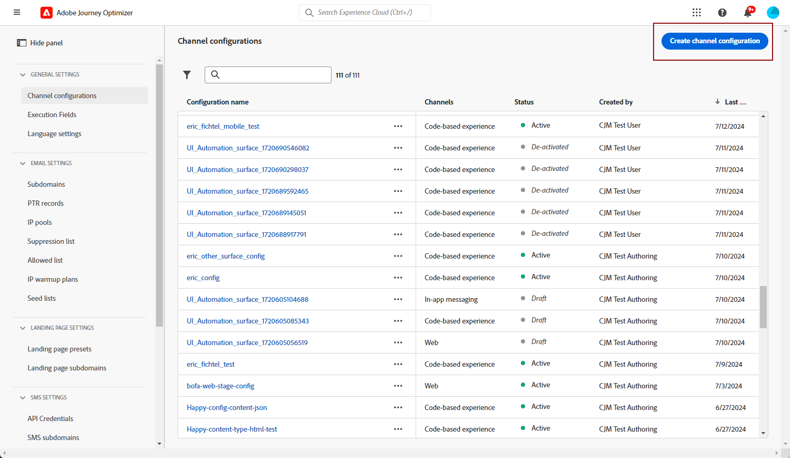
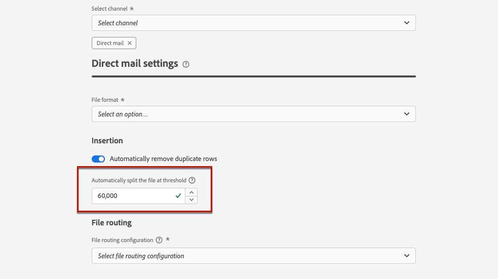

# 다이렉트 메일 구성 {#direct-mail-configuration}

[!DNL Journey Optimizer]을(를) 사용하면 다이렉트 메일 공급자가 고객에게 메일을 보내는 데 필요한 파일을 개인화하고 생성할 수 있습니다.

[DM 메시지를 만들](../direct-mail/create-direct-mail.md) 때 선택한 연락처 정보(예: 우편 주소)를 포함한 대상 데이터를 정의합니다. 그러면 이 데이터가 포함된 파일이 자동으로 생성되고 서버에 내보내져 DM 공급자가 해당 데이터를 검색하고 실제 전송을 처리할 수 있습니다.

이 파일을 생성하려면 먼저 다음을 생성해야 합니다.

1. 파일을 내보낼 서버를 지정하고 필요한 경우 파일을 암호화하는 [파일 라우팅 구성](#file-routing-configuration)입니다.

   >[!CAUTION]
   >
   >파일 라우팅 구성을 만들려면 **[!DNL Manage file routing]** 기본 제공 권한이 있어야 합니다. [자세히 알아보기](../administration/ootb-product-profiles.md#content-library-manager).

1. 파일 라우팅 구성을 참조할 [DM 구성](#direct-mail-configuration)입니다. 파일 라우팅 옵션을 구성하지 않은 경우 DM 구성을 만들 수 없습니다.

## 파일 라우팅 구성 {#file-routing-configuration}

>[!CONTEXTUALHELP]
>id="ajo_dm_file_routing_details"
>title="파일 라우팅 구성 정의"
>abstract="DM 메시지를 만든 후에는 타겟팅된 대상자 데이터가 포함된 파일을 생성하여 서버로 내보냅니다. DM 공급자가 DM 게재를 위해 해당 파일에 액세스하여 사용할 수 있도록 서버 세부 사항을 지정해야 합니다."
>additional-url="https://experienceleague.adobe.com/docs/journey-optimizer/using/direct-mail/create-direct-mail.html?lang=ko" text="다이렉트 메일 메시지 만들기"

>[!CONTEXTUALHELP]
>id="ajo_dm_file_routing_details_header"
>title="파일 라우팅 구성 정의"
>abstract="DM 공급자가 사용하려는 파일을 내보낼 위치를 정의해야 합니다."

>[!CONTEXTUALHELP]
>id="ajo_dm_select_file_routing"
>title="파일 라우팅 구성"
>abstract="원하는 파일 라우팅 구성을 선택하여 DM 공급자가 사용하려는 파일을 내보낼 위치를 정의합니다."

>[!CONTEXTUALHELP]
>id="ajo_dm_file_routing_type"
>title="파일의 서버 유형을 선택합니다."
>abstract="DM 파일 내보내기에 사용할 서버 유형을 선택합니다. 현재 Journey Optimizer는 Amazon S3 및 SFTP만 지원합니다."

>[!CONTEXTUALHELP]
>id="ajo_dm_file_routing_aws_region"
>title="AWS 지역 선택"
>abstract="DM 파일을 내보내려는 AWS 서버가 있는 지역을 선택합니다. 일반적으로 DM 공급자 위치와 가장 가까운 지역을 선택하는 것이 좋습니다."

>[!NOTE]
>
>현재 [!DNL Journey Optimizer]에서 Amazon S3, SFTP 및 Azure가 지원됩니다.

DM 메시지를 배달하기 위해 [!DNL Journey Optimizer]에서는 대상 데이터가 포함된 파일을 생성하여 서버로 내보냅니다.

DM 공급자가 메일을 전달하기 위해 해당 파일에 액세스하고 사용할 수 있도록 서버 세부 정보를 지정해야 합니다.

파일 라우팅을 구성하려면 아래 단계를 따르십시오.

>[!BEGINTABS]

>[!TAB Amazon S3]

1. **[!UICONTROL 관리]** > **[!UICONTROL 채널]** > **[!UICONTROL DM 설정]** > **[!UICONTROL 파일 라우팅]** 메뉴에 액세스한 다음 **[!UICONTROL 라우팅 구성 만들기]**&#x200B;를 클릭합니다.

   {width="800" align="center"}

1. 구성의 이름을 설정합니다.

1. DM 파일을 내보내는 데 사용할 **[!UICONTROL 서버 형식]**(으)로 **Amazon S3**&#x200B;을(를) 선택하십시오.

   {width="800" align="center"}

1. 서버에 대한 세부 정보 및 자격 증명을 입력합니다.

   * **AWS 버킷 이름**:AWS 버킷 이름을 찾을 수 있는 위치를 알려면 [이 페이지](https://docs.aws.amazon.com/AmazonS3/latest/userguide/UsingBucket.html)를 참조하세요.

   * **AWS 액세스 키**: AWS 액세스 키 ID를 찾을 수 있는 위치를 알려면 [이 페이지](https://docs.aws.amazon.com/IAM/latest/UserGuide/security-creds.html#access-keys-and-secret-access-keys)를 참조하세요.

   * **AWS 비밀 키**: AWS 비밀 키를 찾을 수 있는 위치를 알려면 [이 페이지](https://aws.amazon.com/fr/blogs/security/wheres-my-secret-access-key/)를 참조하세요.

   * **AWS 지역**: 서버 인프라가 위치할 **[!UICONTROL AWS 지역]**&#x200B;을 선택하십시오. AWS 지역은 AWS이 클라우드 인프라를 호스팅하는 데 사용하는 지리적 영역입니다. 일반적으로 DM 공급자 위치와 가장 가까운 지역을 선택하는 것이 좋습니다.

   {width="800" align="center"}

1. 파일을 암호화하려면 **[!UICONTROL PGP/GPG 암호화 키]** 필드에 암호화 키를 복사하여 붙여 넣으십시오.

1. **[!UICONTROL 제출]**&#x200B;을 선택합니다. 파일 라우팅 구성이 **[!UICONTROL 활성]** 상태로 만들어졌습니다. 이제 [DM 구성](#direct-mail-surface)에서 사용할 준비가 되었습니다.

   **[!UICONTROL 초안으로 저장]**&#x200B;을 선택하여 파일 라우팅 구성을 만들 수도 있지만 **[!UICONTROL 활성]**&#x200B;이 될 때까지 구성에서 선택할 수 없습니다.

>[!TAB SFTP]

1. **[!UICONTROL 관리]** > **[!UICONTROL 채널]** > **[!UICONTROL DM 설정]** > **[!UICONTROL 파일 라우팅]** 메뉴에 액세스한 다음 **[!UICONTROL 라우팅 구성 만들기]**&#x200B;를 클릭합니다.

   {width="800" align="center"}

1. 구성의 이름을 설정합니다.

1. DM 파일을 내보내는 데 사용할 **[!UICONTROL 서버 유형]**(으)로 SFTP를 선택하십시오.

   {width="800" align="center"}

1. 서버에 대한 세부 정보 및 자격 증명을 입력합니다.

   * **계정**: SFTP 서버에 연결하는 데 사용되는 계정 이름입니다.

   * **서버 주소**: &#x200B; SFTP 서버의 URL.

   * **포트**: FTP 연결 포트 번호입니다.

   * **암호**: &#x200B; SFTP 서버에 연결하는 데 사용되는 암호입니다.

   

1. 파일을 암호화하려면 **[!UICONTROL PGP/GPG 암호화 키]** 필드에 암호화 키를 복사하여 붙여 넣으십시오.

1. **[!UICONTROL 제출]**&#x200B;을 선택합니다. 파일 라우팅 구성이 **[!UICONTROL 활성]** 상태로 만들어졌습니다. 이제 [DM 구성](#direct-mail-surface)에서 사용할 준비가 되었습니다.

   **[!UICONTROL 초안으로 저장]**&#x200B;을 선택하여 파일 라우팅 구성을 만들 수도 있지만 **[!UICONTROL 활성]**&#x200B;이 될 때까지 구성에서 선택할 수 없습니다.

>[!TAB Azure]

1. **[!UICONTROL 관리]** > **[!UICONTROL 채널]** > **[!UICONTROL DM 설정]** > **[!UICONTROL 파일 라우팅]** 메뉴에 액세스한 다음 **[!UICONTROL 라우팅 구성 만들기]**&#x200B;를 클릭합니다.

   {width="800" align="center"}

1. 구성의 이름을 설정합니다.

1. DM 파일을 내보내는 데 사용할 Azure **[!UICONTROL 서버 유형]**&#x200B;을(를) 선택하십시오.

   {width="800" align="center"}

1. 서버에 대한 세부 정보 및 자격 증명을 입력합니다.

   * **Azure 연결 문자열**: **Azure 연결 문자열**&#x200B;을 찾으려면 [이 페이지](https://learn.microsoft.com/en-us/azure/storage/common/storage-configure-connection-string#configure-a-connection-string-for-an-azure-storage-account)를 참조하세요.

     **Azure 연결 문자열**&#x200B;은(는) 아래 형식을 따라야 합니다.

     `DefaultEndpointsProtocol=[http|https];AccountName=myAccountName;AccountKey=myAccountKey`

   * **컨테이너 이름**: **컨테이너 이름**&#x200B;을 찾으려면 [이 페이지](https://learn.microsoft.com/en-us/azure/storage/blobs/blob-containers-portal)를 참조하세요.

     **컨테이너 이름**&#x200B;에는 슬래시 없이 컨테이너 이름만 포함되어야 합니다. 파일을 저장할 컨테이너 내의 경로를 지정하려면 원하는 경로를 포함하도록 DM 캠페인의 파일 이름을 업데이트합니다.

1. 파일을 암호화하려면 **[!UICONTROL PGP/GPG 암호화 키]** 필드에 암호화 키를 복사하여 붙여 넣으십시오.

1. **[!UICONTROL 제출]**&#x200B;을 선택합니다. 파일 라우팅 구성이 **[!UICONTROL 활성]** 상태로 만들어졌습니다. 이제 [DM 구성](#direct-mail-surface)에서 사용할 준비가 되었습니다.

   **[!UICONTROL 초안으로 저장]**&#x200B;을 선택하여 파일 라우팅 구성을 만들 수도 있지만 **[!UICONTROL 활성]**&#x200B;이 될 때까지 구성에서 선택할 수 없습니다.

>[!ENDTABS]

## DM 구성 만들기 {#direct-mail-surface}

>[!CONTEXTUALHELP]
>id="ajo_dm_surface_settings"
>title="DM 설정 정의"
>abstract="DM 구성에는 타겟팅된 대상자 데이터가 있고 메일 공급자가 사용할 수 있는 파일 형식에 대한 설정이 포함됩니다. 파일 라우팅 구성을 선택하여 파일을 내보낼 위치도 정의해야 합니다."
>additional-url="https://experienceleague.adobe.com/docs/journey-optimizer/using/direct-mail/direct-mail-configuration.html#file-routing-configuration" text="파일 라우팅 구성"

<!--
>[!CONTEXTUALHELP]
>id="ajo_dm_surface_sort"
>title="Define the sort order"
>abstract="If you select this option, the sort will be by profile ID, ascending or descending. If you unselect it, the sorting configuration defined when creating the direct mail message within a journey or a campaign."-->

>[!CONTEXTUALHELP]
>id="ajo_dm_surface_split"
>title="파일 분할 임계값 정의"
>abstract="대상자 데이터가 포함된 각 파일의 최대 레코드 수를 설정해야 합니다. 1과 200,000 사이에서 레코드 수를 선택할 수 있습니다. 지정된 임계값에 도달하면 나머지 레코드에 대해 다른 파일이 만들어집니다."

[!DNL Journey Optimizer]에서 DM을 배달하려면 채널 구성을 만들어 메일 공급자가 사용할 파일 형식 설정을 정의해야 합니다.

DM 구성에는 DM 파일을 내보낼 서버를 정의하는 파일 라우팅 구성도 포함되어야 합니다.

1. 왼쪽 레일에서 **[!UICONTROL 관리]** > **[!UICONTROL 채널]**(으)로 이동한 다음 **[!UICONTROL 일반 설정]** > **[!UICONTROL 채널 구성]**&#x200B;을 선택합니다. **[!UICONTROL 채널 구성 만들기]** 단추를 클릭합니다. [자세히 알아보기](../configuration/channel-surfaces.md)

   

1. 구성의 이름 및 설명(선택 사항)을 입력한 다음 구성할 채널을 선택합니다.

   >[!NOTE]
   >
   > 이름은 문자(A-Z)로 시작해야 합니다. 영숫자만 포함할 수 있습니다. 밑줄 `_`, 점`.` 및 하이픈 `-`자를 사용할 수도 있습니다.

1. 구성에 사용자 지정 또는 핵심 데이터 사용 레이블을 할당하려면 **[!UICONTROL 액세스 관리]**&#x200B;를 선택할 수 있습니다. [OLAC(개체 수준 액세스 제어)에 대해 자세히 알아보세요](../administration/object-based-access.md).

1. **[!UICONTROL DM]** 채널을 선택하십시오.

   

1. 이 구성을 사용하여 동의 정책을 메시지에 연결하려면 **[!UICONTROL 마케팅 액션]**&#x200B;을 선택하십시오. 마케팅 액션과 관련된 모든 동의 정책은 고객의 선호도를 존중하기 위해 활용됩니다. [자세히 알아보기](../action/consent.md#surface-marketing-actions)

1. 채널 구성의 전용 섹션에서 DM 설정을 정의합니다.

   {width="800" align="center"}

   <!---->

1. 파일 형식을 선택하십시오. **[!UICONTROL CSV]** 또는 **[!UICONTROL 텍스트로 구분]**.

1. **[!UICONTROL 구분된 텍스트]**&#x200B;를 선택하는 경우 원하는 열 구분 기호(표, 세미콜론, 파이프 또는 앰퍼샌드)를 정의하세요.

   

1. 만든 파일 라우팅 구성 중 **[!UICONTROL 파일 라우팅 구성]**&#x200B;을(를) 선택하십시오. DM 공급자가 사용할 파일을 내보내는 위치를 정의합니다.

   >[!CAUTION]
   >
   >파일 라우팅 옵션을 구성하지 않은 경우 DM 구성을 만들 수 없습니다. [자세히 알아보기](#file-routing-configuration)

   {width="800" align="center"}

   <!---->

1. DM 구성을 제출합니다.

이제 캠페인 내에서 [DM 메시지를 만들기](../direct-mail/create-direct-mail.md)할 수 있습니다. 캠페인이 시작되면 타겟팅된 대상자 데이터가 포함된 파일은 정의한 서버로 자동으로 내보내집니다. 그러면 DM 공급자는 해당 파일을 검색하고 DM 게재를 진행할 수 있습니다.

>[!NOTE]
>
>행의 모든 값이 동일한 중복 행은 파일에서 자동으로 제거됩니다.

<!--
    In the **[!UICONTROL Insertion]** section, you can choose to automatically remove duplicate rows.

    Define the maximum number of records (i.e. rows) for each file containing profile data. After the specified threshold is reached, another file will be created for the remaining records.

    

    For example, if there are 100,000 records in the file and the threshold limit is set to 60,000, the records will be split into two files. The first file will contain 60,000 rows, and the second file will contain the remaining 40,000 rows.

    >[!NOTE]
    >
    >NOTE You can set any number between 1 and 200,000 records, meaning each file must contain at least 1 row and no more than 200,000 rows.

-->