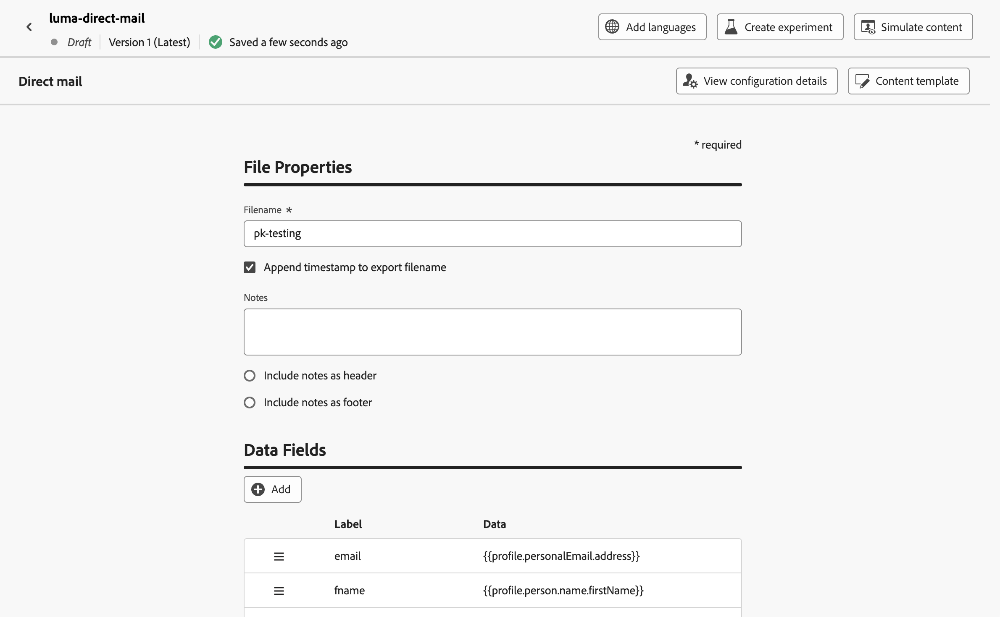

# 여정과 DM 메시지 보내기 {#direct-mail-journeys}

>[!CONTEXTUALHELP]
>id="ajo_journey_direct_mail"
>title="종료 활동"
>abstract="다이렉트 메일은 서드파티 다이렉트 메일 공급자가 고객에게 메일을 보내는 데 필요한 추출 파일을 개인화하고 생성할 수 있는 오프라인 채널입니다."

다이렉트 메일은 서드파티 다이렉트 메일 공급자가 고객에게 메일을 보내는 데 필요한 추출 파일을 개인화하고 생성할 수 있는 오프라인 채널입니다.

DM 메시지를 만들 때 [!DNL Journey Optimizer]은(는) 대상 프로필과 선택한 데이터(예: 우편 주소 및 프로필 특성)가 포함된 파일을 자동으로 생성합니다. 이 파일은 선택한 서드파티 다이렉트 메일 공급자가 액세스할 수 있도록 선택한 서버로 전송되며, 이 공급자가 실제 메일링 프로세스를 처리합니다.

고객이 귀하로부터 메일을 받을 수 있도록 선택한 타사 DM 공급자와 협력하여 고객으로부터 필요한 동의를 얻어야 합니다(해당하는 경우). 우편 서비스 사용은 해당 서드파티 DM 공급자의 추가 약관을 따릅니다. Adobe는 사용자의 서드파티 제품 사용을 통제하지 않으며 이에 대한 책임을 지지 않습니다. DM 메시지 메일링과 관련된 문제 또는 지원 요청은 선택한 서드파티 DM 공급자에게 문의하십시오.

>[!NOTE]
>
>이 페이지에서는 여정이 있는 DM 메시지를 만들고 전송하는 프로세스에 대해 자세히 설명합니다. DM 채널 및 DM 캠페인을 만드는 방법에 대한 자세한 내용은 [DM 시작](../direct-mail/get-started-direct-mail.md) 섹션을 참조하세요.

## 파일 라우팅 구성 만들기

>[!CONTEXTUALHELP]
>id="ajo_dm_file_routing_frequency"
>title="AWS 지역 선택"
>abstract="파일 라우팅 구성이 여정을 사용하여 전송될 경우, 파일이 서버에 전송되는 빈도를 지정할 수 있습니다."

DM 메시지를 만들기 전에 추출 파일을 업로드하고 저장할 서버를 지정하는 파일 라우팅 구성을 구성했는지 확인하십시오. 이렇게 하려면 다음 단계를 수행합니다.

1. **[!UICONTROL 관리]** > **[!UICONTROL 채널]** > **[!UICONTROL DM 설정]** > **[!UICONTROL 파일 라우팅]** 메뉴에 액세스한 다음 **[!UICONTROL 파일 라우팅 구성 만들기]**&#x200B;를 클릭합니다.

1. 파일 라우팅 구성 속성(예: 이름 및 사용할 서버 유형)을 정의합니다. 파일 라우팅 구성을 설정하는 방법에 대한 자세한 내용은 [DM 구성](../direct-mail/direct-mail-configuration.md#file-routing-configuration) 섹션에서 확인할 수 있습니다.

   파일 라우팅 구성이 여정을 사용하여 전송될 경우, 파일이 서버에 전송되는 빈도를 지정할 수 있습니다.

   

1. **[!UICONTROL 제출]**&#x200B;을 클릭하여 파일 라우팅 구성 만들기를 확인합니다. 구성이 **[!UICONTROL 활성]** 상태로 만들어집니다. 이제 DM 구성에서 참조할 준비가 되었습니다.

## DM 구성 만들기 {#direct-mail-surface}

DM 구성에는 타기팅된 대상자 데이터가 있고 메일 공급자가 사용할 수 있는 파일 형식에 대한 설정이 포함됩니다. 또한 파일 라우팅 구성을 선택하여 파일을 내보낼 위치를 정의해야 합니다. DM 구성을 만드는 방법에 대한 자세한 내용은 [DM 구성](../direct-mail/direct-mail-configuration.md#file-routing-configuration) 섹션에서 확인할 수 있습니다.

DM 구성이 준비되면 DM 작업을 여정에 추가할 수 있습니다.

## 여정에 DM 작업 추가

여정에 DM 작업을 추가하려면 다음 단계를 수행합니다.

1. 여정을 열고 팔레트의 **[!UICONTROL 작업]** 섹션에서 **DM** 활동을 끌어서 놓습니다.

1. 메시지에 대한 기본 정보(레이블, 설명, 카테고리)를 입력한 다음 사용할 메시지 구성을 선택합니다. **[!UICONTROL 구성]** 필드는 기본적으로 미리 채워져 있으며 사용자가 해당 채널에 대해 마지막으로 사용한 구성입니다. 여정 구성 방법에 대한 자세한 내용은 [이 페이지](../building-journeys/journey-gs.md)를 참조하세요.

1. DM 공급자에게 보낼 추출 파일을 구성합니다. 이렇게 하려면 **[!UICONTROL 콘텐츠 편집]** 단추를 클릭하십시오.

   

1. 표시할 파일 이름 또는 열과 같은 추출 파일 속성을 조정합니다. 추출 파일 속성을 구성하는 방법에 대한 자세한 내용은 [DM 메시지 만들기](../direct-mail/create-direct-mail.md#extraction-file) 섹션을 참조하십시오.

   

1. 추출 파일의 콘텐츠가 정의되면 테스트 프로필을 사용하여 미리 볼 수 있습니다. 개인화된 콘텐츠를 삽입한 경우 테스트 프로필 데이터를 활용하여 이 콘텐츠가 메시지에 어떻게 표시되는지 확인할 수 있습니다.

   이렇게 하려면 **[!UICONTROL 콘텐츠 시뮬레이션]**&#x200B;을 클릭한 다음 테스트 프로필을 추가하여 테스트 프로필 데이터를 사용하여 추출 파일 렌더링 방법을 확인하십시오. 테스트 프로필을 선택하고 콘텐츠를 미리 보는 방법에 대한 자세한 내용은 [콘텐츠 관리](../content-management/preview-test.md) 섹션에서 확인할 수 있습니다.

   {width="800" align="center"}

추출 파일이 준비되면 [여정](../building-journeys/journey-gs.md)의 구성을 완료하여 전송하십시오.
