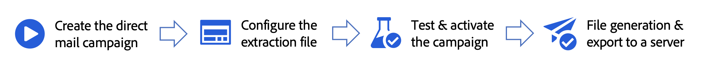

# DM 메시지 만들기 {#create-direct}

>[!AVAILABILITY]
>
>현재 Adobe Healthcare Shield 추가 기능 서비스를 구입한 조직에서는 DM 채널을 사용할 수 없습니다.

DM은 다이렉트 메일 공급자가 고객에게 메일을 보내는 데 필요한 추출 파일을 개인화하고 생성할 수 있는 오프라인 채널입니다.

DM 캠페인을 만들 때 Journey Optimizer은 대상 프로필과 선택한 데이터(예: 우편 주소 및 프로필 속성)가 포함된 파일을 자동으로 생성합니다. 이 파일은 선택한 DM 공급자가 액세스할 수 있도록 선택한 서버로 전송되며, 이 공급자가 실제 메일링 프로세스를 처리합니다.

DM 메시지를 보내는 주요 단계는 다음과 같습니다.

DM 메시지는 예약된 캠페인의 컨텍스트에서만 만들 수 있습니다. API 트리거 캠페인 또는 여정에서 사용할 수 없습니다.

>[!IMPORTANT]
>
>DM 메시지를 보내기 전에 다음을 구성했는지 확인하십시오.
>
>1. A [파일 라우팅 구성](../direct-mail/direct-mail-configuration.md#file-routing-configuration) 추출 파일을 업로드하고 저장할 서버를 지정합니다.
>1. A [다이렉트 메일 메시지 표면](../direct-mail/direct-mail-configuration.md#direct-mail-surface) 파일 라우팅 구성을 참조합니다.
