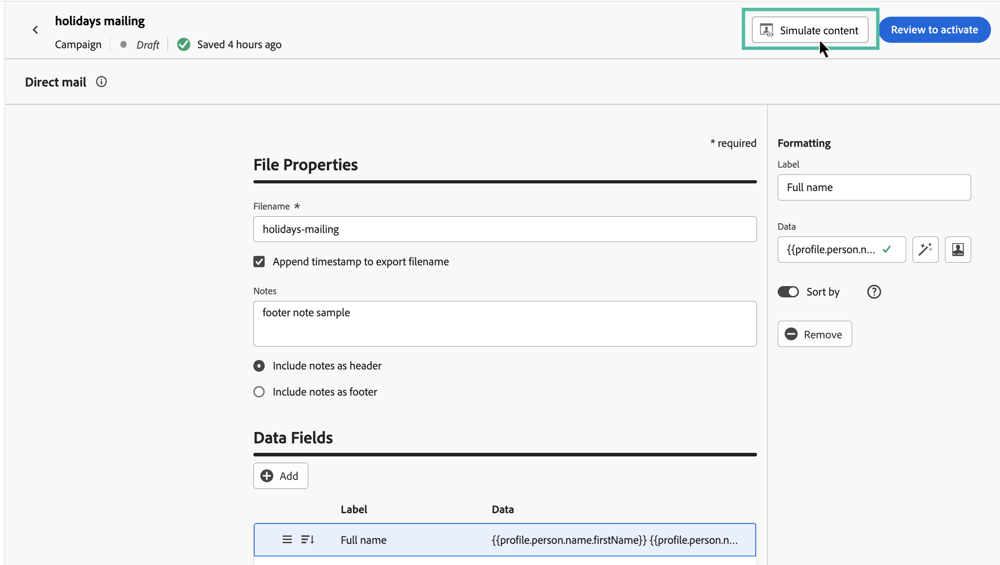

# DM 메시지 테스트 및 보내기 {#direct-mail-test-send}

## 추출 파일 미리 보기 {#preview-dm}

추출 파일의 콘텐츠가 정의되면 테스트 프로필을 사용하여 미리 볼 수 있습니다. 개인화된 콘텐츠를 삽입한 경우 테스트 프로필 데이터를 활용하여 이 콘텐츠가 메시지에 어떻게 표시되는지 확인할 수 있습니다.

1. 추출 파일 콘텐츠 구성 화면에서 다음을 클릭합니다. **[!UICONTROL 콘텐츠 시뮬레이션]**.

   {width="800" align="center"}

1. 클릭 **[!UICONTROL 테스트 프로필 관리]** 테스트 프로필을 추가합니다.

1. 을(를) 사용하여 테스트 프로필 찾기 **[!UICONTROL ID 네임스페이스]** 및 **[!UICONTROL ID 값]** 필드. 그런 다음 을 클릭합니다. **[!UICONTROL 프로필 추가]**.

   {width="800" align="center"}

1. 테스트 프로필을 선택하면 **[!UICONTROL 테스트 프로필 추가]** 창.

1. 다음에서 **미리 보기 및 테스트** 창, 테스트 프로필 데이터가 추출 파일 콘텐츠에 추가되어 파일이 렌더링되는 방법을 미리 볼 수 있습니다.

   {width="800" align="center"}

파일 콘텐츠를 전송할 준비가 되면 시뮬레이트 화면을 닫은 다음 **[!UICONTROL 활성화하려면 검토]** 단추를 클릭합니다.

## DM 캠페인 유효성 검사 및 활성화 {#dm-validate}

DM 캠페인을 활성화하기 전에 캠페인과 추출 파일이 제대로 구성되어 있는지 확인하십시오. 이렇게 하려면 편집기의 위쪽 섹션에서 경고를 확인하십시오. 일부는 간단한 경고이지만 일부는 메시지를 보내지 못하게 할 수 있습니다. 경고와 오류의 두 가지 경고 유형이 발생할 수 있습니다.

* **경고** 권장 사항 및 모범 사례를 참조하십시오. 예를 들어 SMS 메시지가 비어 있는 경우 경고 메시지가 표시됩니다.

* **오류** 해결되지 않는 한 캠페인을 게시하지 못하도록 합니다. 예를 들어 제목 줄이 누락된 경우 경고 메시지가 표시됩니다.

{width="800" align="center"}

DM 캠페인이 준비되면 **[!UICONTROL 활성화]** 단추를 클릭합니다. 캠페인이 시작되면 추출 파일이 자동으로 생성되고 캠페인에 지정된 서버로 내보내집니다 [파일 라우팅 구성](../direct-mail/direct-mail-configuration.md).

DM을 전송하면 캠페인 보고서 내에서 DM 캠페인의 영향을 측정할 수 있습니다. 보고와 관련한 자세한 정보는 이 섹션을 참조하십시오.
