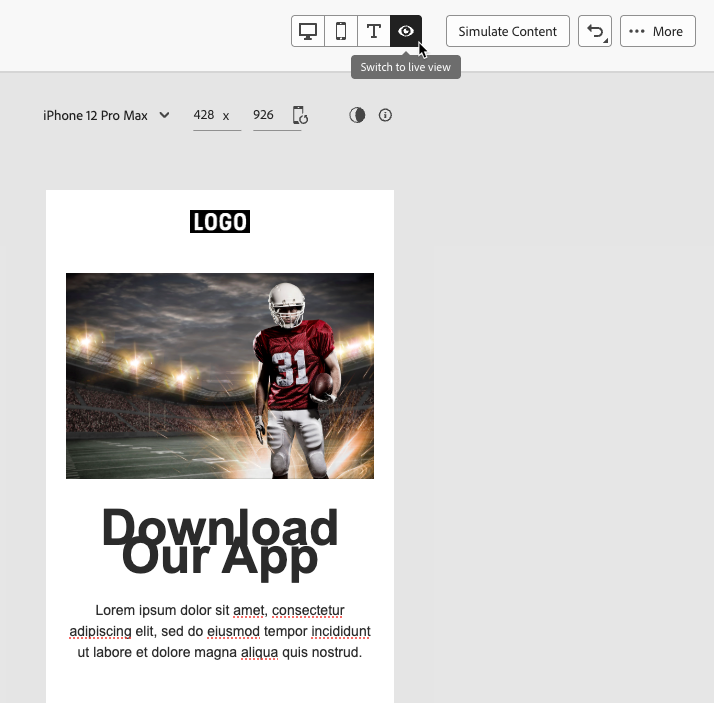

# 액세스 가능한 콘텐츠 디자인 {#accessible-content}

[유럽 접근성 법률](https://eur-lex.europa.eu/legal-content/EN/TXT/?uri=CELEX%3A32019L0882){target="_blank"}은(는) 회원국 간에 국가 규칙이 서로 달라 발생하는 장벽을 제거하여 액세스 가능한 제품 및 서비스의 내부 시장을 개선하기 위해 고안된 지침입니다.

이 규정은 이메일, 뉴스레터, PDF 및 다운로드 가능한 콘텐츠를 포함한 모든 디지털 통신에 액세스할 수 있어야 한다고 명시합니다. 따라서 수신자를 위한 콘텐츠를 만들 때는 액세스 가능한 글꼴, 읽을 수 있는 형식 사용 등의 특정 지침을 따르고 이미지에 대한 대체 텍스트를 제공해야 합니다.

마케터가 [!DNL Journey Optimizer]이메일[ 및 ](content-from-scratch.md)랜딩 페이지&#x200B;**에 대한 콘텐츠를 모두 만들 수 있는** **이메일 Designer**&#x200B;을(를) 사용하면 WCAG(Web Content Accessibility Guidelines) 2.1, 레벨 AA를 기반으로 이 지시문을 쉽게 준수할 수 있습니다.

이에 따라 [!DNL Journey Optimizer]을(를) 사용하여 액세스 가능한 콘텐츠를 디자인하는 모범 사례가 아래에 나와 있습니다.

>[!NOTE]
>
>이 페이지에서는 [!DNL Journey Optimizer]&#x200B;(으)로 디자인된 전자 메일 및 랜딩 페이지를 장애가 있는 사람이 읽고, 이해하고, 상호 작용할 수 있도록 모든 받는 사람이 콘텐츠에 액세스할 수 있도록 합니다.
>
>반면 [!DNL Journey Optimizer] 인터페이스 자체의 액세스 가능성은 [이 섹션](../start/accessibility.md)에 자세히 설명되어 있습니다.
> 
## 텍스트 가독성 확인 {#text-readability}

**[!UICONTROL Text]** 구성 요소의 **[!UICONTROL Styles]** 탭을 사용하여 적절한 색상 대비 및 간단한 글꼴을 사용하는 등 텍스트를 읽을 수 있도록 합니다. [자세히 알아보기](content-components.md#text)

{width="80%"}

글꼴 및 텍스트의 경우 아래 지침을 따라야 합니다.

**글꼴 선택**

* Arial, Verdana, Tahoma, Helvetica 또는 Open Sans와 같은 sans-serif 글꼴을 사용합니다.
* 본문 내용에 serif, cursive 또는 decorative 글꼴을 사용하지 마십시오.
* 일관성 및 대체(예: `font-family: Arial, Helvetica, sans-serif;`)를 위해 제한된 글꼴 집합으로 유지하십시오.

**글꼴 크기 조정**

* 본문 텍스트의 최소 글꼴 크기는 16px여야 합니다.
* 머리글에 적절한 계층 구조를 사용합니다.

**색상 대비**

* 텍스트와 배경 사이의 대비 비율을 최소 4.5:1 유지합니다.
* 큰 텍스트(≥24px 또는 굵은 18px)의 경우, 최소 3:1 대비를 확인합니다.
* 흰색 배경에 밝은 회색이나 파스텔 텍스트를 사용하지 마십시오.
* 의미를 전달하기 위해 색상에만 의존하지 말고, 밑줄, 아이콘 등을 사용하십시오.

**텍스트 접근성**

* 이미지의 텍스트를 사용하지 마십시오.
* 본문에서 모두 대문자로 사용하지 마십시오.
* 레이아웃을 손상하지 않고 텍스트를 최대 200%까지 확대할 수 있는지 확인합니다.

## 시각적 접근성 보장 {#visual-accessibility}

콘텐츠에 시각적으로 액세스할 수 있도록 하려면 아래 모범 사례를 따르십시오.

* 중요한 정보는 색상 전용 표시기를 사용하지 마십시오.
* 명확성을 위해 텍스트 레이블이나 아이콘을 사용합니다.
* 모바일 및 응답형 레이아웃에 맞게 디자인을 최적화하여 버튼의 간격이 적절히 조절됩니다.
* 장치 및 화면 크기에서 정기적으로 테스트하여 접근성을 유지합니다.

[!DNL Journey Optimizer]에서 전자 메일 Designer **[!UICONTROL 스타일]** 창의 스타일 매개 변수 및 특성을 사용하여 콘텐츠에 있는 여러 요소의 크기와 간격을 추가로 조정할 수 있습니다. [자세히 알아보기](get-started-email-style.md)

예를 들어 [background](backgrounds.md)을 업데이트하거나 여백, 패딩 및 맞춤을 변경하여 콘텐츠의 시각적 접근성을 향상시킬 수 있습니다. [자세히 알아보기](alignment-and-padding.md)

{width="80%"}

또한 [!DNL Journey Optimizer] 이메일 Designer을 사용하면 다양한 장치와 화면 크기에 맞게 디자인을 미리 보고 최적화할 수 있습니다. 언제든지 **[!UICONTROL 실시간 보기로 전환]**&#x200B;하여 다양한 장치 크기에서 콘텐츠가 어떻게 렌더링되는지 확인할 수 있습니다.

{width="80%"}

>[!CAUTION]
>
>라이브 보기는 다양한 장치 크기에서 렌더링이 어떻게 표시될 수 있는지 비교하도록 설계된 일반 미리 보기입니다. 최종 렌더링은 수신자의 이메일 클라이언트에 따라 달라질 수 있습니다.

## 이미지에 대체 텍스트 사용 {#alt-text}

**[!UICONTROL 이미지]** 구성 요소를 사용하여 이미지에 대체 텍스트를 제공하십시오. [자세히 알아보기](content-components.md#image)

{width="90%"}

디지털 제품의 효과적인 대체 텍스트를 보려면 아래 지침을 따르십시오.

* 이미지의 목적을 간결하고 상황에 맞게 설명하십시오.
* ...의 이미지&quot;와 같은 중복 구문을 피하고 장식 이미지에 빈 대체 텍스트를 사용합니다.
* 의미가 있는 아이콘의 경우 의미 있는 레이블을 제공하고, 복잡한 이미지의 경우에는 다른 곳에서 간단한 대체 텍스트와 더 긴 설명을 사용하십시오.

## 읽을 수 있는 형식 사용 {#readable-format}

전자 메일 Designer 관련 구조 및 [콘텐츠 구성 요소](content-components.md)와 **[!UICONTROL 스타일]** 창의 옵션을 사용하여 모든 사용자가 액세스할 수 있는 명확하고 논리적이며 간결한 방법으로 콘텐츠를 구성하십시오.

{width="100%"}

* 적절한 제목, 단락, 목록 및 표와 함께 구조화된 의미 있는 HTML을 사용하십시오.
* 컨텐츠가 논리적 왼쪽에서 오른쪽, 위에서 아래로 흐름을 따르는지 확인합니다.
* 명확하고 간결한 언어를 사용하십시오.
* PDF 및 infographics에 대한 대체 형식을 제공합니다.
* 텍스트 크기 조정 및 리플로우를 허용하고 모든 형식에서 적절한 색상 대비를 사용하여 타이포그래피를 읽을 수 있도록 합니다.

## 컨텐츠 가독성 보장 {#readability}

읽을 수 있으려면 콘텐츠가 명확하고, 잘 구성되어 있어야 하며, 시각, 인지 또는 읽기에 어려움이 있는 사람들과 보조 기술을 사용하는 사람들을 포함하여 모든 사람이 사용할 수 있어야 합니다. 액세스 가능한 컨텐츠를 만들 때 고려해야 할 사항은 다음과 같습니다.

* 문장을 약 20단어 이하로 유지합니다.
* 사본을 바로 가리키도록 편집합니다.
* 능동성을 이용하여 문장 구조를 단순화하도록 한다.
* 일부 사람들이 익숙하지 않을 수 있는 속어, 전문어 또는 지역어는 피하십시오.

전자 메일 가독성을 평가하기 위해 Microsoft Word에서 볼 수 있는 인기 있는 [Flesh Reading Ease 테스트](https://support.microsoft.com/en-us/office/get-your-document-s-readability-and-level-statistics-85b4969e-e80a-4777-8dd3-f7fc3c8b3fd2){target="_blank"}를 사용할 수 있으며 0~100의 범위에서 콘텐츠를 얼마나 쉽게 읽을 수 있는지를 계산합니다.

## 콘텐츠 테스트 {#test}

콘텐츠의 접근성을 확인하려면 [!DNL Journey Optimizer]에서 제공하는 테스트 기능을 사용할 수 있습니다. 콘텐츠에 완전히 액세스할 수 있는지 확인하도록 특별히 고안된 것은 아니지만 첫 번째 수준의 확인을 제공할 수 있습니다.

* 테스트 프로필을 사용하여 콘텐츠를 미리 봅니다. [방법 알아보기](../content-management/preview.md)

* Litmus를 활용하는 [전자 메일 렌더링](../content-management/rendering.md) 옵션을 사용하여 주요 전자 메일 클라이언트(Apple Mail, Gmail, Outlook)의 디자인을 시뮬레이션하고 텍스트, 색상 및 이미지를 통해 콘텐츠에 액세스할 수 있는지 확인합니다. <!--Litmus includes accessibility testing-->

* 실제 대상에게 전송하기 전에 콘텐츠의 렌더링을 테스트하기 위한 증명을 보냅니다. [방법 알아보기](../content-management/proofs.md)

{width="90%"}

콘텐츠에 안정적으로 액세스할 수 있는 경우 보다 일관된 방식으로 체크 인하려면 다음과 같은 특정 외부 도구를 사용하십시오.

* [WebAim 대비 검사기](https://webaim.org/resources/contrastchecker/){target="_blank"} 및 [WAVE 웹 접근성 평가 도구](https://wave.webaim.org/){target="_blank"}를 사용하여 대비 및 호환성을 평가합니다.

* 화면 판독기(예: [NVDA](https://www.nvaccess.org/download/){target="_blank"} 또는 iPhone의 [VoiceOver](https://support.apple.com/en-ie/guide/iphone/iph3e2e415f/ios){target="_blank"})와 같은 보조 기술로 시각 장애인 사용자의 관점에서 이메일을 경험합니다.

## 다크 모드 사용 {#dark-mode}

<!--TO PUBLISH WHEN DARK MODE IS RELEASED-->

다크 모드는 광도 또는 시각적 장애가 있는 사용자의 시각적 접근성을 향상시켜 향상된 시청 환경을 제공합니다.

{width="90%"}

어두운 모드에서 콘텐츠를 디자인하는 우수 사례 중에는 투명 PNG 또는 SVG를 사용하고, 적절한 메타 태그와 CSS를 설정하고, 어두운 모드가 지원되지 않는 경우 액세스 가능한 대체 스타일을 제공하는 것이 있습니다. 마지막으로, 밝은 모드와 어두운 모드 모두에서 모든 이메일 콘텐츠와 UI 요소를 테스트하여 이메일이 어두운 모드에서 올바르게 렌더링되는지 확인하십시오.

접근성을 보장하기 위한 지침을 포함하여 다크 모드와 관련된 자세한 모범 사례는 [이 섹션](dark-mode.md#best-practices)에 나열되어 있습니다. <!--KEEP dark mode accessibility best practices IN ONE SINGLE LOCATION - for now listed on the Dark mode page.-->

## 접근성을 위해 특정 특성 사용 {#attributes}

### 언어 속성 {#language}

디자인을 만들 때 콘텐츠 본문에 `lang`(언어) 및 `dir`(텍스트 방향) 특성을 포함하십시오. 이러한 속성은 화면 판독기와 같은 보조 기술이 콘텐츠를 적절한 방식으로 해석하고 제공하는 데 도움이 됩니다.

* `lang` 특성은 단어를 올바로 발음하도록 보조 기술에 대한 전자 메일의 언어를 나타냅니다.

  +++예

  영어의 예:

  ```
  <body lang="en">
  ```

  프랑스어의 경우:

  ```
  <body lang="fr">
  ```

  +++

* `dir` 특성은 텍스트 방향을 지정합니다. 영어와 프랑스어를 포함한 대부분의 언어는 왼쪽에서 오른쪽으로(ltr) 읽지만, 아랍어와 히브리어 같은 언어는 오른쪽에서 왼쪽으로(rtl) 읽습니다.

  +++예

  영어의 예(왼쪽에서 오른쪽):

  ```
  <body lang="en" dir="ltr">
  ```

  아랍어의 예(오른쪽에서 왼쪽):

  ```
  <body lang="ar" dir="rtl">
  ```

  +++

화면 판독기는 `lang` 특성을 사용하여 올바른 발음 규칙을 적용하지만 텍스트 방향에서는 컨텐츠가 왼쪽에서 오른쪽 또는 오른쪽에서 왼쪽 언어로 자연스럽게 흐릅니다. 이러한 속성이 없으면 사용자가 읽기 순서를 혼동하거나 발음을 잘못 이해할 수 있습니다. 따라서 항상 적절한 `lang` 및 `dir` 특성으로 전자 메일 본문을 래핑합니다.

>[!TIP]
>
>전자 메일에 여러 언어가 포함되어 있는 경우 각 부분이 올바르게 읽히도록 특정 섹션(예: `<table>` 또는 `<td>` 블록)에 적절한 언어 특성을 할당하십시오.

### 테이블 {#tables}

HTML 컨텐츠에서 테이블은 종종 레이아웃에 사용됩니다. 기본적으로 화면 판독기는 행, 열 및 구조를 알리는 모든 `<table>`을(를) 데이터 테이블로 취급합니다. 이 경우 표를 포맷에만 사용하는 경우 혼동을 줄 수 있습니다.

레이아웃 표에 `role="presentation"`(또는 `role="none"`)을(를) 추가하여 보조 기술이 구조를 건너뛰고 실제 콘텐츠에만 집중할 수 있도록 합니다.

+++예제 - 레이아웃 표(`role="presentation"` 포함)

```
<table role="presentation" border="0" cellpadding="0" cellspacing="0" width="100%"> 

  <tr> 

    <td align="center"> 

      <h1>Hello World</h1> 

      <p>Welcome to our newsletter</p> 

    </td> 

  </tr> 

</table>
```

화면 판독기는 다음과 같이 읽습니다.
&quot;안녕하세요. 뉴스레터에 오신 것을 환영합니다.&quot; *(행, 열 또는 테이블에 대한 언급 없음)*

+++

+++예 - 데이터 테이블(`role="presentation"` 없음)

```
<table border="1" cellpadding="5" cellspacing="0"> 

  <tr> 

    <th scope="col">Name</th> 

    <th scope="col">Score</th> 

  </tr> 

  <tr> 

    <td>Alice</td> 

    <td>95</td> 

  </tr> 

  <tr> 

    <td>Bob</td> 

    <td>88</td> 

  </tr> 

</table> 
```

화면 판독기는 다음과 같이 읽습니다.
&quot;2개의 열과 3개의 행이 있는 테이블&quot;

&quot;이름, 앨리스. 95점&quot;

&quot;이름, 밥 88점.&quot;

+++

>[!TIP]
>
>레이아웃 테이블에만 `role="presentation"`을(를) 사용합니다. 데이터 테이블의 경우 화면 판독기에서 헤더와 관계를 올바르게 알릴 수 있도록 의미 체계 `<table>` 구조를 유지합니다.

### 링크 텍스트 {#links}

화면 판독기는 텍스트를 사용하여 링크를 읽습니다. 링크에 &#39;여기를 클릭&#39; 또는 &#39;자세히 읽기&#39;만 레이블이 지정되면 보조 기술 사용자는 대상을 알 수 없습니다. 액세스 가능성을 보장하기 위해 대상이나 작업을 명확하게 나타내는 설명 텍스트가 필요합니다.

전자 메일 Designer을 사용하여 [콘텐츠에 링크를 추가](message-tracking.md#insert-links)하고 레이블을 편집하여 식별 가능(표시) 및 설명(목적에 대한 명확한 설명)을 할 수 있습니다. &#39;여기&#39; 또는 &#39;기타&#39;와 같은 모호한 레이블을 사용하지 마십시오.

{width="70%"}

+++예 - 좋은 링크(설명): 

```
<p>Learn more in the  

<a href="https://adobe.com/release-notes">August release notes</a>. 

</p>
```

화면 판독기는 다음과 같이 읽습니다.
&quot;링크, 8월 릴리스 노트&quot;

+++

+++예 - 잘못된 링크(설명 아님)

```
<p>Learn more about our new features.  

  <a href="https://adobe.com/release-notes">Click here</a>. 

</p>
```

화면 판독기는 다음과 같이 읽습니다.
&quot;링크, 여기를 클릭하십시오.&quot; *(읽기 순서에서 벗어난 컨텍스트를 제공하지 않음)*

+++

<!--
>[!TIP]
>
>Always ensure link text is discernible (visible) and descriptive (clear about purpose). Avoid vague labels like 'here' or 'more'.-->

## 키보드 탐색 및 포커스 지원 제공 {#keyboard}

<!--for landing pages-->

키보드 탐색 및 포커스 지원을 제공하면 마우스를 사용할 수 없는 사용자가 콘텐츠에 완전히 액세스하고 상호 작용할 수 있습니다. 또한 모든 사용자가 정보를 통해 명확하고 일관되게 이동할 수 있는 방법을 제공하여 전반적인 유용성을 향상시킵니다.

* 키보드를 통한 포커스

   * 모든 대화형 요소(예: 단추, 확인란, 링크)에 `tabindex="0"`이(가) 있으므로 기본 탭 순서에 포함되어야 합니다.

   * Tab 키와 화살표 키(↑ ↓ ← →)를 사용하여 탐색할 수 있습니다. 이 키는 포커스가 있는 요소를 시각적으로 강조 표시합니다.

* 사용자 지정 포커스 스타일

   * 실행 가능한 요소에 초점을 맞추기 위해 명확하고 구별 가능한 스타일을 적용합니다.

     +++예(CSS)

     ```
     [tabindex="0"] : focus { 
     
     outline: 2px solid #00AEEF;  /* Cyan border */ 
     
     background-color: #20CEFF;   /* Optional background */ 
     
     }
     ```

     +++

   * 포커스 표시기가 다음을 포함한 WCAG 2.2 포커스 표시 표준을 충족하는지 확인합니다.

      * 최소 영역: 2개의 CSS 픽셀 두께 윤곽선입니다.

      * 대비 비율: ≥ 상태와 비초점 상태 간에 3:1을(를) 사용합니다.

* 키보드 활성화 지원

   * 확인란과 단추가 Enter 키와 Space 키에 응답하는지 확인합니다.

   * 키보드만 사용하여 상호 작용 유효성 검사:

      * Enter 키 또는 스페이스를 사용하여 확인란을 전환할 수 있습니다.

      * Enter 또는 스페이스가 단추를 트리거해야 합니다.
