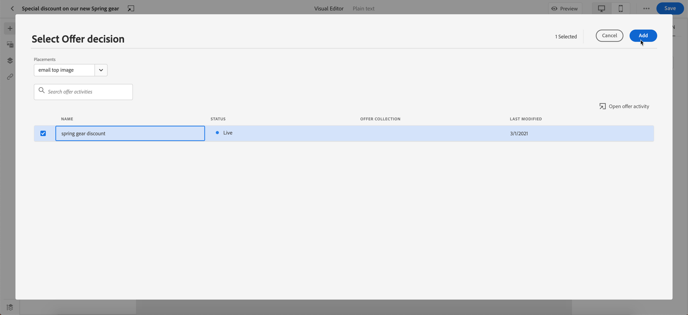

# 개인화된 오퍼 추가 {#deliver-personalized-offers}

위치 [!DNL Journey Optimizer] 이메일에 의사 결정 관리 엔진을 활용하는 의사 결정을 삽입하여 고객에게 제공할 최상의 오퍼를 선택할 수 있습니다.

예를 들어 수신자의 충성도 수준에 따라 달라지는 특별 할인 오퍼를 이메일에 표시하는 결정을 추가할 수 있습니다.

>[!IMPORTANT]
>
>여정 메시지에 사용 중인 여정 결정이 변경되는 경우 오퍼 게시를 취소하고 다시 게시해야 합니다.  이렇게 하면 변경 사항이 여정 메시지에 통합되고 메시지가 최신 업데이트와 일관되게 표시됩니다.

* 오퍼를 만들고 관리하는 방법에 대한 자세한 내용은 을 참조하십시오. [이 섹션](../offers/get-started/starting-offer-decisioning.md).
* 의 경우 **전체적인 예** 오퍼를 구성하고 결정에 사용하며 이메일에서 이 결정을 활용하는 방법을 보여 줍니다. [이 섹션](../offers/offers-e2e.md#insert-decision-in-email).

➡️ [이 비디오에서는 오퍼를 개인화로 추가하는 방법을 알아봅니다](#video-offers)

## 이메일에 결정 삽입 {#insert-offers}

>[!CAUTION]
>
>시작하기 전에 다음을 수행해야 합니다 [오퍼 결정 정의](../offers/offer-activities/create-offer-activities.md).

이메일 메시지에 결정을 삽입하려면 아래 단계를 수행합니다.

1. 이메일을 만든 다음 이메일 디자이너를 열어 콘텐츠를 구성합니다.

1. 추가 **[!UICONTROL 오퍼 결정]** 컨텐츠 구성 요소입니다.

   

   에서 콘텐츠 구성 요소를 사용하는 방법 알아보기 [이 섹션](content-components.md).

1. 다음 **[!UICONTROL 오퍼 결정]** 오른쪽 팔레트에 탭이 표시됩니다. 클릭 **[!UICONTROL 오퍼 결정 선택]**:

   1. 표시되는 창에서 표시할 오퍼에 해당하는 배치를 선택합니다.

      [배치](../offers/offer-library/creating-placements.md) 오퍼를 표시하는 데 사용되는 컨테이너입니다. 이 예제에서는 &quot;이메일 상단 이미지&quot; 배치를 사용합니다. 이 배치는 메시지 상단에 있는 이미지 유형 오퍼를 표시하기 위해 오퍼 라이브러리에 만들어졌습니다.

   1. 선택한 배치 표시와 일치하는 의사 결정 콘텐츠 구성 요소에서 사용할 결정을 선택한 다음, **[!UICONTROL 추가]**.

      >[!NOTE]
      >
      >선택한 배치와 호환되는 결정만 목록에 표시됩니다. 이 예에서는 하나의 오퍼 활동만 &quot;이메일 상단 이미지&quot; 배치와 일치합니다.

      

이제 결정이 구성 요소에 추가됩니다. 변경 사항을 저장하면 메시지를 여정의 일부로 보낼 때 관련 프로필에 오퍼를 표시할 수 있습니다.

>[!NOTE]
>
>메시지에 직접 또는 간접적으로 참조되는 오퍼, 대체 오퍼, 오퍼 컬렉션 또는 오퍼 결정을 업데이트하면 해당 메시지에 업데이트가 자동으로 반영됩니다.

## 이메일에서 오퍼 미리 보기 {#preview-offers-in-email}

을(를) 사용하여 이메일에 추가된 결정의 일부인 다른 오퍼를 미리 볼 수 있습니다. **[!UICONTROL 오퍼]** 섹션 또는 컨텐트 구성 요소 화살표가 표시됩니다.

고객 프로필과 함께 결정의 일부인 다른 오퍼를 표시하려면 아래 단계를 따르십시오.

>[!NOTE]
>
>메시지를 미리 보려면 테스트 프로필을 사용할 수 있어야 합니다. 방법 알아보기 [테스트 프로필 만들기](../segment/creating-test-profiles.md).

1. 오퍼를 미리 보는 데 사용할 테스트 프로필을 선택하십시오.

   1. 다음을 클릭합니다. **[!UICONTROL 콘텐츠 시뮬레이션 버튼]** 버튼을 누른 다음 테스트 프로필을 식별하는 데 사용할 네임스페이스를 선택합니다. **[!UICONTROL ID 네임스페이스]** 필드.

      >[!NOTE]
      >
      >이 예제에서는 **이메일** 네임스페이스입니다. Adobe Experience Platform ID 네임스페이스에 대해 자세히 알아보기 [이 섹션에서](../segment/get-started-identity.md).

   1. 다음에서 **[!UICONTROL ID 값]** 필드에 테스트 프로필을 식별할 값을 입력합니다. 이 예에서는 테스트 프로필의 이메일 주소를 입력합니다.

   <!--For example enter smith@adobe.com and click the **[!UICONTROL Add profile]** button.-->

   1. 프로필 데이터에 따라 메시지의 다양한 변형을 테스트할 수 있도록 다른 프로필을 추가합니다.

      

1. 다음을 클릭합니다. **[!UICONTROL 미리 보기]** 탭을 클릭하여 메시지를 테스트한 다음 테스트 프로필을 선택합니다. 선택한 프로필(여성)에 해당하는 오퍼가 표시됩니다.

   

   다른 테스트 프로필을 선택하여 메시지의 각 변형에 대한 이메일 콘텐츠를 미리 볼 수 있습니다. 이제 메시지 콘텐츠에 선택한 테스트 프로필에 해당하는 오퍼(이제 남자)가 표시됩니다.

에서 메시지 미리 보기를 확인하는 자세한 단계에 대해 자세히 알아보기 [이 섹션](#preview-your-messages).

## 방법 비디오{#video-offers}

의 메시지에 의사 결정 관리 구성 요소를 추가하는 방법 알아보기 [!DNL Journey Optimizer].

>[!VIDEO](https://video.tv.adobe.com/v/334088?quality=12)
