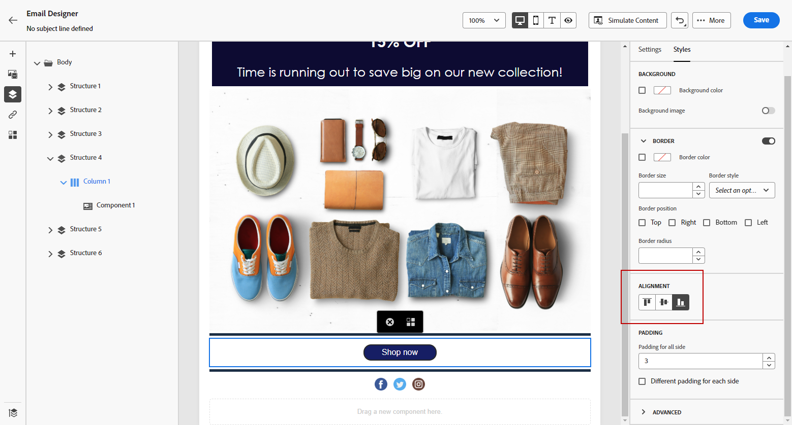

# 세로 정렬 및 패딩 조정 {#alignment-and-padding}

이 예제에서는 3개의 열로 구성된 구조 구성 요소 내부의 패딩 및 수직 정렬을 조정합니다.

1. 이메일에서 구조 구성 요소를 직접 선택하거나 왼쪽 메뉴에서 사용할 수 있는 **[!UICONTROL 탐색 트리]**&#x200B;를 사용합니다.

1. 도구 모음에서 **[!UICONTROL 열 선택]**&#x200B;을 클릭하고 편집할 열을 선택합니다. 구조 트리에서 선택할 수도 있습니다.

   해당 열에 대해 편집 가능한 매개 변수가 **[!UICONTROL 스타일]** 탭에 표시됩니다.

   

1. **[!UICONTROL 정렬]**&#x200B;에서 **[!UICONTROL 위쪽]**, **[!UICONTROL 중간]** 또는 **[!UICONTROL 아래쪽]**&#x200B;을 선택합니다.

   

1. **[!UICONTROL 패딩]**&#x200B;에서 모든 면에 대한 패딩을 정의합니다.

   패딩을 미세 조정하려면 **[!UICONTROL 각 면에 대해 다른 패딩을 선택하십시오]**. 동기화를 중단하려면 잠금 아이콘을 클릭합니다.

   

1. 다른 열의 정렬 및 패딩을 조정하려면 이와 유사하게 진행합니다.

1. 변경 내용을 저장합니다.

>[!TIP]
>
>Android 장치에서 Gmail용 이메일 콘텐츠를 디자인할 때 이미지와 분할자가 크고 고정된 여백이 아닌 열 패딩을 사용하는지 확인하십시오. Android의 Gmail은 종종 크기가 큰 이미지와 여백을 잘못 렌더링하여 레이아웃 오버플로 또는 구분선 축소를 초래합니다. 일관된 표시를 위해 더 작은 이미지 폭을 사용하거나 열 기반 패딩을 사용하십시오.

## 이동 경로 탐색으로 조각 패딩 관리 {#fragment-padding-breadcrumb}

이메일 Designer에서 [조각](../content-management/fragments.md)을(를) 사용하여 작업할 때 숨겨진 패딩 또는 나머지 패딩이 데스크톱과 다르게 모바일 렌더링에 영향을 줄 수 있습니다. 이는 특히 조각이 잠금 해제되었거나 [상속이 끊어졌을 때](use-visual-fragments.md#break-inheritance)입니다. 남은 스타일이 기본 열 또는 텍스트 구성 요소에 남아 있을 수 있기 때문입니다.

조각의 남은 패딩을 식별하고 편집하려면 다음을 수행하십시오.

1. **[!UICONTROL 탐색 트리]**&#x200B;를 사용하거나 편집기에서 요소를 직접 클릭하여 조각 내의 각 상위 구조 또는 열을 선택합니다. 이렇게 하면 모바일 디바이스에만 해당하는 숨겨진 패딩이나 여백을 찾는 데 도움이 됩니다.

1. 탐색 표시에서 요소를 선택한 후 오른쪽의 **[!UICONTROL 스타일]** 탭으로 이동합니다.

1. **[!UICONTROL 패딩]** 설정을 검토하고 필요에 따라 패딩을 제거하거나 재조정하여 올바른 모바일 정렬을 수행합니다.

1. 조각을 재사용할 때 정렬 문제가 지속되면 조각 내의 다른 열 또는 텍스트 구성 요소에 대해 이 프로세스를 반복합니다.

>[!NOTE]
>
>이 동작은 스타일 규칙이 누적될 수 있으므로 조각이 반복적으로 삽입 및 제거될 때 예상됩니다. 이동 경로 탐색을 사용하여 패딩 값을 항상 확인합니다. 특히 모바일 장치를 타깃팅할 때 더욱 그렇습니다.