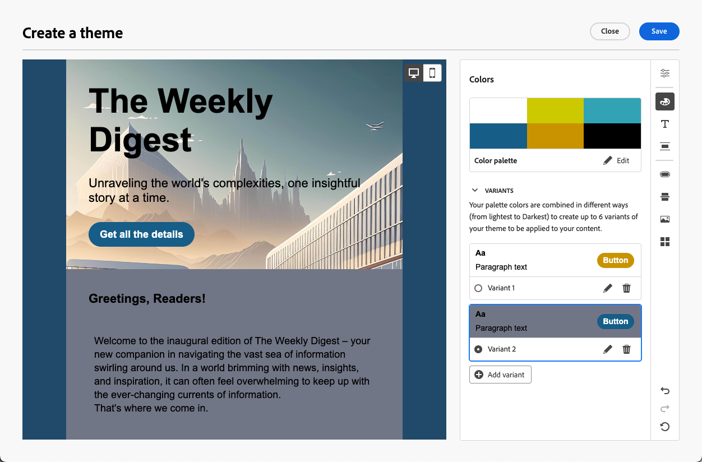
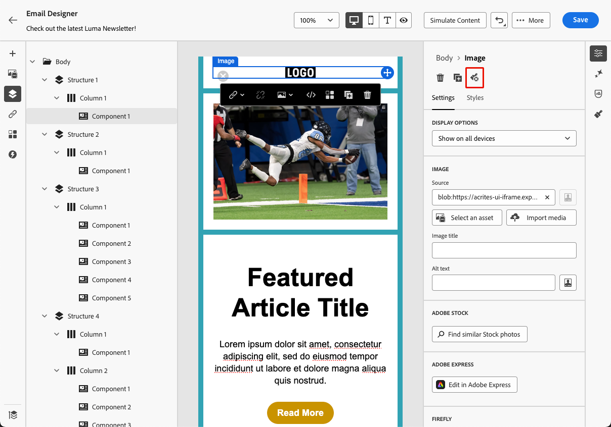

# 이메일 콘텐츠에 테마 적용 {#apply-email-themes}

>[!CONTEXTUALHELP]
>id="ajo_use_theme"
>title="이메일에 테마 적용"
>abstract="이메일 테마를 선택하여 브랜드와 디자인에 맞는 특정 스타일을 빠르게 적용할 수 있습니다."

>[!AVAILABILITY]
>
>이 기능은 제한된 가용성입니다. 액세스 권한을 얻으려면 Adobe 담당자에게 문의하십시오.

테마를 사용하면 기술 전문가가 아닌 사용자도 표준 템플릿<!-- to achieve brand specific results--> 위에 사용자 지정 스타일을 추가하여 특정 브랜드 및 디자인 언어에 맞는 재사용 가능한 콘텐츠를 만들 수 있습니다.

이 기능을 통해 마케터는 시각적으로 호소력 있고 브랜드 일관성이 있는 이메일을 적은 노력으로 더 빠르고 활용할 수 있으며, 고유한 디자인 요구 사항에 대한 고급 사용자 지정 옵션을 제공할 수 있습니다.

## 가드레일 및 제한 사항 {#themes-guardrails}

* 처음부터 이메일을 만들 때는 테마를 사용하여 콘텐츠 작성을 시작하도록 선택하여 내 브랜드 및 디자인에 맞는 특정 스타일을 빠르게 적용할 수 있습니다.

  수동 스타일 모드를 선택하면 이메일을 다시 설정하지 않는 한 테마를 적용할 수 없습니다.

* [조각](../content-management/fragments.md)은(는) 테마 사용 모드와 수동 스타일 지정 모드 간에 서로 호환되지 않습니다.

   * 테마를 사용하지 않고 만든 이메일 콘텐츠에서는 테마 조각을 사용할 수 없습니다.

   * 테마 콘텐츠에서 [조각](../content-management/fragments.md)을 활용하려면 테마를 사용하여 이 조각을 직접 만들어야 합니다. [자세히 알아보기](#leverage-themes-fragment)

   * 이메일 콘텐츠에서 조각을 사용할 때 이 조각에 대해 정의한 테마를 적용하는지 확인하십시오. 그렇지 않으면 특히 Outlook 2021 및 이전 버전에서 표시 문제가 발생할 수 있습니다. [자세히 알아보기](#leverage-themes-fragment)

* HTML에서 만든 콘텐츠를 사용하는 경우 [호환성 모드](existing-content.md)가 되며 이 콘텐츠에 테마를 직접 적용할 수 없습니다.

   * 테마를 적용하려면 먼저 가져온 콘텐츠 [을(를) 새 템플릿으로 저장](../content-management/create-content-templates.md#save-as-template)한 다음 이 템플릿을 테마 호환 콘텐츠로 변환해야 합니다. 그런 다음 이 템플릿을 사용하여 이메일 콘텐츠를 만들 수 있습니다. [이 섹션](#theme-convertor)에서 수동 스타일을 사용하여 만든 템플릿을 변환하는 방법을 알아봅니다.

   * 가져온 HTML 콘텐츠를 계속 변환할 수도 있습니다. [자세히 알아보기](existing-content.md)

  <!--To fully leverage all the capabilities of the Email Designer, including themes, you must either create a new content in Use Themes mode, or convert your imported HTML content. [Learn more](existing-content.md)-->

<!--If you apply a theme to a content using a [fragment](../content-management/fragments.md) created with Manual Styling mode, the rendering may not be optimal.-->

## 테마 만들기 {#create-and-edit-themes}

향후 이메일 콘텐츠에서 활용할 수 있는 테마를 정의하려면 아래 단계를 따르십시오.

1. 시작하려면 새 [콘텐츠 템플릿](../content-management/create-content-templates.md)을 만드세요.

1. **[!UICONTROL 테마 만들기 또는 편집]** 옵션을 선택하십시오.

   

1. Adobe 테마를 선택합니다. 이 예제에서는 **[!UICONTROL 기본 테마]**&#x200B;를 선택하고 **[!UICONTROL 만들기]**&#x200B;를 클릭합니다.

   

1. **[!UICONTROL 내 테마]** 탭에서 사용자 지정 템플릿을 선택하고 **[!UICONTROL 편집]**&#x200B;을 클릭하여 업데이트할 수도 있습니다.

   

1. **[!UICONTROL 일반 설정]** 탭에서 브랜드에 맞는 특정 이름을 지정하여 테마를 정의합니다. 전자 메일의 기본 뷰포트 너비를 조정하고 현재 테마를 [샌드박스에서 공유](../configuration/copy-objects-to-sandbox.md)하도록 내보낼 수 있습니다.

   <!---->

1. 오른쪽의 레일을 사용하여 다양한 탭을 탐색하고 디자인 설정을 업데이트합니다.

   

1. **[!UICONTROL 색상]** 탭에서:

   * **[!UICONTROL 편집]** 단추를 사용하여 브랜드의 기본 색상으로 **[!UICONTROL 색상 팔레트]**&#x200B;를 설정하십시오. **[!UICONTROL 사전 설정]**&#x200B;을 선택하여 색 구성표를 빠르게 만들거나 각 테마 색을 개별적으로 조정하세요. 두 가지를 조합하여 사용할 수도 있습니다.

     

   * **[!UICONTROL 변형 추가]**&#x200B;를 클릭하여 밝은 모드 및 어두운 모드와 같은 여러 색상 변형을 만듭니다. 여기서 각 테마 변형에는 고유한 색상 팔레트 및 뉘앙스 컨트롤이 있습니다.

     

   * 각 변형에 대해 **[!UICONTROL 편집]** 아이콘을 클릭하여 개별 요소를 편집합니다. 만든 기본 팔레트 또는 사용자 지정 색상을 사용할 수 있습니다.

     

1. **[!UICONTROL 텍스트 설정]**&#x200B;에서 전체 테마에 사용할 전역 글꼴을 설정할 수 있습니다. 더 세분화된 제어를 위해 각 제목과 단락 유형을 편집하여 글꼴, 크기, 스타일 등을 조정할 수도 있습니다.

   

1. **[!UICONTROL 간격]** 탭의 목록에서 개별 요소를 선택하여 다른 구성 요소 사이에 적절하게 간격을 지정합니다.

   <!---->

1. 오른쪽의 다른 탭을 사용하여 이 테마의 각 단추 요소, 구분선, 추가 이미지 서식 및 격자 레이아웃 간격을 별도로 관리할 수 있습니다.

   

1. 나중에 사용할 수 있도록 이 테마를 저장하려면 **[!UICONTROL 저장]**&#x200B;을 클릭하세요. 이제 **[!UICONTROL 내 테마]** 탭에 표시됩니다.

<!--A little strange upon hitting Save, because once the theme is created, you need to hit Close to go back to Design your template screen, then click Cancel if you don't want to proceed with template creation.-->

## 이메일 콘텐츠에 테마 적용 {#apply-themes-email}

콘텐츠 템플릿 또는 이메일에 기본 또는 사용자 지정 스타일 테마를 적용하려면 아래 단계를 따르십시오.

1. [!DNL Journey Optimizer]에서 여정 또는 캠페인에 [전자 메일 추가](create-email.md) 작업을 추가하거나 전자 메일 [콘텐츠 템플릿](../content-management/create-content-templates.md#create-template-from-scratch)을 만들고 [전자 메일 본문을 편집](get-started-email-design.md#key-steps)하세요.

1. 다음 작업 중 하나를 선택할 수 있습니다.

   * 기본 제공 [전자 메일 템플릿](use-email-templates.md)을(를) 선택하여 전자 메일 Designer을 엽니다. 각 템플릿에 해당하는 기본 테마는 자동으로 적용됩니다.

   * [새로운 콘텐츠를 처음부터 디자인하고](content-from-scratch.md) **[!UICONTROL 테마 사용]**&#x200B;을 선택하여 미리 정의된 스타일 테마로 시작합니다.

     

     >[!CAUTION]
     >
     >수동 스타일 모드를 선택하면 디자인을 재설정하지 않는 한 테마를 적용할 수 없습니다.
     >
     >테마 콘텐츠에서 [조각](../content-management/fragments.md)을 활용하려면 테마를 사용하여 이 조각을 직접 만들어야 합니다. [자세히 알아보기](#leverage-themes-fragment)

1. 이메일 Designer에서 오른쪽 레일의 **[!UICONTROL 테마]** 단추를 클릭합니다. 기본 테마 또는 템플릿의 테마가 표시됩니다. 이 테마의 두 색상 변형 간을 전환할 수 있습니다.

   

1. 현재 사용 중인 테마 옆의 화살표를 클릭합니다. 사용 가능한 사용자 지정 및 Adobe 테마 목록이 표시됩니다.

   

1. **[!UICONTROL 내 테마]**&#x200B;를 클릭하고 만든 테마를 선택합니다.

   

1. 드롭다운 목록 외부를 클릭합니다. 새로 선택한 사용자 지정 테마는 모든 이메일 구성 요소에 스타일을 자동으로 적용합니다. 색상 변형이 있는 경우 전환할 수 있습니다.

1. 콘텐츠 템플릿에서 테마를 선택하면 **[!UICONTROL 테마 편집]** 단추를 클릭하여 업데이트할 수 있습니다. [자세히 알아보기](#create-and-edit-themes)

   {width="40%"}

   >[!NOTE]
   >
   >이메일 콘텐츠의 테마를 사용할 때는 이 옵션을 사용할 수 없습니다.

1. 여러 색상 변형을 사용하여 테마를 활용하는 경우 주어진 구조 구성 요소에 대해 특정 변형을 선택할 수 있습니다. 이를 통해 전체 콘텐츠에 대해 색상 변형을 정의하고 하나의 특정 구조에 대해 다른 변형을 사용할 수 있습니다.

   >[!NOTE]
   >
   >콘텐츠 구성 요소에 대해서는 이 작업을 수행할 수 없습니다.

   이렇게 하려면 구조 구성 요소를 선택하고 오른쪽의 **[!UICONTROL 스타일]** 탭에서 **[!UICONTROL 특정 테마의 변형 옵션 사용]**&#x200B;을 클릭한 다음 원하는 변형을 해당 구조에 적용합니다.

   

   이 예에서는 현재 테마의 첫 번째 색상 변형이 전체 이메일 콘텐츠에 적용되지만 세 번째 색상 변형이 선택한 구조에 적용됩니다. 특정 구조에 대한 본문 및 뷰포트 배경색이 나머지 콘텐츠와 다른 것을 볼 수 있습니다.

언제든지 테마를 전환할 수 있습니다. 이메일 콘텐츠는 변경되지 않지만 스타일은 새 테마를 반영하도록 업데이트됩니다.

### 스타일 잠금 해제 {#unlocking-styles}

구성 요소를 선택하면 **[!UICONTROL 스타일]** 탭의 전용 아이콘을 사용하여 해당 스타일 잠금을 해제할 수 있습니다.

{width="90%"}

선택한 테마는 해당 구성 요소에 계속 적용되지만 해당 스타일 요소를 무시할 수 있습니다. 테마를 변경하면 새 테마는 재정의되지 않은 스타일 지정 요소에만 적용됩니다.<!--can you revert this action?-->

예를 들어 텍스트 구성 요소의 잠금을 해제하면 <!--the font size from 11 to 14 and -->글꼴 색상을 검정색에서 빨간색으로 변경할 수 있습니다.

{width="80%" align="center" zoomable="yes"}

테마를 변경할 경우 <!--the font size is still 14 and -->해당 구성 요소의 글꼴 색상은 여전히 빨간색이지만 새 테마에 따라 이 구성 요소의 배경색이 변경됩니다.

{width="80%"}

## 조각의 테마 활용 {#leverage-themes-fragment}

[테마가 적용됨](#apply-themes-email)인 템플릿 또는 전자 메일에서 단편을 활용하려면 테마를 사용하여 이 단편을 직접 만들었어야 합니다. 그렇지 않으면 테마 콘텐츠에서 이 조각을 사용할 수 없습니다.

테마와 호환되는 조각을 만들려면 아래 단계를 따르십시오.

1. [!DNL Journey Optimizer]에서 시각적 조각을 만들고 **[!UICONTROL 만들기]**&#x200B;를 클릭하여 조각의 콘텐츠를 디자인합니다. [방법 알아보기](../content-management/create-fragments.md)

1. 미리 정의된 스타일 테마로 시작하려면 **[!UICONTROL 테마 사용]**&#x200B;을 선택하세요.

   {width="100%"}

   >[!CAUTION]
   >
   >수동 스타일 모드를 선택하면 조각 디자인을 재설정하지 않는 한 테마를 적용할 수 없습니다.

1. 이메일 Designer에서 조각 빌드를 시작할 수 있습니다.

1. 오른쪽 레일에서 **[!UICONTROL 테마]** 단추를 클릭합니다. 기본 테마가 표시됩니다. 이 테마의 다른 색상 변형 간을 전환할 수 있습니다.

   {width="100%" align="center" zoomable="yes"}

1. 다른 테마를 선택하여 조각 콘텐츠를 미리 볼 수 있습니다. 이렇게 하려면 기본 테마 옆에 있는 화살표를 선택하고 **[!UICONTROL 테마 선택]**&#x200B;을 클릭합니다.

   {width="40%"}

1. **[!UICONTROL Adobe 테마]**&#x200B;와(과) **[!UICONTROL 내 테마]** 탭 사이를 탐색하고 조각에 대해 호환되는 테마를 최대 5개(두 탭 모두에서) 선택할 수 있습니다.

   {width=70%}

   >[!CAUTION]
   >
   >이메일 콘텐츠에서 조각을 사용할 때는 이 조각에 대해 정의한 [테마를 적용](#apply-themes-email)해야 합니다. 그렇지 않으면 특히 Outlook 2021 및 이전 버전에서 표시 문제가 발생할 수 있습니다.

1. Click **[!UICONTROL Close]**.

1. **[!UICONTROL 기본 테마]** 옆에 있는 화살표를 다시 선택하십시오. 이제 방금 선택한 여러 테마 사이를 전환하여 각 스타일 렌더링을 미리 볼 수 있습니다.

   {width=90%}

1. 테마를 더 추가하거나 선택 항목을 변경하려면 **[!UICONTROL 테마 선택]**&#x200B;을 다시 클릭합니다.

## 템플릿을 테마와 호환되도록 합니다 {#theme-convertor}

[!DNL Journey Optimizer]을(를) 사용하면 수동 스타일을 사용하여 만든 템플릿을 테마 호환 콘텐츠로 변환할 수 있습니다. 이 기능은 테마가 [!DNL Journey Optimizer]에 도입되기 전에 콘텐츠 템플릿을 만들었거나 외부 콘텐츠를 가져오는 경우에 특히 유용합니다.

>[!NOTE]
>
> **전자 메일 템플릿**&#x200B;만 테마와 호환되도록 변환할 수 있습니다. 개별 이메일은 변환할 수 없습니다. 먼저 콘텐츠를 템플릿으로 저장해야 합니다.

1. 이메일 [콘텐츠 템플릿](../content-management/create-content-templates.md)을(를) 열고 이메일 Designer을 사용하여 콘텐츠를 편집합니다.

1. 오른쪽 레일에서 **[!UICONTROL 테마]** 아이콘을 선택하고 **[!UICONTROL 콘텐츠에서 테마 생성]** 단추를 클릭합니다.

   {width=100%}

1. **[!UICONTROL 테마 만들기]** 창이 열립니다. [!DNL Journey Optimizer]은(는) 스타일 요소를 자동으로 감지하여 새 테마로 통합합니다.

   {width=90%}

1. 테마의 이름을 입력합니다.

1. 색상 변형 추가, 글꼴 편집 등과 같이 테마를 처음부터 새로 만들 때와 마찬가지로 필요에 따라 직접 조정합니다. [방법 알아보기](#create-and-edit-themes)

   {width=90%}

1. 재사용할 새 테마를 저장하려면 **[!UICONTROL 저장]**&#x200B;을 클릭하세요. 이제 이 테마를 다른 테마와 같은 콘텐츠에 적용할 수 있습니다. [방법 알아보기](#apply-themes-email)