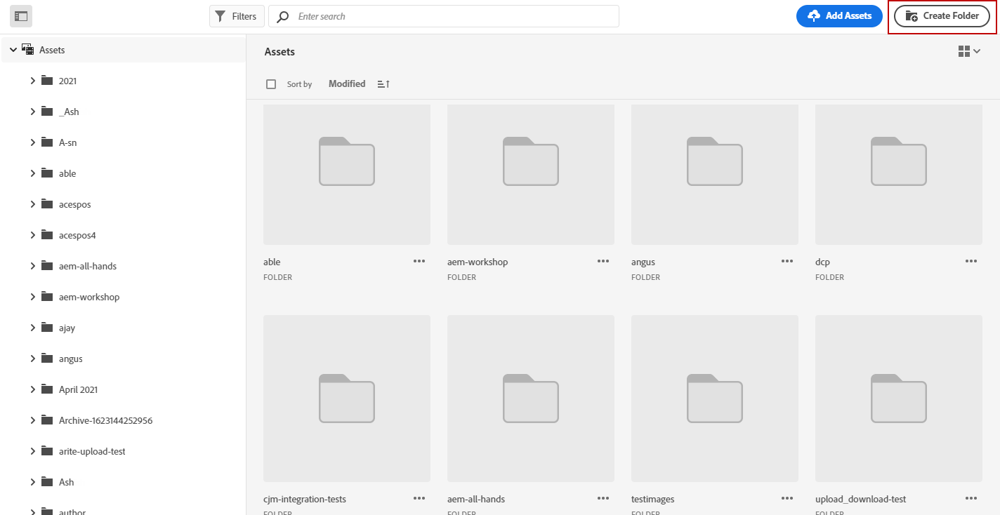

# 을 사용하여 자산 만들기 및 관리 [!DNL Assets Essentials]{#experience-manager-assets}

## [!DNL Assets Essentials] 시작 {#get-started-assets-essentials}

을 사용하여 마케팅 및 크리에이티브 워크플로우를 함께 통합 [!DNL Adobe Experience Manager Assets Essentials]. 기본적으로 [!DNL Adobe Journey Optimizer], 액세스 [!DNL Assets Essentials] 디지털 자산을 저장, 관리, 검색 및 배포하기 위해 메시지를 채우는 데 사용할 수 있는 중앙 집중식 단일 자산 저장소를 제공합니다.

[!DNL Adobe Experience Manager Assets Essentials] 는 크리에이티브 시스템을 확장하고 경험 전달을 위해 디지털 자산을 통합하는 공동 및 중앙 집중식 자산 작업 공간입니다. 승인된 프로덕션 자산을 쉽게 구성, 태그 지정 및 찾아 팀 간에 브랜드 일관성을 유지할 수 있습니다. 직관적인 사용자 경험을 통해 [!DNL Assets Essentials] 즉시 Adobe 크리에이티브 및 Experience Cloud 앱에서 자산을 공유할 수 있습니다.

추가 정보 [Adobe Experience Manager Assets Essentials 설명서](https://experienceleague.adobe.com/docs/experience-manager-assets-essentials/help/introduction.html){target="_blank"}.

[!DNL Adobe Experience Manager Assets Essentials] 는 [!DNL Adobe Journey Optimizer] 왼쪽 메뉴 사용 **[!UICONTROL 자산]** 섹션을 참조하십시오. 필요할 때 자산 및 폴더에 액세스할 수도 있습니다 [이메일 콘텐츠 디자인](get-started-email-design.md).

## 사전 요구 사항{#assets-prerequisites}

사용하기 전 [!DNL Adobe Experience Manager Assets Essentials]를 채울 때는 사용자를 **Assets Essentials 소비자 사용자** 또는/and **Assets Essentials 사용자** 제품 프로필. 자세한 내용 [Assets Essentials 설명서](https://experienceleague.adobe.com/docs/experience-manager-assets-essentials/help/deploy-administer.html?lang=ko){target="_blank"}.

>[!NOTE]
>2022년 1월 6일 이전에 획득한 Journey Optimizer 제품의 경우 조직에 [!DNL Adobe Experience Manager Assets Essentials]을(를) 배포해야 합니다. [Assets Essentials 배포](https://experienceleague.adobe.com/docs/experience-manager-assets-essentials/help/deploy-administer.html?lang=ko){target="_blank"} 섹션에서 자세히 알아보세요.

## 자산 업로드 및 삽입{#add-asset}

파일을 로 가져오려면 [!DNL Assets Essentials]로 지정하는 경우, 먼저 해당 폴더가 저장될 폴더를 찾아보거나 만들어야 합니다. 그러면 전자 메일 콘텐츠에 삽입할 수 있습니다.

자산을 업로드하는 방법에 대한 자세한 내용은 [Adobe Experience Manager Assets Essentials 설명서](https://experienceleague.adobe.com/docs/experience-manager-assets-essentials/help/add-delete.html){target="_blank"}.

1. From [!DNL Adobe Journey Optimizer] 홈 페이지에서 **[!UICONTROL 자산]** 아래의 탭 **[!UICONTROL 콘텐츠 관리]** 액세스 메뉴 [!DNL Assets Essentials].

   

1. 중앙 섹션 또는 트리 보기에서 폴더를 두 번 클릭하여 엽니다.

   을 클릭할 수도 있습니다 **[!UICONTROL 폴더 만들기]** 새 폴더를 만들려면

   

1. 선택한 폴더 또는 생성된 폴더에서 **[!UICONTROL 자산 추가]** 새 자산을 폴더에 업로드하려면 다음을 수행하십시오.

   

1. 에서 **[!UICONTROL 파일 업로드]**&#x200B;를 클릭합니다. **[!UICONTROL 찾아보기]** 원하는 경우 **[!UICONTROL 파일 찾아보기]** 또는 **[!UICONTROL 폴더 찾아보기]**.

1. 업로드할 파일을 선택합니다. 완료되면 를 클릭합니다 **[!UICONTROL 업로드]**. 자산 관리 방법에 대한 자세한 내용은 다음을 참조하십시오 [페이지](https://experienceleague.adobe.com/docs/experience-manager-assets-essentials/help/manage-organize.html).

1. Adobe Photoshop Express으로 자산을 추가로 편집하려면 자산을 두 번 클릭합니다. 그런 다음 오른쪽 메뉴에서 **[!UICONTROL 편집 모드]** 아이콘. [자세히 알아보기](https://experienceleague.adobe.com/docs/experience-manager-assets-essentials/help/edit-images.html){target="_blank"}.

   

1. From [!DNL Adobe Journey Optimizer]에서 을(를) 선택합니다. **[!UICONTROL 자산 선택기]** 이메일 디자이너의 왼쪽 창에 있는 메뉴

   

1. 앞에서 만든 을(를) 선택합니다 **[!UICONTROL 자산]** 폴더를 입력합니다. 검색 창에서 자산이나 폴더를 검색할 수도 있습니다.

1. 이메일 콘텐츠에서 자산을 끌어다 놓습니다.

   

1. 외부 링크 추가 또는 텍스트를 사용하여 자산을 추가로 사용자 지정할 수 있습니다 **[!UICONTROL 설정]** 및 **[!UICONTROL 스타일]** 탭. [구성 요소 설정에 대해 자세히 알아보기](content-components.md)

   

   <!--
    After adding your asset to your email, use the **[!UICONTROL Find similar Stock photos]** option to locate Stock photos that match the content, color, and composition of your image. [Learn more about Adobe Stock](stock.md).

    Note that this option is available for licensed/unlicensed Stock images and images from your Assets folder. 

    
    -->