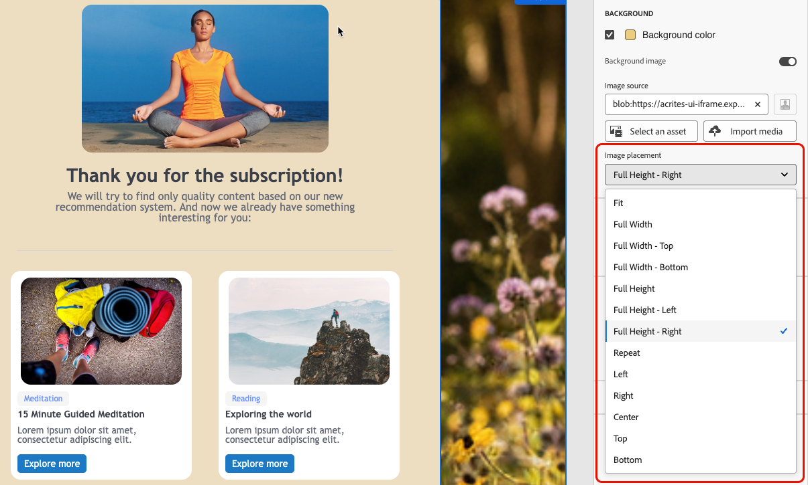

# 이메일 배경 개인화 {#backgrounds}

>[!BEGINSHADEBOX]

**이 페이지의 내용:** 이메일 디자이너에서 이메일 본문, 뷰포트, 구조 및 열 수준에서 배경색과 이미지를 설정하는 방법을 알아봅니다.

>[!ENDSHADEBOX]

>[!CONTEXTUALHELP]
>id="ac_edition_backgroundimage"
>title="배경 설정"
>abstract="콘텐츠 배경색 또는 배경 이미지를 개인화할 수 있습니다. 배경 이미지는 모든 이메일 클라이언트에서 지원되지 않습니다."

배경은 브랜드 정체성을 강화하고 이메일의 주요 영역에 주의를 기울이는 데 도움이 됩니다. 이메일 Designer에서 배경색 또는 이미지를 콘텐츠의 다양한 수준(전체 본문에서 개별 구조 및 열에 이르기까지)으로 설정할 수 있으므로 이메일 전체에서 배경이 렌더링되는 방식을 정확하게 제어할 수 있습니다.

이메일 Designer에서 배경을 설정할 때에는 다음 모범 사례를 염두에 두십시오.

* 디자인에 필요한 경우에만 바디에 배경색을 적용합니다.
* 가능하면 열 수준에서 배경색을 설정하는 것이 좋습니다.
* 이미지 또는 텍스트 구성 요소는 관리하기 어려우므로 배경색을 사용하지 마십시오.
* 렌더링은 이메일 Designer 미리 보기와 다를 수 있으므로 전송하기 전에 실제 이메일 클라이언트에서 배경 이미지를 테스트합니다.

다음 설정을 사용하면 본문에서 개별 구조 및 열에 이르기까지 이메일 콘텐츠의 모든 수준에서 배경색 또는 이미지를 적용할 수 있습니다.

>[!TIP]
>
>테마가 이메일에 적용되는 경우 특정 구성 요소에 대해 테마로 설정된 배경색을 직접 재정의할 수 없습니다. 먼저 **[!UICONTROL 스타일]** 탭의 전용 아이콘을 사용하여 해당 스타일의 잠금을 해제해야 합니다. [방법 알아보기](apply-email-themes.md#unlocking-styles)

## 배경색 설정 {#background-color}

1. **본문 배경색** - 전체 전자 메일에 대해 **[!UICONTROL 배경색]**&#x200B;을 설정합니다. 왼쪽 팔레트에서 액세스할 수 있는 **[!UICONTROL 탐색 트리]**&#x200B;에서 **[!UICONTROL 본문]**&#x200B;을 선택하고 오른쪽의 **[!UICONTROL 스타일]** 탭에서 전용 옵션을 사용하십시오.

   ![탐색 트리에서 [본문]이 선택되어 있고 [스타일] 패널에서 [배경색] 옵션이 강조 표시된 Designer으로 전자 메일을 보내십시오](assets/background_1.png)

1. **뷰포트 배경색** - **[!UICONTROL 뷰포트 색]**&#x200B;을 설정하여 본문의 배경색과 관계없이 모든 구조 구성 요소에 동일한 배경색을 적용합니다.

   

1. **구조 배경색** - 단일 구조 구성 요소에 배경색을 적용하려면 캔버스 또는 왼쪽 팔레트에서 직접 배경색을 선택하고 해당 구조에 대한 특정 색상을 설정합니다.

   

   >[!TIP]
   >
   >이 경우 구조 배경색을 숨길 수 있으므로 뷰포트 배경색을 설정하지 않도록 하십시오.

1. **열 배경색** - 열 수준에서 배경색을 설정합니다. 다시 왼쪽 팔레트에서 원하는 열을 선택하고 해당 열에 대해 특정 색상을 설정해야 합니다.

   ![선택한 열에 대해 [배경색] 옵션이 강조 표시된 전자 메일 Designer 스타일 패널](assets/background_5.png)

   >[!TIP]
   >
   >나머지 이메일 콘텐츠를 편집할 때 보다 유연하게 사용할 수 있으므로 가장 일반적인 사용 사례이자 모범 사례입니다.

## 배경 이미지 설정 {#background-image}

구조 또는 열 구성 요소의 콘텐츠에 대해 **[!UICONTROL 배경 이미지]**&#x200B;를 설정할 수도 있습니다. 이는 구조 수준에서 가장 일반적으로 사용됩니다. 열 수준에서 하나를 설정하는 것은 가능하지만 거의 사용되지 않습니다.

>[!NOTE]
>
>일부 이메일 프로그램은 배경 이미지를 지원하지 않습니다. 지원되지 않는 경우 행의 배경색이 대신 사용됩니다. 이미지를 표시할 수 없는 경우 적절한 대체 배경색을 선택해야 합니다.

>[!TIP]
>
>이메일 Designer 미리 보기뿐만 아니라 전송하기 전에 실제 이메일 클라이언트에서 배경 이미지를 미리 봅니다. 편집기에서 동일한 이미지와 배치를 올바르게 렌더링할 수 있지만 iOS의 Outlook과 같은 일부 클라이언트에서는 다르게 늘이거나 잘린 것처럼 보입니다.

배경 이미지가 설정되면 **[!UICONTROL 이미지 배치]** 드롭다운을 사용하여 이미지가 구조 또는 열을 채우는 방법을 제어합니다. 아래 옵션을 선택할 수 있습니다.

{width=80%}

**채우기 비율, 가운데 맞춤:**

* **[!UICONTROL 맞춤]** - 가로 세로 비율을 유지하지 않고 두 축의 컨테이너를 채우도록 이미지를 늘립니다.
* **[!UICONTROL 전체 너비]** - 컨테이너의 너비에 비례하여 이미지 크기를 조정하고 세로로 가운데에 맞춥니다.
* **[!UICONTROL 전체 높이]** - 컨테이너의 높이에 비례하여 이미지의 크기를 조정하고 수평 가운데로 맞춥니다.

**가장자리에 고정된 채우기 비율:**

* **[!UICONTROL 전체 너비 - 위쪽]** - 컨테이너의 맨 위에 고정된 **[!UICONTROL 전체 너비]**&#x200B;와 같습니다. 아래쪽에서 오버플로가 잘립니다.
* **[!UICONTROL 전체 너비 - 아래쪽]** - 컨테이너의 아래쪽에 고정된 **[!UICONTROL 전체 너비]**&#x200B;와 같습니다. 맨 위에 오버플로가 잘립니다.
* **[!UICONTROL 전체 높이 - 왼쪽]** - 컨테이너의 왼쪽에 고정된 **[!UICONTROL 전체 높이]**&#x200B;와(과) 같습니다. 오른쪽에는 오버플로가 잘립니다.
* **[!UICONTROL 전체 높이 - 오른쪽]** - 컨테이너의 오른쪽에 고정된 **[!UICONTROL 전체 높이]**&#x200B;와(과) 동일합니다. 오버플로가 왼쪽에서 잘립니다.

**타일:**

* **[!UICONTROL 반복]** - 컨테이너를 채우도록 이미지를 원래 크기로 타일로 맞춥니다.

**크기 조절 없이 위치:**

* **[!UICONTROL 왼쪽]**, **[!UICONTROL 오른쪽]**, **[!UICONTROL 가운데]**, **[!UICONTROL 위쪽]**, **[!UICONTROL 아래쪽]** - 컨테이너의 해당 가장자리 또는 중앙에 고정된 이미지를 원래 크기로 배치합니다.

>[!NOTE]
>
>가장자리 고정 옵션을 사용하면 위의 가운데 옵션에 비해 구조의 비율과 일치하지 않을 때 이미지의 어느 부분이 뷰에 남아 있는지 보다 세밀하게 제어할 수 있습니다.

{{$include /help/_includes/do-not-localize/email/ai-augmented-backgrounds.md}}
